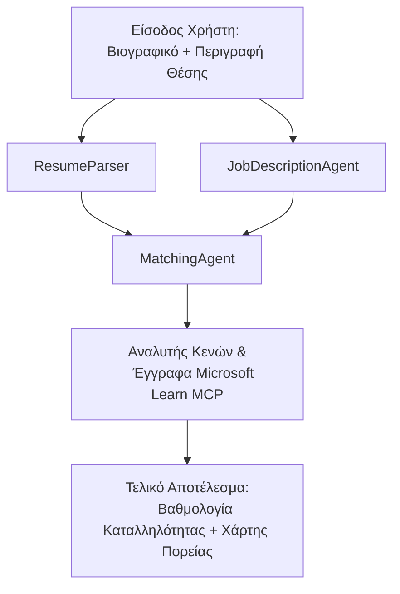

# PersonalCareerCopilot - Αξιολογητής Καταλληλότητας Βιογραφικού για Θέση Εργασίας

Μια ροή εργασίας πολλαπλών πρακτόρων που αξιολογεί πόσο καλά ταιριάζει ένα βιογραφικό με μια περιγραφή θέσης εργασίας και στη συνέχεια δημιουργεί έναν εξατομικευμένο μαθησιακό οδικό χάρτη για να καλύψει τα κενά.

---

## Πράκτορες

| Πράκτορας | Ρόλος | Εργαλεία |
|-------|------|-------|
| **ResumeParser** | Εξάγει δομημένες δεξιότητες, εμπειρία, πιστοποιήσεις από το κείμενο του βιογραφικού | - |
| **JobDescriptionAgent** | Εξάγει απαιτούμενες/προτιμώμενες δεξιότητες, εμπειρία, πιστοποιήσεις από μια περιγραφή θέσης | - |
| **MatchingAgent** | Συγκρίνει το προφίλ με τις απαιτήσεις → σκορ καταλληλότητας (0-100) + ταιριαστές/ελλείπουσες δεξιότητες | - |
| **GapAnalyzer** | Δημιουργεί εξατομικευμένο μαθησιακό οδικό χάρτη με πόρους από το Microsoft Learn | `search_microsoft_learn_for_plan` (MCP) |

## Ροή εργασίας


---

## Γρήγορη εκκίνηση

### 1. Ρύθμιση περιβάλλοντος

```powershell
cd workshop\lab02-multi-agent\PersonalCareerCopilot
python -m venv .venv
.\.venv\Scripts\Activate.ps1          # Windows PowerShell
# source .venv/bin/activate            # macOS / Linux
pip install -r requirements.txt
```

### 2. Διαμόρφωση διαπιστευτηρίων

Αντιγράψτε το παράδειγμα αρχείου env και συμπληρώστε τις λεπτομέρειες του έργου σας στο Foundry:

```powershell
cp .env.example .env
```

Επεξεργαστείτε το `.env`:

```env
PROJECT_ENDPOINT=https://<your-account>.services.ai.azure.com/api/projects/<your-project>
MODEL_DEPLOYMENT_NAME=gpt-4.1-mini
```

| Τιμή | Πού θα τη βρείτε |
|-------|-----------------|
| `PROJECT_ENDPOINT` | Πλευρική μπάρα Microsoft Foundry στο VS Code → δεξί κλικ στο έργο σας → **Αντιγραφή Τελικού Σημείου Έργου** |
| `MODEL_DEPLOYMENT_NAME` | Πλευρική μπάρα Foundry → επεκτείνετε το έργο → **Μοντέλα + τελικά σημεία** → όνομα ανάπτυξης |

### 3. Εκτέλεση τοπικά

```powershell
python -m debugpy --listen 127.0.0.1:5679 -m agentdev run main.py --verbose --port 8088
```

Ή χρησιμοποιήστε το task του VS Code: `Ctrl+Shift+P` → **Tasks: Run Task** → **Run Lab02 HTTP Server**.

### 4. Δοκιμή με Agent Inspector

Ανοίξτε το Agent Inspector: `Ctrl+Shift+P` → **Foundry Toolkit: Open Agent Inspector**.

Επικολλήστε αυτό το τεστ prompt:

```
Resume:
Jane Doe
Senior Software Engineer with 5 years of experience in Python, Django, and AWS.
Built microservices handling 10K+ requests/second. Led a team of 4 developers.
Certifications: AWS Solutions Architect Associate.
Education: B.S. Computer Science, State University.

Job Description:
Senior Cloud Engineer at Contoso Ltd.
Required: Python, Azure, Kubernetes, Terraform, CI/CD pipelines.
Preferred: Go, monitoring (Prometheus/Grafana), cost optimization.
Experience: 5+ years in cloud infrastructure.
Certifications: Azure Solutions Architect Expert preferred.
```

**Αναμενόμενο:** Ένα σκορ καταλληλότητας (0-100), ταιριαστές/ελλείπουσες δεξιότητες, και ένας εξατομικευμένος μαθησιακός οδικός χάρτης με URL από το Microsoft Learn.

### 5. Ανάπτυξη στο Foundry

`Ctrl+Shift+P` → **Microsoft Foundry: Deploy Hosted Agent** → επιλέξτε το έργο σας → επιβεβαιώστε.

---

## Δομή έργου

```
PersonalCareerCopilot/
├── .env.example        ← Template for environment variables
├── .env                ← Your credentials (git-ignored)
├── agent.yaml          ← Hosted agent definition (name, resources, env vars)
├── Dockerfile          ← Container image for Foundry deployment
├── main.py             ← 4-agent workflow (instructions, MCP tool, WorkflowBuilder)
└── requirements.txt    ← Python dependencies
```

## Κύρια αρχεία

### `agent.yaml`

Ορίζει τον φιλοξενούμενο πράκτορα για την Υπηρεσία Πράκτορα Foundry:
- `kind: hosted` - εκτελείται ως διαχειριζόμενο κοντέινερ
- `protocols: [responses v1]` - εκθέτει το HTTP endpoint `/responses`
- `environment_variables` - οι `PROJECT_ENDPOINT` και `MODEL_DEPLOYMENT_NAME` εγχέονται κατά την ανάπτυξη

### `main.py`

Περιλαμβάνει:
- **Οδηγίες πράκτορα** - τέσσερις σταθερές `*_INSTRUCTIONS`, μία ανά πράκτορα
- **Εργαλείο MCP** - `search_microsoft_learn_for_plan()` καλεί `https://learn.microsoft.com/api/mcp` μέσω Streamable HTTP
- **Δημιουργία πρακτόρων** - διαχειριστής συμφραζομένων `create_agents()` χρησιμοποιώντας `AzureAIAgentClient.as_agent()`
- **Διάγραμμα ροής εργασίας** - `create_workflow()` χρησιμοποιεί το `WorkflowBuilder` για να συνδέσει πράκτορες με μοτίβα fan-out/fan-in/διαδοχικά
- **Εκκίνηση διακομιστή** - `from_agent_framework(agent).run_async()` στη θύρα 8088

### `requirements.txt`

| Πακέτο | Έκδοση | Σκοπός |
|---------|---------|---------|
| `agent-framework-azure-ai` | `1.0.0rc3` | Ενσωμάτωση Azure AI για το Microsoft Agent Framework |
| `agent-framework-core` | `1.0.0rc3` | Βασικό runtime (περιλαμβάνει το WorkflowBuilder) |
| `azure-ai-agentserver-agentframework` | `1.0.0b16` | Runtime φιλοξενούμενου διακομιστή πρακτόρων |
| `azure-ai-agentserver-core` | `1.0.0b16` | Βασικές αφαιρέσεις διακομιστή πρακτόρων |
| `debugpy` | latest | Αποσφαλμάτωση Python (F5 στο VS Code) |
| `agent-dev-cli` | `--pre` | Τοπικό CLI ανάπτυξης + backend Agent Inspector |

---

## Αντιμετώπιση προβλημάτων

| Πρόβλημα | Διόρθωση |
|-------|-----|
| `RuntimeError: Missing required environment variable(s)` | Δημιουργήστε το `.env` με `PROJECT_ENDPOINT` και `MODEL_DEPLOYMENT_NAME` |
| `ModuleNotFoundError: No module named 'agent_framework'` | Ενεργοποιήστε το venv και τρέξτε `pip install -r requirements.txt` |
| Δεν υπάρχουν URL από το Microsoft Learn στην έξοδο | Ελέγξτε τη σύνδεση διαδικτύου προς `https://learn.microsoft.com/api/mcp` |
| Μόνο 1 κάρτα κενών (περικομμένη) | Βεβαιωθείτε ότι οι οδηγίες `GAP_ANALYZER_INSTRUCTIONS` περιλαμβάνουν το μπλοκ `CRITICAL:` |
| Η θύρα 8088 χρησιμοποιείται | Σταματήστε άλλους διακομιστές: `netstat -ano \| findstr :8088` |

Για λεπτομερή αντιμετώπιση προβλημάτων, δείτε [Module 8 - Troubleshooting](../docs/08-troubleshooting.md).

---

**Πλήρης παρουσίαση:** [Lab 02 Docs](../docs/README.md) · **Επιστροφή στο:** [Lab 02 README](../README.md) · [Αρχική Εργαστηρίου](../../../README.md)

---

<!-- CO-OP TRANSLATOR DISCLAIMER START -->
**Αποποίηση ευθύνης**:  
Αυτό το έγγραφο έχει μεταφραστεί χρησιμοποιώντας την υπηρεσία αυτόματης μετάφρασης AI [Co-op Translator](https://github.com/Azure/co-op-translator). Ενώ επιδιώκουμε την ακρίβεια, παρακαλούμε να γνωρίζετε ότι οι αυτοματοποιημένες μεταφράσεις ενδέχεται να περιέχουν λάθη ή ανακρίβειες. Το πρωτότυπο έγγραφο στη γλώσσα του πρέπει να θεωρείται η αυθεντική πηγή. Για κρίσιμες πληροφορίες, συστήνεται επαγγελματική μετάφραση από ανθρώπινο μεταφραστή. Δεν φέρουμε ευθύνη για οποιεσδήποτε παρεξηγήσεις ή λανθασμένες ερμηνείες προκύψουν από τη χρήση αυτής της μετάφρασης.
<!-- CO-OP TRANSLATOR DISCLAIMER END -->