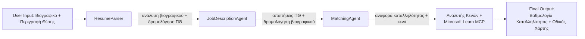

# PersonalCareerCopilot - Εκτιμητής Καταλληλότητας Βιογραφικού προς Θέση Εργασίας

Μια εφαρμογή πολλαπλών πρακτόρων προσανατολισμένη σε ροή εργασίας που αξιολογεί πόσο καλά ταιριάζει ένα βιογραφικό με μια περιγραφή εργασίας και στη συνέχεια δημιουργεί έναν εξατομικευμένο οδικό χάρτη μάθησης για την κάλυψη των κενών.

---

## Πράκτορες

| Πράκτορας | Ρόλος | Εργαλεία |
|-------|------|-------|
| **ResumeParser** | Εξάγει δομημένες δεξιότητες, εμπειρία, πιστοποιήσεις από το κείμενο του βιογραφικού | - |
| **JobDescriptionAgent** | Εξάγει απαιτούμενες/προτιμώμενες δεξιότητες, εμπειρία, πιστοποιήσεις από μια περιγραφή εργασίας | - |
| **MatchingAgent** | Συγκρίνει προφίλ με απαιτήσεις → βαθμός καταλληλότητας (0-100) + ταιριαστές/ελλείπουσες δεξιότητες | - |
| **GapAnalyzer** | Δημιουργεί εξατομικευμένο οδικό χάρτη μάθησης με πόρους από το Microsoft Learn | `search_microsoft_learn_for_plan` (MCP) |

## Ροή Εργασίας


```mermaid
flowchart LR
    UserInput["User Input: Βιογραφικό + Περιγραφή Θέσης"] --> ResumeParser
    ResumeParser -- "ανάλυση βιογραφικού + δρομολόγηση ΠΘ" --> JobDescriptionAgent
    JobDescriptionAgent -- "απαιτήσεις ΠΘ + δρομολόγηση βιογραφικού" --> MatchingAgent
    MatchingAgent -- "αναφορά καταλληλότητας + κενά" --> GapAnalyzerMCP["Αναλυτής Κενών +\nMicrosoft Learn MCP"]
    GapAnalyzerMCP --> FinalOutput["Final Output:\nΒαθμολογία Καταλληλότητας + Οδικός Χάρτης"]
```

---

## Γρήγορη εκκίνηση

### 1. Ρύθμιση περιβάλλοντος

Αυτός ο φάκελος είναι η υλοποίηση αναφοράς για το υπόβαθρο εργασίας Lab 02. Το `main.py` χρησιμοποιεί τα υπάρχοντα μπλοκ προτροπών μαζί με το `WorkflowBuilder` για να συνδέσει τους τέσσερις πράκτορες.

```powershell
cd workshop\lab02-multi-agent\PersonalCareerCopilot
python -m venv .venv
.\.venv\Scripts\Activate.ps1          # Windows PowerShell
# source .venv/bin/activate            # macOS / Linux
pip install -r requirements.txt
```

### 2. Ρύθμιση διαπιστευτηρίων

Δημιουργήστε ένα αρχείο `.env` σε αυτόν τον φάκελο:

```powershell
copy .env .env.bak 2>$null; echo $null > .env
```

Επεξεργαστείτε το `.env`:

```env
FOUNDRY_PROJECT_ENDPOINT=https://<your-account>.services.ai.azure.com/api/projects/<your-project>
AZURE_AI_MODEL_DEPLOYMENT_NAME=gpt-4.1-mini
```

| Τιμή | Πού να την βρείτε |
|-------|------------------|
| `FOUNDRY_PROJECT_ENDPOINT` | Πλευρικό μενού Foundry Toolkit → δεξί κλικ στο έργο σας → **Copy Project Endpoint** |
| `AZURE_AI_MODEL_DEPLOYMENT_NAME` | Πλευρικό μενού Foundry → επεκτείνετε το έργο → **Models + endpoints** → όνομα ανάπτυξης |

### 3. Τοπική εκτέλεση

```powershell
python -m debugpy --listen 127.0.0.1:5679 main.py --port 8088
```

Ή χρησιμοποιήστε την εργασία του VS Code: `Ctrl+Shift+P` → **Tasks: Run Task** → **Run Agent HTTP Server**.

Για αποσφαλμάτωση με F5, χρησιμοποιήστε **Debug Local Agent HTTP Server**.

### 4. Δοκιμή με Agent Inspector

Ανοίξτε το Agent Inspector: `Ctrl+Shift+P` → **Foundry Toolkit: Open Agent Inspector**.

Επικολλήστε αυτή την προτροπή δοκιμής:

```
Resume:
Jane Doe
Senior Software Engineer with 5 years of experience in Python, Django, and AWS.
Built microservices handling 10K+ requests/second. Led a team of 4 developers.
Certifications: AWS Solutions Architect Associate.
Education: B.S. Computer Science, State University.

Job Description:
Senior Cloud Engineer at Contoso Ltd.
Required: Python, Azure, Kubernetes, Terraform, CI/CD pipelines.
Preferred: Go, monitoring (Prometheus/Grafana), cost optimization.
Experience: 5+ years in cloud infrastructure.
Certifications: Azure Solutions Architect Expert preferred.
```

**Αναμενόμενο:** Μια βαθμολογία καταλληλότητας (0-100), ταιριαστές/ελλείπουσες δεξιότητες και ένας εξατομικευμένος οδικός χάρτης μάθησης με URLs του Microsoft Learn.

### 5. Ανάπτυξη στο Foundry

`Ctrl+Shift+P` → **Foundry Toolkit: Deploy Hosted Agent** → επιλέξτε το έργο σας → επιβεβαιώστε.

---

## Δομή έργου

```
PersonalCareerCopilot/
├── .env                ← Your credentials (git-ignored)
├── agent.yaml          ← Hosted agent definition (name, resources, env vars)
├── Dockerfile          ← Container image for Foundry deployment
├── main.py             ← 4-agent workflow (instructions, MCP tool, WorkflowBuilder)
└── requirements.txt    ← Python dependencies
```

## Κύρια αρχεία

### `agent.yaml`

Ορίζει τον φιλοξενούμενο πράκτορα για το Foundry Agent Service:
- `kind: hosted` - εκτελείται ως διαχειριζόμενο container
- `protocols` - πρωτόκολλο `responses` με `version: 1.0.0`, εκθέτοντας το HTTP endpoint `/responses`
- `environment_variables` - δηλώνεται το `AZURE_AI_MODEL_DEPLOYMENT_NAME` εδώ· το `FOUNDRY_PROJECT_ENDPOINT` εγχέεται αυτόματα κατά την ανάπτυξη

### `main.py`

Περιέχει:
- **Οδηγίες πρακτόρων** - τέσσερις σταθερές `*_INSTRUCTIONS`, μία για κάθε πράκτορα
- **Εργαλείο MCP** - `search_microsoft_learn_for_plan()` καλεί το `https://learn.microsoft.com/api/mcp` μέσω Streamable HTTP
- **Δημιουργία πρακτόρων** - τέσσερα instances `Agent()` + `AgentExecutor()` που μοιράζονται έναν `FoundryChatClient`
- **Γράφος ροής εργασίας** - `WorkflowBuilder` συνδέει τους πράκτορες ως ακολουθιακή γραμμή: ResumeParser → JD Agent → MatchingAgent → GapAnalyzer
- **Εκκίνηση διακομιστή** - `ResponsesHostServer` τρέχει στη θύρα 8088

### `requirements.txt`

| Πακέτο | Σκοπός |
|---------|----------|
| `agent-framework-foundry` | Βασικό runtime: `Agent`, `AgentExecutor`, `WorkflowBuilder`, `@tool`, `FoundryChatClient` |
| `agent-framework-foundry-hosting` | `ResponsesHostServer` + ενσωμάτωση φιλοξενίας Foundry |
| `mcp<2,>=1.24.0` | MCP client για GapAnalyzer (`streamable_http_client`) |
| `debugpy` | Αποσφαλμάτωση Python (F5 στο VS Code) |

---

## Επίλυση προβλημάτων

| Πρόβλημα | Διόρθωση |
|-------|-----|
| `KeyError: 'FOUNDRY_PROJECT_ENDPOINT'` ή `KeyError: 'AZURE_AI_MODEL_DEPLOYMENT_NAME'` | Δημιουργήστε `.env` με ρυθμισμένα και τα δύο `FOUNDRY_PROJECT_ENDPOINT` και `AZURE_AI_MODEL_DEPLOYMENT_NAME` |
| `ModuleNotFoundError: No module named 'agent_framework'` | Ενεργοποιήστε το venv και τρέξτε `pip install -r requirements.txt` |
| Καμία URL Microsoft Learn στην έξοδο | Ελέγξτε τη σύνδεση στο διαδίκτυο προς `https://learn.microsoft.com/api/mcp` |
| Μόνο μία κάρτα κενών (κομμένη) | Επαληθεύστε ότι οι `GAP_ANALYZER_INSTRUCTIONS` περιλαμβάνουν το μπλοκ `CRITICAL:` |
| Η θύρα 8088 είναι σε χρήση | Σταματήστε άλλους διακομιστές: `netstat -ano \| findstr :8088` |

Για λεπτομερή επίλυση προβλημάτων, δείτε [Module 8 - Troubleshooting](../docs/08-troubleshooting.md).

---

**Πλήρης περιήγηση:** [Lab 02 Docs](../docs/README.md) · **Επιστροφή στο:** [Lab 02 README](../README.md) · [Workshop Home](../../../README.md)

---

<!-- CO-OP TRANSLATOR DISCLAIMER START -->
**Αποποίηση ευθυνών**:
Αυτό το έγγραφο έχει μεταφραστεί χρησιμοποιώντας την υπηρεσία μετάφρασης με τεχνητή νοημοσύνη [Co-op Translator](https://github.com/Azure/co-op-translator). Ενώ επιδιώκουμε την ακρίβεια, παρακαλούμε να έχετε υπόψη ότι οι αυτοματοποιημένες μεταφράσεις ενδέχεται να περιέχουν λάθη ή ανακρίβειες. Το πρωτότυπο έγγραφο στη μητρική του γλώσσα πρέπει να θεωρείται η αυθεντική πηγή. Για κρίσιμες πληροφορίες, συνιστάται επαγγελματική ανθρώπινη μετάφραση. Δεν φέρουμε ευθύνη για τυχόν παρεξηγήσεις ή λανθασμένες ερμηνείες που προκύπτουν από τη χρήση αυτής της μετάφρασης.
<!-- CO-OP TRANSLATOR DISCLAIMER END -->