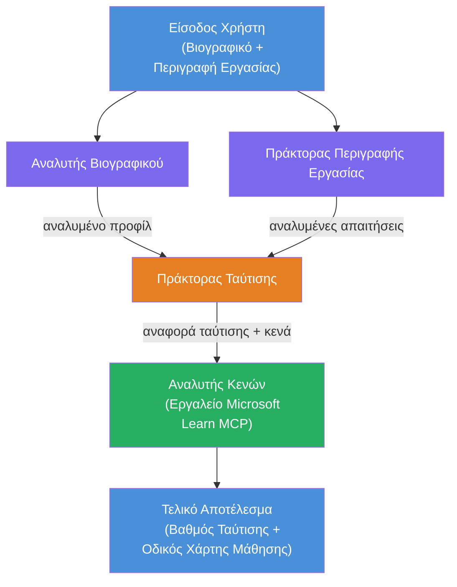

# Εργαστήριο 02 - Ροή Εργασίας Πολυ-Πρακτόρων: Εκτιμητής Ταύτισης Βιογραφικού με Θέση Εργασίας

---

## Τι θα δημιουργήσετε

Έναν **Εκτιμητή Ταύτισης Βιογραφικού → Θέσης Εργασίας** - μια ροή εργασίας με πολλούς εξειδικευμένους πράκτορες που συνεργάζονται για να αξιολογήσουν πόσο καλά ταιριάζει το βιογραφικό ενός υποψηφίου με μια περιγραφή θέσης εργασίας, και στη συνέχεια να δημιουργήσουν έναν εξατομικευμένο οδικό χάρτη μάθησης για να καλύψουν τα κενά.

### Οι πράκτορες

| Πράκτορας | Ρόλος |
|-------|------|
| **Αναλυτής Βιογραφικού** | Εξάγει δομημένες δεξιότητες, εμπειρία, πιστοποιήσεις από το κείμενο βιογραφικού |
| **Πράκτορας Περιγραφής Θέσης** | Εξάγει απαιτούμενες/προτιμώμενες δεξιότητες, εμπειρία, πιστοποιήσεις από μια περιγραφή θέσης |
| **Πράκτορας Συγκριτικής Αναλυσης** | Συγκρίνει προφίλ με απαιτήσεις → βαθμολογία ταύτισης (0-100) + ταιριαστές/ελλείπουσες δεξιότητες |
| **Αναλυτής Κενών** | Δημιουργεί έναν εξατομικευμένο οδικό χάρτη μάθησης με πόρους, χρονοδιαγράμματα και έργα γρήγορης νίκης |

### Ροή παρουσίασης

Ανεβάστε ένα **βιογραφικό + περιγραφή θέσης** → λάβετε μια **βαθμολογία ταύτισης + ελλείπουσες δεξιότητες** → λάβετε έναν **εξατομικευμένο οδικό χάρτη μάθησης**.

### Αρχιτεκτονική ροής εργασίας

> Μωβ = παράλληλοι πράκτορες | Πορτοκαλί = σημείο συγκέντρωσης | Πράσινο = τελικός πράκτορας με εργαλεία. Δείτε το [Module 1 - Κατανόηση της Αρχιτεκτονικής](docs/01-understand-multi-agent.md) και το [Module 4 - Πρότυπα Ορχήστρωσης](docs/04-orchestration-patterns.md) για λεπτομερή διαγράμματα και ροή δεδομένων.

### Θεματικές ενότητες

- Δημιουργία ροής εργασίας πολυ-πρακτόρων χρησιμοποιώντας **WorkflowBuilder**
- Ορισμός ρόλων πρακτόρων και ροής ορχήστρωσης (παράλληλη + διαδοχική)
- Πρότυπα επικοινωνίας μεταξύ πρακτόρων
- Τοπική δοκιμή με τον Επιθεωρητή Πρακτόρων
- Ανάπτυξη ροών εργασίας πολυ-πρακτόρων στην Υπηρεσία Πρακτόρων Foundry

---

## Προαπαιτούμενα

Ολοκληρώστε πρώτα το Εργαστήριο 01:

- [Εργαστήριο 01 - Μονός Πράκτορας](../lab01-single-agent/README.md)

---

## Ξεκινήστε

Δείτε τις πλήρεις οδηγίες εγκατάστασης, παρουσίαση κώδικα και εντολές δοκιμών στα:

- [Έγγραφα Εργαστηρίου 2 - Προαπαιτούμενα](docs/00-prerequisites.md)
- [Έγγραφα Εργαστηρίου 2 - Πλήρης Διαδρομή Μάθησης](docs/README.md)
- [Οδηγός εκτέλεσης PersonalCareerCopilot](PersonalCareerCopilot/README.md)

## Πρότυπα ορχήστρωσης (εναλλακτικές πρακτόρων)

Το Εργαστήριο 2 περιλαμβάνει την προεπιλεγμένη ροή **παράλληλοι → συγκεντρωτής → προγραμματιστής**, και τα έγγραφα
περιγράφουν επίσης εναλλακτικά πρότυπα για να δείξουν πιο ισχυρή πράκτορα συμπεριφορά:

- **Fan-out/Fan-in με σταθμισμένη συναίνεση**
- **Έλεγχος/κριτική πριν από τον τελικό οδικό χάρτη**
- **Υπό όρους δρομολογητής** (επιλογή διαδρομής βάσει βαθμολογίας ταύτισης και ελλειπουσών δεξιοτήτων)

Δείτε [docs/04-orchestration-patterns.md](docs/04-orchestration-patterns.md).

---

**Προηγούμενο:** [Εργαστήριο 01 - Μονός Πράκτορας](../lab01-single-agent/README.md) · **Πίσω στο:** [Αρχική Σελίδα Εργαστηρίου](../../README.md)

---

<!-- CO-OP TRANSLATOR DISCLAIMER START -->
**Αποποίηση ευθυνών**:  
Αυτό το έγγραφο έχει μεταφραστεί χρησιμοποιώντας υπηρεσία μετάφρασης AI [Co-op Translator](https://github.com/Azure/co-op-translator). Παρόλο που επιδιώκουμε την ακρίβεια, παρακαλούμε να έχετε υπόψη ότι οι αυτόματες μεταφράσεις μπορεί να περιέχουν σφάλματα ή ανακρίβειες. Το αρχικό έγγραφο στη μητρική του γλώσσα θα πρέπει να θεωρείται η επίσημη πηγή. Για κρίσιμες πληροφορίες, συνιστάται επαγγελματική μετάφραση από ανθρώπους. Δεν φέρουμε καμία ευθύνη για τυχόν παρανοήσεις ή λανθασμένες ερμηνείες που προκύπτουν από τη χρήση αυτής της μετάφρασης.
<!-- CO-OP TRANSLATOR DISCLAIMER END -->