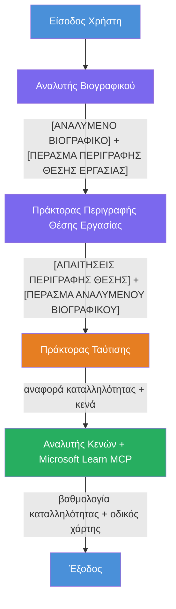

# Εργαστήριο 02 - Ροή εργασίας πολλαπλών πρακτόρων: Αξιολόγηση Καταλληλότητας Βιογραφικού → Θέσης Εργασίας

## Επισκόπηση

Σε αυτό το εργαστήριο πρακτικής, θα δημιουργήσετε μια **εφαρμογή πολλαπλών πρακτόρων με προτεραιότητα στη ροή εργασίας** χρησιμοποιώντας το Foundry Toolkit στο VS Code και θα την αναπτύξετε στην υπηρεσία Microsoft Foundry Agent Service.

**Τι θα δημιουργήσετε:** μια Αξιολόγηση Καταλληλότητας Βιογραφικού → Θέσης Εργασίας που αναλύει ένα βιογραφικό και περιγραφή θέσης, βαθμολογεί την αντιστοιχία και παράγει ένα εξατομικευμένο οδικό χάρτη εκμάθησης χρησιμοποιώντας πόρους του Microsoft Learn.

---

## Αρχιτεκτονική

```mermaid
flowchart TD
    A["Είσοδος Χρήστη"] --> B["Αναλυτής Βιογραφικού"]
    B -->|"[ΑΝΑΛΥΜΕΝΟ ΒΙΟΓΡΑΦΙΚΟ] + [ΠΕΡΑΣΜΑ ΠΕΡΙΓΡΑΦΗΣ ΘΕΣΗΣ ΕΡΓΑΣΙΑΣ]"| C["Πράκτορας Περιγραφής Θέσης Εργασίας"]
    C -->|"[ΑΠΑΙΤΗΣΕΙΣ ΠΕΡΙΓΡΑΦΗΣ ΘΕΣΗΣ] + [ΠΕΡΑΣΜΑ ΑΝΑΛΥΜΕΝΟΥ ΒΙΟΓΡΑΦΙΚΟΥ]"| D["Πράκτορας Ταύτισης"]
    D -->|αναφορά καταλληλότητας + κενά| E["Αναλυτής Κενών + Microsoft Learn MCP"]
    E -->|βαθμολογία καταλληλότητας + οδικός χάρτης| F["Έξοδος"]

    style A fill:#4A90D9,color:#fff
    style B fill:#7B68EE,color:#fff
    style C fill:#7B68EE,color:#fff
    style D fill:#E67E22,color:#fff
    style E fill:#27AE60,color:#fff
    style F fill:#4A90D9,color:#fff
```

**Πώς λειτουργεί:**
1. Ο χρήστης επικολλά ένα βιογραφικό και μια περιγραφή θέσης εργασίας.
2. Ο **ResumeParser** αναλύει το βιογραφικό και αντιγράφει το JD αυτούσιο σε μια ενότητα `[JOB DESCRIPTION PASS-THROUGH]`.
3. Ο **JD Agent** εξάγει δομημένες απαιτήσεις από την ενότητα αυτή και στη συνέχεια προωθεί το `[PARSED RESUME]` ως `[PARSED RESUME PASS-THROUGH]`.
4. Ο **MatchingAgent** συγκρίνει το `[PARSED RESUME PASS-THROUGH]` με το `[JD REQUIREMENTS]` και παράγει μια βαθμολογία καταλληλότητας.
5. Ο **GapAnalyzer** μετατρέπει τα κενά σε πρακτικό οδικό χάρτη και αναζητά πραγματικούς συνδέσμους Microsoft Learn μέσω MCP.

---

## Προαπαιτούμενα

Ολοκληρώστε πρώτα το Εργαστήριο 01:

- [Εργαστήριο 01 - Μονός Πράκτορας](../lab01-single-agent/README.md)

---

## Μέρος 1: Διαβάστε τις ενότητες με τη σειρά

Δείτε ολόκληρη τη διαδρομή μάθησης στο:

- [Έγγραφα Εργαστηρίου 2 - Προαπαιτούμενα](docs/00-prerequisites.md)
- [Έγγραφα Εργαστηρίου 2 - Πλήρης Διαδρομή Μάθησης](docs/README.md)
- [Οδηγός εκτέλεσης PersonalCareerCopilot](PersonalCareerCopilot/README.md)

---

## Μέρος 2: Δημιουργία και δοκιμή της ροής εργασίας

1. Χρησιμοποιήστε τον οδηγό Foundry Toolkit για να στήσετε το έργο με βάση τη ροή εργασίας.
2. Αντιγράψτε τα μπλοκ προτροπής και το γράφημα ροής εργασίας από το `PersonalCareerCopilot/main.py` στον χώρο εργασίας σας.
3. Εκτελέστε το τοπικά με τον Επιθεωρητή Πρακτόρων και επαληθεύστε και τους τέσσερις πράκτορες καθώς και το εργαλείο MCP.
4. Αναπτύξτε τον φιλοξενούμενο πράκτορα στο Foundry όταν περάσουν οι τοπικές δοκιμές.

---

## Σχήματα ορχήστρωσης

Το Εργαστήριο 02 περιλαμβάνει τη προεπιλεγμένη ροή **διασπορά → συγκέντρωση → διαδοχική**, και τα έγγραφα περιγράφουν επίσης εναλλακτικά σχήματα ορχήστρωσης για πειραματισμούς.

- **Διασπορά/συγκέντρωση με σταθμισμένη συναίνεση**
- **Πέρασμα επανεξέτασης/κριτικής πριν από τον τελικό οδικό χάρτη**
- **Υποconditional δρομολογητής** με βάση τη βαθμολογία καταλληλότητας και τις ελλείπουσες δεξιότητες

Δείτε [docs/04-orchestration-patterns.md](docs/04-orchestration-patterns.md).

---

**Προηγούμενο:** [Εργαστήριο 01 - Μονός Πράκτορας](../lab01-single-agent/README.md) · **Πίσω στο:** [Αρχική Σελίδα Εργαστηρίου](../../README.md)

---

<!-- CO-OP TRANSLATOR DISCLAIMER START -->
**Αποποίηση ευθυνών**:
Αυτό το έγγραφο έχει μεταφραστεί χρησιμοποιώντας την υπηρεσία μετάφρασης με τεχνητή νοημοσύνη [Co-op Translator](https://github.com/Azure/co-op-translator). Ενώ επιδιώκουμε την ακρίβεια, παρακαλούμε να έχετε υπόψη ότι οι αυτοματοποιημένες μεταφράσεις ενδέχεται να περιέχουν λάθη ή ανακρίβειες. Το πρωτότυπο έγγραφο στη μητρική του γλώσσα πρέπει να θεωρείται η αυθεντική πηγή. Για κρίσιμες πληροφορίες, συνιστάται επαγγελματική ανθρώπινη μετάφραση. Δεν φέρουμε ευθύνη για τυχόν παρεξηγήσεις ή λανθασμένες ερμηνείες που προκύπτουν από τη χρήση αυτής της μετάφρασης.
<!-- CO-OP TRANSLATOR DISCLAIMER END -->