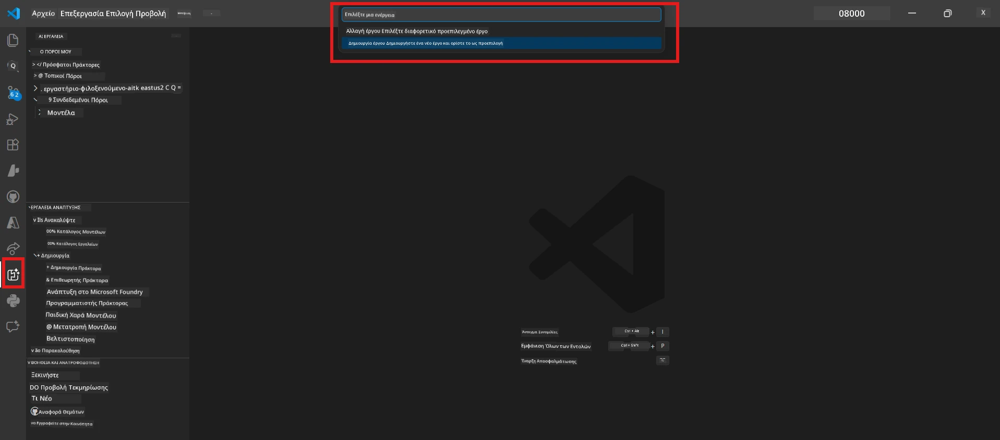

# Module 0 - Προαπαιτούμενα

Πριν ξεκινήσετε το Εργαστήριο 02, επιβεβαιώστε ότι έχετε ολοκληρώσει τα παρακάτω. Αυτό το εργαστήριο βασίζεται άμεσα στο Εργαστήριο 01 - μην το παραλείψετε.

---

## 1. Ολοκληρώστε το Εργαστήριο 01

Το Εργαστήριο 02 προϋποθέτει ότι έχετε ήδη:

- [x] Ολοκληρώσει όλα τα 8 modules του [Εργαστηρίου 01 - Μονός Αντιπρόσωπος](../../lab01-single-agent/README.md)
- [x] Εγκαταστήσει επιτυχώς έναν μόνο αντιπρόσωπο στην Υπηρεσία Αντιπροσώπων Foundry
- [x] Επιβεβαιώσει ότι ο αντιπρόσωπος λειτουργεί τόσο τοπικά με το Agent Inspector όσο και στο Foundry Playground

Αν δεν έχετε ολοκληρώσει το Εργαστήριο 01, επιστρέψτε και ολοκληρώστε το τώρα: [Έγγραφα Εργαστηρίου 01](../../lab01-single-agent/docs/00-prerequisites.md)

---

## 2. Επιβεβαιώστε την υπάρχουσα εγκατάσταση

Όλα τα εργαλεία από το Εργαστήριο 01 θα πρέπει να είναι ακόμη εγκατεστημένα και να λειτουργούν. Εκτελέστε αυτούς τους γρήγορους ελέγχους:

### 2.1 Azure CLI

```powershell
az account show --query "{name:name, id:id}" --output table
```

Αναμένεται: Εμφανίζει το όνομα και το αναγνωριστικό της συνδρομής σας. Αν αποτύχει, εκτελέστε [`az login`](https://learn.microsoft.com/cli/azure/authenticate-azure-cli-interactively).

### 2.2 Επεκτάσεις VS Code

1. Πατήστε `Ctrl+Shift+P` → πληκτρολογήστε **"Microsoft Foundry"** → επιβεβαιώστε ότι βλέπετε εντολές (π.χ., `Microsoft Foundry: Create a New Hosted Agent`).
2. Πατήστε `Ctrl+Shift+P` → πληκτρολογήστε **"Foundry Toolkit"** → επιβεβαιώστε ότι βλέπετε εντολές (π.χ., `Foundry Toolkit: Open Agent Inspector`).

### 2.3 Έργο & Μοντέλο Foundry

1. Κάντε κλικ στο εικονίδιο **Microsoft Foundry** στη γραμμή δραστηριοτήτων του VS Code.
2. Επιβεβαιώστε ότι το έργο σας εμφανίζεται στη λίστα (π.χ., `workshop-agents`).
3. Αναπτύξτε το έργο → επιβεβαιώστε ότι υπάρχει αναπτυγμένο μοντέλο (π.χ., `gpt-4.1-mini`) με κατάσταση **Succeeded**.

> **Αν η ανάπτυξη του μοντέλου σας έχει λήξει:** Κάποιες δωρεάν αναπτύξεις λήγουν αυτόματα. Ανεπτυξτε ξανά από τον [Κατάλογο Μοντέλων](https://learn.microsoft.com/azure/foundry/foundry-models/concepts/models-sold-directly-by-azure) (`Ctrl+Shift+P` → **Microsoft Foundry: Open Model Catalog**).



### 2.4 Ρόλοι RBAC

Επιβεβαιώστε ότι έχετε τον ρόλο **Azure AI User** στο έργο Foundry σας:

1. [Azure Portal](https://portal.azure.com) → πόρος του έργου Foundry σας → **Έλεγχος πρόσβασης (IAM)** → καρτέλα **[Αναθέσεις ρόλων](https://learn.microsoft.com/azure/foundry/concepts/rbac-foundry)**.
2. Αναζητήστε το όνομά σας → επιβεβαιώστε ότι ο ρόλος **[Azure AI User](https://aka.ms/foundry-ext-project-role)** είναι καταχωρημένος.

---

## 3. Κατανόηση εννοιών πολλαπλών αντιπροσώπων (νέο για το Εργαστήριο 02)

Το Εργαστήριο 02 εισάγει έννοιες που δεν καλύφθηκαν στο Εργαστήριο 01. Διαβάστε τις προσεκτικά πριν προχωρήσετε:

### 3.1 Τι είναι μια ροή εργασίας πολλαπλών αντιπροσώπων;

Αντί για έναν μόνο αντιπρόσωπο που χειρίζεται τα πάντα, μια **ροή εργασίας πολλαπλών αντιπροσώπων** διαμοιράζει τη δουλειά ανάμεσα σε πολλούς εξειδικευμένους αντιπροσώπους. Κάθε αντιπρόσωπος έχει:

- Τις δικές του **οδηγίες** (σύστημα προτροπής)
- Τον δικό του **ρόλο** (στοιχείο που είναι υπεύθυνος)
- Προαιρετικά **εργαλεία** (λειτουργίες που μπορεί να καλέσει)

Οι αντιπρόσωποι επικοινωνούν μέσω ενός **γραφικού ορχηστρωτή** που καθορίζει πώς ρέουν τα δεδομένα μεταξύ τους.

### 3.2 WorkflowBuilder

Η κλάση [`WorkflowBuilder`](https://learn.microsoft.com/agent-framework/workflows/agents-in-workflows) από το `agent_framework` είναι το SDK συστατικό που συνδέει τους αντιπροσώπους:

```python
from agent_framework import WorkflowBuilder

workflow = (
    WorkflowBuilder(
        name="MyWorkflow",
        start_executor=agent_a,
        output_executors=[agent_d],
    )
    .add_edge(agent_a, agent_b)
    .add_edge(agent_a, agent_c)
    .add_edge(agent_b, agent_d)
    .add_edge(agent_c, agent_d)
    .build()
)
```

- **`start_executor`** - Ο πρώτος αντιπρόσωπος που λαμβάνει την είσοδο του χρήστη
- **`output_executors`** - Ο αντιπρόσωπος ή οι αντιπρόσωποι των οποίων η έξοδος γίνεται η τελική απάντηση
- **`add_edge(source, target)`** - Ορίζει ότι ο `target` λαμβάνει την έξοδο του `source`

### 3.3 Εργαλεία MCP (Πρωτόκολλο Πλαισίου Μοντέλου)

Το Εργαστήριο 02 χρησιμοποιεί ένα **εργαλείο MCP** που καλεί το Microsoft Learn API για να αντλήσει πόρους μάθησης. Το [MCP (Model Context Protocol)](https://modelcontextprotocol.io/introduction) είναι ένα τυποποιημένο πρωτόκολλο για τη σύνδεση μοντέλων AI με εξωτερικές πηγές δεδομένων και εργαλεία.

| Όρος | Ορισμός |
|------|---------|
| **MCP server** | Μια υπηρεσία που παρέχει εργαλεία/πόρους μέσω του [πρωτοκόλλου MCP](https://learn.microsoft.com/azure/foundry/agents/how-to/tools/model-context-protocol) |
| **MCP client** | Ο κώδικας του αντιπροσώπου σας που συνδέεται με έναν MCP server και καλεί τα εργαλεία του |
| **[Streamable HTTP](https://learn.microsoft.com/agent-framework/agents/tools/hosted-mcp-tools)** | Η μέθοδος μεταφοράς που χρησιμοποιείται για την επικοινωνία με τον MCP server |

### 3.4 Πώς διαφέρει το Εργαστήριο 02 από το Εργαστήριο 01

| Στοιχείο | Εργαστήριο 01 (Μονός Αντιπρόσωπος) | Εργαστήριο 02 (Πολλαπλοί Αντιπρόσωποι) |
|----------|-----------------------------------|---------------------------------------|
| Αντιπρόσωποι | 1 | 4 (με εξειδικευμένους ρόλους) |
| Ορχήστρωση | Καμία | WorkflowBuilder (παράλληλη + αλληλουχία) |
| Εργαλεία | Προαιρετική λειτουργία `@tool` | Εργαλείο MCP (κλήση εξωτερικού API) |
| Πολυπλοκότητα | Απλή προτροπή → απάντηση | Βιογραφικό + JD → βαθμολογία → οδικός χάρτης |
| Ροή πλαισίου | Άμεση | Παράδοση από αντιπρόσωπο σε αντιπρόσωπο |

---

## 4. Δομή αποθετηρίου εργαστηρίου για το Εργαστήριο 02

Βεβαιωθείτε ότι γνωρίζετε πού βρίσκονται τα αρχεία του Εργαστηρίου 02:

```
workshop/
└── lab02-multi-agent/
    ├── README.md                       ← Lab overview
    ├── docs/                           ← You are here
    │   ├── README.md                   ← Learning path index
    │   ├── 00-prerequisites.md         ← This file
    │   ├── 01-understand-multi-agent.md
    │   ├── ...
    │   └── 08-troubleshooting.md
    └── PersonalCareerCopilot/          ← The agent project
        ├── agent.yaml                  ← Agent definition
        ├── main.py                     ← 4-agent workflow code
        ├── Dockerfile                  ← Container configuration
        └── requirements.txt            ← Python dependencies
```

---

### Σημείο ελέγχου

- [ ] Το Εργαστήριο 01 έχει ολοκληρωθεί πλήρως (όλα τα 8 modules, αντιπρόσωπος αναπτυγμένος και επαληθευμένος)
- [ ] `az account show` επιστρέφει τη συνδρομή σας
- [ ] Οι επεκτάσεις Microsoft Foundry και Foundry Toolkit είναι εγκατεστημένες και ανταποκρίνονται
- [ ] Το έργο Foundry έχει αναπτυγμένο μοντέλο (π.χ., `gpt-4.1-mini`)
- [ ] Έχετε τον ρόλο **Azure AI User** στο έργο
- [ ] Έχετε διαβάσει την ενότητα για τις έννοιες πολλαπλών αντιπροσώπων παραπάνω και κατανοείτε το WorkflowBuilder, MCP και την ορχήστρωση αντιπροσώπων

---

**Επόμενο:** [01 - Κατανόηση Αρχιτεκτονικής Πολλαπλών Αντιπροσώπων →](01-understand-multi-agent.md)

---

<!-- CO-OP TRANSLATOR DISCLAIMER START -->
**Αποποίηση ευθυνών**:  
Αυτό το έγγραφο έχει μεταφραστεί χρησιμοποιώντας την υπηρεσία αυτόματης μετάφρασης AI [Co-op Translator](https://github.com/Azure/co-op-translator). Παρόλο που επιδιώκουμε ακρίβεια, παρακαλούμε να έχετε υπόψη ότι οι αυτόματες μεταφράσεις μπορεί να περιέχουν λάθη ή ανακρίβειες. Το πρωτότυπο έγγραφο στη γλώσσα του θεωρείται η αυθεντική πηγή. Για κρίσιμες πληροφορίες, συνιστάται επαγγελματική ανθρώπινη μετάφραση. Δεν φέρουμε ευθύνη για τυχόν παρεξηγήσεις ή λανθασμένες ερμηνείες που προκύπτουν από τη χρήση αυτής της μετάφρασης.
<!-- CO-OP TRANSLATOR DISCLAIMER END -->