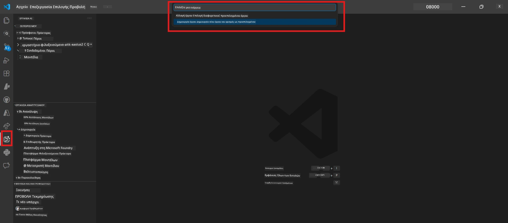

# Ενότητα 0 - Εισαγωγή

⏱️ ~10 λεπτά

> [!WARNING]
> **Προεπισκόπηση & Περιορισμοί:** Οι [Φιλοξενούμενοι Πράκτορες](https://learn.microsoft.com/azure/foundry/agents/concepts/hosted-agents) βρίσκονται αυτήν τη στιγμή σε **δημόσια προεπισκόπηση** - δεν συνιστώνται για παραγωγικά φορτία εργασίας. Ορισμένες λειτουργίες που εμφανίζονται σε αυτό το εργαστήριο μπορεί να αλλάξουν καθώς η υπηρεσία προχωρά προς τη γενική διαθεσιμότητα.

## Τι θα κατασκευάσετε

Σε αυτό το εργαστήριο, επεκτείνετε τις δεξιότητες του απλού πράκτορα από το Εργαστήριο 01 για να δημιουργήσετε μια **ροή εργασίας πολλών πρακτόρων** - τον Αξιολογητή Καταλληλότητας Βιογραφικού → Θέσης Εργασίας.

Επικολλάτε ένα **βιογραφικό** και μια **περιγραφή θέσης εργασίας**. Τέσσερις εξειδικευμένοι πράκτορες επεξεργάζονται την είσοδο διαδοχικά, και στη συνέχεια επιστρέφουν:
- Μια βαθμολογία καταλληλότητας (0–100 με ανάλυση βαθμολογίας)
- Μια λίστα κενών δεξιοτήτων και πιστοποιήσεων
- Έναν εξατομικευμένο οδικό χάρτη μάθησης με πραγματικούς συνδέσμους Microsoft Learn για κάθε κενό

**Η ροή εργασίας χρησιμοποιεί:**
- **Microsoft Agent Framework** - `WorkflowBuilder` για διαδοχική ορχήστρωση ροής
- **Foundry Toolkit για VS Code** - αρχιτεκτονική, τοπικές δοκιμές, ανάπτυξη
- **Ένα μοντέλο AI** (π.χ., `gpt-4.1-mini`) - χρησιμοποιείται από και τους τέσσερις πράκτορες
- **Microsoft Learn MCP server** - παρέχει πραγματικούς συνδέσμους πόρων μάθησης για κάθε κενό δεξιότητας

---

## Επιλέξτε το μονοπάτι σας

> ⚠️ **Συνεχίστε με το ίδιο μονοπάτι που χρησιμοποιήσατε στο Εργαστήριο 01.**

<details open>
<summary><strong>🅰️ Μονοπάτι Α - Νέφος Azure (απαιτεί συνδρομή Azure)</strong></summary>

| | Λεπτομέρειες |
|---|---|
| **Για ποιον είναι;** | Ολοκληρώσατε το Εργαστήριο 01 χρησιμοποιώντας μια συνδρομή Azure |
| **Μοντέλο** | Azure OpenAI μέσω Foundry (π.χ., `gpt-4.1-mini`) |
| **Καλυπτόμενα εργαστήρια** | Όλες οι ενότητες (00–09) |
| **Ανάπτυξη στο νέφος;** | ✅ Ναι - πλήρης ανάπτυξη από άκρο σε άκρο |

</details>

<details open>
<summary><strong>🅱️ Μονοπάτι Β - Foundry Local (χωρίς ανάγκη συνδρομής Azure)</strong></summary>

| | Λεπτομέρειες |
|---|---|
| **Για ποιον είναι;** | Ολοκληρώσατε το Εργαστήριο 01 χρησιμοποιώντας Foundry Local |
| **Μοντέλο** | Foundry Local (δωρεάν, τρέχει στον υπολογιστή σας) |
| **Καλυπτόμενα εργαστήρια** | Ενότητες 00–05 (παραλείπονται 06–07 - ανάπτυξη & επαλήθευση νέφους) |
| **Ανάπτυξη στο νέφος;** | ❌ Όχι - μόνο τοπικός έλεγχος μέσω Agent Inspector |

</details>

---

## Έλεγχος Εργαστηρίου 01

Το Εργαστήριο 02 βασίζεται απευθείας στο Εργαστήριο 01. Ολοκληρώστε πρώτα το Εργαστήριο 01 πριν ξεκινήσετε εδώ.

Δεν έχετε κάνει ακόμα το Εργαστήριο 01; Ξεκινήστε εδώ: [Lab 01 - Introduction](../../lab01-single-agent/docs/00-prerequisites.md)

<details open>
<summary><strong>🅰️ Μονοπάτι Α - Νέφος Azure</strong></summary>

```powershell
az account show --query "{name:name, id:id}" --output table
```

Αν αποτύχει, εκτελέστε `az login`. Στη συνέχεια επιβεβαιώστε στο VS Code:

1. `Ctrl+Shift+P` → πληκτρολογήστε **Foundry Toolkit** → επιβεβαιώστε ότι εμφανίζονται οι εντολές.
2. Κάντε κλικ στο εικονίδιο **Foundry Toolkit** → το έργο σας και το αναπτυγμένο μοντέλο εμφανίζουν **Succeeded**.



> **RBAC:** Αντιστοιχίσατε **Foundry User** στο Εργαστήριο 01. Αν χρειάζεται να το ξαναεπιλέξετε, δείτε [Lab 01, Module 1](../../lab01-single-agent/docs/01-setup.md#deploy-a-model--assign-rbac). Ο ρόλος ονομαζόταν προηγουμένως **Azure AI User** - ίδιες άδειες.

</details>

<details open>
<summary><strong>🅱️ Μονοπάτι Β - Foundry Local</strong></summary>

```powershell
Invoke-WebRequest -Uri "http://localhost:5273/v1/health" -UseBasicParsing | Select-Object StatusCode
```

Αναμενόμενο: `StatusCode: 200`. Αν όχι, επανεκκινήστε το Foundry Local από την πλευρική μπάρα Foundry Toolkit.

> Όλη η επεξεργασία γίνεται στη μηχανή σας. Η μόνη εξερχόμενη κλήση είναι το εργαλείο MCP προς `https://learn.microsoft.com/api/mcp`.

</details>

---

## Τι νέο υπάρχει στο Εργαστήριο 02

| | Εργαστήριο 01 | Εργαστήριο 02 |
|--|--------|--------|
| Πράκτορες | 1 | 4 (αλυσιδωτοί με WorkflowBuilder) |
| Πρότυπο αρχιτεκτονικής | Βασικό - Agent Framework | Ροές εργασίας - Agent Framework |
| Νέο πακέτο | - | `mcp` |
| Ορχήστρωση | Μονός συνομιλητικός πράκτορας | Διαδοχικός αγωγός (WorkflowBuilder) |
| Νέο εργαλείο | - | `search_microsoft_learn_for_plan` (MCP) |

---

**Επόμενο:** [01 - Κατανόηση της Αρχιτεκτονικής →](01-understand-multi-agent.md)

---

<!-- CO-OP TRANSLATOR DISCLAIMER START -->
**Αποποίηση ευθυνών**:
Αυτό το έγγραφο έχει μεταφραστεί χρησιμοποιώντας την υπηρεσία μετάφρασης με τεχνητή νοημοσύνη [Co-op Translator](https://github.com/Azure/co-op-translator). Ενώ επιδιώκουμε την ακρίβεια, παρακαλούμε να έχετε υπόψη ότι οι αυτοματοποιημένες μεταφράσεις ενδέχεται να περιέχουν λάθη ή ανακρίβειες. Το πρωτότυπο έγγραφο στη μητρική του γλώσσα πρέπει να θεωρείται η αυθεντική πηγή. Για κρίσιμες πληροφορίες, συνιστάται επαγγελματική ανθρώπινη μετάφραση. Δεν φέρουμε ευθύνη για τυχόν παρεξηγήσεις ή λανθασμένες ερμηνείες που προκύπτουν από τη χρήση αυτής της μετάφρασης.
<!-- CO-OP TRANSLATOR DISCLAIMER END -->