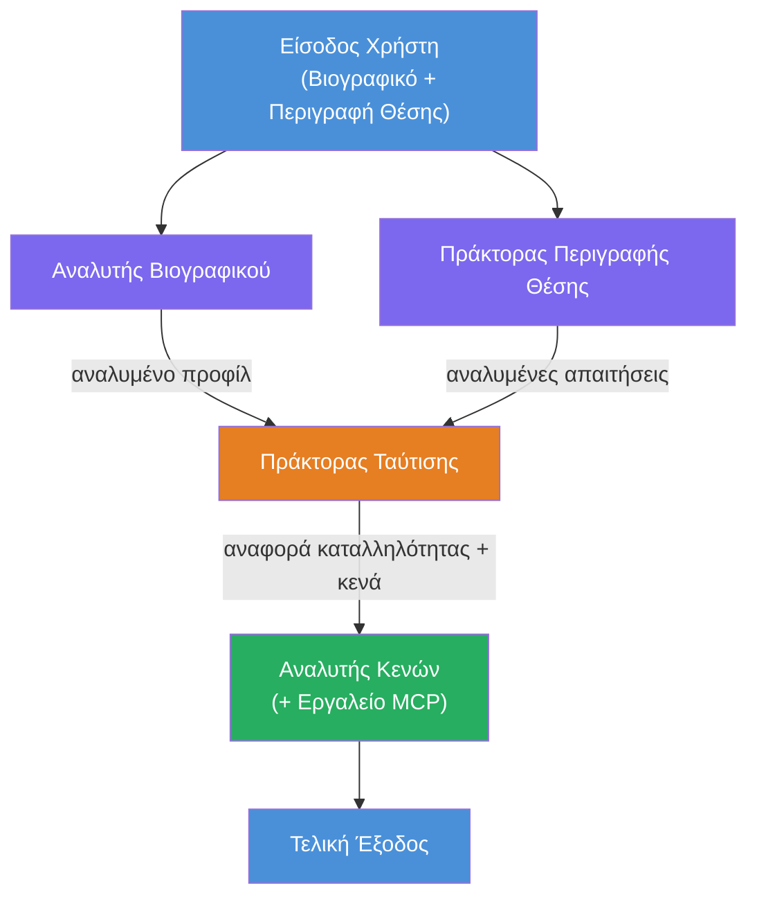
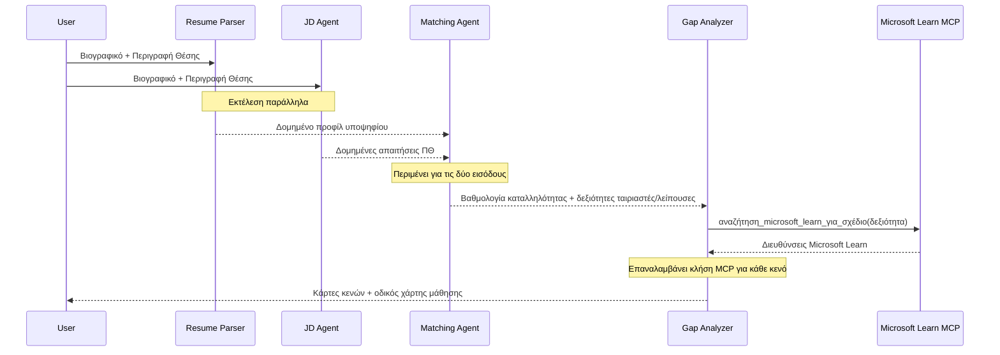
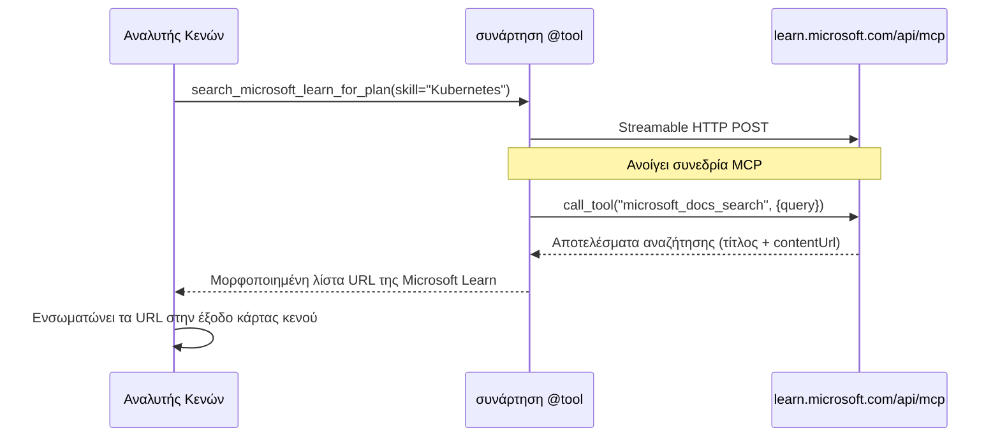

# Module 1 - Κατανόηση της Αρχιτεκτονικής Πολυ-Πρακτόρων

Σε αυτό το μοντέλο, μαθαίνετε την αρχιτεκτονική του Resume → Job Fit Evaluator πριν γράψετε οποιονδήποτε κώδικα. Η κατανόηση του γραφήματος ορχήστρωσης, των ρόλων των πρακτόρων και της ροής δεδομένων είναι κρίσιμη για τον εντοπισμό σφαλμάτων και την επέκταση των [εργασιών με πολλαπλούς πράκτορες](https://learn.microsoft.com/azure/architecture/ai-ml/idea/multiple-agent-workflow-automation).

---

## Το πρόβλημα που λύνει

Ο συγχρονισμός ενός βιογραφικού με μια περιγραφή θέσης εργασίας περιλαμβάνει πολλές διακριτές δεξιότητες:

1. **Ανάλυση** - Εξαγωγή δομημένων δεδομένων από αδόμητο κείμενο (βιογραφικό)
2. **Ανάλυση** - Εξαγωγή απαιτήσεων από μια περιγραφή θέσης εργασίας
3. **Σύγκριση** - Βαθμολόγηση της ευθυγράμμισης μεταξύ των δύο
4. **Σχεδιασμός** - Δημιουργία οδικού χάρτη μάθησης για την κάλυψη κενών

Ένας μόνος πράκτορας που εκτελεί και τα τέσσερα καθήκοντα σε μία προτροπή συχνά παράγει:
- Ελλιπή εξαγωγή (σπεύδει να ολοκληρώσει την ανάλυση για να φτάσει στη βαθμολογία)
- Επιφανειακή βαθμολόγηση (χωρίς ανάλυση βάσει αποδείξεων)
- Γενικούς οδικούς χάρτες (όχι προσαρμοσμένους στα συγκεκριμένα κενά)

Με τον διαχωρισμό σε **τέσσερις εξειδικευμένους πράκτορες**, ο καθένας εστιάζει στο δικό του έργο με αφιερωμένες οδηγίες, παράγοντας υψηλότερης ποιότητας αποτελέσματα σε κάθε στάδιο.

---

## Οι τέσσερις πράκτορες

Κάθε πράκτορας είναι ένας πλήρης [Microsoft Foundry](https://learn.microsoft.com/azure/foundry/agents/concepts/hosted-agents) πράκτορας που δημιουργείται μέσω της `AzureAIAgentClient.as_agent()`. Μοιράζονται την ίδια ανάπτυξη μοντέλου αλλά έχουν διαφορετικές οδηγίες και (προαιρετικά) διαφορετικά εργαλεία.

| # | Όνομα Πράκτορα | Ρόλος | Είσοδος | Έξοδος |
|---|----------------|-------|---------|---------|
| 1 | **ResumeParser** | Εξάγει δομημένο προφίλ από κείμενο βιογραφικού | Ακατέργαστο κείμενο βιογραφικού (από χρήστη) | Προφίλ Υποψήφιου, Τεχνικές Δεξιότητες, Μαλακές Δεξιότητες, Πιστοποιήσεις, Εμπειρία Περιοχής, Επιτεύγματα |
| 2 | **JobDescriptionAgent** | Εξάγει δομημένες απαιτήσεις από μια Περιγραφή Θέσης | Ακατέργαστο κείμενο περιγραφής θέσης (από χρήστη, προωθείται μέσω ResumeParser) | Επισκόπηση Ρόλου, Απαιτούμενες Δεξιότητες, Προτιμώμενες Δεξιότητες, Εμπειρία, Πιστοποιήσεις, Εκπαίδευση, Υποχρεώσεις |
| 3 | **MatchingAgent** | Υπολογίζει βαθμολογία ευθυγράμμισης βάσει αποδείξεων | Εξόδους από ResumeParser + JobDescriptionAgent | Βαθμολογία Ευθυγράμμισης (0-100 με ανάλυση), Ταιριαστές Δεξιότητες, Ελλείπουσες Δεξιότητες, Κενά |
| 4 | **GapAnalyzer** | Δημιουργεί προσωποποιημένο οδικό χάρτη μάθησης | Έξοδος από MatchingAgent | Κάρτες κενών (ανά δεξιότητα), Σειρά Μάθησης, Χρονοδιάγραμμα, Πόροι από το Microsoft Learn |

---

## Το γράφημα ορχήστρωσης

Η ροή εργασίας χρησιμοποιεί **παράλληλη διανομή** ακολουθούμενη από **διαδοχική συγκέντρωση**:


> **Υπόμνημα:** Μωβ = παράλληλοι πράκτορες, Πορτοκαλί = σημείο συγκέντρωσης, Πράσινο = τελικός πράκτορας με εργαλεία

### Πώς ρέουν τα δεδομένα


1. **Ο χρήστης στέλνει** μήνυμα που περιλαμβάνει ένα βιογραφικό και μια περιγραφή θέσης.
2. **ResumeParser** λαμβάνει ολόκληρη την είσοδο χρήστη και εξάγει δομημένο προφίλ υποψηφίου.
3. **JobDescriptionAgent** λαμβάνει την είσοδο χρήστη παράλληλα και εξάγει δομημένες απαιτήσεις.
4. **MatchingAgent** λαμβάνει εξόδους και από τους δύο ResumeParser και JobDescriptionAgent (το πλαίσιο περιμένει και τους δύο να ολοκληρώσουν πριν τρέξει το MatchingAgent).
5. **GapAnalyzer** λαμβάνει την έξοδο του MatchingAgent και καλεί το **εργαλείο Microsoft Learn MCP** για να αντλήσει πραγματικούς πόρους μάθησης για κάθε κενό.
6. Η **τελική έξοδος** είναι η απάντηση του GapAnalyzer, που περιλαμβάνει τη βαθμολογία ευθυγράμμισης, τις κάρτες κενών και έναν πλήρη οδικό χάρτη μάθησης.

### Γιατί έχει σημασία η παράλληλη διανομή

Ο ResumeParser και ο JobDescriptionAgent τρέχουν **παράλληλα** επειδή κανένας δεν εξαρτάται από τον άλλο. Αυτό:
- Μειώνει τη συνολική καθυστέρηση (και οι δύο τρέχουν ταυτόχρονα αντί διαδοχικά)
- Είναι ένας φυσικός διαχωρισμός (ανάλυση βιογραφικού έναντι ανάλυσης περιγραφής θέσης είναι ανεξάρτητα καθήκοντα)
- Δείχνει ένα κοινό μοτίβο πολυ-πράκτορα: **διανομή → συγκέντρωση → δράση**

---

## WorkflowBuilder στον κώδικα

Ακολουθεί πώς το παραπάνω γράφημα αντιστοιχεί σε κλήσεις API του [`WorkflowBuilder`](https://learn.microsoft.com/agent-framework/workflows/agents-in-workflows) στο `main.py`:

```python
from agent_framework import WorkflowBuilder

workflow = (
    WorkflowBuilder(
        name="ResumeJobFitEvaluator",
        start_executor=resume_parser,       # Πρώτος πράκτορας που λαμβάνει είσοδο χρήστη
        output_executors=[gap_analyzer],     # Τελικός πράκτορας του οποίου η έξοδος επιστρέφεται
    )
    .add_edge(resume_parser, jd_agent)      # ResumeParser → JobDescriptionAgent
    .add_edge(resume_parser, matching_agent) # ResumeParser → MatchingAgent
    .add_edge(jd_agent, matching_agent)      # JobDescriptionAgent → MatchingAgent
    .add_edge(matching_agent, gap_analyzer)  # MatchingAgent → GapAnalyzer
    .build()
)
```

**Κατανόηση των ακμών:**

| Ακμή | Τι σημαίνει |
|-------|-------------|
| `resume_parser → jd_agent` | Ο JD Agent λαμβάνει έξοδο από ResumeParser |
| `resume_parser → matching_agent` | Ο MatchingAgent λαμβάνει έξοδο από ResumeParser |
| `jd_agent → matching_agent` | Ο MatchingAgent λαμβάνει επίσης έξοδο από JD Agent (περιμένει και τους δύο) |
| `matching_agent → gap_analyzer` | Ο GapAnalyzer λαμβάνει έξοδο από MatchingAgent |

Επειδή ο `matching_agent` έχει **δύο εισερχόμενες ακμές** (`resume_parser` και `jd_agent`), το πλαίσιο περιμένει αυτόματα και τους δύο να ολοκληρώσουν πριν τρέξει τον Matching Agent.

---

## Το εργαλείο MCP

Ο πράκτορας GapAnalyzer έχει ένα εργαλείο: `search_microsoft_learn_for_plan`. Αυτό είναι ένα **[εργαλείο MCP](https://learn.microsoft.com/agent-framework/agents/tools/hosted-mcp-tools)** που καλεί το API του Microsoft Learn για να αντλήσει επιμελημένους πόρους μάθησης.

### Πώς λειτουργεί

```python
@tool
async def search_microsoft_learn_for_plan(
    skill: str, role: str = "", max_results: int = 5
) -> str:
    """Search Microsoft Learn MCP and return curated official links."""
    # Συνδέεται στο https://learn.microsoft.com/api/mcp μέσω ροής HTTP
    # Καλεί το εργαλείο 'microsoft_docs_search' στον διακομιστή MCP
    # Επιστρέφει μορφοποιημένη λίστα διευθύνσεων URL του Microsoft Learn
```

### Ροή κλήσης MCP


1. Ο GapAnalyzer αποφασίζει ότι χρειάζεται πόρους μάθησης για μια δεξιότητα (π.χ., "Kubernetes")
2. Το πλαίσιο καλεί `search_microsoft_learn_for_plan(skill="Kubernetes")`
3. Η συνάρτηση ανοίγει μια [Streamable HTTP](https://learn.microsoft.com/agent-framework/agents/tools/hosted-mcp-tools) σύνδεση στο `https://learn.microsoft.com/api/mcp`
4. Καλεί το εργαλείο `microsoft_docs_search` στον [MCP server](https://learn.microsoft.com/azure/foundry/agents/how-to/tools/model-context-protocol)
5. Ο MCP server επιστρέφει αποτελέσματα αναζήτησης (τίτλο + URL)
6. Η συνάρτηση μορφοποιεί τα αποτελέσματα και τα επιστρέφει ως συμβολοσειρά
7. Ο GapAnalyzer χρησιμοποιεί τα επιστρεφόμενα URLs στην έξοδο των καρτών κενών

### Αναμενόμενα αρχεία καταγραφής MCP

Όταν τρέχει το εργαλείο, θα δείτε καταγραφές όπως:

```
GET https://learn.microsoft.com/api/mcp → 405 (Method Not Allowed)
POST https://learn.microsoft.com/api/mcp → 200
DELETE https://learn.microsoft.com/api/mcp → 405 (Method Not Allowed)
```

**Αυτά είναι φυσιολογικά.** Ο πελάτης MCP κάνει δοκιμές με GET και DELETE κατά την αρχικοποίηση - οι απαντήσεις 405 είναι αναμενόμενη συμπεριφορά. Η ίδια η κλήση εργαλείου χρησιμοποιεί POST και επιστρέφει 200. Ανησυχείτε μόνο αν οι κλήσεις POST αποτύχουν.

---

## Πρότυπο δημιουργίας πράκτορα

Κάθε πράκτορας δημιουργείται χρησιμοποιώντας τον **ασύγχρονο διαχειριστή context [`AzureAIAgentClient.as_agent()`](https://learn.microsoft.com/python/api/overview/azure/ai-agents-readme)**. Αυτό είναι το πρότυπο SDK Foundry για τη δημιουργία πρακτόρων που καθαρίζονται αυτόματα:

```python
async with (
    get_credential() as credential,
    AzureAIAgentClient(
        project_endpoint=PROJECT_ENDPOINT,
        model_deployment_name=MODEL_DEPLOYMENT_NAME,
        credential=credential,
    ).as_agent(
        name="ResumeParser",
        instructions=RESUME_PARSER_INSTRUCTIONS,
    ) as resume_parser,
    # ... επανάλαβε για κάθε πράκτορα ...
):
    # Όλοι οι 4 πράκτορες υπάρχουν εδώ
    workflow = create_workflow(resume_parser, jd_agent, matching_agent, gap_analyzer)
```

**Κύρια σημεία:**
- Κάθε πράκτορας λαμβάνει τη δική του παρουσία `AzureAIAgentClient` (το SDK απαιτεί το όνομα πράκτορα να αφορά τον πελάτη)
- Όλοι οι πράκτορες μοιράζονται τα ίδια `credential`, `PROJECT_ENDPOINT` και `MODEL_DEPLOYMENT_NAME`
- Το μπλοκ `async with` διασφαλίζει ότι όλοι οι πράκτορες καθαρίζονται όταν ο διακομιστής κλείνει
- Ο GapAnalyzer λαμβάνει επιπλέον `tools=[search_microsoft_learn_for_plan]`

---

## Εκκίνηση διακομιστή

Μετά τη δημιουργία των πρακτόρων και την κατασκευή της ροής εργασίας, ξεκινά ο διακομιστής:

```python
from azure.ai.agentserver.agentframework import from_agent_framework

agent = create_workflow(resume_parser, jd_agent, matching_agent, gap_analyzer)
await from_agent_framework(agent).run_async()
```

Το `from_agent_framework()` τυλίγει τη ροή εργασίας ως HTTP διακομιστή που εκθέτει το endpoint `/responses` στην πόρτα 8088. Πρόκειται για το ίδιο μοτίβο με το Lab 01, αλλά ο "πράκτορας" είναι πλέον ολόκληρο το [γράφημα ροής εργασίας](https://learn.microsoft.com/agent-framework/workflows/as-agents).

---

### Σημείο Ελέγχου

- [ ] Κατανοείτε την αρχιτεκτονική με 4 πράκτορες και το ρόλο κάθε πρακτόρα
- [ ] Μπορείτε να παρακολουθήσετε τη ροή δεδομένων: Χρήστης → ResumeParser → (παράλληλα) JD Agent + MatchingAgent → GapAnalyzer → Έξοδος
- [ ] Κατανοείτε γιατί ο MatchingAgent περιμένει και τους δύο ResumeParser και JD Agent (δύο εισερχόμενες ακμές)
- [ ] Κατανοείτε το εργαλείο MCP: τι κάνει, πώς καλείται και ότι τα GET 405 αρχεία καταγραφής είναι φυσιολογικά
- [ ] Κατανοείτε το πρότυπο `AzureAIAgentClient.as_agent()` και γιατί κάθε πράκτορας έχει τη δική του παρουσία πελάτη
- [ ] Μπορείτε να διαβάσετε τον κώδικα `WorkflowBuilder` και να τον αντιστοιχίσετε στο οπτικό γράφημα

---

**Προηγούμενο:** [00 - Προαπαιτούμενα](00-prerequisites.md) · **Επόμενο:** [02 - Στήσιμο του Πολυ-Πρακτορικού Έργου →](02-scaffold-multi-agent.md)

---

<!-- CO-OP TRANSLATOR DISCLAIMER START -->
**Αποποίηση ευθυνών**:  
Αυτό το έγγραφο έχει μεταφραστεί χρησιμοποιώντας την υπηρεσία μετάφρασης AI [Co-op Translator](https://github.com/Azure/co-op-translator). Ενώ επιδιώκουμε την ακρίβεια, παρακαλούμε να λάβετε υπόψη ότι οι αυτόματες μεταφράσεις ενδέχεται να περιέχουν λάθη ή ανακρίβειες. Το πρωτότυπο έγγραφο στη γλώσσα του θεωρείται η αυθεντική πηγή. Για κρίσιμες πληροφορίες, συνιστάται η επαγγελματική ανθρώπινη μετάφραση. Δεν φέρουμε ευθύνη για οποιεσδήποτε παρεξηγήσεις ή λανθασμένες ερμηνείες που προκύπτουν από τη χρήση αυτής της μετάφρασης.
<!-- CO-OP TRANSLATOR DISCLAIMER END -->