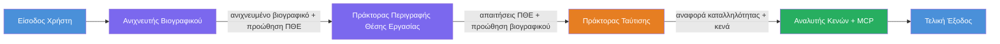

# Ενότητα 1 - Κατανόηση της Αρχιτεκτονικής

⏱️ ~5 λεπτά

Πριν γράψετε οποιονδήποτε κώδικα, εδώ είναι μια σύντομη επισκόπηση του τι χτίζετε και πώς λειτουργεί.

---

## Τι χτίζετε

Επικολλάτε ένα **βιογραφικό** και μια **περιγραφή θέσης εργασίας**. Η ροή εργασίας επιστρέφει:

- Μια βαθμολογία καταλληλότητας (0–100 με ανάλυση)
- Μια λίστα με ελλείψεις δεξιοτήτων και πιστοποιήσεων
- Έναν εξατομικευμένο οδικό χάρτη μάθησης με συνδέσμους Microsoft Learn για κάθε έλλειψη

---

## Οι τέσσερις πράκτορες

Ένας μόνος πράκτορας που προσπαθεί να αναλύσει, να βαθμολογήσει και να σχεδιάσει ταυτόχρονα τείνει να βιάζεται και να παράγει επιφανειακό αποτέλεσμα. Η διάσπαση της εργασίας σε τέσσερις εξειδικευμένους πράκτορες δίνει καλύτερα αποτελέσματα:

| Πράκτορας | Τι κάνει |
|-------|-------------|
| **ResumeParser** | Αναλύει το βιογραφικό. Αντιγράφει την περιγραφή θέσης αυτούσια στο `[JOB DESCRIPTION PASS-THROUGH]` για τους επόμενους πράκτορες |
| **JobDescriptionAgent** | Εξάγει τις απαιτήσεις της περιγραφής θέσης από το πέρασμα. Προωθεί το `[PARSED RESUME]` ως `[PARSED RESUME PASS-THROUGH]` |
| **MatchingAgent** | Συγκρίνει και τις δύο επισημασμένες ενότητες. Παράγει βαθμολογία καταλληλότητας 0–100 και λίστα ελλείψεων |
| **GapAnalyzer** | Δημιουργεί οδικό χάρτη μάθησης. Αναζητά στο Microsoft Learn για κάθε έλλειψη |

---

## Το γράφημα ορχήστρωσης

Η ροή εργασίας είναι μια **διαδοχική αλυσίδα** - κάθε πράκτορας περνάει το αποτέλεσμα του στον επόμενο:


```mermaid
flowchart LR
    A["Είσοδος Χρήστη"] --> B["Ανιχνευτής Βιογραφικού"]
    B -- "ανιχνευμένο βιογραφικό + προώθηση ΠΘΕ" --> C["Πράκτορας Περιγραφής Θέσης Εργασίας"]
    C -- "απαιτήσεις ΠΘΕ + προώθηση βιογραφικού" --> D["Πράκτορας Ταύτισης"]
    D -- "αναφορά καταλληλότητας + κενά" --> E["Αναλυτής Κενών + MCP"]
    E --> F["Τελική Έξοδος"]

    style A fill:#4A90D9,color:#fff
    style B fill:#7B68EE,color:#fff
    style C fill:#7B68EE,color:#fff
    style D fill:#E67E22,color:#fff
    style E fill:#27AE60,color:#fff
    style F fill:#4A90D9,color:#fff
```

1. Ο **ResumeParser** λαμβάνει την είσοδο του χρήστη, αναλύει το βιογραφικό και αντιγράφει την περιγραφή θέσης στο `[JOB DESCRIPTION PASS-THROUGH]`.
2. Ο **JD Agent** εξάγει δομημένες απαιτήσεις και προωθεί το `[PARSED RESUME PASS-THROUGH]`.
3. Ο **MatchingAgent** συγκρίνει και τις δύο ενότητες και παράγει βαθμολογία καταλληλότητας και λίστα ελλείψεων.
4. Ο **GapAnalyzer** κατασκευάζει τον οδικό χάρτη και καλεί το εργαλείο Microsoft Learn MCP για κάθε έλλειψη.

---

## Πώς αντιστοιχίζεται αυτό στον κώδικα

Στο `main.py`, περιγράφετε αυτό το γράφημα με τον `WorkflowBuilder`:

```python
workflow_agent = (
    WorkflowBuilder(
        start_executor=resume_executor,       # πρώτος πράκτορας που λαμβάνει την είσοδο χρήστη
        output_executors=[gap_executor],      # τελευταίος πράκτορας - η έξοδός του είναι η απάντηση
    )
    .add_edge(resume_executor, jd_executor)       # ResumeParser → JD Agent
    .add_edge(jd_executor, matching_executor)     # JD Agent → MatchingAgent
    .add_edge(matching_executor, gap_executor)    # MatchingAgent → GapAnalyzer
    .build()
    .as_agent()
)
```

Κάθε `Agent` περιτυλίγεται σε έναν `AgentExecutor`. Οι κλήσεις `add_edge()` ορίζουν μια αυστηρά διαδοχική αλυσίδα - κάθε πράκτορας λαμβάνει μόνο το αποτέλεσμα του άμεσου προκατόχου του.

> Το `context_mode="last_agent"` σημαίνει ότι κάθε εκτελεστής βλέπει μόνο το αποτέλεσμα του άμεσου προκατόχου του. Ο ResumeParser και ο JD Agent προωθούν δεδομένα σε επισημασμένες ενότητες ώστε κάθε επόμενος πράκτορας να έχει ακριβώς ό,τι χρειάζεται.

---

## Το εργαλείο MCP

Ο GapAnalyzer διαθέτει ένα εργαλείο: `search_microsoft_learn_for_plan`. Συνδέεται με το `https://learn.microsoft.com/api/mcp` και επιστρέφει πραγματικούς συνδέσμους Microsoft Learn για κάθε κενό δεξιότητας.

Όταν τρέχει το εργαλείο θα δείτε αυτά τα αρχεία καταγραφής - όλα αναμενόμενα:

```
GET  https://learn.microsoft.com/api/mcp → 405   ← connection probe, normal
POST https://learn.microsoft.com/api/mcp → 200   ← actual tool call
DELETE https://learn.microsoft.com/api/mcp → 405 ← cleanup probe, normal
```

Να ανησυχείτε μόνο αν το `POST` επιστρέψει σφάλμα.

---

**Προηγούμενο:** [00 - Προαπαιτούμενα](00-prerequisites.md) · **Επόμενο:** [02 - Δομήστε το Project →](02-scaffold-multi-agent.md)

---

<!-- CO-OP TRANSLATOR DISCLAIMER START -->
**Αποποίηση ευθυνών**:
Αυτό το έγγραφο έχει μεταφραστεί χρησιμοποιώντας την υπηρεσία μετάφρασης με τεχνητή νοημοσύνη [Co-op Translator](https://github.com/Azure/co-op-translator). Ενώ επιδιώκουμε την ακρίβεια, παρακαλούμε να έχετε υπόψη ότι οι αυτοματοποιημένες μεταφράσεις ενδέχεται να περιέχουν λάθη ή ανακρίβειες. Το πρωτότυπο έγγραφο στη μητρική του γλώσσα πρέπει να θεωρείται η αυθεντική πηγή. Για κρίσιμες πληροφορίες, συνιστάται επαγγελματική ανθρώπινη μετάφραση. Δεν φέρουμε ευθύνη για τυχόν παρεξηγήσεις ή λανθασμένες ερμηνείες που προκύπτουν από τη χρήση αυτής της μετάφρασης.
<!-- CO-OP TRANSLATOR DISCLAIMER END -->