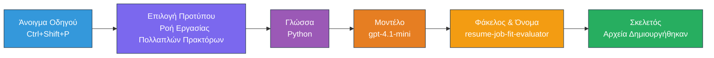
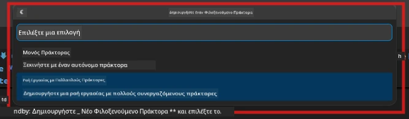

# Module 2 - Σκελετός του Έργου Πολυ-Πράκτορα

Σε αυτό το module, χρησιμοποιείτε την [επέκταση Microsoft Foundry](https://marketplace.visualstudio.com/items?itemName=TeamsDevApp.vscode-ai-foundry) για να **σκελετώσετε ένα έργο ροής εργασίας με πολλούς πράκτορες**. Η επέκταση δημιουργεί ολόκληρη τη δομή του έργου - `agent.yaml`, `main.py`, `Dockerfile`, `requirements.txt`, `.env`, και τη ρύθμιση αποσφαλμάτωσης. Στη συνέχεια προσαρμόζετε αυτά τα αρχεία στα Modules 3 και 4.

> **Σημείωση:** Ο φάκελος `PersonalCareerCopilot/` σε αυτό το εργαστήριο είναι ένα πλήρες, λειτουργικό παράδειγμα προσαρμοσμένου έργου πολλών πρακτόρων. Μπορείτε είτε να σκελετώσετε ένα νέο έργο (συνιστάται για μάθηση) είτε να μελετήσετε απευθείας τον υπάρχοντα κώδικα.

---

## Βήμα 1: Άνοιγμα του οδηγού Create Hosted Agent


1. Πατήστε `Ctrl+Shift+P` για να ανοίξετε την **Παλέτα Εντολών**.
2. Πληκτρολογήστε: **Microsoft Foundry: Create a New Hosted Agent** και επιλέξτε το.
3. Ανοίγει ο οδηγός δημιουργίας hosted agent.

> **Εναλλακτικά:** Κάντε κλικ στο εικονίδιο **Microsoft Foundry** στη γραμμή δραστηριοτήτων → κάντε κλικ στο εικονίδιο **+** δίπλα στο **Agents** → **Create New Hosted Agent**.

---

## Βήμα 2: Επιλογή του προτύπου Multi-Agent Workflow

Ο οδηγός σας ζητά να επιλέξετε ένα πρότυπο:

| Πρότυπο | Περιγραφή | Πότε να το χρησιμοποιήσετε |
|----------|-------------|-------------|
| Single Agent | Ένας πράκτορας με οδηγίες και προαιρετικά εργαλεία | Εργαστήριο 01 |
| **Multi-Agent Workflow** | Πολλοί πράκτορες που συνεργάζονται μέσω του WorkflowBuilder | **Αυτό το εργαστήριο (Εργαστήριο 02)** |

1. Επιλέξτε **Multi-Agent Workflow**.
2. Κάντε κλικ στο **Επόμενο**.



---

## Βήμα 3: Επιλογή γλώσσας προγραμματισμού

1. Επιλέξτε **Python**.
2. Κάντε κλικ στο **Επόμενο**.

---

## Βήμα 4: Επιλογή του μοντέλου σας

1. Ο οδηγός δείχνει τα μοντέλα που έχουν αναπτυχθεί στο έργο Foundry σας.
2. Επιλέξτε το ίδιο μοντέλο που χρησιμοποιήσατε στο Εργαστήριο 01 (π.χ., **gpt-4.1-mini**).
3. Κάντε κλικ στο **Επόμενο**.

> **Συμβουλή:** Το [`gpt-4.1-mini`](https://learn.microsoft.com/azure/foundry/foundry-models/concepts/models-sold-directly-by-azure#gpt-41-series) προτείνεται για ανάπτυξη - είναι γρήγορο, φθηνό και χειρίζεται καλά τις ροές εργασίας πολλών πρακτόρων. Μεταβείτε στο `gpt-4.1` για τελική παραγωγική ανάπτυξη αν θέλετε υψηλότερης ποιότητας έξοδο.

---

## Βήμα 5: Επιλογή τοποθεσίας φακέλου και ονόματος πράκτορα

1. Ανοίγει ένα παράθυρο επιλογής αρχείου. Επιλέξτε έναν φάκελο προορισμού:
   - Αν ακολουθείτε το αποθετήριο του εργαστηρίου: πλοηγηθείτε στο `workshop/lab02-multi-agent/` και δημιουργήστε έναν νέο υποφάκελο
   - Αν ξεκινάτε από την αρχή: επιλέξτε οποιονδήποτε φάκελο
2. Πληκτρολογήστε ένα **όνομα** για τον hosted agent (π.χ., `resume-job-fit-evaluator`).
3. Κάντε κλικ στο **Create**.

---

## Βήμα 6: Περιμένετε να ολοκληρωθεί ο σκελετός

1. Ο VS Code ανοίγει ένα νέο παράθυρο (ή το τρέχον παράθυρο ενημερώνεται) με το σκελετωμένο έργο.
2. Θα πρέπει να δείτε τη δομή αρχείων:

```
resume-job-fit-evaluator/
├── .env                ← Environment variables (placeholders)
├── .vscode/
│   └── launch.json     ← Debug configuration
├── agent.yaml          ← Agent definition (kind: hosted)
├── Dockerfile          ← Container configuration
├── main.py             ← Multi-agent workflow code (scaffold)
└── requirements.txt    ← Python dependencies
```

> **Σημείωση εργαστηρίου:** Στο αποθετήριο εργαστηρίου, ο φάκελος `.vscode/` βρίσκεται στη **ρίζα του χώρου εργασίας** με κοινά `launch.json` και `tasks.json`. Περιλαμβάνονται οι ρυθμίσεις αποσφαλμάτωσης για το Εργαστήριο 01 και 02. Όταν πατάτε F5, επιλέξτε **"Lab02 - Multi-Agent"** από το αναπτυσσόμενο μενού.

---

## Βήμα 7: Κατανόηση των σκελετωμένων αρχείων (ειδικά για πολλούς πράκτορες)

Ο σκελετός πολλών πρακτόρων διαφέρει από τον σκελετό ενός πράκτορα σε αρκετές βασικές πτυχές:

### 7.1 `agent.yaml` - Ορισμός πράκτορα

```yaml
kind: hosted
name: resume-job-fit-evaluator
description: >
  A multi-agent workflow that evaluates resume-to-job fit.
metadata:
  authors:
    - Microsoft
  tags:
    - Multi-Agent Workflow
    - Resume Evaluator
protocols:
  - protocol: responses
    version: v1
environment_variables:
  - name: PROJECT_ENDPOINT
    value: ${PROJECT_ENDPOINT}
  - name: MODEL_DEPLOYMENT_NAME
    value: ${MODEL_DEPLOYMENT_NAME}
```

**Βασική διαφορά από το Εργαστήριο 01:** Η ενότητα `environment_variables` μπορεί να περιλαμβάνει επιπλέον μεταβλητές για τα σημεία τερματισμού MCP ή άλλες ρυθμίσεις εργαλείων. Το `name` και το `description` αντικατοπτρίζουν τη χρήση πολλών πρακτόρων.

### 7.2 `main.py` - Κώδικας ροής εργασίας πολλών πρακτόρων

Ο σκελετός περιλαμβάνει:
- **Πολλαπλές συμβολοσειρές οδηγιών για τους πράκτορες** (μία `const` ανά πράκτορα)
- **Πολλαπλούς context managers [`AzureAIAgentClient.as_agent()`](https://learn.microsoft.com/python/api/overview/azure/ai-agents-readme)** (έναν ανά πράκτορα)
- **[`WorkflowBuilder`](https://learn.microsoft.com/agent-framework/workflows/agents-in-workflows)** για να συνδέει τους πράκτορες
- **`from_agent_framework()`** για να προσφέρει τη ροή εργασίας ως HTTP endpoint

```python
from agent_framework import WorkflowBuilder, tool
from agent_framework.azure import AzureAIAgentClient
from azure.ai.agentserver.agentframework import from_agent_framework
```

Η επιπλέον εισαγωγή [`WorkflowBuilder`](https://learn.microsoft.com/agent-framework/workflows/agents-in-workflows) είναι νέα σε σύγκριση με το Εργαστήριο 01.

### 7.3 `requirements.txt` - Πρόσθετες εξαρτήσεις

Το έργο πολλών πρακτόρων χρησιμοποιεί τα ίδια βασικά πακέτα με το Εργαστήριο 01, συν τυχόν πακέτα που σχετίζονται με MCP:

```
agent-framework-azure-ai==1.0.0rc3
agent-framework-core==1.0.0rc3
azure-ai-agentserver-agentframework==1.0.0b16
azure-ai-agentserver-core==1.0.0b16
debugpy
agent-dev-cli --pre
```

> **Σημαντική σημείωση έκδοσης:** Το πακέτο `agent-dev-cli` απαιτεί την παράμετρο `--pre` στο `requirements.txt` για την εγκατάσταση της τελευταίας προεπισκόπησης έκδοσης. Αυτό απαιτείται για τη συμβατότητα του Agent Inspector με το `agent-framework-core==1.0.0rc3`. Δείτε το [Module 8 - Troubleshooting](08-troubleshooting.md) για λεπτομέρειες εκδόσεων.

| Πακέτο | Έκδοση | Σκοπός |
|---------|---------|---------|
| [`agent-framework-azure-ai`](https://learn.microsoft.com/agent-framework/overview/) | `1.0.0rc3` | Ενσωμάτωση Azure AI για το [Microsoft Agent Framework](https://github.com/microsoft/agent-framework) |
| [`agent-framework-core`](https://learn.microsoft.com/agent-framework/overview/) | `1.0.0rc3` | Βασική λειτουργία (περιλαμβάνει το WorkflowBuilder) |
| `azure-ai-agentserver-agentframework` | `1.0.0b16` | Εκτελεστική λειτουργία διακομιστή hosted agent |
| `azure-ai-agentserver-core` | `1.0.0b16` | Βασικά αφηρημένα για διακομιστή agent |
| `debugpy` | τελευταία έκδοση | Αποσφαλμάτωση Python (F5 στο VS Code) |
| `agent-dev-cli` | `--pre` | Τοπική γραμμή εντολών ανάπτυξης + Agent Inspector backend |

### 7.4 `Dockerfile` - Ίδιο με το Εργαστήριο 01

Το Dockerfile είναι πανομοιότυπο με εκείνο του Εργαστηρίου 01 - αντιγράφει αρχεία, εγκαθιστά εξαρτήσεις από το `requirements.txt`, εκθέτει την πόρτα 8088 και τρέχει `python main.py`.

```dockerfile
FROM python:3.14-slim
WORKDIR /app
COPY ./ .
RUN pip install --upgrade pip && \
    if [ -f requirements.txt ]; then \
        pip install -r requirements.txt; \
    else \
      echo "No requirements.txt found" >&2; exit 1; \
    fi
EXPOSE 8088
CMD ["python", "main.py"]
```

---

### Σημείο Ελέγχου

- [ ] Ο οδηγός σκελετού ολοκληρώθηκε → η νέα δομή του έργου είναι ορατή
- [ ] Βλέπετε όλα τα αρχεία: `agent.yaml`, `main.py`, `Dockerfile`, `requirements.txt`, `.env`
- [ ] Το `main.py` περιέχει την εισαγωγή `WorkflowBuilder` (επιβεβαιώνει ότι επιλέχθηκε το πρότυπο πολλών πρακτόρων)
- [ ] Το `requirements.txt` περιλαμβάνει τόσο το `agent-framework-core` όσο και το `agent-framework-azure-ai`
- [ ] Κατανοείτε πώς διαφέρει ο σκελετός πολλών πρακτόρων από του ενός πράκτορα (πολλοί πράκτορες, WorkflowBuilder, εργαλεία MCP)

---

**Προηγούμενο:** [01 - Κατανόηση Αρχιτεκτονικής Πολλών Πρακτόρων](01-understand-multi-agent.md) · **Επόμενο:** [03 - Διαμόρφωση Πρακτόρων & Περιβάλλοντος →](03-configure-agents.md)

---

<!-- CO-OP TRANSLATOR DISCLAIMER START -->
**Αποποίηση ευθυνών**:
Αυτό το έγγραφο έχει μεταφραστεί χρησιμοποιώντας την υπηρεσία μετάφρασης AI [Co-op Translator](https://github.com/Azure/co-op-translator). Παρόλο που προσπαθούμε για ακρίβεια, παρακαλούμε να γνωρίζετε ότι οι αυτόματες μεταφράσεις ενδέχεται να περιέχουν λάθη ή ανακρίβειες. Το πρωτότυπο έγγραφο στην αρχική του γλώσσα πρέπει να θεωρείται η αυθεντική πηγή. Για κρίσιμες πληροφορίες, συνιστάται επαγγελματική ανθρώπινη μετάφραση. Δεν φέρουμε ευθύνη για τυχόν παρανοήσεις ή λανθασμένες ερμηνείες που προκύπτουν από τη χρήση αυτής της μετάφρασης.
<!-- CO-OP TRANSLATOR DISCLAIMER END -->