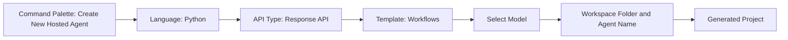
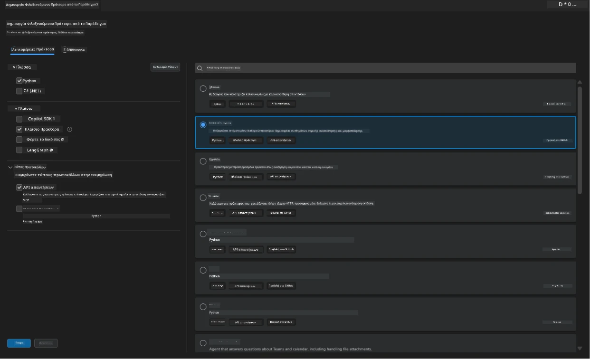
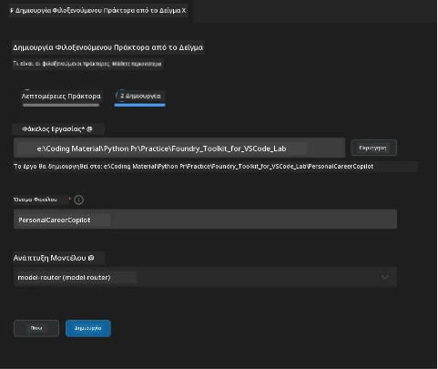

# Ενότητα 2 - Δημιουργία της Βάσης του Έργου Πολυ-Πράκτορα

⏱️ ~5 λεπτά

Σε αυτή την ενότητα, χρησιμοποιείτε το [Foundry Toolkit for VS Code](https://aka.ms/foundrytk) για να **δημιουργήσετε τη βάση ενός έργου με πολλούς πράκτορες**. Ο οδηγός δημιουργεί `agent.yaml`, `main.py`, `Dockerfile`, `requirements.txt`, `.env` και τη ρύθμιση αποσφαλμάτωσης του VS Code - ώστε να μπορείτε να εστιάσετε στη σύνδεση της ροής εργασίας 4 πρακτόρων στην Ενότητα 3.

> **Βασική έννοια:** Η βάση είναι ένα λειτουργικό πρότυπο με έναν πράκτορα. Αντικαθιστάτε τη λογική του προτύπου με το γράφο `WorkflowBuilder` στην Ενότητα 3. Δεν γράφετε το γενικό πλαίσιο από την αρχή.

> **Παράδειγμα αναφοράς:** [`PersonalCareerCopilot/`](../../../../../workshop/lab02-multi-agent/PersonalCareerCopilot) είναι ένα πλήρες λειτουργικό παράδειγμα. Χρησιμοποιήστε το για να συγκρίνετε την εργασία σας καθώς προχωράτε.

### Ροή του οδηγού δημιουργίας


```mermaid
flowchart LR
    A[Command Palette: Create New Hosted Agent] --> B[Language: Python]
    B --> C[API Type: Response API]
    C --> D[Template: Workflows]
    D --> E[Select Model]
    E --> F[Workspace Folder and Agent Name]
    F --> G[Generated Project]
```

---

## Βήμα 1: Ανοίξτε τον οδηγό "Create Hosted Agent"

1. Πατήστε `Ctrl+Shift+P` για να ανοίξετε την **Παλέτα Εντολών**.
2. Πληκτρολογήστε: **Foundry Toolkit: Create new Hosted Agent** και επιλέξτε το.
3. Ο οδηγός ανοίγει στην καρτέλα **Agent Details**.

> **Εναλλακτικά:** Κάντε κλικ στο εικονίδιο **Foundry Toolkit** στη Γραμμή Δραστηριοτήτων → κάντε κλικ στο εικονίδιο **+** δίπλα σε **Hosted Agents** → **Create New Hosted Agent**.

---

## Βήμα 2: Επιλέξτε ρυθμίσεις



1. Στο αριστερό τμήμα πλοήγησης/επιλογών επιλέξτε τα εξής:

| Μενού | Επιλογή | Σημειώσεις |
|--------|-----------|-------|
| **Γλώσσα** | Python | Υποστηρίζεται και C# (.NET) |
| **Πλαίσιο** | Agent Framework | Παρέχει `Agent`, `AgentExecutor`, `WorkflowBuilder` |
| **Τύπος API** | Response API | `POST /responses` - ιστορικό που διαχειρίζεται η πλατφόρμα, υποστήριξη streaming |
| **Πρότυπο** | **Workflows** | Διαχειρίζεται αιτήματα μέσω πολλών πρακτόρων σε σειρά |

2. Μόλις επιλεγούν, πατήστε **Επόμενο**



3. Στο επόμενο παράθυρο, επιλέξτε τα εξής:

| Μενού | Επιλογή | Σημειώσεις |
|--------|-----------|-------|
| **Φάκελος εργασίας** | Περιηγηθείτε στον επιθυμητό φάκελο | π.χ., `workshop/lab02-multi-agent/` σε αυτό το αποθετήριο |
| **Όνομα πράκτορα** | `PersonalCareerCopilot` | Αυτό γίνεται το όνομα καταλόγου του έργου |
| **Ανάπτυξη μοντέλου** | Επιλέξτε το αναπτυγμένο μοντέλο σας | π.χ., `gpt-4.1-mini` από το Εργαστήριο 01 |

4. Πατήστε **Create** για να δημιουργήσετε τη βάση του έργου. Το VS Code δημιουργεί τα αρχεία και ανοίγει το φάκελο.

> **Συμβουλή:** [`gpt-4.1-mini`](https://learn.microsoft.com/azure/foundry/foundry-models/concepts/models-sold-directly-by-azure#gpt-41-series) εξισορροπεί καλά την ταχύτητα με την ποιότητα για ανάπτυξη πολλαπλών πρακτόρων.

---

## Βήμα 3: Εξετάστε το δημιουργημένο έργο

Μόλις ολοκληρωθεί η δημιουργία, επαληθεύστε ότι βλέπετε αυτά τα αρχεία στον Explorer (`Ctrl+Shift+E`):

```
📂 <your-agent-name>/
├── .azdignore          ← Files excluded from Azure Developer CLI deployments
├── .dockerignore       ← Files excluded from Docker builds
├── .env                ← Environment variables (placeholders - fill in Module 3)
├── .vscode/
│   ├── launch.json     ← Debug config (F5 → run + Agent Inspector)
│   └── tasks.json      ← VS Code task definitions
├── agent.yaml          ← Agent definition (kind: hosted, protocol: responses)
├── Dockerfile          ← Container config for deployment
├── main.py             ← Stub agent entry point (replace with WorkflowBuilder in Module 3)
└── requirements.txt    ← Python dependencies
```

> **Σημαντικό:** Ανοίξτε αυτόν τον φάκελο απευθείας στο VS Code ώστε οι `.vscode/launch.json` και `tasks.json` να εφαρμόζονται σωστά για αποσφαλμάτωση με F5.

### Επεξήγηση βασικών αρχείων

| Αρχείο | Σκοπός |
|------|---------|
| `agent.yaml` | Δηλώνει `kind: hosted`, αντιστοιχεί μεταβλητές περιβάλλοντος, ορίζει το πρωτόκολλο `/responses` |
| `main.py` | Πρωτότυπο: ένας `FoundryChatClient` → `Agent` → `ResponsesHostServer`. Το αντικαθιστάτε με 4 πράκτορες + `WorkflowBuilder` στην Ενότητα 3 |
| `Dockerfile` | `python:3.12-slim`, εγκαθιστά `requirements.txt`, εκθέτει τη θύρα 8088, τρέχει `python main.py` |
| `requirements.txt` | `agent-framework-foundry`, `agent-framework-foundry-hosting`, `mcp<2,>=1.24.0`, `debugpy` |

> **Αναφορά:** Δείτε [`PersonalCareerCopilot/agent.yaml`](../../../../../workshop/lab02-multi-agent/PersonalCareerCopilot/agent.yaml) και [`PersonalCareerCopilot/requirements.txt`](../../../../../workshop/lab02-multi-agent/PersonalCareerCopilot/requirements.txt) για το πλήρες παραγόμενο περιεχόμενο.

---

### ✅ Σημείο Ελέγχου

- [ ] Ο οδηγός δημιουργίας ολοκληρώθηκε - ο νέος φάκελος έργου είναι ορατός στον Explorer
- [ ] Όλα τα αναμενόμενα αρχεία υπάρχουν: `agent.yaml`, `main.py`, `Dockerfile`, `requirements.txt`, `.env`
- [ ] Το `agent.yaml` εμφανίζει `kind: hosted` και `protocol: responses`
- [ ] Το `main.py` εισάγει `Agent`, `FoundryChatClient`, `ResponsesHostServer`
- [ ] Ο φάκελος του έργου είναι ανοιχτός ως ρίζα του χώρου εργασίας στο VS Code
- [ ] Καταλαβαίνετε ότι το `main.py` είναι πρότυπο - το `WorkflowBuilder` προστίθεται στην Ενότητα 3

---

**Προηγούμενο:** [01 - Κατανόηση Αρχιτεκτονικής Πολυ-Πράκτορα](01-understand-multi-agent.md) · **Επόμενο:** [03 - Ρύθμιση Πρακτόρων & Περιβάλλοντος →](03-configure-agents.md)

---

<!-- CO-OP TRANSLATOR DISCLAIMER START -->
**Αποποίηση ευθυνών**:
Αυτό το έγγραφο έχει μεταφραστεί χρησιμοποιώντας την υπηρεσία μετάφρασης με τεχνητή νοημοσύνη [Co-op Translator](https://github.com/Azure/co-op-translator). Ενώ επιδιώκουμε την ακρίβεια, παρακαλούμε να έχετε υπόψη ότι οι αυτοματοποιημένες μεταφράσεις ενδέχεται να περιέχουν λάθη ή ανακρίβειες. Το πρωτότυπο έγγραφο στη μητρική του γλώσσα πρέπει να θεωρείται η αυθεντική πηγή. Για κρίσιμες πληροφορίες, συνιστάται επαγγελματική ανθρώπινη μετάφραση. Δεν φέρουμε ευθύνη για τυχόν παρεξηγήσεις ή λανθασμένες ερμηνείες που προκύπτουν από τη χρήση αυτής της μετάφρασης.
<!-- CO-OP TRANSLATOR DISCLAIMER END -->