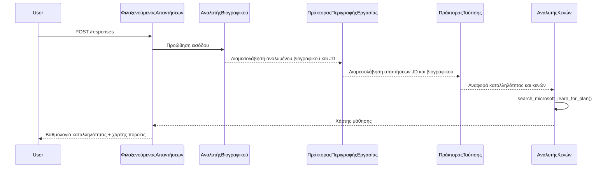

# Ενότητα 3 - Διαμόρφωση Οδηγιών, Περιβάλλον & Εγκατάσταση Εξαρτήσεων

⏱️ ~15 λεπτά

Σε αυτήν την ενότητα, μετασχηματίζετε τον προκαθορισμένο σκελετό σε **το δικό σας** πολλαπλό ροή εργασίας πράκτορα - ορίζοντας μεταβλητές περιβάλλοντος, γράφοντας οδηγίες πρακτόρων, προσθέτοντας το εργαλείο MCP, συνδέοντας το γράφημα ροής εργασίας και εγκαθιστώντας εξαρτήσεις.

> **Αναφορά:** Ο πλήρης λειτουργικός κώδικας βρίσκεται στο [`PersonalCareerCopilot/main.py`](../../../../../workshop/lab02-multi-agent/PersonalCareerCopilot/main.py). Χρησιμοποιήστε το ως αναφορά κατά την κατασκευή του δικού σας γραφήματος ροής εργασίας και μπλοκ προτροπών.

---

## Πώς συνεργάζονται οι τέσσερις πράκτορες



---

## Βήμα 1: Διαμόρφωση μεταβλητών περιβάλλοντος

1. Ανοίξτε το αρχείο **`.env`** στη ρίζα του έργου σας (δημιουργήθηκε από τον οδηγό σκελετού).
2. Αντικαταστήστε τους χώρους κράτησης με τις πραγματικές σας τιμές από το Εργαστήριο 01.

<details open>
<summary><strong>🅰️ Διαδρομή Α - Συνδρομή Foundry</strong></summary>

```env
FOUNDRY_PROJECT_ENDPOINT=https://<your-account>.services.ai.azure.com/api/projects/<your-project>
AZURE_AI_MODEL_DEPLOYMENT_NAME=gpt-4.1-mini
```

> **Πού να βρείτε τιμές:** Δείτε [Εργαστήριο 01, Ενότητα 1](../../lab01-single-agent/docs/01-setup.md#deploy-a-model--assign-rbac).

</details>

<details open>
<summary><strong>🅱️ Διαδρομή Β - Foundry Local</strong></summary>

```env
FOUNDRY_PROJECT_ENDPOINT=http://localhost:5273/v1
AZURE_AI_MODEL_DEPLOYMENT_NAME=phi-4-mini
```

> Όλη η επεξεργασία γίνεται τοπικά στη μηχανή σας - καμία δεδομένη πληροφορία δεν φεύγει από τη συσκευή σας. Εκτελέστε `foundry model list` για να επιβεβαιώσετε το ακριβές ψευδώνυμο του μοντέλου. Η μόνη εξερχόμενη αίτηση είναι η κλήση εργαλείου MCP στο `https://learn.microsoft.com/api/mcp`.

> **Πού να βρείτε τιμές:** Δείτε [Εργαστήριο 01, Ενότητα 1 - τοπική διαδρομή](../../lab01-single-agent/docs/01-setup.md#step-2-set-up-based-on-your-access).

</details>

> **Ασφάλεια:** Μην ανεβάζετε ποτέ το `.env` σε έλεγχο εκδόσεων. Πρέπει να είναι ήδη στο `.gitignore`.

---

## Βήμα 2: Γράψτε οδηγίες πρακτόρων

Οι οδηγίες ορίζουν τον ρόλο κάθε πράκτορα, τη μορφή εξόδου και τους κανόνες. Ανοίξτε το `main.py` και ορίστε (ή αντικαταστήστε) τις τέσσερις σταθερές οδηγιών - οι πλήρεις συμβολοσειρές βρίσκονται στο [`PersonalCareerCopilot/main.py`](../../../../../workshop/lab02-multi-agent/PersonalCareerCopilot/main.py).

### 2.1 `RESUME_PARSER_INSTRUCTIONS`
Αναλύει το βιογραφικό σε ένα δομημένο προφίλ υποψηφίου **και** αντιγράφει την περιγραφή θέσης ακριβώς μέσα στο `[JOB DESCRIPTION PASS-THROUGH]`. Και οι δύο επισημασμένες ενότητες πρέπει να εμφανίζονται στην έξοδο.

> **Γιατί το pass-through;** Με το `context_mode="last_agent"`, ο ResumeParser είναι ο **μόνος** πράκτορας που βλέπει το αρχικό μήνυμα χρήστη. Αν δεν αντιγράψει την περιγραφή θέσης, οι επόμενοι πράκτορες δεν το βλέπουν ποτέ.

### 2.2 `JOB_DESCRIPTION_INSTRUCTIONS`
Διαβάζει τα `[PARSED RESUME]` και `[JOB DESCRIPTION PASS-THROUGH]` από την έξοδο του ResumeParser. Παράγει τα `[JD REQUIREMENTS]` (δομημένες απαιτήσεις) και `[PARSED RESUME PASS-THROUGH]` (ακριβές αντίγραφο βιογραφικού για τον MatchingAgent).

### 2.3 `MATCHING_AGENT_INSTRUCTIONS`
Διαβάζει τα `[JD REQUIREMENTS]` και `[PARSED RESUME PASS-THROUGH]`. Παράγει μια βαθμολογημένη αναφορά καταλληλότητας (0–100) με ανάλυση μαθηματικών, δεξιότητες που ταιριάζουν, ελλείπουσες δεξιότητες και ευθυγράμμιση εμπειρίας.

### 2.4 `GAP_ANALYZER_INSTRUCTIONS`
Διαβάζει την αναφορά καταλληλότητας. Για **κάθε** ελλείπουσα δεξιότητα, καλεί τη `search_microsoft_learn_for_plan` για να αντλήσει πόρους από το Microsoft Learn. Παράγει μία λεπτομερή κάρτα χάσματος ανά δεξιότητα καθώς και έναν εβδομαδιαίο οδικό χάρτη μάθησης.

---

## Βήμα 3: Προσθέστε το εργαλείο MCP

Ο GapAnalyzer καλεί τον [Microsoft Learn MCP server](https://learn.microsoft.com/azure/foundry/agents/how-to/tools/model-context-protocol) για να ανακτήσει πραγματικούς μαθησιακούς πόρους για κάθε κενό δεξιότητας. Η πλήρης συνάρτηση `search_microsoft_learn_for_plan` βρίσκεται στο [`PersonalCareerCopilot/main.py`](../../../../../workshop/lab02-multi-agent/PersonalCareerCopilot/main.py).

Εγγράψτε το εργαλείο στον GapAnalyzer κατά τη δημιουργία του πράκτορα:

```python
gap_analyzer = Agent(
    client=client,
    instructions=GAP_ANALYZER_INSTRUCTIONS,
    name="GapAnalyzer",
    tools=[search_microsoft_learn_for_plan],
)
```

> Δείτε το [`PersonalCareerCopilot/main.py`](../../../../../workshop/lab02-multi-agent/PersonalCareerCopilot/main.py) για το πλήρες γράφημα `WorkflowBuilder` με `FoundryChatClient`, `AgentExecutor` και όλες τις κλήσεις `add_edge()`.

---

## Βήμα 4: Δημιουργία εικονικού περιβάλλοντος & εγκατάσταση εξαρτήσεων

> ⚠️ **Μην παραλείψετε αυτό το βήμα.** Χωρίς εγκατεστημένες εξαρτήσεις, η αποσφαλμάτωση με F5 θα αποτύχει.

### 4.1 Δημιουργήστε το εικονικό περιβάλλον

```powershell
python -m venv .venv
```

### 4.2 Ενεργοποιήστε το

| ΛΣ | Εντολή |
|----|---------|
| **Windows (PowerShell)** | `.\.venv\Scripts\Activate.ps1` |
| **Windows (CMD)** | `.venv\Scripts\activate.bat` |
| **macOS / Linux** | `source .venv/bin/activate` |

Πρέπει να δείτε `(.venv)` στο prompt του τερματικού σας.

### 4.3 Εγκαταστήστε τις εξαρτήσεις

```powershell
pip install -r requirements.txt
```

### 4.4 Επαληθεύστε

```powershell
pip list | Select-String "agent-framework|mcp|debugpy"
```

Αναμενόμενο: `agent-framework-foundry`, `agent-framework-foundry-hosting`, `mcp` και `debugpy` να περιλαμβάνονται.

---

## Βήμα 5: Επαληθεύστε την αυθεντικοποίηση

<details open>
<summary><strong>🅰️ Διαδρομή Α - Πιστοποιητικό Azure</strong></summary>

```powershell
az account show --query "{name:name, id:id}" --output table
```

Εάν αποτύχει, εκτελέστε [`az login`](https://learn.microsoft.com/cli/azure/authenticate-azure-cli-interactively).

Όλοι οι τέσσερις πράκτορες μοιράζονται έναν `FoundryChatClient` και ένα `DefaultAzureCredential`. Εάν η αυθεντικοποίηση λειτουργεί για έναν, λειτουργεί για όλους.

</details>

<details open>
<summary><strong>🅱️ Διαδρομή Β - Foundry Local</strong></summary>

Δεν απαιτείται αυθεντικοποίηση για τοπικές δοκιμές.

</details>

---

### ✅ Σημείο Ελέγχου

> Μην προχωρήσετε στο Ενότητα 04 μέχρι: **(1)** να εμφανίζεται το `(.venv)` στο prompt ΚΑΙ **(2)** η εντολή `pip install -r requirements.txt` να ολοκληρωθεί με επιτυχία.

- [ ] Το `.env` έχει έγκυρο endpoint και όνομα ανάπτυξης μοντέλου (όχι χώροι κράτησης)
- [ ] Οι 4 σταθερές οδηγιών πρακτόρων ορίζονται στο `main.py` (ResumeParser, JD Agent, MatchingAgent, GapAnalyzer)
- [ ] Η λειτουργία `search_microsoft_learn_for_plan` του εργαλείου MCP ορίζεται και εγγράφεται στον GapAnalyzer
- [ ] Τα αντικείμενα `FoundryChatClient` + 4 `Agent` + 4 `AgentExecutor` δημιουργούνται στο `main()`
- [ ] Το `WorkflowBuilder` κατασκευάζει το σωστό διαδοχικό γράφημα με όλες τις κλήσεις `add_edge()`
- [ ] Το εικονικό περιβάλλον δημιουργήθηκε και ενεργοποιήθηκε (το `(.venv)` εμφανίζεται στο prompt)
- [ ] Η εντολή `pip install -r requirements.txt` ολοκληρώθηκε χωρίς σφάλματα
- [ ] **Διαδρομή Α:** Η εντολή `az account show` επιτυγχάνει ή το εικονίδιο Λογαριασμών στο VS Code δείχνει ότι η σύνδεση έχει γίνει

---

**Προηγούμενο:** [02 - Scaffold Multi-Agent Project](02-scaffold-multi-agent.md) · **Επόμενο:** [04 - Orchestration Patterns →](04-orchestration-patterns.md)

---

<!-- CO-OP TRANSLATOR DISCLAIMER START -->
**Αποποίηση ευθυνών**:
Αυτό το έγγραφο έχει μεταφραστεί χρησιμοποιώντας την υπηρεσία μετάφρασης με τεχνητή νοημοσύνη [Co-op Translator](https://github.com/Azure/co-op-translator). Ενώ επιδιώκουμε την ακρίβεια, παρακαλούμε να έχετε υπόψη ότι οι αυτοματοποιημένες μεταφράσεις ενδέχεται να περιέχουν λάθη ή ανακρίβειες. Το πρωτότυπο έγγραφο στη μητρική του γλώσσα πρέπει να θεωρείται η αυθεντική πηγή. Για κρίσιμες πληροφορίες, συνιστάται επαγγελματική ανθρώπινη μετάφραση. Δεν φέρουμε ευθύνη για τυχόν παρεξηγήσεις ή λανθασμένες ερμηνείες που προκύπτουν από τη χρήση αυτής της μετάφρασης.
<!-- CO-OP TRANSLATOR DISCLAIMER END -->