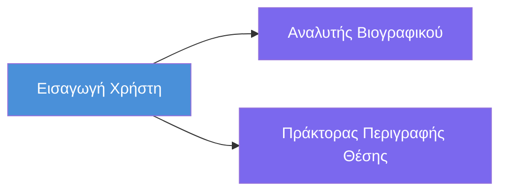
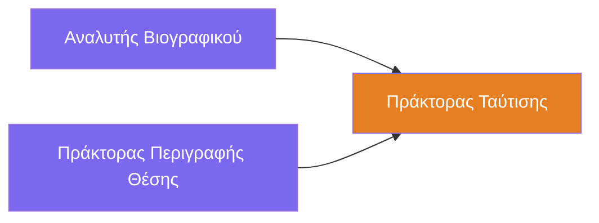
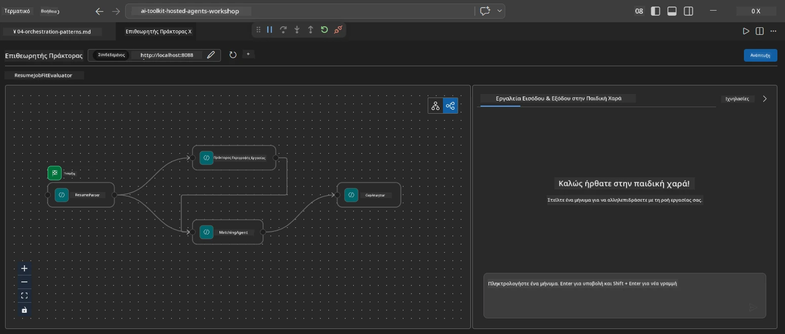
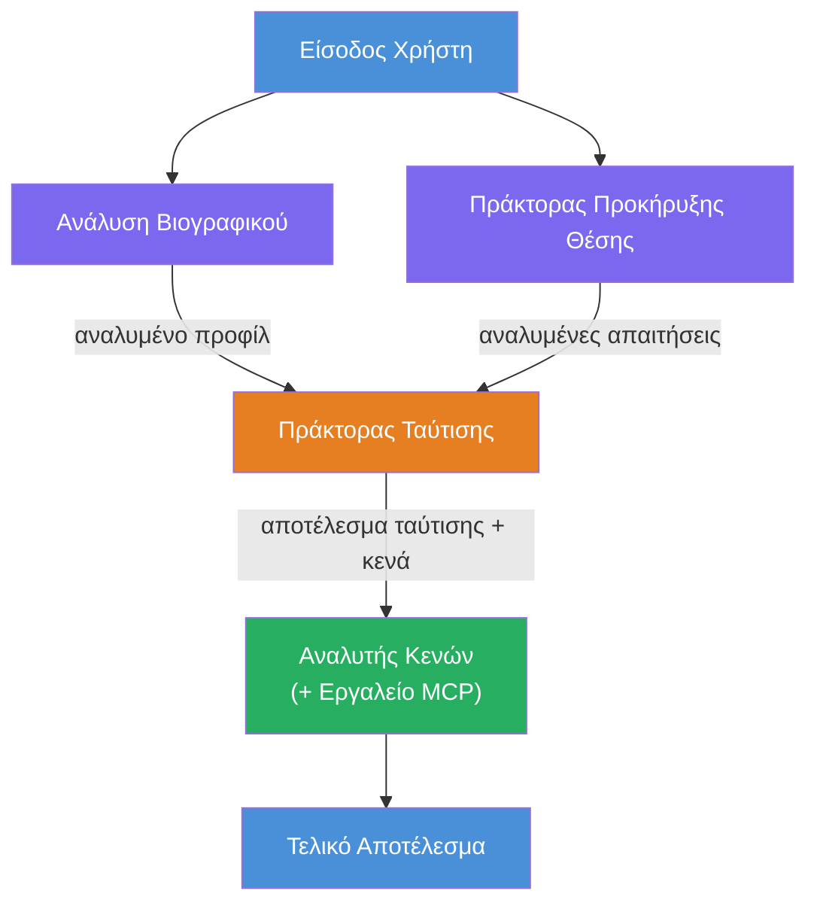
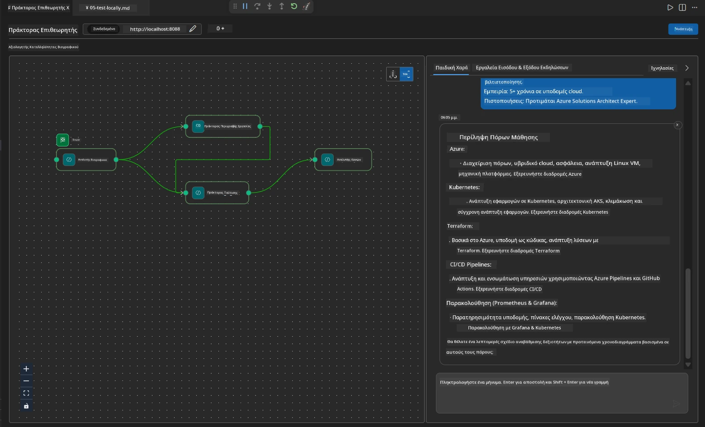

# Module 4 - Πρότυπα Ορχήστρωσης

Σε αυτή τη μονάδα, εξερευνάτε τα πρότυπα ορχήστρωσης που χρησιμοποιούνται στον Αξιολογητή Κατάλληλου Βιογραφικού και μαθαίνετε πώς να διαβάζετε, να τροποποιείτε και να επεκτείνετε το γράφημα ροής εργασίας. Η κατανόηση αυτών των προτύπων είναι απαραίτητη για τον εντοπισμό σφαλμάτων ροής δεδομένων και την κατασκευή των δικών σας [πολυ-πρακτόρων ροών εργασίας](https://learn.microsoft.com/agent-framework/workflows/).

---

## Πρότυπο 1: Fan-out (παράλληλο διαχωρισμό)

Το πρώτο πρότυπο στη ροή εργασίας είναι το **fan-out** - μία είσοδος αποστέλλεται σε πολλούς πράκτορες ταυτόχρονα.


Στον κώδικα, αυτό συμβαίνει επειδή το `resume_parser` είναι ο `start_executor` - λαμβάνει πρώτα το μήνυμα του χρήστη. Στη συνέχεια, επειδή και οι `jd_agent` και `matching_agent` έχουν ακμές από το `resume_parser`, το πλαίσιο κατευθύνει την έξοδο του `resume_parser` και στους δύο πράκτορες:

```python
.add_edge(resume_parser, jd_agent)         # Έξοδος ResumeParser → JD Agent
.add_edge(resume_parser, matching_agent)   # Έξοδος ResumeParser → MatchingAgent
```

**Γιατί λειτουργεί αυτό:** Ο ResumeParser και ο JD Agent επεξεργάζονται διαφορετικές πτυχές της ίδιας εισόδου. Η εκτέλεση τους παράλληλα μειώνει τη συνολική καθυστέρηση σε σχέση με την εκτέλεση τους διαδοχικά.

### Πότε να χρησιμοποιήσετε το fan-out

| Περίπτωση χρήσης | Παράδειγμα |
|----------|---------|
| Ανεξάρτητα υπο-εργασίες | Ανάλυση βιογραφικού έναντι ανάλυσης JD |
| Πλεονασμός / ψηφοφορία | Δύο πράκτορες αναλύουν τα ίδια δεδομένα, ένας τρίτος επιλέγει την καλύτερη απάντηση |
| Πολλαπλή μορφή εξόδου | Ένας πράκτορας παράγει κείμενο, άλλος παράγει δομημένο JSON |

---

## Πρότυπο 2: Fan-in (συγκέντρωση)

Το δεύτερο πρότυπο είναι το **fan-in** - πολλαπλές έξοδοι πρακτόρων συλλέγονται και αποστέλλονται σε έναν μόνο πράκτορα στη ροή.


Στον κώδικα:

```python
.add_edge(resume_parser, matching_agent)   # Έξοδος ResumeParser → MatchingAgent
.add_edge(jd_agent, matching_agent)        # Έξοδος JD Agent → MatchingAgent
```

**Βασική συμπεριφορά:** Όταν ένας πράκτορας έχει **δύο ή περισσότερες εισερχόμενες ακμές**, το πλαίσιο περιμένει αυτόματα την ολοκλήρωση **όλων** των ανώτερων πρακτόρων πριν εκτελέσει τον κατώτερο πράκτορα. Ο MatchingAgent δεν ξεκινά έως ότου τελειώσουν τόσο ο ResumeParser όσο και ο JD Agent.

### Τι λαμβάνει ο MatchingAgent

Το πλαίσιο συγχωνεύει τις εξόδους από όλους τους ανώτερους πράκτορες. Η είσοδος του MatchingAgent μοιάζει με:

```
[ResumeParser output]
---
Candidate Profile:
  Name: Jane Doe
  Technical Skills: Python, Azure, Kubernetes, ...
  ...

[JobDescriptionAgent output]
---
Role Overview: Senior Cloud Engineer
Required Skills: Python, Azure, Terraform, ...
...
```

> **Σημείωση:** Η ακριβής μορφή συγχώνευσης εξαρτάται από την έκδοση του πλαισίου. Οι οδηγίες του πράκτορα πρέπει να είναι γραμμένες ώστε να διαχειρίζονται τόσο δομημένη όσο και αδόμητη έξοδο από τα ανώτερα.



---

## Πρότυπο 3: Αλληλουχία

Το τρίτο πρότυπο είναι η **αλληλουχία** - η έξοδος ενός πράκτορα τροφοδοτεί απευθείας τον επόμενο.


Στον κώδικα:

```python
.add_edge(matching_agent, gap_analyzer)    # Έξοδος MatchingAgent → GapAnalyzer
```

Αυτό είναι το πιο απλό πρότυπο. Ο GapAnalyzer λαμβάνει τον βαθμό καταλληλότητας από τον MatchingAgent, τις δεξιότητες που αντιστοιχούν ή λείπουν και τα κενά. Στη συνέχεια καλεί το [MCP εργαλείο](https://learn.microsoft.com/azure/foundry/agents/how-to/tools/model-context-protocol) για κάθε κενό ώστε να πάρει πόρους από το Microsoft Learn.

---

## Το πλήρες γράφημα

Ο συνδυασμός και των τριών προτύπων παράγει ολόκληρη τη ροή εργασίας:


### Χρονοδιάγραμμα εκτέλεσης

```mermaid
gantt
    title Χρονοδιάγραμμα Εκτέλεσης Πράκτορα
    dateFormat X
    axisFormat %s

    section Παράλληλα
    Resume Parser       :rp, 0, 3
    JD Agent            :jd, 0, 2

    section Ακολουθιακά
    Matching Agent      :ma, 3, 5
    Gap Analyzer        :ga, 5, 9
```


> Ο συνολικός χρόνος τοίχου είναι περίπου `max(ResumeParser, JD Agent) + MatchingAgent + GapAnalyzer`. Ο GapAnalyzer είναι συνήθως ο πιο αργός επειδή κάνει πολλαπλές κλήσεις στο MCP εργαλείο (μία για κάθε κενό).

---

## Ανάγνωση του κώδικα WorkflowBuilder

Εδώ είναι η πλήρης συνάρτηση `create_workflow()` από το `main.py`, σχολιασμένη:

```python
def create_workflow(resume_parser, jd_agent, matching_agent, gap_analyzer):
    workflow = (
        WorkflowBuilder(
            name="ResumeJobFitEvaluator",

            # Ο πρώτος πράκτορας που λαμβάνει την είσοδο χρήστη
            start_executor=resume_parser,

            # Οι πράκτορες των οποίων η έξοδος γίνεται η τελική απάντηση
            output_executors=[gap_analyzer],
        )
        # Διακλαδώσεις: Η έξοδος του ResumeParser πηγαίνει τόσο στον JD Agent όσο και στον MatchingAgent
        .add_edge(resume_parser, jd_agent)
        .add_edge(resume_parser, matching_agent)

        # Συγκέντρωση: Ο MatchingAgent περιμένει τόσο τον ResumeParser όσο και τον JD Agent
        .add_edge(jd_agent, matching_agent)

        # Διαδοχικά: Η έξοδος του MatchingAgent τροφοδοτεί τον GapAnalyzer
        .add_edge(matching_agent, gap_analyzer)

        .build()
    )
    return workflow.as_agent()
```

### Πίνακας περίληψης ακμών

| # | Ακμή | Πρότυπο | Επίδραση |
|---|------|---------|--------|
| 1 | `resume_parser → jd_agent` | Fan-out | Ο JD Agent λαμβάνει την έξοδο του ResumeParser (συν την αρχική είσοδο χρήστη) |
| 2 | `resume_parser → matching_agent` | Fan-out | Ο MatchingAgent λαμβάνει την έξοδο του ResumeParser |
| 3 | `jd_agent → matching_agent` | Fan-in | Ο MatchingAgent λαμβάνει επίσης την έξοδο του JD Agent (περιμένει και τις δύο) |
| 4 | `matching_agent → gap_analyzer` | Αλληλουχία | Ο GapAnalyzer λαμβάνει την αναφορά κατάλληλότητας + λίστα κενών |

---

## Τροποποίηση του γραφήματος

### Προσθήκη νέου πράκτορα

Για να προσθέσετε έναν πέμπτο πράκτορα (π.χ., έναν **InterviewPrepAgent** που παράγει ερωτήσεις συνέντευξης βασισμένες στην ανάλυση κενών):

```python
# 1. Ορίστε τις οδηγίες
INTERVIEW_PREP_INSTRUCTIONS = """\
You are the Interview Prep Agent.
Given a gap analysis and fit report, generate 10 targeted interview questions
the candidate should prepare for.
"""

# 2. Δημιουργήστε τον πράκτορα (μέσα στο μπλοκ async with)
AzureAIAgentClient(
    project_endpoint=PROJECT_ENDPOINT,
    model_deployment_name=MODEL_DEPLOYMENT_NAME,
    credential=credential,
).as_agent(
    name="InterviewPrepAgent",
    instructions=INTERVIEW_PREP_INSTRUCTIONS,
) as interview_prep,

# 3. Προσθέστε ακμές στη δημιουργία_ροής_εργασίας()
.add_edge(matching_agent, interview_prep)   # λαμβάνει αναφορά προσαρμογής
.add_edge(gap_analyzer, interview_prep)     # επίσης λαμβάνει κάρτες κενών

# 4. Ενημερώστε τους εκτελεστές_εξόδου
output_executors=[interview_prep],  # τώρα ο τελικός πράκτορας
```

### Αλλαγή σειράς εκτέλεσης

Για να κάνει ο JD Agent να τρέχει **μετά από** τον ResumeParser (διαδοχικά αντί παράλληλα):

```python
# Αφαιρέστε: .add_edge(resume_parser, jd_agent) ← υπάρχει ήδη, κρατήστε το
# Αφαιρέστε την έμμεση παράλληλη εκτέλεση ΜΗ έχοντας το jd_agent να λαμβάνει απευθείας είσοδο χρήστη
# Ο start_executor στέλνει πρώτα στον resume_parser, και το jd_agent λαμβάνει μόνο
# την έξοδο του resume_parser μέσω της σύνδεσης. Αυτό τα καθιστά διαδοχικά.
```

> **Σημαντικό:** Ο `start_executor` είναι ο μόνος πράκτορας που λαμβάνει την ακατέργαστη είσοδο χρήστη. Όλοι οι άλλοι πράκτορες λαμβάνουν έξοδο από τις ανώτερες ακμές τους. Αν θέλετε ένας πράκτορας να λαμβάνει επίσης την ακατέργαστη είσοδο χρήστη, πρέπει να έχει ακμή από τον `start_executor`.

---

## Συνήθη λάθη στο γράφημα

| Λάθος | Σύμπτωμα | Διόρθωση |
|---------|---------|-----|
| Λείπει ακμή προς `output_executors` | Ο πράκτορας τρέχει αλλά η έξοδος είναι κενή | Βεβαιωθείτε ότι υπάρχει διαδρομή από `start_executor` σε κάθε πράκτορα στο `output_executors` |
| Κυκλική εξάρτηση | Ατελείωτος βρόχος ή χρονικό όριο | Ελέγξτε ότι κανένας πράκτορας δεν τροφοδοτεί πίσω έναν ανώτερο πράκτορα |
| Πράκτορας στο `output_executors` χωρίς εισερχόμενη ακμή | Κενή έξοδος | Προσθέστε τουλάχιστον μία `add_edge(source, that_agent)` |
| Πολλαπλοί `output_executors` χωρίς fan-in | Η έξοδος περιέχει μόνο απάντηση ενός πράκτορα | Χρησιμοποιήστε έναν μόνο πράκτορα εξόδου που συγκεντρώνει ή αποδεχτείτε πολλαπλές εξόδους |
| Λείπει ο `start_executor` | `ValueError` κατά το build | Πάντα να ορίζετε τον `start_executor` στο `WorkflowBuilder()` |

---

## Εντοπισμός σφαλμάτων στο γράφημα

### Χρήση του Agent Inspector

1. Ξεκινήστε τον πράκτορα τοπικά (F5 ή τερματικό - δείτε [Μονάδα 5](05-test-locally.md)).
2. Ανοίξτε το Agent Inspector (`Ctrl+Shift+P` → **Foundry Toolkit: Open Agent Inspector**).
3. Στείλτε ένα δοκιμαστικό μήνυμα.
4. Στο πάνελ απάντησης του Inspector, αναζητήστε την **ροή εξόδου** - δείχνει τη συμβολή κάθε πράκτορα με τη σειρά.



### Χρήση καταγραφής (logging)

Προσθέστε καταγραφή στο `main.py` για να ακολουθήσετε τη ροή δεδομένων:

```python
import logging
logger = logging.getLogger("resume-job-fit")

# Στο create_workflow(), μετά την κατασκευή:
logger.info("Workflow graph built with edges: RP→JD, RP→MA, JD→MA, MA→GA")
```

Τα logs του server δείχνουν τη σειρά εκτέλεσης των πρακτόρων και τις κλήσεις στο MCP εργαλείο:

```
INFO:resume-job-fit:Starting Resume -> Job Fit Evaluator HTTP server...
INFO:resume-job-fit:Server running on http://localhost:8088
INFO:agent_framework:Executing agent: ResumeParser
INFO:agent_framework:Executing agent: JobDescriptionAgent
INFO:agent_framework:Waiting for upstream agents: ResumeParser, JobDescriptionAgent
INFO:agent_framework:Executing agent: MatchingAgent
INFO:agent_framework:Executing agent: GapAnalyzer
INFO:agent_framework:Tool call: search_microsoft_learn_for_plan(skill="Kubernetes")
POST https://learn.microsoft.com/api/mcp → 200
INFO:agent_framework:Tool call: search_microsoft_learn_for_plan(skill="Terraform")
POST https://learn.microsoft.com/api/mcp → 200
```

---

### Σημείο ελέγχου

- [ ] Μπορείτε να αναγνωρίσετε τα τρία πρότυπα ορχήστρωσης στη ροή εργασίας: fan-out, fan-in και αλληλουχία
- [ ] Κατανοείτε ότι οι πράκτορες με πολλαπλές εισερχόμενες ακμές περιμένουν όλους τους ανώτερους πράκτορες να ολοκληρώσουν
- [ ] Μπορείτε να διαβάσετε τον κώδικα `WorkflowBuilder` και να αντιστοιχίσετε κάθε κλήση `add_edge()` στο οπτικό γράφημα
- [ ] Κατανοείτε το χρονοδιάγραμμα εκτέλεσης: πρώτα τρέχουν οι παράλληλοι πράκτορες, μετά η συγκέντρωση, μετά η αλληλουχία
- [ ] Ξέρετε πώς να προσθέσετε νέο πράκτορα στο γράφημα (ορίστε οδηγίες, δημιουργήστε πράκτορα, προσθέστε ακμές, ενημερώστε έξοδο)
- [ ] Μπορείτε να εντοπίσετε κοινά λάθη στο γράφημα και τα συμπτώματά τους

---

**Προηγούμενο:** [03 - Ρύθμιση Πρακτόρων & Περιβάλλοντος](03-configure-agents.md) · **Επόμενο:** [05 - Δοκιμή Τοπικά →](05-test-locally.md)

---

<!-- CO-OP TRANSLATOR DISCLAIMER START -->
**Αποποίηση ευθυνών**:  
Αυτό το έγγραφο έχει μεταφραστεί χρησιμοποιώντας την υπηρεσία αυτόματης μετάφρασης AI [Co-op Translator](https://github.com/Azure/co-op-translator). Ενώ προσπαθούμε για ακρίβεια, παρακαλούμε να γνωρίζετε ότι οι αυτοματοποιημένες μεταφράσεις ενδέχεται να περιέχουν λάθη ή ανακρίβειες. Το πρωτότυπο έγγραφο στη γλώσσα του θα πρέπει να θεωρείται η αξιόπιστη πηγή. Για κρίσιμες πληροφορίες, συνιστάται επαγγελματική ανθρώπινη μετάφραση. Δεν φέρουμε ευθύνη για τυχόν παρανοήσεις ή λανθασμένες ερμηνείες που προκύπτουν από τη χρήση αυτής της μετάφρασης.
<!-- CO-OP TRANSLATOR DISCLAIMER END -->