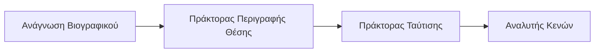
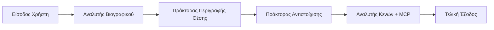

# Ενότητα 4 - Πρότυπα Ορχήστρωσης

⏱️ ~10 λεπτά

Σε αυτήν την ενότητα, εξερευνάτε τα πρότυπα ορχήστρωσης που χρησιμοποιούνται στον Resume Job Fit Evaluator και μαθαίνετε πώς να διαβάζετε, να τροποποιείτε και να επεκτείνετε το γράφημα ροής εργασίας. Η κατανόηση αυτών των προτύπων είναι απαραίτητη για τον εντοπισμό σφαλμάτων στη ροή δεδομένων και την κατασκευή των δικών σας [multi-agent workflows](https://learn.microsoft.com/agent-framework/workflows/).

---

## Πρότυπο 1: Αλληλουχία

Το θεμελιώδες πρότυπο στη ροή εργασίας είναι μια **αλληλουχία** - η έξοδος κάθε πράκτορα τροφοδοτεί απευθείας τον επόμενο.


```mermaid
flowchart LR
    RP[Ανάγνωση Βιογραφικού] --> JD[Πράκτορας Περιγραφής Θέσης]
    JD --> MA[Πράκτορας Ταύτισης]
    MA --> GA[Αναλυτής Κενών]
```

Στον κώδικα, κάθε κλήση `add_edge()` δημιουργεί ένα βήμα στην αλυσίδα:

```python
.add_edge(resume_executor, jd_executor)       # Έξοδος ResumeParser → JD Agent
.add_edge(jd_executor, matching_executor)     # Έξοδος JD Agent → MatchingAgent
.add_edge(matching_executor, gap_executor)    # Έξοδος MatchingAgent → GapAnalyzer
```

> **Γιατί αλληλουχία και όχι fan-out/fan-in;** Το `WorkflowBuilder` χρησιμοποιεί **OR-σημασιολογία** για τις εισερχόμενες ακμές: ένας εκτελεστής downstream ξεκινά μόλις **οποιοσδήποτε** προηγούμενος ολοκληρώσει. Αν ο `matching_executor` είχε δύο εισερχόμενες ακμές (από `resume_executor` και `jd_executor`), θα ενεργοποιούνταν δύο φορές — μία όταν ολοκληρώνει το ResumeParser και μία όταν ολοκληρώνει ο JD Agent — προκαλώντας να εκτελεστεί ο GapAnalyzer δύο φορές και η έξοδος να εμφανιστεί δύο φορές. Η αλληλουχία εξαφανίζει αυτό το ζήτημα εντελώς.

## Πρότυπο 2: Μεταβίβαση Περιεχομένου

Επειδή `context_mode="last_agent"` σημαίνει ότι κάθε εκτελεστής βλέπει μόνο την **έξοδο του άμεσου προηγούμενου** του, οι πράκτορες σε αλληλουχία πρέπει ρητά να μεταβιβάζουν οποιαδήποτε δεδομένα χρειάζονται οι πράκτορες downstream.

Σε αυτήν τη ροή εργασίας:
- Ο **ResumeParser** αντιγράφει το JD κατά λέξη στο `[JOB DESCRIPTION PASS-THROUGH]` (ώστε ο JD Agent να μπορεί να το βρει).
- Ο **JD Agent** αντιγράφει το `[PARSED RESUME]` κατά λέξη στο `[PARSED RESUME PASS-THROUGH]` (ώστε ο MatchingAgent να μπορεί να συγκρίνει και τα δύο προφίλ).

```
ResumeParser output
└─ [PARSED RESUME]               ← extracted by JD Agent
└─ [JOB DESCRIPTION PASS-THROUGH] ← extracted by JD Agent

JD Agent output
└─ [JD REQUIREMENTS]             ← extracted by MatchingAgent
└─ [PARSED RESUME PASS-THROUGH]  ← extracted by MatchingAgent
```

Κάθε τμήμα μεταβίβασης πρέπει να αντιγράφεται **κατά λέξη** — η περίληψη ή παράφρασή του σπάει τον πράκτορα downstream που εξαρτάται από αυτό.

---

## Το πλήρες γράφημα

Ο συνδυασμός των προτύπων αλληλουχίας και μεταβίβασης περιεχομένου παράγει τη πλήρη ροή εργασίας:


```mermaid
flowchart LR
    U[Είσοδος Χρήστη] --> RP[Αναλυτής Βιογραφικού]
    RP --> JD[Πράκτορας Περιγραφής Θέσης]
    JD --> MA[Πράκτορας Αντιστοίχισης]
    MA --> GA[Αναλυτής Κενών + MCP]
    GA --> O[Τελική Έξοδος]
```

Ο Agent Inspector δείχνει αυτήν τη δομή γραφήματος όταν ο πράκτορας τρέχει τοπικά. Ανατρέξτε στην [Ενότητα 5 - Δοκιμή Τοπικά](05-test-locally.md) για στιγμιότυπα οθόνης.

---

## Ανάγνωση του κώδικα WorkflowBuilder

Η ολοκληρωμένη συνάρτηση `create_workflow()` βρίσκεται στο [`PersonalCareerCopilot/main.py`](../../../../../workshop/lab02-multi-agent/PersonalCareerCopilot/main.py). Οι τρεις κλήσεις `add_edge()` χτίζουν την αλληλουχία:

| # | Ακμή | Επίδραση |
|---|------|--------|
| 1 | `resume_executor → jd_executor` | Ο JD Agent λαμβάνει `[PARSED RESUME]` + `[JOB DESCRIPTION PASS-THROUGH]` |
| 2 | `jd_executor → matching_executor` | Ο MatchingAgent λαμβάνει `[JD REQUIREMENTS]` + `[PARSED RESUME PASS-THROUGH]` |
| 3 | `matching_executor → gap_executor` | Ο GapAnalyzer λαμβάνει έκθεση κατάλληλου ταιριάσματος + λίστα κενών |

---

## Τροποποίηση του γραφήματος

### Προσθήκη νέου πράκτορα

Για να προσθέσετε πέμπτο πράκτορα (π.χ. έναν **InterviewPrepAgent** μετά τον GapAnalyzer):

1. Ορίστε μια σταθερά `INTERVIEW_PREP_INSTRUCTIONS`.
2. Δημιουργήστε αντικείμενα `Agent` + `AgentExecutor` (ίδιο πρότυπο με τους υπάρχοντες τέσσερις).
3. Προσθέστε `.add_edge(gap_executor, interview_exec)` στο `WorkflowBuilder`.
4. Ενημερώστε το `output_executors=[interview_exec]`.

> **Σημαντικό:** Ο `start_executor` είναι ο μόνος πράκτορας που λαμβάνει ακατέργαστη είσοδο χρήστη. Όλοι οι άλλοι πράκτορες λαμβάνουν έξοδο από την ακμή upstream τους.

---

## Συχνά λάθη στο γράφημα

| Λάθος | Σύμπτωμα | Διόρθωση |
|---------|---------|-----|
| Έλλειψη ακμής προς `output_executors` | Ο πράκτορας τρέχει αλλά η έξοδος είναι κενή | Βεβαιωθείτε ότι υπάρχει διαδρομή από τον `start_executor` σε κάθε πράκτορα στα `output_executors` |
| Κυκλική εξάρτηση | Απειροεπαναλήψεις ή χρονικό όριο | Ελέγξτε να μην διοχετεύεται πίσω σε upstream πράκτορα |
| Πράκτορας σε `output_executors` χωρίς εισερχόμενη ακμή | Κενή έξοδος | Προσθέστε τουλάχιστον μία `add_edge(source, that_agent)` |
| Πολλοί `output_executors` χωρίς fan-in | Η έξοδος περιέχει μόνο απάντηση ενός πράκτορα | Χρησιμοποιήστε έναν μεμονωμένο πράκτορα εξόδου που συγκεντρώνει, ή αποδεχτείτε πολλαπλές εξόδους |
| Έλλειψη `start_executor` | `ValueError` κατά τη δημιουργία | Καθορίστε πάντα το `start_executor` στο `WorkflowBuilder()` |

---

## Εντοπισμός σφαλμάτων στο γράφημα

### Χρήση Agent Inspector

1. Ξεκινήστε τον πράκτορα τοπικά με το F5.
2. Ανοίξτε τον Agent Inspector (`Ctrl+Shift+P` → **Foundry Toolkit: Open Agent Inspector**).
3. Στείλτε δοκιμαστικό μήνυμα.
4. Στο πάνελ απάντησης του Inspector, αναζητήστε την **έξοδο σε streaming** - εμφανίζει τη συμβολή κάθε πράκτορα διαδοχικά.


### Χρήση logging

Προσθέστε logging στο `main.py` για να παρακολουθήσετε τη ροή δεδομένων:

```python
import logging
logger = logging.getLogger("resume-job-fit")

# Στο main(), μετά τη δημιουργία της ροής εργασίας:
logger.info("Workflow graph built with edges: RP→JD, JD→MA, MA→GA")
```

Τα logs του server δείχνουν τη σειρά εκτέλεσης των πρακτόρων και τις κλήσεις εργαλείων MCP:

```
INFO:agent_framework:Executing agent: ResumeParser
INFO:agent_framework:Executing agent: JobDescriptionAgent
INFO:agent_framework:Executing agent: MatchingAgent
INFO:agent_framework:Executing agent: GapAnalyzer
INFO:agent_framework:Tool call: search_microsoft_learn_for_plan(skill="Kubernetes")
POST https://learn.microsoft.com/api/mcp → 200
INFO:agent_framework:Tool call: search_microsoft_learn_for_plan(skill="Terraform")
POST https://learn.microsoft.com/api/mcp → 200
```

---

### Σημείο ελέγχου

- [ ] Μπορείτε να αναγνωρίσετε τα δύο πρότυπα ορχήστρωσης στη ροή εργασίας: αλληλουχία και μεταβίβαση περιεχομένου
- [ ] Κατανοείτε γιατί το `context_mode="last_agent"` απαιτεί ρητή μεταβίβαση δεδομένων μεταξύ πρακτόρων
- [ ] Μπορείτε να διαβάσετε τον κώδικα του `WorkflowBuilder` και να αντιστοιχίσετε κάθε κλήση `add_edge()` στο οπτικό γράφημα
- [ ] Γνωρίζετε πώς να προσθέσετε νέο πράκτορα στο τέλος της αλυσίδας
- [ ] Μπορείτε να εντοπίσετε κοινά λάθη στο γράφημα και τα συμπτώματά τους

---

**Προηγούμενο:** [03 - Διαμόρφωση Πρακτόρων & Περιβάλλοντος](03-configure-agents.md) · **Επόμενο:** [05 - Δοκιμή Τοπικά →](05-test-locally.md)

---

<!-- CO-OP TRANSLATOR DISCLAIMER START -->
**Αποποίηση ευθυνών**:
Αυτό το έγγραφο έχει μεταφραστεί χρησιμοποιώντας την υπηρεσία μετάφρασης με τεχνητή νοημοσύνη [Co-op Translator](https://github.com/Azure/co-op-translator). Ενώ επιδιώκουμε την ακρίβεια, παρακαλούμε να έχετε υπόψη ότι οι αυτοματοποιημένες μεταφράσεις ενδέχεται να περιέχουν λάθη ή ανακρίβειες. Το πρωτότυπο έγγραφο στη μητρική του γλώσσα πρέπει να θεωρείται η αυθεντική πηγή. Για κρίσιμες πληροφορίες, συνιστάται επαγγελματική ανθρώπινη μετάφραση. Δεν φέρουμε ευθύνη για τυχόν παρεξηγήσεις ή λανθασμένες ερμηνείες που προκύπτουν από τη χρήση αυτής της μετάφρασης.
<!-- CO-OP TRANSLATOR DISCLAIMER END -->