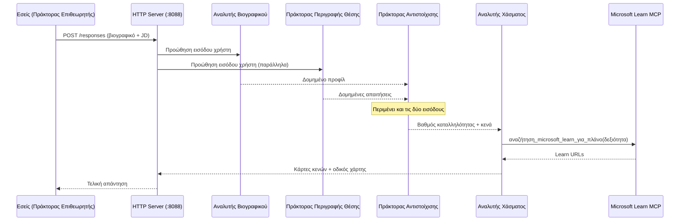
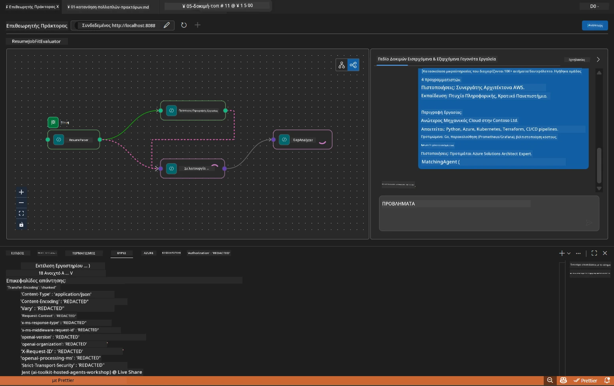

# Module 5 - Δοκιμή τοπικά (Πολυ-Πράκτορας)

Σε αυτό το module, εκτελείτε το workflow του πολυ-πράκτορα τοπικά, το δοκιμάζετε με τον Agent Inspector και επαληθεύετε ότι και οι τέσσερις πράκτορες και το εργαλείο MCP λειτουργούν σωστά πριν την ανάπτυξη στο Foundry.

### Τι συμβαίνει κατά τη διάρκεια μιας τοπικής δοκιμής


---

## Βήμα 1: Εκκίνηση του διακομιστή πράκτορα

### Επιλογή Α: Χρήση της εργασίας του VS Code (συνιστάται)

1. Πατήστε `Ctrl+Shift+P` → πληκτρολογήστε **Tasks: Run Task** → επιλέξτε **Run Lab02 HTTP Server**.
2. Η εργασία ξεκινά τον διακομιστή με το debugpy προσαρτημένο στη θύρα `5679` και τον πράκτορα στη θύρα `8088`.
3. Περιμένετε να εμφανιστεί η έξοδος:

```
INFO:resume-job-fit:Starting Resume -> Job Fit Evaluator HTTP server...
INFO:resume-job-fit:Server running on http://localhost:8088
```

### Επιλογή Β: Χρήση του τερματικού χειροκίνητα

```powershell
cd workshop\lab02-multi-agent\PersonalCareerCopilot
```

Ενεργοποιήστε το εικονικό περιβάλλον:

**PowerShell (Windows):**
```powershell
.\.venv\Scripts\Activate.ps1
```

**macOS/Linux:**
```bash
source .venv/bin/activate
```

Ξεκινήστε τον διακομιστή:

```powershell
python -m debugpy --listen 127.0.0.1:5679 -m agentdev run main.py --verbose --port 8088
```

### Επιλογή Γ: Χρήση του F5 (λειτουργία αποσφαλμάτωσης)

1. Πατήστε `F5` ή μεταβείτε στο **Run and Debug** (`Ctrl+Shift+D`).
2. Επιλέξτε τη ρύθμιση εκκίνησης **Lab02 - Multi-Agent** από το αναδυόμενο μενού.
3. Ο διακομιστής ξεκινά με πλήρη υποστήριξη διακοπών.

> **Συμβουλή:** Η λειτουργία αποσφαλμάτωσης σάς επιτρέπει να ορίσετε σημεία διακοπής μέσα στο `search_microsoft_learn_for_plan()` για να ελέγξετε τις απαντήσεις MCP, ή μέσα σε συμβολοσειρές εντολών του πράκτορα για να δείτε τι λαμβάνει κάθε πράκτορας.

---

## Βήμα 2: Άνοιγμα Agent Inspector

1. Πατήστε `Ctrl+Shift+P` → πληκτρολογήστε **Foundry Toolkit: Open Agent Inspector**.
2. Ο Agent Inspector ανοίγει σε μια καρτέλα προγράμματος περιήγησης στη διεύθυνση `http://localhost:5679`.
3. Θα πρέπει να δείτε την διεπαφή του πράκτορα έτοιμη να δεχτεί μηνύματα.

> **Εάν ο Agent Inspector δεν ανοίγει:** Βεβαιωθείτε ότι ο διακομιστής έχει ξεκινήσει πλήρως (βλέπετε το αρχείο καταγραφής "Server running"). Αν η θύρα 5679 είναι κατειλημμένη, δείτε [Module 8 - Troubleshooting](08-troubleshooting.md).

---

## Βήμα 3: Εκτέλεση δοκιμών καπνού

Εκτελέστε αυτές τις τρεις δοκιμές με τη σειρά. Κάθε μία δοκιμάζει σταδιακά περισσότερο το workflow.

### Δοκιμή 1: Βασικό βιογραφικό + περιγραφή θέσης

Επικολλήστε το ακόλουθο στο Agent Inspector:

```
Resume:
Jane Doe
Senior Software Engineer with 5 years of experience in Python, Django, and AWS.
Built microservices handling 10K+ requests/second. Led a team of 4 developers.
Certifications: AWS Solutions Architect Associate.
Education: B.S. Computer Science, State University.

Job Description:
Senior Cloud Engineer at Contoso Ltd.
Required: Python, Azure, Kubernetes, Terraform, CI/CD pipelines.
Preferred: Go, monitoring (Prometheus/Grafana), cost optimization.
Experience: 5+ years in cloud infrastructure.
Certifications: Azure Solutions Architect Expert preferred.
```

**Αναμενόμενη δομή εξόδου:**

Η απάντηση πρέπει να περιέχει έξοδο από και τους τέσσερις πράκτορες στη σειρά:

1. **Έξοδος Resume Parser** - Δομημένο προφίλ υποψηφίου με τις δεξιότητες ομαδοποιημένες κατά κατηγορία
2. **Έξοδος JD Agent** - Δομημένες απαιτήσεις με διαχωρισμό απαιτούμενων και προτιμώμενων δεξιοτήτων
3. **Έξοδος Matching Agent** - Βαθμολογία καταλληλότητας (0-100) με ανάλυση, ταιριαστές δεξιότητες, ελλείπουσες δεξιότητες, κενά
4. **Έξοδος Gap Analyzer** - Μεμονωμένες κάρτες κενών για κάθε ελλείπουσα δεξιότητα, κάθε μία με Microsoft Learn URLs



### Τι να επαληθεύσετε στη Δοκιμή 1

| Ελεγχος | Αναμενόμενο | Επιτυχία; |
|---------|-------------|-----------|
| Η απάντηση περιέχει βαθμολογία καταλληλότητας | Αριθμός μεταξύ 0-100 με ανάλυση | |
| Καταγράφονται οι ταιριαστές δεξιότητες | Python, CI/CD (μερικώς), κτλ. | |
| Καταγράφονται οι ελλείπουσες δεξιότητες | Azure, Kubernetes, Terraform, κτλ. | |
| Υπάρχουν κάρτες κενών για κάθε ελλείπουσα δεξιότητα | Μια κάρτα ανά δεξιότητα | |
| Παρουσιάζονται Microsoft Learn URLs | Πραγματικοί σύνδεσμοι `learn.microsoft.com` | |
| Δεν υπάρχουν μηνύματα σφάλματος στην απάντηση | Καθαρή δομημένη έξοδος | |

### Δοκιμή 2: Επαλήθευση εκτέλεσης εργαλείου MCP

Κατά την εκτέλεση της Δοκιμής 1, ελέγξτε το **τερματικό του διακομιστή** για καταγραφές MCP:

```
GET https://learn.microsoft.com/api/mcp → 405 (Method Not Allowed)
POST https://learn.microsoft.com/api/mcp → 200
DELETE https://learn.microsoft.com/api/mcp → 405 (Method Not Allowed)
```

| Καταγραφή | Σημασία | Αναμενόμενο; |
|-----------|---------|-------------|
| `GET ... → 405` | Ο πελάτης MCP κάνει probe με GET κατά την αρχικοποίηση | Ναι - φυσιολογικό |
| `POST ... → 200` | Πραγματική κλήση εργαλείου στον MCP server της Microsoft Learn | Ναι - η πραγματική κλήση |
| `DELETE ... → 405` | Ο πελάτης MCP κάνει probe με DELETE κατά την καθαρισμό | Ναι - φυσιολογικό |
| `POST ... → 4xx/5xx` | Η κλήση εργαλείου απέτυχε | Όχι - δείτε [Troubleshooting](08-troubleshooting.md) |

> **Κύριο σημείο:** Οι γραμμές `GET 405` και `DELETE 405` είναι **αναμενόμενη συμπεριφορά**. Ανησυχήστε μόνο αν οι κλήσεις `POST` επιστρέφουν κωδικούς κατάστασης διαφορετικούς από 200.

### Δοκιμή 3: Ακραία περίπτωση - υποψήφιος με υψηλή καταλληλότητα

Επικολλήστε ένα βιογραφικό που ταιριάζει στενά με την περιγραφή θέσης για να επαληθεύσετε ότι ο GapAnalyzer διαχειρίζεται σενάρια υψηλής καταλληλότητας:

```
Resume:
Alex Chen
Senior Cloud Engineer with 7 years of experience.
Skills: Python, Azure (AKS, Functions, DevOps), Kubernetes, Terraform, CI/CD (GitHub Actions, Azure Pipelines), Go, Prometheus, Grafana, cost optimization.
Certifications: Azure Solutions Architect Expert, Azure DevOps Engineer Expert.
Led infrastructure migration to Azure for 3 enterprise clients.
Education: M.S. Computer Science, Tech University.

Job Description:
Senior Cloud Engineer at Contoso Ltd.
Required: Python, Azure, Kubernetes, Terraform, CI/CD pipelines.
Preferred: Go, monitoring (Prometheus/Grafana), cost optimization.
Experience: 5+ years in cloud infrastructure.
Certifications: Azure Solutions Architect Expert preferred.
```

**Αναμενόμενη συμπεριφορά:**
- Η βαθμολογία καταλληλότητας πρέπει να είναι **80+** (οι περισσότερες δεξιότητες ταιριάζουν)
- Οι κάρτες κενών πρέπει να εστιάζουν στην επιμέλεια/ετοιμότητα για συνέντευξη και όχι στη βασική εκμάθηση
- Οι οδηγίες του GapAnalyzer λένε: "Αν το fit >= 80, εστιάστε στην επιμέλεια/ετοιμότητα για συνέντευξη"

---

## Βήμα 4: Επαλήθευση πληρότητας εξόδου

Μετά την εκτέλεση των δοκιμών, επαληθεύστε ότι η έξοδος πληροί τα εξής κριτήρια:

### Έλεγχος δομής εξόδου

| Ενότητα | Πράκτορας | Παρόν; |
|---------|-----------|---------|
| Προφίλ υποψηφίου | Resume Parser | |
| Τεχνικές δεξιότητες (ομαδοποιημένες) | Resume Parser | |
| Ανασκόπηση ρόλου | JD Agent | |
| Απαιτούμενες έναντι προτιμώμενων δεξιοτήτων | JD Agent | |
| Βαθμολογία καταλληλότητας με ανάλυση | Matching Agent | |
| Ταιριαστές / Ελλείπουσες / Μερικές δεξιότητες | Matching Agent | |
| Κάρτα κενών ανά ελλείπουσα δεξιότητα | Gap Analyzer | |
| Microsoft Learn URLs στις κάρτες κενού | Gap Analyzer (MCP) | |
| Σειρά εκμάθησης (αρθρωμένα από αριθμό) | Gap Analyzer | |
| Περίληψη χρονοδιαγράμματος | Gap Analyzer | |

### Συνήθη προβλήματα σε αυτό το στάδιο

| Πρόβλημα | Αιτία | Επίλυση |
|----------|-------|---------|
| Μόνο 1 κάρτα κενών (οι υπόλοιπες κόβονται) | Στις οδηγίες του GapAnalyzer λείπει το κρίσιμο μπλοκ | Προσθέστε την παράγραφο `CRITICAL:` στο `GAP_ANALYZER_INSTRUCTIONS` - δείτε [Module 3](03-configure-agents.md) |
| Δεν υπάρχουν Microsoft Learn URLs | Δεν είναι προσπελάσιμο το endpoint MCP | Ελέγξτε τη σύνδεση στο Internet. Βεβαιωθείτε ότι το `MICROSOFT_LEARN_MCP_ENDPOINT` στο `.env` είναι `https://learn.microsoft.com/api/mcp` |
| Κενή απάντηση | `PROJECT_ENDPOINT` ή `MODEL_DEPLOYMENT_NAME` δεν έχει οριστεί | Ελέγξτε τις τιμές στο αρχείο `.env`. Τρέξτε `echo $env:PROJECT_ENDPOINT` στο τερματικό |
| Η βαθμολογία καταλληλότητας είναι 0 ή λείπει | Ο MatchingAgent δεν έλαβε δεδομένα upstream | Ελέγξτε ότι υπάρχουν `add_edge(resume_parser, matching_agent)` και `add_edge(jd_agent, matching_agent)` στο `create_workflow()` |
| Ο πράκτορας ξεκινά αλλά βγαίνει αμέσως | Σφάλμα εισαγωγής ή λείπει εξάρτηση | Τρέξτε ξανά `pip install -r requirements.txt`. Ελέγξτε το τερματικό για σφάλματα |
| Σφάλμα `validate_configuration` | Λείπουν μεταβλητές περιβάλλοντος | Δημιουργήστε `.env` με `PROJECT_ENDPOINT=<your-endpoint>` και `MODEL_DEPLOYMENT_NAME=<your-model>` |

---

## Βήμα 5: Δοκιμή με δικά σας δεδομένα (προαιρετικό)

Δοκιμάστε να επικολλήσετε το δικό σας βιογραφικό και μια πραγματική περιγραφή θέσης. Αυτό βοηθά να επαληθεύσετε:

- Οι πράκτορες χειρίζονται διαφορετικές μορφές βιογραφικών (χρονικά, λειτουργικά, υβριδικά)
- Ο JD Agent χειρίζεται διάφορα στυλ περιγραφών θέσεων (κουκκίδες, παραγράφους, δομημένες)
- Το εργαλείο MCP επιστρέφει σχετικά πόρους για πραγματικές δεξιότητες
- Οι κάρτες κενών είναι εξατομικευμένες στο δικό σας υπόβαθρο

> **Σημείωση απορρήτου:** Κατά τη τοπική δοκιμή, τα δεδομένα σας μένουν στη συσκευή σας και αποστέλλονται μόνο στην ανάπτυξη Azure OpenAI. Δεν καταγράφονται ή αποθηκεύονται από την υποδομή εργαστηρίου. Χρησιμοποιήστε ψευδώνυμα αν προτιμάτε (π.χ. "Ιωάννα Παπαδοπούλου" αντί για το πραγματικό όνομά σας).

---

### Σημείο ελέγχου

- [ ] Ο διακομιστής ξεκίνησε επιτυχώς στη θύρα `8088` (το αρχείο καταγραφής δείχνει "Server running")
- [ ] Ο Agent Inspector άνοιξε και συνδέθηκε με τον πράκτορα
- [ ] Δοκιμή 1: Πλήρης απάντηση με βαθμολογία καταλληλότητας, ταιριαστές/ελλείπουσες δεξιότητες, κάρτες κενών, και Microsoft Learn URLs
- [ ] Δοκιμή 2: Τα αρχεία καταγραφής MCP δείχνουν `POST ... → 200` (οι κλήσεις εργαλείων πέτυχαν)
- [ ] Δοκιμή 3: Ο υποψήφιος με υψηλή καταλληλότητα παίρνει βαθμολογία 80+ με προτάσεις που εστιάζουν στην επιμέλεια
- [ ] Παρουσιάζονται όλες οι κάρτες κενών (μία ανά ελλείπουσα δεξιότητα, χωρίς κοπή)
- [ ] Δεν υπάρχουν σφάλματα ή ιχνηλατήσεις στο τερματικό διακομιστή

---

**Προηγούμενο:** [04 - Orchestration Patterns](04-orchestration-patterns.md) · **Επόμενο:** [06 - Deploy to Foundry →](06-deploy-to-foundry.md)

---

<!-- CO-OP TRANSLATOR DISCLAIMER START -->
**Απόρρητο**:  
Αυτό το έγγραφο έχει μεταφραστεί χρησιμοποιώντας την υπηρεσία αυτόματης μετάφρασης AI [Co-op Translator](https://github.com/Azure/co-op-translator). Παρόλο που επιδιώκουμε ακρίβεια, παρακαλούμε να γνωρίζετε ότι οι αυτοματοποιημένες μεταφράσεις ενδέχεται να περιέχουν λάθη ή ανακρίβειες. Το πρωτότυπο έγγραφο στη μητρική του γλώσσα πρέπει να θεωρείται ως η αυθεντική πηγή. Για κρίσιμες πληροφορίες, συνιστάται επαγγελματική ανθρώπινη μετάφραση. Δεν φέρουμε ευθύνη για τυχόν παρανοήσεις ή εσφαλμένες ερμηνείες που προκύπτουν από τη χρήση αυτής της μετάφρασης.
<!-- CO-OP TRANSLATOR DISCLAIMER END -->