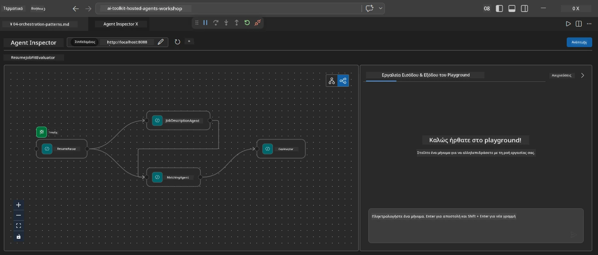
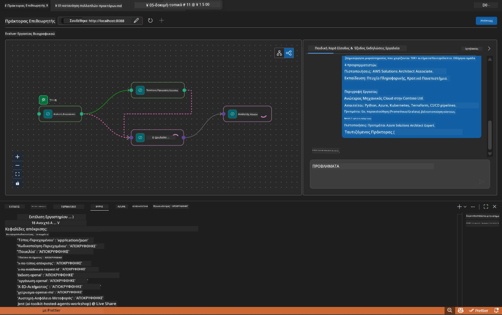
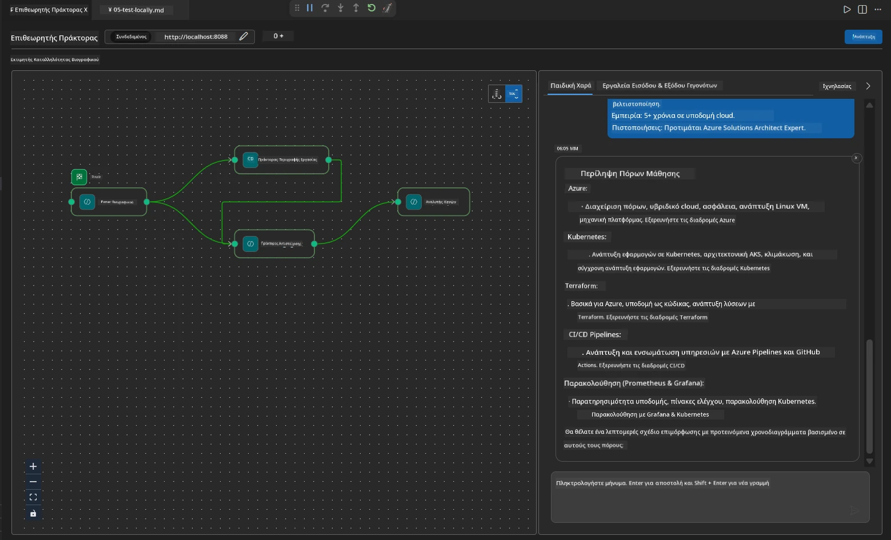

# Ενότητα 5 - Τοπική Δοκιμή

⏱️ ~15 λεπτά

Σε αυτήν την ενότητα, εκτελείτε την ροή εργασίας πολλαπλών πρακτόρων τοπικά, τη δοκιμάζετε με το Agent Inspector και επαληθεύετε ότι και οι τέσσερις πράκτορες και το εργαλείο MCP λειτουργούν σωστά πριν από την ανάπτυξη.

---

## Βήμα 1: Εκκίνηση του διακομιστή πράκτορα

### Επιλογή Α: Χρήση της εργασίας VS Code (προτεινόμενη)

1. Ανοίξτε το φάκελο `workshop/lab02-multi-agent/PersonalCareerCopilot/` ως φάκελο VS Code.
2. Πατήστε `Ctrl+Shift+P` → πληκτρολογήστε **Tasks: Run Task** → επιλέξτε **Run Agent HTTP Server**.
3. Η εργασία εκκινεί τον διακομιστή με συνδεδεμένο τον debugpy στην θύρα `5679` και τον πράκτορα στη θύρα `8088`.
4. Περιμένετε να εμφανιστεί η έξοδος:

```
INFO:resume-job-fit:Starting Resume -> Job Fit Evaluator HTTP server...
INFO:resume-job-fit:Server running on http://localhost:8088
```

### Επιλογή Β: Χρήση του F5 (λειτουργία αποσφαλμάτωσης)

1. Πατήστε `F5` → επιλέξτε **Debug Local Agent HTTP Server**.
2. Ο διακομιστής ξεκινά με πλήρη υποστήριξη breakpoint - χρήσιμο για την επιθεώρηση απαντήσεων MCP ή αποτελεσμάτων πράκτορα.

---

## Βήμα 2: Άνοιγμα Agent Inspector

1. Πατήστε `Ctrl+Shift+P` → πληκτρολογήστε **Foundry Toolkit: Open Agent Inspector**.
2. Το Agent Inspector ανοίγει ως πίνακας VS Code συνδεδεμένος με το `http://localhost:8088`.
3. Πρέπει να δείτε την διεπαφή πράκτορα έτοιμη να δεχτεί μηνύματα.



> **Αν το Agent Inspector δεν ανοίγει:** Βεβαιωθείτε ότι ο διακομιστής έχει ξεκινήσει πλήρως (βλέπετε το λογ "Server running"). Αν η θύρα 5679 είναι κατειλημμένη, δείτε [Ενότητα 8 - Αντιμετώπιση προβλημάτων](08-troubleshooting.md).

---

## Βήμα 2β: (Προαιρετικό) Άνοιγμα του Visualizer ροής εργασίας

Το Foundry Toolkit περιλαμβάνει έναν οπτικοποιητή ροής εργασίας σε πραγματικό χρόνο (**Workflow Visualizer**) που δείχνει πώς οι πράκτορες αλληλεπιδρούν κατά την εκτέλεση του γραφήματος. Αυτό είναι ιδιαίτερα χρήσιμο για την αποσφαλμάτωση πολλαπλών πρακτόρων.

1. Πατήστε `Ctrl+Shift+P` → πληκτρολογήστε **Foundry Toolkit: Open Visualizer for Hosted Agents**.
2. Ανοίγει μια νέα καρτέλα VS Code που δείχνει το ζωντανό γράφημα εκτέλεσης.
3. Καθώς στέλνετε μηνύματα στο Agent Inspector, ο οπτικοποιητής ενημερώνεται αυτόματα - τα πράσινα σημεία υποδεικνύουν ολοκληρωμένους πράκτορες, και οι κινούμενες ακμές δείχνουν την ροή δεδομένων μεταξύ τους.

> **Σύγκρουση θύρας:** Αν η θύρα του οπτικοποιητή χρησιμοποιείται ήδη, αλλάξτε την στις Ρυθμίσεις VS Code → **Επεκτάσεις** → **Microsoft Foundry Configuration** → **Hosted Agents: Visualizer Port**.

---

## Βήμα 3: Εκτέλεση βασικών δοκιμών

Εκτελέστε αυτές τις τρεις δοκιμές με τη σειρά. Κάθε μία ελέγχει σταδιακά μεγαλύτερο μέρος της ροής εργασίας.

### Δοκιμή 1: Βασικό βιογραφικό + περιγραφή θέσης εργασίας

Επικολλήστε τα παρακάτω στο Agent Inspector:

```
Resume:
Jane Doe
Senior Software Engineer with 5 years of experience in Python, Django, and AWS.
Built microservices handling 10K+ requests/second. Led a team of 4 developers.
Certifications: AWS Solutions Architect Associate.
Education: B.S. Computer Science, State University.

Job Description:
Senior Cloud Engineer at Contoso Ltd.
Required: Python, Azure, Kubernetes, Terraform, CI/CD pipelines.
Preferred: Go, monitoring (Prometheus/Grafana), cost optimization.
Experience: 5+ years in cloud infrastructure.
Certifications: Azure Solutions Architect Expert preferred.
```

**Αναμενόμενη δομή αποτελέσματος:**

Η απάντηση πρέπει να περιέχει έξοδο από και τους τέσσερις πράκτορες με σειρά:

1. **Έξοδος ανάλυσης βιογραφικού** - δύο επισημασμένα τμήματα: `[PARSED RESUME]` (προφίλ υποψηφίου με ομαδοποιημένες δεξιότητες) και `[JOB DESCRIPTION PASS-THROUGH]` (αυστηρά κείμενο Περιγραφής Θέσης που τροφοδοτεί τον JD Agent)
2. **Έξοδος JD Agent** - Διαρθρωμένες απαιτήσεις με διαχωρισμό δεξιοτήτων απαραίτητων και προτιμώμενων
3. **Έξοδος Matching Agent** - Βαθμολογία καταλληλότητας (0-100) με ανάλυση, ταιριασμένες δεξιότητες, ελλείψεις, κενά
4. **Έξοδος Gap Analyzer** - Ατομικές κάρτες κενών για κάθε ελλείπουσα δεξιότητα, καθεμία με URLs Microsoft Learn





### Τι πρέπει να επαληθεύσετε στη Δοκιμή 1

| Έλεγχος | Αναμενόμενο | Πέρασε; |
|-------|----------|-------|
| Η απάντηση περιέχει βαθμό καταλληλότητας | Αριθμός μεταξύ 0-100 με ανάλυση | |
| Οι ταιριασμένες δεξιότητες απαριθμούνται | Python, CI/CD (μερικώς), κλπ. | |
| Οι ελλείπουσες δεξιότητες απαριθμούνται | Azure, Kubernetes, Terraform, κλπ. | |
| Υπάρχουν κάρτες κενών για κάθε ελλείπουσα δεξιότητα | Μία κάρτα ανά δεξιότητα | |
| Υπάρχουν URLs Microsoft Learn | Πραγματικοί σύνδεσμοι `learn.microsoft.com` | |
| Δεν υπάρχουν μηνύματα σφάλματος στην απάντηση | Καθαρή δομημένη έξοδος | |

### Δοκιμή 2: Ακραίο παράδειγμα - υποψήφιος με υψηλή καταλληλότητα

Επικολλήστε ένα βιογραφικό που ταιριάζει στενά στην Περιγραφή Θέσης για να επαληθεύσετε ότι ο GapAnalyzer χειρίζεται σενάρια υψηλής καταλληλότητας:

```
Resume:
Alex Chen
Senior Cloud Engineer with 7 years of experience.
Skills: Python, Azure (AKS, Functions, DevOps), Kubernetes, Terraform, CI/CD (GitHub Actions, Azure Pipelines), Go, Prometheus, Grafana, cost optimization.
Certifications: Azure Solutions Architect Expert, Azure DevOps Engineer Expert.
Led infrastructure migration to Azure for 3 enterprise clients.
Education: M.S. Computer Science, Tech University.

Job Description:
Senior Cloud Engineer at Contoso Ltd.
Required: Python, Azure, Kubernetes, Terraform, CI/CD pipelines.
Preferred: Go, monitoring (Prometheus/Grafana), cost optimization.
Experience: 5+ years in cloud infrastructure.
Certifications: Azure Solutions Architect Expert preferred.
```

**Αναμενόμενη συμπεριφορά:**
- Ο βαθμός καταλληλότητας πρέπει να είναι **80+** (τα περισσότερα προσόντα ταιριάζουν)
- Οι κάρτες κενών πρέπει να εστιάζουν στο φινίρισμα/ετοιμότητα για συνέντευξη αντί για βασική εκμάθηση
- Οι οδηγίες του GapAnalyzer λένε: "Αν η καταλληλότητα >= 80, εστιάστε στο φινίρισμα/ετοιμότητα για συνέντευξη"

---

## Βήμα 4: Δοκιμή με δικά σας δεδομένα (προαιρετικό)

Δοκιμάστε να επικολλήσετε το δικό σας βιογραφικό και μια πραγματική περιγραφή θέσης εργασίας. Αυτό βοηθά να επαληθεύσετε:

- Οι πράκτορες χειρίζονται διαφορετικές μορφές βιογραφικών (χρονικά, λειτουργικά, υβριδικά)
- Ο JD Agent διαχειρίζεται διαφορετικά στυλ περιγραφής θέσης (με κουκκίδες, παραγράφους, δομημένα)
- Το εργαλείο MCP επιστρέφει σχετικούς πόρους για πραγματικές δεξιότητες
- Οι κάρτες κενών είναι προσωποποιημένες ανάλογα με το συγκεκριμένο υπόβαθρό σας

> **Ιδιωτικότητα - Διαδρομή Α (Foundry cloud):** Το βιογραφικό και το κείμενο της Περιγραφής Θέσης αποστέλλονται στην ανάπτυξή σας Azure OpenAI για επεξεργασία. Δεν αποθηκεύονται ούτε καταγράφονται υποδομές του εργαστηρίου. Χρησιμοποιήστε ψευδώνυμα (π.χ. "Jane Doe") αν προτιμάτε.
>
> **Ιδιωτικότητα - Διαδρομή Β (Foundry Local):** Όλες οι τετραπλές επεξεργασίες πρακτόρων εκτελούνται πλήρως στη συσκευή σας. Το βιογραφικό και τα κείμενα περιγραφής θέσης **δεν φεύγουν ποτέ από τον υπολογιστή σας**. Η μόνη εξερχόμενη κλήση είναι η ανάκτηση πόρων από το εργαλείο MCP από `https://learn.microsoft.com/api/mcp`; το ερώτημα περιέχει μόνο το όνομα της δεξιότητας, όχι τα προσωπικά σας δεδομένα.

---

### Σημείο ελέγχου

- [ ] Ο διακομιστής ξεκίνησε επιτυχώς στη θύρα `8088` (το λογ δείχνει "Server running")
- [ ] Το Agent Inspector άνοιξε και συνδέθηκε με τον πράκτορα
- [ ] Δοκιμή 1: Πλήρης απάντηση με βαθμολογία καταλληλότητας, ταιριαστές/ελλείπουσες δεξιότητες, κάρτες κενών, και URLs Microsoft Learn
- [ ] Δοκιμή 2: Ο υποψήφιος υψηλής καταλληλότητας παίρνει σκορ 80+ με προτάσεις που εστιάζουν στο φινίρισμα
- [ ] Όλες οι κάρτες κενών υπάρχουν (μία ανά ελλείπουσα δεξιότητα, χωρίς αποκοπή)
- [ ] Δεν υπάρχουν σφάλματα ή ίχνη στο τερματικό του διακομιστή

---

**Προηγούμενο:** [04 - Σχηματισμοί Ορχήστρωσης](04-orchestration-patterns.md) · **Επόμενο:** [06 - Ανάπτυξη σε Foundry →](06-deploy-to-foundry.md)

---

<!-- CO-OP TRANSLATOR DISCLAIMER START -->
**Αποποίηση ευθυνών**:
Αυτό το έγγραφο έχει μεταφραστεί χρησιμοποιώντας την υπηρεσία μετάφρασης με τεχνητή νοημοσύνη [Co-op Translator](https://github.com/Azure/co-op-translator). Ενώ επιδιώκουμε την ακρίβεια, παρακαλούμε να έχετε υπόψη ότι οι αυτοματοποιημένες μεταφράσεις ενδέχεται να περιέχουν λάθη ή ανακρίβειες. Το πρωτότυπο έγγραφο στη μητρική του γλώσσα πρέπει να θεωρείται η αυθεντική πηγή. Για κρίσιμες πληροφορίες, συνιστάται επαγγελματική ανθρώπινη μετάφραση. Δεν φέρουμε ευθύνη για τυχόν παρεξηγήσεις ή λανθασμένες ερμηνείες που προκύπτουν από τη χρήση αυτής της μετάφρασης.
<!-- CO-OP TRANSLATOR DISCLAIMER END -->