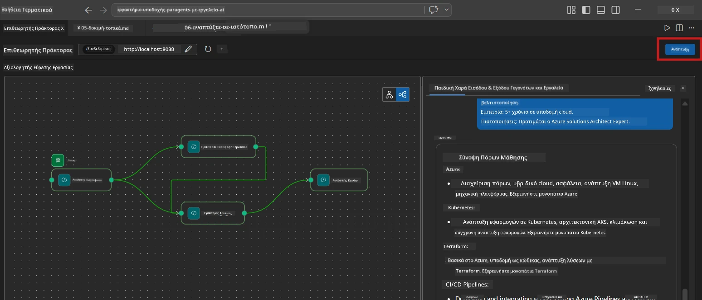
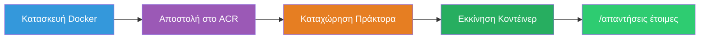
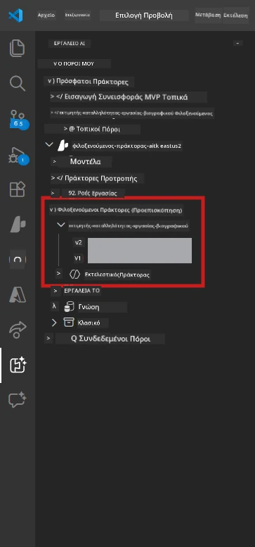

# Ενότητα 6 - Ανάπτυξη στην Υπηρεσία Πράκτορα Foundry

Σε αυτή την ενότητα, αναπτύσσετε την τοπικά δοκιμασμένη ροή εργασίας πολλαπλών πρακτόρων σας στο [Microsoft Foundry](https://learn.microsoft.com/azure/foundry/agents/concepts/hosted-agents) ως **Φιλοξενούμενος Πράκτορας**. Η διαδικασία ανάπτυξης δημιουργεί μια εικόνα κοντέινερ Docker, την προωθεί στο [Azure Container Registry (ACR)](https://learn.microsoft.com/azure/container-registry/container-registry-intro) και δημιουργεί μια έκδοση φιλοξενούμενου πράκτορα στην [Υπηρεσία Πράκτορα Foundry](https://learn.microsoft.com/azure/foundry/agents/how-to/publish-agent).

> **Κύρια διαφορά από το Εργαστήριο 01:** Η διαδικασία ανάπτυξης είναι παρόμοια. Το Foundry αντιμετωπίζει τη ροή εργασίας πολλαπλών πρακτόρων σας ως ένα μοναδικό φιλοξενούμενο πράκτορα - η πολυπλοκότητα είναι μέσα στο κοντέινερ, αλλά η επιφάνεια ανάπτυξης είναι η ίδια, το endpoint `/responses`.

---

## Έλεγχος προαπαιτούμενων

Πριν την ανάπτυξη, επιβεβαιώστε κάθε παρακάτω στοιχείο:

1. **Ο πράκτορας περνάει τα τοπικά δοκιμαστικά smoke tests:**
   - Ολοκληρώσατε και τις 3 δοκιμές στο [Ενότητα 5](05-test-locally.md) και η ροή εργασίας παρήγαγε πλήρες αποτέλεσμα με κάρτες κενών και διευθύνσεις Microsoft Learn.

2. **Διαθέτετε ρόλο [Azure AI User](https://learn.microsoft.com/azure/foundry/concepts/rbac-foundry):**
   - Ανατέθηκε στο [Εργαστήριο 01, Ενότητα 2](../../lab01-single-agent/docs/02-create-foundry-project.md). Επαληθεύστε:
   - [Azure Portal](https://portal.azure.com) → πόρος **έργου** Foundry → **Έλεγχος πρόσβασης (IAM)** → **Αναθέσεις ρόλων** → επιβεβαιώστε ότι ο **[Azure AI User](https://aka.ms/foundry-ext-project-role)** υπάρχει για τον λογαριασμό σας.

3. **Έχετε συνδεθεί στο Azure μέσω του VS Code:**
   - Ελέγξτε το εικονίδιο Λογαριασμών κάτω αριστερά στο VS Code. Το όνομα του λογαριασμού σας πρέπει να είναι ορατό.

4. **Το αρχείο `agent.yaml` έχει σωστές τιμές:**
   - Ανοίξτε το `PersonalCareerCopilot/agent.yaml` και επαληθεύστε:
     ```yaml
     environment_variables:
       - name: PROJECT_ENDPOINT
         value: ${PROJECT_ENDPOINT}
       - name: MODEL_DEPLOYMENT_NAME
         value: ${MODEL_DEPLOYMENT_NAME}
     ```
   - Πρέπει να ταιριάζουν με τις περιβαλλοντικές μεταβλητές που διαβάζει το `main.py`.

5. **Το `requirements.txt` έχει σωστές εκδόσεις:**
   ```
   agent-framework-azure-ai==1.0.0rc3
   agent-framework-core==1.0.0rc3
   azure-ai-agentserver-agentframework==1.0.0b16
   azure-ai-agentserver-core==1.0.0b16
   debugpy
   agent-dev-cli --pre
   ```

---

## Βήμα 1: Ξεκινήστε την ανάπτυξη

### Επιλογή Α: Ανάπτυξη από το Agent Inspector (συνιστάται)

Αν ο πράκτορας εκτελείται μέσω F5 με ανοιχτό το Agent Inspector:

1. Κοιτάξτε στην **επάνω δεξιά γωνία** του πίνακα Agent Inspector.
2. Κάντε κλικ στο κουμπί **Deploy** (εικονίδιο σύννεφου με βέλος προς τα πάνω ↑).
3. Ανοίγει ο οδηγός ανάπτυξης.



### Επιλογή Β: Ανάπτυξη από την Command Palette

1. Πιέστε `Ctrl+Shift+P` για να ανοίξετε την **Command Palette**.
2. Πληκτρολογήστε: **Microsoft Foundry: Deploy Hosted Agent** και επιλέξτε το.
3. Ανοίγει ο οδηγός ανάπτυξης.

---

## Βήμα 2: Διαμορφώστε την ανάπτυξη

### 2.1 Επιλέξτε το στοχευόμενο έργο

1. Ένα αναδιπλούμενο μενού δείχνει τα έργα Foundry σας.
2. Επιλέξτε το έργο που χρησιμοποιήσατε σε όλο το εργαστήριο (π.χ., `workshop-agents`).

### 2.2 Επιλέξτε το αρχείο πράκτορα κοντέινερ

1. Θα σας ζητηθεί να επιλέξετε το σημείο εισόδου του πράκτορα.
2. Πλοηγηθείτε στο `workshop/lab02-multi-agent/PersonalCareerCopilot/` και επιλέξτε **`main.py`**.

### 2.3 Διαμορφώστε πόρους

| Ρύθμιση | Συνιστώμενη τιμή | Σημειώσεις |
|---------|------------------|------------|
| **CPU** | `0.25` | Προεπιλογή. Οι ροές εργασίας πολλαπλών πρακτόρων δεν χρειάζονται περισσότερη CPU γιατί οι κλήσεις μοντέλου είναι I/O bound |
| **Μνήμη** | `0.5Gi` | Προεπιλογή. Αυξήστε σε `1Gi` αν προσθέσετε εργαλεία μεγάλης επεξεργασίας δεδομένων |

---

## Βήμα 3: Επιβεβαιώστε και αναπτύξτε

1. Ο οδηγός εμφανίζει σύνοψη ανάπτυξης.
2. Επανεξετάστε και κάντε κλικ στο **Confirm and Deploy**.
3. Παρακολουθήστε την πρόοδο στο VS Code.

### Τι συμβαίνει κατά την ανάπτυξη

Παρακολουθήστε τον πίνακα **Output** του VS Code (επιλέξτε το dropdown "Microsoft Foundry"):


1. **Κατασκευή Docker** - Δημιουργεί το κοντέινερ από το αρχείο `Dockerfile`:
   ```
   Step 1/6 : FROM python:3.14-slim
   Step 2/6 : WORKDIR /app
   ...
   Successfully built abc123def456
   ```

2. **Προώθηση Docker** - Προωθεί την εικόνα στο ACR (1-3 λεπτά στην πρώτη ανάπτυξη).

3. **Καταχώρηση πράκτορα** - Το Foundry δημιουργεί έναν φιλοξενούμενο πράκτορα χρησιμοποιώντας τα μεταδεδομένα `agent.yaml`. Το όνομα πράκτορα είναι `resume-job-fit-evaluator`.

4. **Εκκίνηση κοντέινερ** - Το κοντέινερ ξεκινά στην υποδομή που διαχειρίζεται το Foundry με ταυτότητα που διαχειρίζεται το σύστημα.

> **Η πρώτη ανάπτυξη είναι πιο αργή** (το Docker ωθεί όλα τα στρώματα). Οι επόμενες αναπτύξεις χρησιμοποιούν προσωρινά αποθηκευμένα στρώματα και είναι πιο γρήγορες.

### Σημειώσεις ειδικά για πολλαπλούς πράκτορες

- **Οι τέσσερις πράκτορες βρίσκονται μέσα σε ένα κοντέινερ.** Το Foundry βλέπει έναν μοναδικό φιλοξενούμενο πράκτορα. Το γράφημα WorkflowBuilder εκτελείται εσωτερικά.
- **Οι κλήσεις MCP είναι εξερχόμενες.** Το κοντέινερ χρειάζεται πρόσβαση στο διαδίκτυο για να φτάσει στο `https://learn.microsoft.com/api/mcp`. Η υποδομή που διαχειρίζεται το Foundry παρέχει αυτό από προεπιλογή.
- **[Διαχειριζόμενη ταυτότητα](https://learn.microsoft.com/python/api/overview/azure/identity-readme#managed-identity-support).** Στο φιλοξενούμενο περιβάλλον, το `get_credential()` στο `main.py` επιστρέφει `ManagedIdentityCredential()` (επειδή έχει οριστεί το `MSI_ENDPOINT`). Αυτό γίνεται αυτόματα.

---

## Βήμα 4: Επαληθεύστε την κατάσταση ανάπτυξης

1. Ανοίξτε την πλαϊνή μπάρα **Microsoft Foundry** (πατήστε το εικονίδιο Foundry στην Activity Bar).
2. Αναπτύξτε **Hosted Agents (Preview)** κάτω από το έργο σας.
3. Βρείτε τον **resume-job-fit-evaluator** (ή το όνομα του πράκτορά σας).
4. Κάντε κλικ στο όνομα του πράκτορα → αναπτύξτε τις εκδόσεις (π.χ., `v1`).
5. Κάντε κλικ στην έκδοση → δείτε **Λεπτομέρειες Κοντέινερ** → **Κατάσταση**:



| Κατάσταση | Σημασία |
|-----------|---------|
| **Started** / **Running** | Το κοντέινερ εκτελείται, ο πράκτορας είναι έτοιμος |
| **Pending** | Το κοντέινερ ξεκινά (περιμένετε 30-60 δευτερόλεπτα) |
| **Failed** | Το κοντέινερ απέτυχε να ξεκινήσει (ελέγξτε τα αρχεία καταγραφής - παρακάτω) |

> **Η εκκίνηση πολλαπλών πρακτόρων διαρκεί περισσότερο** από αυτή ενός μόνο πράκτορα γιατί το κοντέινερ δημιουργεί 4 στιγμιότυπα πρακτόρων κατά την εκκίνηση. "Pending" μέχρι 2 λεπτά είναι φυσιολογικό.

---

## Συνήθεις σφάλματα ανάπτυξης και διορθώσεις

### Σφάλμα 1: Άρνηση άδειας - `agents/write`

```
Error: lacks the required data action 
Microsoft.CognitiveServices/accounts/AIServices/agents/write
```

**Διόρθωση:** Αναθέστε το ρόλο **[Azure AI User](https://learn.microsoft.com/azure/foundry/concepts/rbac-foundry)** στο επίπεδο **έργου**. Δείτε το [Ενότητα 8 - Αντιμετώπιση προβλημάτων](08-troubleshooting.md) για βήμα προς βήμα οδηγίες.

### Σφάλμα 2: Το Docker δεν εκκινεί

```
Error: Docker build failed / Cannot connect to Docker daemon
```

**Διόρθωση:**
1. Ξεκινήστε το Docker Desktop.
2. Περιμένετε μέχρι να εμφανιστεί το μήνυμα "Docker Desktop is running".
3. Επαληθεύστε: `docker info`
4. **Windows:** Βεβαιωθείτε ότι το backend WSL 2 είναι ενεργοποιημένο στις ρυθμίσεις του Docker Desktop.
5. Δοκιμάστε ξανά.

### Σφάλμα 3: Αποτυχία pip install κατά την κατασκευή Docker

```
Error: Could not find a version that satisfies the requirement agent-dev-cli
```

**Διόρθωση:** Η σημαία `--pre` στο `requirements.txt` χειρίζεται διαφορετικά στο Docker. Βεβαιωθείτε ότι το `requirements.txt` περιέχει:
```
agent-dev-cli --pre
```

Αν το Docker αποτύχει και πάλι, δημιουργήστε ένα `pip.conf` ή περάστε το `--pre` μέσω build argument. Δείτε το [Ενότητα 8](08-troubleshooting.md).

### Σφάλμα 4: Αποτυχία εργαλείου MCP στον φιλοξενούμενο πράκτορα

Αν ο Gap Analyzer σταματήσει να παράγει URL Microsoft Learn μετά την ανάπτυξη:

**Βασική αιτία:** Πολιτική δικτύου μπορεί να μπλοκάρει εξερχόμενο HTTPS από το κοντέινερ.

**Διόρθωση:**
1. Συνήθως δεν αποτελεί πρόβλημα στη προεπιλεγμένη ρύθμιση του Foundry.
2. Αν συμβαίνει, ελέγξτε αν το εικονικό δίκτυο του έργου Foundry έχει NSG που μπλοκάρει εξερχόμενο HTTPS.
3. Το εργαλείο MCP έχει ενσωματωμένα fallback URLs, οπότε ο πράκτορας θα παράγει ακόμα αποτελέσματα (χωρίς live URLs).

---

### Σημείο ελέγχου

- [ ] Η εντολή ανάπτυξης ολοκληρώθηκε χωρίς σφάλματα στο VS Code
- [ ] Ο πράκτορας εμφανίζεται κάτω από **Hosted Agents (Preview)** στην πλαϊνή μπάρα του Foundry
- [ ] Το όνομα του πράκτορα είναι `resume-job-fit-evaluator` (ή το επιλεγμένο όνομά σας)
- [ ] Η κατάσταση του κοντέινερ δείχνει **Started** ή **Running**
- [ ] (Σε περίπτωση σφαλμάτων) Αναγνωρίσατε το σφάλμα, εφαρμόσατε τη διόρθωση και αναπτύξατε επιτυχώς ξανά

---

**Προηγούμενο:** [05 - Δοκιμή τοπικά](05-test-locally.md) · **Επόμενο:** [07 - Επαλήθευση στο Playground →](07-verify-in-playground.md)

---

<!-- CO-OP TRANSLATOR DISCLAIMER START -->
**Αποποίηση ευθυνών**:  
Αυτό το έγγραφο έχει μεταφραστεί χρησιμοποιώντας την υπηρεσία μετάφρασης AI [Co-op Translator](https://github.com/Azure/co-op-translator). Ενώ προσπαθούμε για ακρίβεια, παρακαλούμε να γνωρίζετε ότι οι αυτόματες μεταφράσεις ενδέχεται να περιέχουν λάθη ή ανακρίβειες. Το αρχικό έγγραφο στη μητρική του γλώσσα πρέπει να θεωρείται η επίσημη πηγή. Για κρίσιμες πληροφορίες, συνιστάται η επαγγελματική ανθρώπινη μετάφραση. Δεν φέρουμε ευθύνη για τυχόν παρεξηγήσεις ή λανθασμένες ερμηνείες που προκύπτουν από τη χρήση αυτής της μετάφρασης.
<!-- CO-OP TRANSLATOR DISCLAIMER END -->