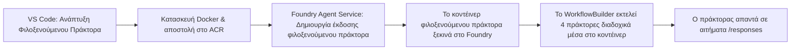
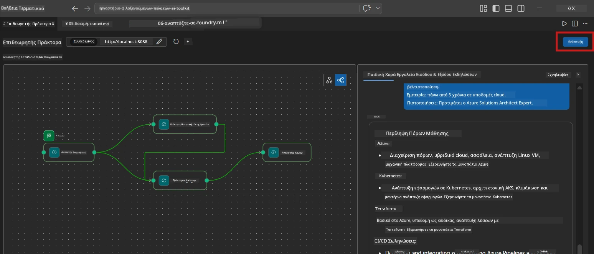
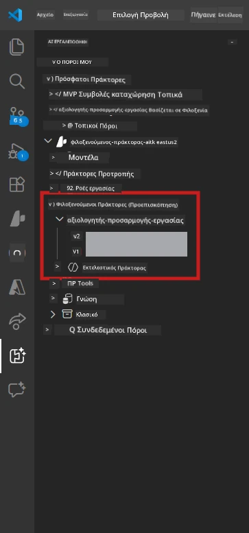

# Ενότητα 6 - Ανάπτυξη στην υπηρεσία Foundry Agent

⏱️ ~10 λεπτά

Σε αυτήν την ενότητα, αναπτύσσετε τη ροή εργασίας πολλών πρακτόρων που δοκιμάσατε τοπικά στο [Microsoft Foundry](https://learn.microsoft.com/azure/foundry/agents/concepts/hosted-agents) ως **Φιλοξενούμενος Πράκτορας**. Η διαδικασία ανάπτυξης δημιουργεί μια εικόνα κοντέινερ Docker, την ανεβάζει στο [Azure Container Registry (ACR)](https://learn.microsoft.com/azure/container-registry/container-registry-intro) και δημιουργεί μια έκδοση φιλοξενούμενου πράκτορα στην [Foundry Agent Service](https://learn.microsoft.com/azure/foundry/agents/how-to/publish-agent).

> **Κύρια διαφορά από το Εργαστήριο 01:** Η διαδικασία ανάπτυξης είναι ίδια. Το Foundry αντιμετωπίζει τη ροή εργασίας πολλών πρακτόρων ως έναν ενιαίο φιλοξενούμενο πράκτορα - η πολυπλοκότητα βρίσκεται μέσα στο κοντέινερ, αλλά η επιφάνεια ανάπτυξης είναι η ίδια `/responses` τελική σημείο.

### Αλυσίδα ανάπτυξης


```mermaid
flowchart LR
    A[VS Code: Ανάπτυξη Φιλοξενούμενου Πράκτορα] --> B[Κατασκευή Docker & αποστολή στο ACR]
    B --> C[Foundry Agent Service: Δημιουργία έκδοσης φιλοξενούμενου πράκτορα]
    C --> D[Το κοντέινερ φιλοξενούμενου πράκτορα ξεκινά στο Foundry]
    D --> E[Το WorkflowBuilder εκτελεί 4 πράκτορες διαδοχικά μέσα στο κοντέινερ]
    E --> F[Ο πράκτορας απαντά σε αιτήματα /responses]
```

---

## Έλεγχος προαπαιτούμενων

Πριν από την ανάπτυξη, επαληθεύστε κάθε στοιχείο παρακάτω:

1. **Ο πράκτορας περνάει τα τοπικά smoke tests:**
   - Ολοκληρώσατε και τις 3 δοκιμές στο [Ενότητα 5](05-test-locally.md) και η ροή εργασίας παρήγαγε πλήρη έξοδο με κάρτες κενών και URL του Microsoft Learn.

2. **Έχετε το ρόλο [Foundry User](https://learn.microsoft.com/azure/foundry/concepts/rbac-foundry)** (για να αναπτύξετε, χρειάζεστε τουλάχιστον τον **Foundry Project Manager** σε επίπεδο έργου):

   > **Σημείωση:** Οι ρόλοι RBAC του Foundry μετονομάστηκαν πρόσφατα - οι **Foundry User**, **Foundry Owner** και **Foundry Project Manager** ονομάζονταν προηγουμένως Azure AI User, Azure AI Owner και Azure AI Project Manager. Τα ID ρόλων και τα δικαιώματα παραμένουν αμετάβλητα.

   - Επαληθεύστε στο [Azure Portal](https://portal.azure.com) → τον πόρο **έργου** Foundry → **Έλεγχος πρόσβασης (IAM)** → **Αναθέσεις ρόλων** → επιβεβαιώστε ότι ο ρόλος **Foundry User** (ή ανώτερος) εμφανίζεται στον λογαριασμό σας.

3. **Έχετε συνδεθεί στο Azure στο VS Code:**
   - Ελέγξτε το εικονίδιο Λογαριασμοί στο κάτω-αριστερό μέρος του VS Code. Το όνομα του λογαριασμού σας θα πρέπει να είναι ορατό.

4. **Το `agent.yaml` έχει σωστές τιμές:**
   - Ανοίξτε το `PersonalCareerCopilot/agent.yaml` και επιβεβαιώστε:
     ```yaml
     environment_variables:
       - name: AZURE_AI_MODEL_DEPLOYMENT_NAME
         value: ${AZURE_AI_MODEL_DEPLOYMENT_NAME}
     ```
   - Το `FOUNDRY_PROJECT_ENDPOINT` **δεν** περιλαμβάνεται εδώ - το Foundry το εισάγει κατά την εκτέλεση. Μόνο το `AZURE_AI_MODEL_DEPLOYMENT_NAME` πρέπει να δηλωθεί.

5. **Το `requirements.txt` έχει σωστές εκδόσεις:**
   ```
   agent-framework-foundry
   agent-framework-foundry-hosting
   mcp<2,>=1.24.0
   debugpy
   ```

---

## Βήμα 1: Ξεκινήστε την ανάπτυξη

### Επιλογή Α: Αναπτύξτε από το Agent Inspector (συνιστάται)

Αν ο πράκτορας τρέχει με F5 και το Agent Inspector είναι ανοιχτό:

1. Κοιτάξτε την **πάνω δεξιά γωνία** του πίνακα Agent Inspector.
2. Πατήστε το κουμπί **Deploy** (εικονίδιο συννεφιάς με βέλος προς τα πάνω ↑).
3. Ανοίγει ο οδηγός ανάπτυξης.



### Επιλογή Β: Αναπτύξτε από την Command Palette

1. Πατήστε `Ctrl+Shift+P` για να ανοίξετε την **Command Palette**.
2. Πληκτρολογήστε: **Foundry Toolkit: Deploy Hosted Agent** και επιλέξτε το.
3. Ανοίγει ο οδηγός ανάπτυξης.

---

## Βήμα 2: Ρυθμίστε την ανάπτυξη

### 2.1 Επιλέξτε το στοχευόμενο έργο

1. Ένα αναπτυσσόμενο μενού εμφανίζει τα έργα Foundry σας.
2. Επιλέξτε το έργο που χρησιμοποιήσατε σε όλο το εργαστήριο (π.χ., `workshop-agents`).

### 2.2 Επιλέξτε το αρχείο του κοντέινερ πράκτορα

1. Θα σας ζητηθεί να επιλέξετε το σημείο εισόδου του πράκτορα.
2. Μεταβείτε στο `workshop/lab02-multi-agent/PersonalCareerCopilot/` και επιλέξτε **`main.py`**.

### 2.3 Διαμόρφωση πόρων

| Ρύθμιση | Συνιστώμενη τιμή | Σημειώσεις |
|---------|------------------|-----------|
| **Μέθοδος ανάπτυξης** | **Container** (συνιστάται) ή **Code** | Το Container δημιουργεί εικόνα Docker· το Code ανεβάζει τον πηγαίο κώδικα ως ZIP (σε προεπισκόπηση) |
| **Container Registry** | **Προεπιλεγμένο ACR** | Το Foundry δημιουργεί και διαχειρίζεται ένα για εσάς |
| **CPU** | `0.25` | Προεπιλογή. Οι ροές εργασίας πολλών πρακτόρων δεν χρειάζονται περισσότερη CPU επειδή οι κλήσεις μοντέλων είναι δεσμευμένες σε I/O |
| **Μνήμη** | `0.5Gi` | Προεπιλογή. Αυξήστε σε `1Gi` αν προσθέσετε εργαλεία επεξεργασίας μεγάλης κλίμακας |

---

## Βήμα 3: Επιβεβαιώστε και αναπτύξτε

1. Ο οδηγός εμφανίζει μια περίληψη ανάπτυξης.
2. Ανασκοπήστε και πατήστε **Confirm and Deploy**.
3. Παρακολουθήστε την πρόοδο στο VS Code.

### Τι συμβαίνει κατά την ανάπτυξη

Παρακολουθήστε τον πίνακα **Output** του VS Code (επιλέξτε το αναπτυσσόμενο "Microsoft Foundry"):

1. **Docker build** - Δημιουργεί το κοντέινερ από το `Dockerfile` σας
   ```
   Step 1/6 : FROM python:3.12-slim
   Step 2/6 : WORKDIR /app
   ...
   Successfully built abc123def456
   ```

2. **Docker push** - Ανεβάζει την εικόνα στο ACR (1-3 λεπτά στην πρώτη ανάπτυξη).

3. **Εγγραφή πράκτορα** - Το Foundry δημιουργεί έναν φιλοξενούμενο πράκτορα χρησιμοποιώντας τα μεταδεδομένα `agent.yaml`. Το όνομα του πράκτορα είναι `resume-job-fit-evaluator`.

4. **Έναρξη κοντέινερ** - Το κοντέινερ ξεκινά στην διαχειριζόμενη υποδομή του Foundry με μια ταυτότητα συστήματος.

> **Η πρώτη ανάπτυξη είναι πιο αργή** (το Docker ανεβάζει όλα τα στρώματα). Οι επόμενες αναπτύξεις χρησιμοποιούν κρυφά στρώματα και είναι ταχύτερες.

### Σημειώσεις ειδικές για πολλούς πράκτορες

- **Οι τέσσερις πράκτορες είναι μέσα σε ένα κοντέινερ.** Το Foundry βλέπει έναν ενιαίο φιλοξενούμενο πράκτορα. Το γράφημα WorkflowBuilder τρέχει εσωτερικά.
- **Οι κλήσεις MCP είναι εξερχόμενες.** Το κοντέινερ χρειάζεται πρόσβαση στο διαδίκτυο για να φτάσει στο `https://learn.microsoft.com/api/mcp`. Η διαχειριζόμενη υποδομή του Foundry το παρέχει εξ ορισμού.
- **[Διαχειριζόμενη Ταυτότητα](https://learn.microsoft.com/azure/foundry/agents/concepts/agent-identity).** Το Foundry δημιουργεί αυτόματα μια **αφιερωμένη ταυτότητα Entra ανά πράκτορα** για κάθε φιλοξενούμενο πράκτορα κατά την ανάπτυξη. Στο φιλοξενούμενο περιβάλλον, το `DefaultAzureCredential` επιλύει αυτόματα αυτή την ταυτότητα πράκτορα - δεν απαιτείται χειροκίνητη ρύθμιση διαχειριζόμενης ταυτότητας.

---

## Βήμα 4: Επαληθεύστε την κατάσταση ανάπτυξης

1. Ανοίξτε την πλαϊνή μπάρα του **Microsoft Foundry** (πατήστε το εικονίδιο Foundry στη Γραμμή Δραστηριοτήτων).
2. Αναπτύξτε το **Hosted Agents (Preview)** κάτω από το έργο σας.
3. Βρείτε τον **resume-job-fit-evaluator** (ή το όνομα του πράκτορά σας).
4. Πατήστε στο όνομα του πράκτορα → αναπτύξτε τις εκδόσεις (π.χ., `v1`).
5. Πατήστε στην έκδοση → ελέγξτε τα **Λεπτομέρειες κοντέινερ** → **Κατάσταση**:



| Κατάσταση | Σημασία |
|--------|---------|
| **active** | Ο πράκτορας τρέχει και είναι έτοιμος να δεχτεί αιτήματα |
| **creating** | Το κοντέινερ ξεκινάει (περιμένετε 30–60 δευτερόλεπτα) |
| **failed** | Το κοντέινερ απέτυχε να ξεκινήσει (ελέγξτε τα αρχεία καταγραφής - δείτε παρακάτω) |

> **Σημείωση:** Η πλαϊνή μπάρα του VS Code μπορεί να εμφανίζει ετικέτες όπως "Running" ή "Started" ενώ η κατάσταση στο API είναι `active`/`creating`. Και οι δύο εμφανίσεις δείχνουν την ίδια κατάσταση.

> **Η εκκίνηση πολλών πρακτόρων παίρνει περισσότερο χρόνο** από την εκκίνηση ενός πράκτορα επειδή το κοντέινερ δημιουργεί 4 στιγμιότυπα πρακτόρων κατά την εκκίνηση. Το `creating` για έως 2 λεπτά είναι φυσιολογικό.

---

## Συνηθισμένα σφάλματα ανάπτυξης και διορθώσεις

### Σφάλμα 1: Άρνηση πρόσβασης - `agents/write`

```
Error: lacks the required data action 
Microsoft.CognitiveServices/accounts/AIServices/agents/write
```

**Διόρθωση:** Αναθέστε το ρόλο **[Foundry User](https://learn.microsoft.com/azure/foundry/concepts/rbac-foundry)** (προηγουμένως **Azure AI User**) στο επίπεδο **έργου**. Δείτε [Ενότητα 8 - Επίλυση προβλημάτων](08-troubleshooting.md) για βήμα-βήμα οδηγίες.

### Σφάλμα 2: Docker δεν τρέχει

```
Error: Docker build failed / Cannot connect to Docker daemon
```

**Διόρθωση:**
1. Εκκινήστε το Docker Desktop.
2. Περιμένετε μέχρι να εμφανιστεί "Το Docker Desktop τρέχει".
3. Επιβεβαιώστε με `docker info`
4. **Windows:** Βεβαιωθείτε ότι το backend WSL 2 είναι ενεργοποιημένο στις ρυθμίσεις Docker Desktop.
5. Δοκιμάστε ξανά.

### Σφάλμα 3: Η εντολή pip install αποτυγχάνει κατά τη δημιουργία Docker

```
Error: Could not find a version that satisfies the requirement agent-framework-foundry
```

**Διόρθωση:** Επαληθεύστε ότι το `requirements.txt` ταιριάζει με:
```
agent-framework-foundry
agent-framework-foundry-hosting
mcp<2,>=1.24.0
debugpy
```

Αν η δημιουργία αποτύχει ακόμα, το δίκτυο Docker σας μπορεί να μπλοκάρει το PyPI. Ελέγξτε τις ρυθμίσεις proxy με `docker info`.

### Σφάλμα 4: Το εργαλείο MCP αποτυγχάνει στον φιλοξενούμενο πράκτορα

Αν ο Gap Analyzer σταματήσει να παράγει URLs του Microsoft Learn μετά την ανάπτυξη:

**Αιτία:** Πολιτική δικτύου μπορεί να μπλοκάρει εξερχόμενο HTTPS από το κοντέινερ.

**Διόρθωση:**
1. Συνήθως αυτό δεν αποτελεί πρόβλημα με τη προεπιλεγμένη ρύθμιση του Foundry.
2. Αν συμβεί, ελέγξτε αν το εικονικό δίκτυο του έργου Foundry έχει NSG που μπλοκάρει το εξερχόμενο HTTPS.
3. Το εργαλείο MCP έχει ενσωματωμένα εφεδρικά URLs, οπότε ο πράκτορας θα συνεχίσει να παράγει έξοδο (χωρίς ζωντανά URLs).

---

### Έλεγχος

- [ ] Η εντολή ανάπτυξης ολοκληρώθηκε χωρίς σφάλματα στο VS Code
- [ ] Ο πράκτορας εμφανίζεται στο **Hosted Agents (Preview)** στην πλαϊνή μπάρα Foundry
- [ ] Το όνομα του πράκτορα είναι `resume-job-fit-evaluator` (ή το όνομα που επιλέξατε)
- [ ] Η κατάσταση του κοντέινερ δείχνει **Started** ή **Running**
- [ ] (Σε περίπτωση σφαλμάτων) Εντοπίσατε το σφάλμα, εφαρμόσατε τη διόρθωση και κάνατε επιτυχημένη επανανάπτυξη

---

**Προηγούμενο:** [05 - Test Locally](05-test-locally.md) · **Επόμενο:** [07 - Verify in Playground →](07-verify-in-playground.md)

---

<!-- CO-OP TRANSLATOR DISCLAIMER START -->
**Αποποίηση ευθυνών**:
Αυτό το έγγραφο έχει μεταφραστεί χρησιμοποιώντας την υπηρεσία μετάφρασης με τεχνητή νοημοσύνη [Co-op Translator](https://github.com/Azure/co-op-translator). Ενώ επιδιώκουμε την ακρίβεια, παρακαλούμε να έχετε υπόψη ότι οι αυτοματοποιημένες μεταφράσεις ενδέχεται να περιέχουν λάθη ή ανακρίβειες. Το πρωτότυπο έγγραφο στη μητρική του γλώσσα πρέπει να θεωρείται η αυθεντική πηγή. Για κρίσιμες πληροφορίες, συνιστάται επαγγελματική ανθρώπινη μετάφραση. Δεν φέρουμε ευθύνη για τυχόν παρεξηγήσεις ή λανθασμένες ερμηνείες που προκύπτουν από τη χρήση αυτής της μετάφρασης.
<!-- CO-OP TRANSLATOR DISCLAIMER END -->