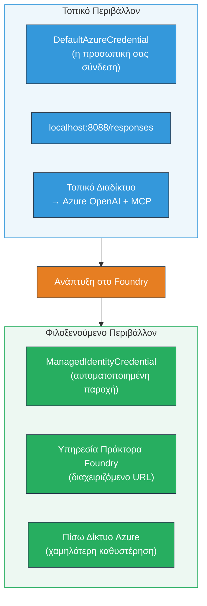

# Module 7 - Επαλήθευση στο Playground

Σε αυτό το module, δοκιμάζετε τη λειτουργία πολλαπλών πρακτόρων που έχετε αναπτύξει τόσο στο **VS Code** όσο και στο **[Foundry Portal](https://ai.azure.com)**, επιβεβαιώνοντας ότι ο πράκτορας συμπεριφέρεται με τον ίδιο τρόπο όπως στο τοπικό τεστ.

---

## Γιατί να επαληθεύσω μετά την ανάπτυξη;

Η λειτουργία πολλαπλών πρακτόρων λειτούργησε άψογα τοπικά, οπότε γιατί να δοκιμάσετε ξανά; Το φιλοξενούμενο περιβάλλον διαφέρει σε αρκετά σημεία:


| Διαφορά | Τοπικά | Φιλοξενούμενο |
|-----------|-------|--------|
| **Ταυτότητα** | [`DefaultAzureCredential`](https://learn.microsoft.com/azure/developer/python/sdk/authentication/credential-chains#defaultazurecredential-overview) (προσωπική σύνδεση) | [`ManagedIdentityCredential`](https://learn.microsoft.com/python/api/overview/azure/identity-readme#managed-identity-support) (αυτόματη παροχή) |
| **Τερματικό σημείο** | `http://localhost:8088/responses` | [Foundry Agent Service](https://learn.microsoft.com/azure/foundry/agents/concepts/hosted-agents) τερματικό σημείο (διαχειριζόμενο URL) |
| **Δίκτυο** | Τοπικός υπολογιστής → Azure OpenAI + MCP εξερχόμενα | Υποδομή Azure (χαμηλότερη καθυστέρηση μεταξύ υπηρεσιών) |
| **Συνδεσιμότητα MCP** | Τοπικό διαδίκτυο → `learn.microsoft.com/api/mcp` | Εξερχόμενο κοντέινερ → `learn.microsoft.com/api/mcp` |

Εάν έχει ρυθμιστεί λανθασμένα κάποια μεταβλητή περιβάλλοντος, το RBAC διαφέρει, ή το εξερχόμενο MCP είναι μπλοκαρισμένο, θα το εντοπίσετε εδώ.

---

## Επιλογή Α: Δοκιμή στο VS Code Playground (συνιστάται πρώτα)

Η [Foundry επέκταση](https://marketplace.visualstudio.com/items?itemName=TeamsDevApp.vscode-ai-foundry) περιλαμβάνει ένα ενσωματωμένο Playground που σας επιτρέπει να συνομιλείτε με τον αναπτυγμένο πράκτορά σας χωρίς να φύγετε από το VS Code.

### Βήμα 1: Μεταβείτε στον φιλοξενούμενο πράκτορά σας

1. Κάντε κλικ στο εικονίδιο **Microsoft Foundry** στη **Γραμμή Δραστηριότητας** του VS Code (αριστερό πλαϊνό μενού) για να ανοίξετε τον πίνακα Foundry.
2. Αναπτύξτε το συνδεδεμένο έργο σας (π.χ., `workshop-agents`).
3. Αναπτύξτε **Hosted Agents (Preview)**.
4. Θα δείτε το όνομα του πράκτορα σας (π.χ., `resume-job-fit-evaluator`).

### Βήμα 2: Επιλέξτε μια έκδοση

1. Κάντε κλικ στο όνομα του πράκτορα για να ανοίξετε τις εκδόσεις του.
2. Κάντε κλικ στην έκδοση που αναπτύξατε (π.χ., `v1`).
3. Ανοίγει ένας **πίνακας λεπτομερειών** που δείχνει τις λεπτομέρειες του κοντέινερ.
4. Επιβεβαιώστε ότι η κατάσταση είναι **Started** ή **Running**.

### Βήμα 3: Ανοίξτε το Playground

1. Στον πίνακα λεπτομερειών, κάντε κλικ στο κουμπί **Playground** (ή δεξί κλικ στην έκδοση → **Open in Playground**).
2. Ανοίγει μια διεπαφή συνομιλίας σε καρτέλα του VS Code.

### Βήμα 4: Εκτελέστε τα smoke tests σας

Χρησιμοποιήστε τα ίδια 3 τεστ από το [Module 5](05-test-locally.md). Πληκτρολογήστε κάθε μήνυμα στο πλαίσιο εισόδου του Playground και πατήστε **Send** (ή **Enter**).

#### Τεστ 1 - Πλήρες βιογραφικό + JD (τυπική ροή)

Επικολλήστε το πλήρες σενάριο βιογραφικού + JD από το Module 5, Τεστ 1 (Jane Doe + Senior Cloud Engineer στην Contoso Ltd).

**Αναμενόμενο:**
- Βαθμολογία καταλληλότητας με μαθηματική ανάλυση (κλίμακα 100 πόντων)
- Ενότητα ταιριασμένων δεξιοτήτων
- Ενότητα ελλειπουσών δεξιοτήτων
- **Μία κάρτα κενών ανά ελλειπούσα δεξιότητα** με URLs από το Microsoft Learn
- Οδικός χάρτης μάθησης με χρονοδιάγραμμα

#### Τεστ 2 - Γρήγορο σύντομο τεστ (ελάχιστη είσοδος)

```
RESUME: 3 years Python developer, knows Django and PostgreSQL, no cloud experience.

JOB: Cloud DevOps Engineer requiring AWS, Kubernetes, Terraform, CI/CD. 5 years needed.
```

**Αναμενόμενο:**
- Χαμηλότερη βαθμολογία καταλληλότητας (< 40)
- Ειλικρινής αξιολόγηση με σταδιακό πλάνο μάθησης
- Πολλαπλές κάρτες κενών (AWS, Kubernetes, Terraform, CI/CD, κενό εμπειρίας)

#### Τεστ 3 - Υψηλά κατάλληλος υποψήφιος

```
RESUME:
10 years Azure Cloud Architect. AZ-305 certified. Expert in AKS, Terraform, Azure DevOps, 
Azure Functions, Helm, Prometheus, Grafana, Python, Go. Led platform team of 8.

JOB:
Senior Cloud Engineer. Required: AKS, Terraform, Azure DevOps, Python. Preferred: Helm, Go.
5+ years experience. AZ-305 preferred.
```

**Αναμενόμενο:**
- Υψηλή βαθμολογία καταλληλότητας (≥ 80)
- Εστίαση στην ετοιμότητα συνέντευξης και βελτίωση
- Λίγες ή καμία κάρτα κενών
- Σύντομο χρονοδιάγραμμα με επίκεντρο την προετοιμασία

### Βήμα 5: Συγκρίνετε με τα τοπικά αποτελέσματα

Ανοίξτε τις σημειώσεις σας ή την καρτέλα browser από το Module 5 όπου αποθηκεύσατε τις τοπικές απαντήσεις. Για κάθε τεστ:

- Η απάντηση έχει την **ίδια δομή** (βαθμολογία καταλληλότητας, κάρτες κενών, οδικός χάρτης);
- Ακολουθεί την **ίδια κλίμακα βαθμολόγησης** (ανάλυση 100 πόντων);
- Υπάρχουν **URLs Microsoft Learn** ακόμη στις κάρτες κενών;
- Υπάρχει **μία κάρτα κενών ανά ελλειπούσα δεξιότητα** (όχι κομμένη);

> **Μικρές διαφορές στη διατύπωση είναι φυσιολογικές** - το μοντέλο είναι μη-καθοριστικό. Επικεντρωθείτε στη δομή, στη συνέπεια βαθμολόγησης και στη χρήση εργαλείων MCP.

---

## Επιλογή Β: Δοκιμή στο Foundry Portal

Το [Foundry Portal](https://ai.azure.com) παρέχει ένα διαδικτυακό playground χρήσιμο για κοινή χρήση με συναδέλφους ή ενδιαφερόμενους.

### Βήμα 1: Ανοίξτε το Foundry Portal

1. Ανοίξτε το πρόγραμμα περιήγησης και μεταβείτε στο [https://ai.azure.com](https://ai.azure.com).
2. Συνδεθείτε με τον ίδιο λογαριασμό Azure που χρησιμοποιείτε καθ’ όλη τη διάρκεια του εργαστηρίου.

### Βήμα 2: Μεταβείτε στο έργο σας

1. Στην αρχική σελίδα, κοιτάξτε στα αριστερά για **Πρόσφατα έργα**.
2. Κάντε κλικ στο όνομα του έργου σας (π.χ., `workshop-agents`).
3. Αν δεν το βλέπετε, κάντε κλικ στα **Όλα τα έργα** και αναζητήστε το.

### Βήμα 3: Βρείτε τον αναπτυγμένο πράκτορά σας

1. Στην αριστερή πλοήγηση έργου, κάντε κλικ στο **Build** → **Agents** (ή αναζητήστε την ενότητα **Agents**).
2. Θα δείτε μια λίστα με πράκτορες. Βρείτε τον αναπτυγμένο πράκτορα σας (π.χ., `resume-job-fit-evaluator`).
3. Κάντε κλικ στο όνομα του πράκτορα για να ανοίξετε τη σελίδα λεπτομερειών.

### Βήμα 4: Ανοίξτε το Playground

1. Στη σελίδα λεπτομερειών του πράκτορα, κοιτάξτε στη γραμμή εργαλείων στο πάνω μέρος.
2. Κάντε κλικ στο **Open in playground** (ή **Try in playground**).
3. Ανοίγει μια διεπαφή συνομιλίας.

### Βήμα 5: Εκτελέστε τα ίδια smoke tests

Επαναλάβετε όλα τα 3 τεστ από την ενότητα Playground VS Code παραπάνω. Συγκρίνετε κάθε απάντηση με τα τοπικά αποτελέσματα (Module 5) και τα αποτελέσματα του VS Code Playground (Επιλογή Α).

---

## Ειδική επαλήθευση για πολλαπλούς πράκτορες

Πέρα από τη βασική ορθότητα, επαληθεύστε τις παρακάτω συμπεριφορές ειδικές για πολλαπλούς πράκτορες:

### Εκτέλεση εργαλείου MCP

| Έλεγχος | Πώς να επαληθεύσετε | Προϋπόθεση επιτυχίας |
|-------|---------------|----------------|
| Επιτυχία κλήσεων MCP | Οι κάρτες κενών περιέχουν URLs `learn.microsoft.com` | Πραγματικά URLs, όχι μηνύματα εφεδρείας |
| Πολλαπλές κλήσεις MCP | Κάθε κενό υψηλής/μεσαίας προτεραιότητας έχει πόρους | Όχι μόνο η πρώτη κάρτα κενών |
| Λειτουργία εφεδρείας MCP | Αν λείπουν URLs, ελέγξτε για κείμενο εφεδρείας | Ο πράκτορας παράγει ακόμα κάρτες κενών (με ή χωρίς URLs) |

### Συντονισμός πρακτόρων

| Έλεγχος | Πώς να επαληθεύσετε | Προϋπόθεση επιτυχίας |
|-------|---------------|----------------|
| Όλοι οι 4 πράκτορες εκτελέστηκαν | Η έξοδος έχει βαθμό καταλληλότητας ΚΑΙ κάρτες κενών | Βαθμός από MatchingAgent, κάρτες από GapAnalyzer |
| Παράλληλη εκτέλεση | Ο χρόνος απόκρισης είναι λογικός (< 2 λεπτά) | Αν> 3 λεπτά, μπορεί να μην λειτουργεί η παράλληλη εκτέλεση |
| Ακεραιότητα ροής δεδομένων | Οι κάρτες κενών αναφέρουν δεξιότητες από την αναφορά ταιριάσματος | Δεν υπάρχουν φανταστικές δεξιότητες που δεν υπάρχουν στο JD |

---

## Κλίμακα επικύρωσης

Χρησιμοποιήστε αυτή την κλίμακα για να αξιολογήσετε τη συμπεριφορά της λειτουργίας πολλαπλών πρακτόρων στο φιλοξενούμενο περιβάλλον:

| # | Κριτήριο | Προϋπόθεση επιτυχίας | Επιτυχία? |
|---|----------|---------------|-------|
| 1 | **Λειτουργική ορθότητα** | Ο πράκτορας απαντά σε βιογραφικό + JD με βαθμό καταλληλότητας και ανάλυση κενών | |
| 2 | **Συνέπεια βαθμολόγησης** | Ο βαθμός καταλληλότητας χρησιμοποιεί κλίμακα 100 πόντων με ανάλυση | |
| 3 | **Πληρότητα κάρτας κενών** | Μία κάρτα ανά ελλειπούσα δεξιότητα (όχι κομμένη ή συνδυασμένη) | |
| 4 | **Ενσωμάτωση εργαλείου MCP** | Οι κάρτες κενών περιλαμβάνουν πραγματικά URLs Microsoft Learn | |
| 5 | **Δομική συνέπεια** | Η δομή εξόδου ταιριάζει μεταξύ τοπικών και φιλοξενούμενων εκτελέσεων | |
| 6 | **Χρόνος απόκρισης** | Ο φιλοξενούμενος πράκτορας ανταποκρίνεται μέσα σε 2 λεπτά για πλήρη αξιολόγηση | |
| 7 | **Χωρίς σφάλματα** | Δεν υπάρχουν σφάλματα HTTP 500, χρονικά όρια ή κενές απαντήσεις | |

> «Επιτυχία» σημαίνει ότι πληρούνται και τα 7 κριτήρια και για τα 3 smoke tests σε τουλάχιστον ένα playground (VS Code ή Portal).

---

## Αντιμετώπιση προβλημάτων Playground

| Σύμπτωμα | Πιθανή αιτία | Διόρθωση |
|---------|-------------|-----|
| Το Playground δεν φορτώνει | Η κατάσταση κοντέινερ δεν είναι "Started" | Επιστρέψτε στο [Module 6](06-deploy-to-foundry.md), επιβεβαιώστε την κατάσταση ανάπτυξης. Περιμένετε αν είναι "Pending" |
| Ο πράκτορας επιστρέφει κενή απάντηση | Όνομα ανάπτυξης μοντέλου δεν ταιριάζει | Ελέγξτε το `agent.yaml` → `environment_variables` → `MODEL_DEPLOYMENT_NAME` να ταιριάζει με το αναπτυγμένο μοντέλο |
| Ο πράκτορας επιστρέφει μήνυμα σφάλματος | Λείπει δικαίωμα [RBAC](https://learn.microsoft.com/azure/foundry/concepts/rbac-foundry) | Αντιστοιχίστε **[Azure AI User](https://aka.ms/foundry-ext-project-role)** στο scope του έργου |
| Δεν υπάρχουν URLs Microsoft Learn στις κάρτες κενών | Το εξερχόμενο MCP είναι μπλοκαρισμένο ή ο διακομιστής MCP μη διαθέσιμος | Ελέγξτε αν το κοντέινερ μπορεί να φτάσει στο `learn.microsoft.com`. Δείτε [Module 8](08-troubleshooting.md) |
| Μόνο 1 κάρτα κενών (κομμένη) | Λείπουν οδηγίες "CRITICAL" στο GapAnalyzer | Ανασκόπηση [Module 3, Step 2.4](03-configure-agents.md) |
| Η βαθμολογία καταλληλότητας διαφέρει σημαντικά από το τοπικό | Διαφορετικό μοντέλο ή οδηγίες αναπτύχθηκαν | Συγκρίνετε τις env vars του `agent.yaml` με το τοπικό `.env`. Αναπτύξτε ξανά αν χρειάζεται |
| "Agent not found" στο Portal | Η ανάπτυξη βρίσκεται σε εξέλιξη ή απέτυχε | Περιμένετε 2 λεπτά, ανανεώστε. Αν λείπει ακόμα, αναπτύξτε ξανά από [Module 6](06-deploy-to-foundry.md) |

---

### Σημείο ελέγχου

- [ ] Δοκιμασμένος πράκτορας στο VS Code Playground - όλα τα 3 smoke tests πέρασαν
- [ ] Δοκιμασμένος πράκτορας στο [Foundry Portal](https://ai.azure.com) Playground - όλα τα 3 smoke tests πέρασαν
- [ ] Οι απαντήσεις είναι δομικά συνεπείς με την τοπική δοκιμή (βαθμός καταλληλότητας, κάρτες κενών, οδικός χάρτης)
- [ ] Υπάρχουν URLs Microsoft Learn στις κάρτες κενών (εργαλείο MCP λειτουργεί σε φιλοξενούμενο περιβάλλον)
- [ ] Μία κάρτα κενών ανά ελλειπούσα δεξιότητα (χωρίς κοπή)
- [ ] Χωρίς σφάλματα ή χρονικά όρια κατά τις δοκιμές
- [ ] Ολοκληρωμένη κλίμακα επικύρωσης (όλα τα 7 κριτήρια πληρούνται)

---

**Προηγούμενο:** [06 - Deploy to Foundry](06-deploy-to-foundry.md) · **Επόμενο:** [08 - Troubleshooting →](08-troubleshooting.md)

---

<!-- CO-OP TRANSLATOR DISCLAIMER START -->
**Απόρριψη ευθυνών**:  
Αυτό το έγγραφο έχει μεταφραστεί χρησιμοποιώντας την υπηρεσία αυτόματης μετάφρασης AI [Co-op Translator](https://github.com/Azure/co-op-translator). Ενώ καταβάλλουμε προσπάθεια για ακρίβεια, παρακαλούμε να έχετε υπόψη ότι οι αυτόματες μεταφράσεις ενδέχεται να περιέχουν λάθη ή ανακρίβειες. Το πρωτότυπο έγγραφο στη μητρική του γλώσσα πρέπει να θεωρείται η αυθεντική πηγή. Για κρίσιμες πληροφορίες, συνιστάται επαγγελματική ανθρώπινη μετάφραση. Δεν φέρουμε ευθύνη για τυχόν παρεξηγήσεις ή λανθασμένες ερμηνείες που προκύπτουν από τη χρήση αυτής της μετάφρασης.
<!-- CO-OP TRANSLATOR DISCLAIMER END -->