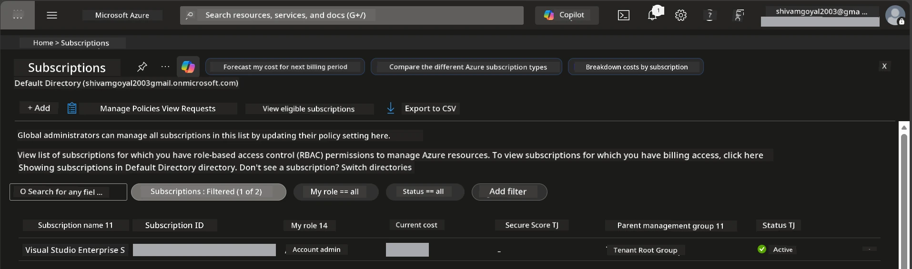

# Module 0 - Prerequisites

Before starting the workshop, confirm you have the following tools, access, and environment ready. Follow every step below - do not skip ahead.

---

## 1. Azure account & subscription

### 1.1 Create or verify your Azure subscription

1. Open a browser and navigate to [https://azure.microsoft.com/free/](https://azure.microsoft.com/free/).
2. If you don't have an Azure account, click **Start free** and follow the sign-up flow. You'll need a Microsoft account (or create one) and a credit card for identity verification.
3. If you already have an account, sign in at [https://portal.azure.com](https://portal.azure.com).
4. In the Portal, click the **Subscriptions** blade in the left navigation (or search "Subscriptions" in the top search bar).
5. Verify you see at least one **Active** subscription. Note down the **Subscription ID** - you'll need it later.



### 1.2 Understand the required RBAC roles

[Hosted Agent](https://learn.microsoft.com/azure/foundry/agents/concepts/hosted-agents) deployment requires **data action** permissions that standard Azure `Owner` and `Contributor` roles do **not** include. You will need one of these [role combinations](https://learn.microsoft.com/azure/foundry/concepts/rbac-foundry#built-in-roles):

| Scenario | Required roles | Where to assign them |
|----------|---------------|----------------------|
| Create new Foundry project | **Azure AI Owner** on Foundry resource | Foundry resource in Azure Portal |
| Deploy to existing project (new resources) | **Azure AI Owner** + **Contributor** on subscription | Subscription + Foundry resource |
| Deploy to fully configured project | **Reader** on account + **Azure AI User** on project | Account + Project in Azure Portal |

> **Key point:** Azure `Owner` and `Contributor` roles only cover *management* permissions (ARM operations). You need [**Azure AI User**](https://learn.microsoft.com/azure/foundry/concepts/rbac-foundry#built-in-roles) (or higher) for *data actions* like `agents/write` which is required to create and deploy agents. You'll assign these roles in [Module 2](02-create-foundry-project.md).

---

## 2. Install local tools

Install each tool below. After installing, verify it works by running the check command.

### 2.1 Visual Studio Code

1. Go to [https://code.visualstudio.com/](https://code.visualstudio.com/).
2. Download the installer for your OS (Windows/macOS/Linux).
3. Run the installer with default settings.
4. Open VS Code to confirm it launches.

### 2.2 Python 3.10+

1. Go to [https://www.python.org/downloads/](https://www.python.org/downloads/).
2. Download Python 3.10 or later (3.12+ recommended).
3. **Windows:** During installation, check **"Add Python to PATH"** on the first screen.
4. Open a terminal and verify:

   ```powershell
   python --version
   ```

   Expected output: `Python 3.10.x` or higher.

### 2.3 Azure CLI

1. Go to [https://learn.microsoft.com/cli/azure/install-azure-cli](https://learn.microsoft.com/cli/azure/install-azure-cli).
2. Follow the install instructions for your OS.
3. Verify:

   ```powershell
   az --version
   ```

   Expected: `azure-cli 2.80.0` or higher.

4. Sign in:

   ```powershell
   az login
   ```

### 2.4 Azure Developer CLI (azd)

1. Go to [https://learn.microsoft.com/azure/developer/azure-developer-cli/install-azd](https://learn.microsoft.com/azure/developer/azure-developer-cli/install-azd).
2. Follow the install instructions for your OS. On Windows:

   ```powershell
   winget install microsoft.azd
   ```

3. Verify:

   ```powershell
   azd version
   ```

   Expected: `azd version 1.x.x` or higher.

4. Sign in:

   ```powershell
   azd auth login
   ```

### 2.5 Docker Desktop (optional)

Docker is only needed if you want to build and test the container image locally before deployment. The Foundry extension handles container builds during deployment automatically.

1. Go to [https://docs.docker.com/get-docker/](https://docs.docker.com/get-docker/).
2. Download and install Docker Desktop for your OS.
3. **Windows:** Ensure the WSL 2 backend is selected during installation.
4. Start Docker Desktop and wait for the icon in the system tray to show **"Docker Desktop is running"**.
5. Open a terminal and verify:

   ```powershell
   docker info
   ```

   This should print Docker system info without errors. If you see `Cannot connect to the Docker daemon`, wait a few more seconds for Docker to fully start.

---

## 3. Install VS Code extensions

You need three extensions. Install them **before** the workshop begins.

### 3.1 Microsoft Foundry for VS Code

1. Open VS Code.
2. Press `Ctrl+Shift+X` to open the Extensions panel.
3. In the search box, type **"Microsoft Foundry"**.
4. Find **Microsoft Foundry for Visual Studio Code** (publisher: Microsoft, ID: `TeamsDevApp.vscode-ai-foundry`).
5. Click **Install**.
6. After installation, you should see the **Microsoft Foundry** icon appear in the Activity Bar (left sidebar).

### 3.2 Foundry Toolkit

1. In the Extensions panel (`Ctrl+Shift+X`), search for **"Foundry Toolkit"**.
2. Find **Foundry Toolkit** (publisher: Microsoft, ID: `ms-windows-ai-studio.windows-ai-studio`).
3. Click **Install**.
4. The **Foundry Toolkit** icon should appear in the Activity Bar.

### 3.3 Python

1. In the Extensions panel, search for **"Python"**.
2. Find **Python** (publisher: Microsoft, ID: `ms-python.python`).
3. Click **Install**.

---

## 4. Sign into Azure from VS Code

The [Microsoft Agent Framework](https://learn.microsoft.com/agent-framework/overview/) uses [`DefaultAzureCredential`](https://learn.microsoft.com/azure/developer/python/sdk/authentication/credential-chains#defaultazurecredential-overview) for authentication. You need to be signed into Azure in VS Code.

### 4.1 Sign in via VS Code

1. Look at the bottom-left corner of VS Code and click the **Accounts** icon (person silhouette).
2. Click **Sign in to use Microsoft Foundry** (or **Sign in with Azure**).
3. A browser window opens - sign in with the Azure account that has access to your subscription.
4. Return to VS Code. You should see your account name in the bottom-left.

### 4.2 (Optional) Sign in via Azure CLI

If you installed the Azure CLI and prefer CLI-based auth:

```powershell
az login
```

This opens a browser for sign-in. After signing in, set the correct subscription:

```powershell
az account set --subscription "<your-subscription-id>"
```

Verify:

```powershell
az account show --query "{name:name, id:id, state:state}" --output table
```

You should see your subscription name, ID, and state = `Enabled`.

### 4.3 (Alternative) Service principal auth

For CI/CD or shared environments, set these environment variables instead:

```powershell
$env:AZURE_TENANT_ID = "<your-tenant-id>"
$env:AZURE_CLIENT_ID = "<your-client-id>"
$env:AZURE_CLIENT_SECRET = "<your-client-secret>"
```

---

## 5. Preview limitations

Before proceeding, be aware of current limitations:

- [**Hosted Agents**](https://learn.microsoft.com/azure/foundry/agents/concepts/hosted-agents) are currently in **public preview** - not recommended for production workloads.
- **Supported regions are limited** - check [region availability](https://learn.microsoft.com/azure/foundry/agents/concepts/hosted-agents#region-availability) before creating resources. If you pick an unsupported region, deployment will fail.
- The `azure-ai-agentserver-agentframework` package is pre-release (`1.0.0b16`) - APIs may change.
- Scale limits: hosted agents support 0-5 replicas (including scale-to-zero).

---

## 6. Preflight checklist

Run through every item below. If any step fails, go back and fix it before continuing.

- [ ] VS Code opens with no errors
- [ ] Python 3.10+ is on your PATH (`python --version` prints `3.10.x` or higher)
- [ ] Azure CLI is installed (`az --version` prints `2.80.0` or higher)
- [ ] Azure Developer CLI is installed (`azd version` prints version info)
- [ ] Microsoft Foundry extension is installed (icon visible in Activity Bar)
- [ ] Foundry Toolkit extension is installed (icon visible in Activity Bar)
- [ ] Python extension is installed
- [ ] You are signed into Azure in VS Code (check Accounts icon, bottom-left)
- [ ] `az account show` returns your subscription
- [ ] (Optional) Docker Desktop is running (`docker info` returns system info without errors)

### Checkpoint

Open VS Code's Activity Bar and confirm you can see both the **Foundry Toolkit** and **Microsoft Foundry** sidebar views. Click each one to verify they load without errors.

---

**Next:** [01 - Install Foundry Toolkit & Foundry Extension →](01-install-foundry-toolkit.md)

---

<!-- CO-OP TRANSLATOR DISCLAIMER START -->
**Disclaimer**:
This document has been translated using AI translation service [Co-op Translator](https://github.com/Azure/co-op-translator). While we strive for accuracy, please be aware that automated translations may contain errors or inaccuracies. The original document in its native language should be considered the authoritative source. For critical information, professional human translation is recommended. We are not liable for any misunderstandings or misinterpretations arising from the use of this translation.
<!-- CO-OP TRANSLATOR DISCLAIMER END -->