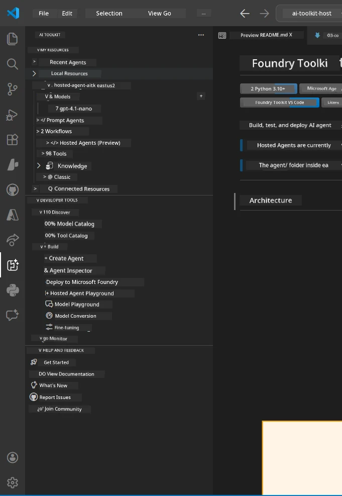
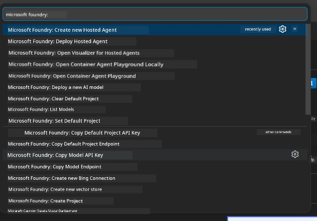

# Module 1 - Install Foundry Toolkit & Foundry Extension

This module walks you through installing and verifying the two key VS Code extensions for this workshop. If you already installed them during [Module 0](00-prerequisites.md), use this module to verify they are working correctly.

---

## Step 1: Install the Microsoft Foundry Extension

The **Microsoft Foundry for VS Code** extension is your main tool for creating Foundry projects, deploying models, scaffolding hosted agents, and deploying directly from VS Code.

1. Open VS Code.
2. Press `Ctrl+Shift+X` to open the **Extensions** panel.
3. In the search box at the top, type: **Microsoft Foundry**
4. Look for the result titled **Microsoft Foundry for Visual Studio Code**.
   - Publisher: **Microsoft**
   - Extension ID: `TeamsDevApp.vscode-ai-foundry`
5. Click the **Install** button.
6. Wait for the installation to complete (you'll see a small progress indicator).
7. After installation, look at the **Activity Bar** (the vertical icon bar on the left side of VS Code). You should see a new **Microsoft Foundry** icon (looks like a diamond/AI icon).
8. Click the **Microsoft Foundry** icon to open its sidebar view. You should see sections for:
   - **Resources** (or Projects)
   - **Agents**
   - **Models**

> **If the icon doesn't appear:** Try reloading VS Code (`Ctrl+Shift+P` → `Developer: Reload Window`).

---

## Step 2: Install the Foundry Toolkit Extension

The **Foundry Toolkit** extension provides the [**Agent Inspector**](https://learn.microsoft.com/azure/foundry/agents/how-to/vs-code-agents-workflow-pro-code) - a visual interface for testing and debugging agents locally - plus playground, model management, and evaluation tools.

1. In the Extensions panel (`Ctrl+Shift+X`), clear the search box and type: **Foundry Toolkit**
2. Find **Foundry Toolkit** in the results.
   - Publisher: **Microsoft**
   - Extension ID: `ms-windows-ai-studio.windows-ai-studio`
3. Click **Install**.
4. After installation, the **Foundry Toolkit** icon appears in the Activity Bar (looks like a robot/sparkle icon).
5. Click the **Foundry Toolkit** icon to open its sidebar view. You should see the Foundry Toolkit welcome screen with options for:
   - **Models**
   - **Playground**
   - **Agents**

---

## Step 3: Verify both extensions are working

### 3.1 Verify Microsoft Foundry Extension

1. Click the **Microsoft Foundry** icon in the Activity Bar.
2. If you're signed into Azure (from Module 0), you should see your projects listed under **Resources**.
3. If prompted to sign in, click **Sign in** and follow the authentication flow.
4. Confirm you can see the sidebar without errors.

### 3.2 Verify Foundry Toolkit Extension

1. Click the **Foundry Toolkit** icon in the Activity Bar.
2. Confirm the welcome view or main panel loads without errors.
3. You don't need to configure anything yet - we'll use the Agent Inspector in [Module 5](05-test-locally.md).

### 3.3 Verify via Command Palette

1. Press `Ctrl+Shift+P` to open the Command Palette.
2. Type **"Microsoft Foundry"** - you should see commands like:
   - `Microsoft Foundry: Create a New Hosted Agent`
   - `Microsoft Foundry: Deploy Hosted Agent`
   - `Microsoft Foundry: Open Model Catalog`
3. Press `Escape` to close the Command Palette.
4. Open the Command Palette again and type **"Foundry Toolkit"** - you should see commands like:
   - `Foundry Toolkit: Open Agent Inspector`

> If you don't see these commands, the extensions may not be installed correctly. Try uninstalling and reinstalling them.

---

## What these extensions do in this workshop

| Extension | What it does | When you'll use it |
|-----------|-------------|-------------------|
| **Microsoft Foundry for VS Code** | Create Foundry projects, deploy models, **scaffold [hosted agents](https://learn.microsoft.com/azure/foundry/agents/concepts/hosted-agents)** (auto-generates `agent.yaml`, `main.py`, `Dockerfile`, `requirements.txt`), deploy to [Foundry Agent Service](https://learn.microsoft.com/azure/foundry/agents/overview) | Modules 2, 3, 6, 7 |
| **Foundry Toolkit** | Agent Inspector for local testing/debugging, playground UI, model management | Modules 5, 7 |

> **The Foundry extension is the most critical tool in this workshop.** It handles the end-to-end lifecycle: scaffold → configure → deploy → verify. The Foundry Toolkit complements it by providing the visual Agent Inspector for local testing.

---

### Checkpoint

- [ ] Microsoft Foundry icon is visible in the Activity Bar
- [ ] Clicking it opens the sidebar without errors
- [ ] Foundry Toolkit icon is visible in the Activity Bar
- [ ] Clicking it opens the sidebar without errors
- [ ] `Ctrl+Shift+P` → typing "Microsoft Foundry" shows available commands
- [ ] `Ctrl+Shift+P` → typing "Foundry Toolkit" shows available commands

---

**Previous:** [00 - Prerequisites](00-prerequisites.md) · **Next:** [02 - Create Foundry Project →](02-create-foundry-project.md)

---

<!-- CO-OP TRANSLATOR DISCLAIMER START -->
**Disclaimer**:
This document has been translated using AI translation service [Co-op Translator](https://github.com/Azure/co-op-translator). While we strive for accuracy, please be aware that automated translations may contain errors or inaccuracies. The original document in its native language should be considered the authoritative source. For critical information, professional human translation is recommended. We are not liable for any misunderstandings or misinterpretations arising from the use of this translation.
<!-- CO-OP TRANSLATOR DISCLAIMER END -->