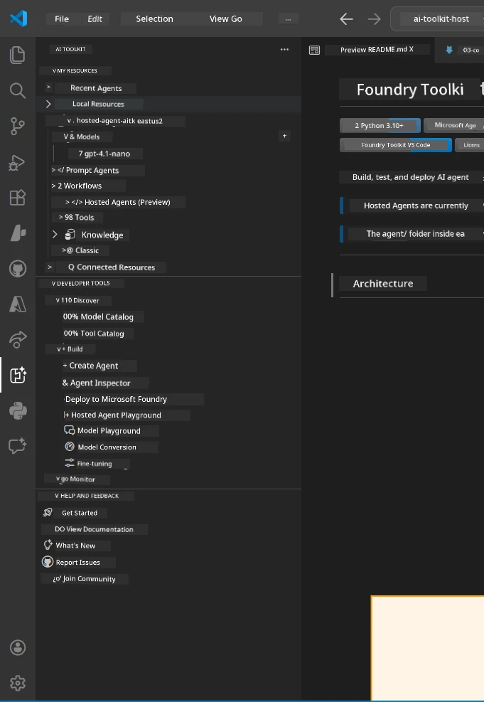
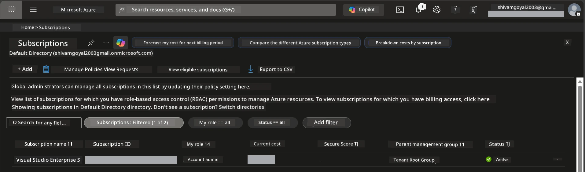
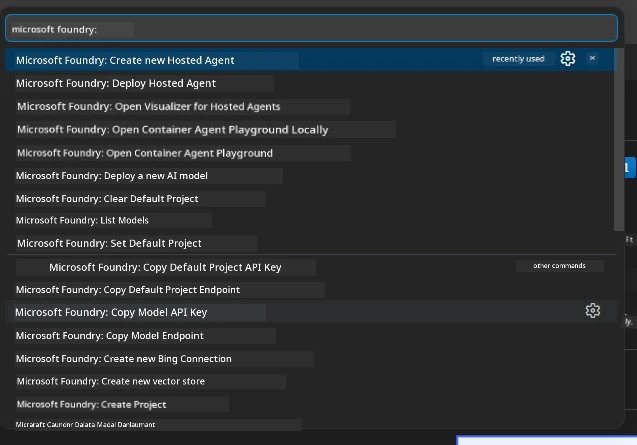
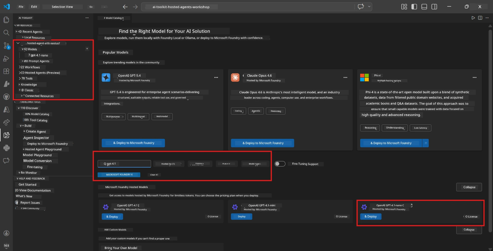
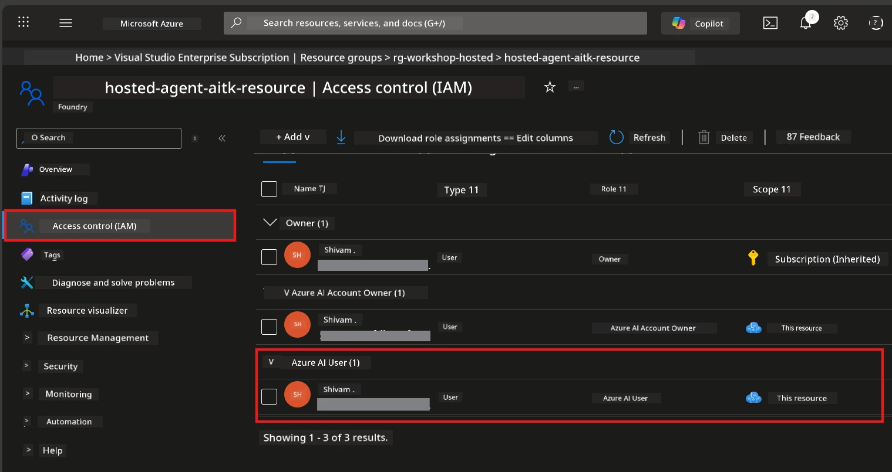

# Setup: Extension, Project & Model

⏱️ ~15 min

In this module, you install and verify the Foundry Toolkit extension, create (or connect to) a Foundry project, and deploy a model your agent will use.

## Step 1: Install Foundry Toolkit

**Foundry Toolkit for VS Code** is the primary extension for this workshop. It provides project creation, model deployment, agent scaffolding, local testing (Agent Inspector), and cloud deployment - all from VS Code.

1. Open VS Code then press `Ctrl+Shift+X` to open the **Extensions** panel.
2. Search for **Foundry Toolkit**.
3. Install **Foundry Toolkit for VS Code** (Publisher: Microsoft, ID: `ms-windows-ai-studio.windows-ai-studio`).
4. After installation, the **Foundry Toolkit** icon appears in the Activity Bar (left sidebar).

> *Note: The Activity Bar may display "AI TOOLKIT" in older extension versions. The functionality is identical.*



## Step 2: Set up based on your access

> **Choose your path:** Expand the section below that matches your setup. You only need to complete **one** path.

<details>
<summary><strong>🅰️ Path A - Azure cloud (requires Azure subscription)</strong></summary>

### Azure CLI

1. Install from [learn.microsoft.com/cli/azure/install-azure-cli](https://learn.microsoft.com/cli/azure/install-azure-cli).
2. Verify: `az --version` (expect 2.80.0+).
3. Sign in: `az login`

### Authentication Options

The [Microsoft Agent Framework](https://learn.microsoft.com/agent-framework/overview/) uses [`DefaultAzureCredential`](https://learn.microsoft.com/azure/developer/python/sdk/authentication/credential-chains#defaultazurecredential-overview) which tries multiple authentication methods in order. Choose the one that fits your environment:

#### Option 1: VS Code Accounts (recommended for workshops)
1. Click the **Accounts** icon (person silhouette) in the bottom-left corner of VS Code.
2. Select **Sign in to use Microsoft Foundry** (or **Sign in with Azure**).
3. A browser opens - sign in with the Azure account that has access to your subscription.
4. Return to VS Code. You should see your account name in the bottom-left.

#### Option 2: Azure CLI
```bash
az login
az account set --subscription "<your-subscription-id>"
```

#### Option 3: Service Principal (Enterprise/CI)
For locked-down environments or CI/CD pipelines, set these environment variables in your `.env` file:
```env
AZURE_TENANT_ID=<your-tenant-id>
AZURE_CLIENT_ID=<your-client-id>
AZURE_CLIENT_SECRET=<your-client-secret>
```

> **How `DefaultAzureCredential` works:** It tries environment variables first, then managed identity, then VS Code sign-in, then Azure CLI - and uses whichever succeeds first. See [credential chain docs](https://learn.microsoft.com/azure/developer/python/sdk/authentication/credential-chains#defaultazurecredential-overview).

### Azure Developer CLI (azd)

1. Install: `winget install microsoft.azd` (Windows) or see [install docs](https://learn.microsoft.com/azure/developer/azure-developer-cli/install-azd).
2. Verify: `azd version`
3. Sign in: `azd auth login`

### Docker Desktop (optional)

Docker is only needed if you want to build containers locally. The Foundry extension handles builds automatically during deployment.

1. Install from [docs.docker.com/get-docker](https://docs.docker.com/get-docker/).
2. Verify: `docker info`

### Azure subscription & RBAC

1. Sign in at [portal.azure.com](https://portal.azure.com).
2. Navigate to **Subscriptions** and confirm at least one is **Active**.
3. Note your **Subscription ID** - you'll need it in Module 01.



#### RBAC Scenario Table

[Hosted Agent](https://learn.microsoft.com/azure/foundry/agents/concepts/hosted-agents) deployment requires **data action** permissions that standard Azure `Owner` and `Contributor` roles do **not** include. Use the table below to determine which roles you need:

| Scenario | Required roles | Where to assign them |
|----------|---------------|----------------------|
| Create new Foundry project | **Azure AI Owner** on Foundry resource | Foundry resource in Azure Portal |
| Deploy to existing project (new resources) | **Azure AI Owner** + **Contributor** on subscription | Subscription + Foundry resource |
| Deploy to fully configured project | **Reader** on account + **Azure AI User** on project | Account + Project in Azure Portal |
| Local testing only (no deployment) | **Azure AI User** on project | Project in Azure Portal |

> **Key point:** Azure `Owner` and `Contributor` roles only cover *management* permissions (ARM operations). You need [**Azure AI User**](https://learn.microsoft.com/azure/foundry/concepts/rbac-foundry#built-in-roles) (or higher) for *data actions* like `agents/write` which is required to create and deploy agents.

## Connect or create a Foundry project



1. Press `Ctrl+Shift+P` → type **Foundry Toolkit: Create Project** → select it.
2. Select your **Azure subscription** from the dropdown.
3. Select or create a **resource group** (e.g., `rg-hosted-agents-workshop`).
4. Select a **region** that supports hosted agents: `East US`, `West US 2`, or `Sweden Central`. See [region availability](https://learn.microsoft.com/azure/foundry/agents/concepts/hosted-agents#region-availability).
5. Enter a project name (e.g., `workshop-agents`).
6. Wait 2–5 minutes for provisioning. A progress notification appears in VS Code.
7. When complete, your project appears in the **Foundry Toolkit** sidebar under **MY RESOURCES**.


## Deploy a model & assign RBAC

Your hosted agent needs an AI model to generate responses.

#### Model Selection Matrix
Depending on your needs, you can choose from different model tiers:

| Model | Best for | Cost | Notes |
|-------|----------|------|-------|
| `gpt-4.1` | High-quality, nuanced responses | Higher | Best results, recommended for final testing |
| `gpt-4.1-mini/gpt-5-mini` | Fast iteration, lower cost | Lower | Good for workshop development and rapid testing |
| `gpt-4.1-nano` | Lightweight tasks | Lowest | Most cost-effective, but simpler responses |

1. Press `Ctrl+Shift+P` → **Foundry Toolkit: Open Model Catalog** (or click **Model Catalog** in the sidebar under DEVELOPER TOOLS → Discover).
2. Search for **gpt-4.1** in the catalog.
3. Find **OpenAI GPT-4.1-mini** (or `gpt-5-mini` for better quality) and click **Deploy**.



4. In the deployment configuration:
   - **Deployment name:** Leave the default or enter a custom name. **Remember this name.**
   - **Target:** Select **Deploy to Foundry Toolkit** → choose your project.
5. Click **Deploy** and wait 1–3 minutes.

> **Recommendation:** Use `gpt-4.1-mini/gpt-5-mini` for the workshop - fast, affordable, and produces good results.

### Note your values

After deployment, note these two values (you'll need them in Module 03):

| Value | Where to find it |
|-------|-----------------|
| **Project endpoint** | Click your project in the sidebar → detail view shows the URL (e.g., `https://<account>.services.ai.azure.com/api/projects/<project>`) |
| **Model deployment name** | Expand project → **Models** → the name next to your deployed model (e.g., `gpt-4.1-mini/gpt-5-mini`) |

### Assign RBAC role

> ⚠️ **This is the most commonly missed step.** Without the correct role, deployment in Module 05 will fail.

#### Which role do I need?
Depending on your scenario, you need the following role combinations:

| Scenario | Required roles | Where to assign them |
|----------|---------------|----------------------|
| Create new Foundry project | **Azure AI Owner** on Foundry resource | Foundry resource in Azure Portal |
| Deploy to existing project (new resources) | **Azure AI Owner** + **Contributor** on subscription | Subscription + Foundry resource |
| Deploy to fully configured project | **Reader** on account + **Azure AI User** on project | Account + Project in Azure Portal |

**Key point:** Azure `Owner` and `Contributor` roles only cover *management* permissions. You need **Azure AI User** (or higher) for *data actions* like `agents/write` required to create and deploy agents.

1. Open [portal.azure.com](https://portal.azure.com).
2. Search for your **Foundry project** name → click the result of type **"Foundry Toolkit project"** (NOT the parent account).
3. Click **Access control (IAM)** in the left navigation.
4. Click **+ Add** → **Add role assignment**.
5. **Role tab:** Search for **Azure AI User**, select it, click **Next**.
6. **Members tab:** Select **User, group, or service principal** → click **+ Select members** → find and select yourself → click **Select**.
7. Click **Review + assign** → **Review + assign** again.
8. **Wait 1–2 minutes** for propagation.

> **Why this role?** Azure `Owner`/`Contributor` only grant management permissions. The **Azure AI User** role grants the `agents/write` data action needed to create and deploy agents. See [Foundry RBAC docs](https://learn.microsoft.com/azure/foundry/concepts/rbac-foundry#built-in-roles).



</details>

<details>
<summary><strong>🅱️ Path B - Local / free-tier (no Azure subscription needed)</strong></summary>

### Foundry Local

Foundry Local lets you run AI models on your own machine - no cloud account needed. You can access Foundry Local models using Foundry Toolkit through the model catalog as follows:

1. Go to the Foundry Toolkit extension.
2. In the Foundry Toolkit navigation go to **Developer Tools** > and select **Model Catalog**
3. In the new window, select **local** from the navigation bar. 
4. Scroll down to **Phi 4 Mini,** and click the **add button** a pop up will appear indicating model is being downloaded.
5. Once the model is downloaded, you can proceed to the next step.

</details>

### ✅ Checkpoint


- [ ] `Ctrl+Shift+P` → "Foundry Toolkit" shows available commands
- [ ] Foundry Toolkit extension installed and sidebar loads without errors
- [ ] VS Code opens and runs correctly
- [ ] `python --version` shows 3.10+
- [ ] Foundry Toolkit icon visible in VS Code Activity Bar
- [ ] **Path A:** `az login` succeeds, subscription is Active
- [ ] **Path B:** Foundry Local is running (`foundry local status`)
- [ ] **Path A:** Foundry project visible in sidebar, model deployed, Azure AI User role assigned
- [ ] **Path B:** Foundry Local running with a model
- [ ] You have noted your **endpoint** and **model deployment name**


**Previous:** [00 - Prerequisites](00-prerequisites.md) · **Next:** [02 - Create Hosted Agent →](02-create-hosted-agent.md)

---

<!-- CO-OP TRANSLATOR DISCLAIMER START -->
**Disclaimer**:
This document has been translated using AI translation service [Co-op Translator](https://github.com/Azure/co-op-translator). While we strive for accuracy, please be aware that automated translations may contain errors or inaccuracies. The original document in its native language should be considered the authoritative source. For critical information, professional human translation is recommended. We are not liable for any misunderstandings or misinterpretations arising from the use of this translation.
<!-- CO-OP TRANSLATOR DISCLAIMER END -->