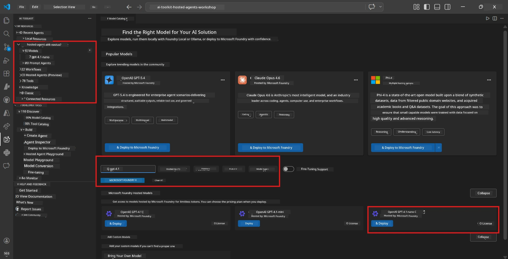

# Module 2 - Create a Foundry Project & Deploy a Model

In this module, you create (or select) a Microsoft Foundry project and deploy a model that your agent will use. Every step is written out explicitly - follow them in order.

> If you already have a Foundry project with a deployed model, skip to [Module 3](03-create-hosted-agent.md).

---

## Step 1: Create a Foundry project from VS Code

You'll use the Microsoft Foundry extension to create a project without leaving VS Code.

1. Press `Ctrl+Shift+P` to open the **Command Palette**.
2. Type: **Microsoft Foundry: Create Project** and select it.
3. A dropdown appears - select your **Azure subscription** from the list.
4. You'll be asked to select or create a **resource group**:
   - To create a new one: type a name (e.g., `rg-hosted-agents-workshop`) and press Enter.
   - To use an existing one: select it from the dropdown.
5. Select a **region**. **Important:** Choose a region that supports hosted agents. Check [region availability](https://learn.microsoft.com/azure/foundry/agents/concepts/hosted-agents#region-availability) - common choices are `East US`, `West US 2`, or `Sweden Central`.
6. Enter a **name** for the Foundry project (e.g., `workshop-agents`).
7. Press Enter and wait for provisioning to complete.

> **Provisioning takes 2-5 minutes.** You'll see a progress notification in VS Code's bottom-right corner. Do not close VS Code during provisioning.

8. When complete, the **Microsoft Foundry** sidebar will show your new project under **Resources**.
9. Click on the project name to expand it and confirm it shows sections like **Models + endpoints** and **Agents**.


### Alternative: Create via the Foundry Portal

If you prefer using the browser:

1. Open [https://ai.azure.com](https://ai.azure.com) and sign in.
2. Click **Create project** on the home page.
3. Enter a project name, select your subscription, resource group, and region.
4. Click **Create** and wait for provisioning.
5. Once created, return to VS Code - the project should appear in the Foundry sidebar after a refresh (click the refresh icon).

---

## Step 2: Deploy a model

Your [hosted agent](https://learn.microsoft.com/azure/foundry/agents/concepts/hosted-agents) needs an Azure OpenAI model to generate responses. You'll [deploy one now](https://learn.microsoft.com/azure/ai-foundry/openai/how-to/create-resource#deploy-a-model).

1. Press `Ctrl+Shift+P` to open the **Command Palette**.
2. Type: **Microsoft Foundry: Open [Model Catalog](https://learn.microsoft.com/azure/ai-foundry/openai/concepts/models)** and select it.
3. The Model Catalog view opens in VS Code. Browse or use the search bar to find **gpt-4.1**.
4. Click on the **gpt-4.1** model card (or `gpt-4.1-mini` if you prefer lower cost).
5. Click **Deploy**.


6. In the deployment configuration:
   - **Deployment name**: Leave the default (e.g., `gpt-4.1`) or enter a custom name. **Remember this name** - you'll need it in Module 4.
   - **Target**: Select **Deploy to Microsoft Foundry** and choose the project you just created.
7. Click **Deploy** and wait for the deployment to complete (1-3 minutes).

### Choosing a model

| Model | Best for | Cost | Notes |
|-------|----------|------|-------|
| `gpt-4.1` | High-quality, nuanced responses | Higher | Best results, recommended for final testing |
| `gpt-4.1-mini` | Fast iteration, lower cost | Lower | Good for workshop development and rapid testing |
| `gpt-4.1-nano` | Lightweight tasks | Lowest | Most cost-effective, but simpler responses |

> **Recommendation for this workshop:** Use `gpt-4.1-mini` for development and testing. It's fast, cheap, and produces good results for the exercises.

### Verify the model deployment

1. In the **Microsoft Foundry** sidebar, expand your project.
2. Look under **Models + endpoints** (or similar section).
3. You should see your deployed model (e.g., `gpt-4.1-mini`) with a status of **Succeeded** or **Active**.
4. Click on the model deployment to see its details.
5. **Note down** these two values - you'll need them in Module 4:

   | Setting | Where to find it | Example value |
   |---------|-----------------|---------------|
   | **Project endpoint** | Click on the project name in the Foundry sidebar. The endpoint URL is shown in the details view. | `https://<account>.services.ai.azure.com/api/projects/<project>` |
   | **Model deployment name** | The name shown next to the deployed model. | `gpt-4.1-mini` |

---

## Step 3: Assign required RBAC roles

This is the **most commonly missed step**. Without the correct roles, deployment in Module 6 will fail with a permissions error.

### 3.1 Assign Azure AI User role to yourself

1. Open a browser and go to [https://portal.azure.com](https://portal.azure.com).
2. In the top search bar, type the name of your **Foundry project** and click on it in the results.
   - **Important:** Navigate to the **project** resource (type: "Microsoft Foundry project"), **not** the parent account/hub resource.
3. In the project's left navigation, click **Access control (IAM)**.
4. Click the **+ Add** button at the top → select **Add role assignment**.
5. In the **Role** tab, search for [**Azure AI User**](https://learn.microsoft.com/azure/foundry/concepts/rbac-foundry#built-in-roles) and select it. Click **Next**.
6. In the **Members** tab:
   - Select **User, group, or service principal**.
   - Click **+ Select members**.
   - Search for your name or email, select yourself, and click **Select**.
7. Click **Review + assign** → then click **Review + assign** again to confirm.


### 3.2 (Optional) Assign Azure AI Developer role

If you need to create additional resources within the project or manage deployments programmatically:

1. Repeat the steps above, but in step 5 select **Azure AI Developer** instead.
2. Assign this at the **Foundry resource (account)** level, not just the project level.

### 3.3 Verify your role assignments

1. On the project's **Access control (IAM)** page, click the **Role assignments** tab.
2. Search for your name.
3. You should see at least **Azure AI User** listed for the project scope.

> **Why this matters:** The [`Azure AI User`](https://learn.microsoft.com/azure/foundry/concepts/rbac-foundry#built-in-roles) role grants the `Microsoft.CognitiveServices/accounts/AIServices/agents/write` data action. Without it, you'll see this error during deployment:
>
> ```
> Error: lacks the required data action 
> Microsoft.CognitiveServices/accounts/AIServices/agents/write 
> to perform POST /api/projects/{projectName}/assistants operation.
> ```
>
> See [Module 8 - Troubleshooting](08-troubleshooting.md) for more details.

---

### Checkpoint

- [ ] Foundry project exists and is visible in the Microsoft Foundry sidebar in VS Code
- [ ] At least one model is deployed (e.g., `gpt-4.1-mini`) with status **Succeeded**
- [ ] You noted down the **project endpoint** URL and **model deployment name**
- [ ] You have the **Azure AI User** role assigned at the **project** level (verify in Azure Portal → IAM → Role assignments)
- [ ] The project is in a [supported region](https://learn.microsoft.com/azure/foundry/agents/concepts/hosted-agents#region-availability) for hosted agents

---

**Previous:** [01 - Install Foundry Toolkit](01-install-foundry-toolkit.md) · **Next:** [03 - Create a Hosted Agent →](03-create-hosted-agent.md)

---

<!-- CO-OP TRANSLATOR DISCLAIMER START -->
**Disclaimer**:
This document has been translated using AI translation service [Co-op Translator](https://github.com/Azure/co-op-translator). While we strive for accuracy, please be aware that automated translations may contain errors or inaccuracies. The original document in its native language should be considered the authoritative source. For critical information, professional human translation is recommended. We are not liable for any misunderstandings or misinterpretations arising from the use of this translation.
<!-- CO-OP TRANSLATOR DISCLAIMER END -->