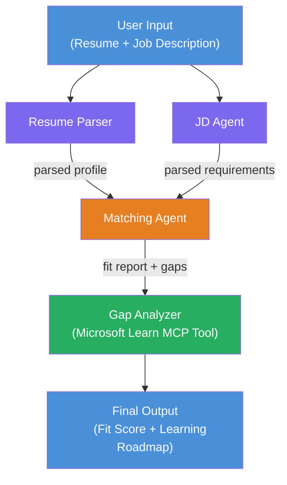

# Lab 02 - Multi-Agent Workflow: Resume → Job Fit Evaluator

---

## What you'll build

A **Resume → Job Fit Evaluator** - a multi-agent workflow where four specialized agents collaborate to evaluate how well a candidate's resume matches a job description, then generate a personalized learning roadmap to close the gaps.

### The agents

| Agent | Role |
|-------|------|
| **Resume Parser** | Extracts structured skills, experience, certifications from resume text |
| **Job Description Agent** | Extracts required/preferred skills, experience, certifications from a JD |
| **Matching Agent** | Compares profile vs requirements → fit score (0-100) + matched/missing skills |
| **Gap Analyzer** | Builds a personalized learning roadmap with resources, timelines, and quick-win projects |

### Demo flow

Upload a **resume + job description** → get a **fit score + missing skills** → receive a **personalized learning roadmap**.

### Workflow architecture

> Purple = parallel agents | Orange = aggregation point | Green = final agent with tools. See [Module 1 - Understand the Architecture](docs/01-understand-multi-agent.md) and [Module 4 - Orchestration Patterns](docs/04-orchestration-patterns.md) for detailed diagrams and data flow.

### Topics covered

- Creating a multi-agent workflow using **WorkflowBuilder**
- Defining agent roles and orchestration flow (parallel + sequential)
- Inter-agent communication patterns
- Local testing with the Agent Inspector
- Deploying multi-agent workflows to Foundry Agent Service

---

## Prerequisites

Complete Lab 01 first:

- [Lab 01 - Single Agent](../lab01-single-agent/README.md)

---

## Get started

See the full setup instructions, code walkthrough, and test commands in:

- [Lab 2 Docs - Prerequisites](docs/00-prerequisites.md)
- [Lab 2 Docs - Full Learning Path](docs/README.md)
- [PersonalCareerCopilot run guide](PersonalCareerCopilot/README.md)

## Orchestration patterns (agentic alternatives)

Lab 2 includes the default **parallel → aggregator → planner** flow, and the docs
also describe alternative patterns to demonstrate stronger agentic behavior:

- **Fan-out/Fan-in with weighted consensus**
- **Reviewer/critic pass before final roadmap**
- **Conditional router** (path selection based on fit score and missing skills)

See [docs/04-orchestration-patterns.md](docs/04-orchestration-patterns.md).

---

**Previous:** [Lab 01 - Single Agent](../lab01-single-agent/README.md) · **Back to:** [Workshop Home](../../README.md)

---

<!-- CO-OP TRANSLATOR DISCLAIMER START -->
**Disclaimer**:
This document has been translated using AI translation service [Co-op Translator](https://github.com/Azure/co-op-translator). While we strive for accuracy, please be aware that automated translations may contain errors or inaccuracies. The original document in its native language should be considered the authoritative source. For critical information, professional human translation is recommended. We are not liable for any misunderstandings or misinterpretations arising from the use of this translation.
<!-- CO-OP TRANSLATOR DISCLAIMER END -->