# Module 1 - Understand the Architecture

⏱️ ~5 min

Before writing any code, here's a quick overview of what you're building and how it works.

---

## What you're building

You paste in a **resume** and a **job description**. The workflow returns:

- A fit score (0–100 with a breakdown)
- A list of skill and certification gaps
- A personalized learning roadmap with Microsoft Learn links for each gap

---

## The four agents

A single agent trying to parse, score, and plan all at once tends to rush and produce shallow output. Splitting the work into four specialized agents gives better results:

| Agent | What it does |
|-------|-------------|
| **ResumeParser** | Parses the resume; copies the JD verbatim into `[JOB DESCRIPTION PASS-THROUGH]` for downstream agents |
| **JobDescriptionAgent** | Extracts JD requirements from the pass-through; relays `[PARSED RESUME]` forward as `[PARSED RESUME PASS-THROUGH]` |
| **MatchingAgent** | Compares both labeled sections; produces a 0–100 fit score and gap list |
| **GapAnalyzer** | Builds a learning roadmap; searches Microsoft Learn for each gap |

---

## The orchestration graph

The workflow is a **sequential pipeline** - each agent passes its output to the next:

```mermaid
flowchart LR
    A["User Input"] --> B["Resume Parser"]
    B -- "parsed resume + JD relay" --> C["Job Description Agent"]
    C -- "JD requirements + resume relay" --> D["Matching Agent"]
    D -- "fit report + gaps" --> E["Gap Analyzer + MCP"]
    E --> F["Final Output"]

    style A fill:#4A90D9,color:#fff
    style B fill:#7B68EE,color:#fff
    style C fill:#7B68EE,color:#fff
    style D fill:#E67E22,color:#fff
    style E fill:#27AE60,color:#fff
    style F fill:#4A90D9,color:#fff
```



1. **ResumeParser** receives the user input, parses the resume, and copies the JD into `[JOB DESCRIPTION PASS-THROUGH]`.
2. **JD Agent** extracts structured requirements and relays `[PARSED RESUME PASS-THROUGH]` forward.
3. **MatchingAgent** compares both sections and produces a fit score and gap list.
4. **GapAnalyzer** builds the roadmap and calls the Microsoft Learn MCP tool for each gap.

---

## How this maps to code

In `main.py`, you describe this graph with `WorkflowBuilder`:

```python
workflow_agent = (
    WorkflowBuilder(
        start_executor=resume_executor,       # first agent to receive user input
        output_executors=[gap_executor],      # last agent - its output is the response
    )
    .add_edge(resume_executor, jd_executor)       # ResumeParser → JD Agent
    .add_edge(jd_executor, matching_executor)     # JD Agent → MatchingAgent
    .add_edge(matching_executor, gap_executor)    # MatchingAgent → GapAnalyzer
    .build()
    .as_agent()
)
```

Each `Agent` is wrapped in an `AgentExecutor`. The `add_edge()` calls define a strictly sequential pipeline - each agent receives only its direct predecessor's output.

> `context_mode="last_agent"` means each executor sees only its direct predecessor’s output. ResumeParser and JD Agent relay data forward in labeled sections so each downstream agent has exactly what it needs.

---

## The MCP tool

GapAnalyzer has one tool: `search_microsoft_learn_for_plan`. It connects to `https://learn.microsoft.com/api/mcp` and returns real Microsoft Learn links for each skill gap.

When the tool runs you’ll see these logs - all expected:

```
GET  https://learn.microsoft.com/api/mcp → 405   ← connection probe, normal
POST https://learn.microsoft.com/api/mcp → 200   ← actual tool call
DELETE https://learn.microsoft.com/api/mcp → 405 ← cleanup probe, normal
```

Only worry if the `POST` returns an error.

---

**Previous:** [00 - Prerequisites](00-prerequisites.md) · **Next:** [02 - Scaffold the Project →](02-scaffold-multi-agent.md)

---

<!-- CO-OP TRANSLATOR DISCLAIMER START -->
**Disclaimer**:
This document has been translated using AI translation service [Co-op Translator](https://github.com/Azure/co-op-translator). While we strive for accuracy, please be aware that automated translations may contain errors or inaccuracies. The original document in its native language should be considered the authoritative source. For critical information, professional human translation is recommended. We are not liable for any misunderstandings or misinterpretations arising from the use of this translation.
<!-- CO-OP TRANSLATOR DISCLAIMER END -->