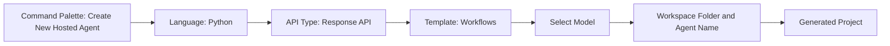
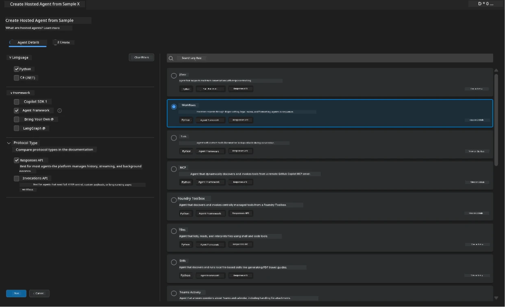
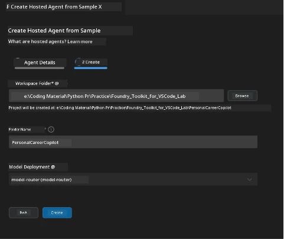

# Module 2 - Scaffold the Multi-Agent Project

⏱️ ~5 min

In this module, you use [Foundry Toolkit for VS Code](https://aka.ms/foundrytk) to **scaffold a multi-agent project**. The wizard generates `agent.yaml`, `main.py`, `Dockerfile`, `requirements.txt`, `.env`, and VS Code debug configuration - so you can focus on wiring the 4-agent workflow in Module 3.

> **Key concept:** The scaffold is a working stub with one agent. You replace the placeholder logic with the `WorkflowBuilder` graph in Module 3. You don't write the boilerplate from scratch.

> **Reference implementation:** [`PersonalCareerCopilot/`](../../../../../workshop/lab02-multi-agent/PersonalCareerCopilot) is a complete working example. Use it to compare your work as you go.

### Scaffold wizard flow



---

## Step 1: Open the Create Hosted Agent wizard

1. Press `Ctrl+Shift+P` to open the **Command Palette**.
2. Type: **Foundry Toolkit: Create a New Hosted Agent** and select it.
3. The wizard opens on the **Agent Details** tab.

> **Alternative:** Click the **Foundry Toolkit** icon in the Activity Bar → click the **+** icon next to **Hosted Agents** → **Create New Hosted Agent**.

---

## Step 2: Choose settings



1. On the left navigation/options section select the following:

| Menu | Selection | Notes |
|--------|-----------|-------|
| **Language** | Python | C# (.NET) also supported |
| **Framework** | Agent Framework | Provides `Agent`, `AgentExecutor`, `WorkflowBuilder` |
| **API type** | Response API | `POST /responses` - platform-managed history, streaming support |
| **Template** | **Workflows** | Processes requests through multiple agents in sequence |

2. Once selected, click **Next**



3. In the next window, select the following:

| Menu | Selection | Notes |
|--------|-----------|-------|
| **Workspace folder** | Browse to target folder | e.g., `workshop/lab02-multi-agent/` in this repo |
| **Agent name** | `PersonalCareerCopilot` | This becomes the project directory name |
| **Model Deployment** | Select your deployed model | e.g., `gpt-4.1-mini` from Lab 01 |

4. Click **Create** to scaffold the project. VS Code generates the files and opens the folder.

> **Tip:** [`gpt-4.1-mini`](https://learn.microsoft.com/azure/foundry/foundry-models/concepts/models-sold-directly-by-azure#gpt-41-series) balances speed and quality well for multi-agent development.

---

## Step 3: Inspect the generated project

After scaffolding completes, verify you see these files in the Explorer (`Ctrl+Shift+E`):

```
📂 <your-agent-name>/
├── .azdignore          ← Files excluded from Azure Developer CLI deployments
├── .dockerignore       ← Files excluded from Docker builds
├── .env                ← Environment variables (placeholders - fill in Module 3)
├── .vscode/
│   ├── launch.json     ← Debug config (F5 → run + Agent Inspector)
│   └── tasks.json      ← VS Code task definitions
├── agent.yaml          ← Agent definition (kind: hosted, protocol: responses)
├── Dockerfile          ← Container config for deployment
├── main.py             ← Stub agent entry point (replace with WorkflowBuilder in Module 3)
└── requirements.txt    ← Python dependencies
```

> **Important:** Open this scaffolded folder directly in VS Code so that `.vscode/launch.json` and `tasks.json` apply correctly for F5 debugging.

### Key files explained

| File | Purpose |
|------|---------|
| `agent.yaml` | Declares `kind: hosted`, maps env vars, defines the `/responses` protocol |
| `main.py` | Stub: one `FoundryChatClient` → `Agent` → `ResponsesHostServer`. You replace this with 4 agents + `WorkflowBuilder` in Module 3 |
| `Dockerfile` | `python:3.12-slim`, installs `requirements.txt`, exposes port 8088, runs `python main.py` |
| `requirements.txt` | `agent-framework-foundry`, `agent-framework-foundry-hosting`, `mcp<2,>=1.24.0`, `debugpy` |

> **Reference:** See [`PersonalCareerCopilot/agent.yaml`](../../../../../workshop/lab02-multi-agent/PersonalCareerCopilot/agent.yaml) and [`PersonalCareerCopilot/requirements.txt`](../../../../../workshop/lab02-multi-agent/PersonalCareerCopilot/requirements.txt) for the complete generated content.

---

### ✅ Checkpoint

- [ ] Scaffold wizard completed - new project folder is visible in Explorer
- [ ] All expected files present: `agent.yaml`, `main.py`, `Dockerfile`, `requirements.txt`, `.env`
- [ ] `agent.yaml` shows `kind: hosted` and `protocol: responses`
- [ ] `main.py` imports `Agent`, `FoundryChatClient`, `ResponsesHostServer`
- [ ] Scaffolded folder is open as the VS Code workspace root
- [ ] You understand `main.py` is a stub - `WorkflowBuilder` is added in Module 3

---

**Previous:** [01 - Understand Multi-Agent Architecture](01-understand-multi-agent.md) · **Next:** [03 - Configure Agents & Environment →](03-configure-agents.md)

---

<!-- CO-OP TRANSLATOR DISCLAIMER START -->
**Disclaimer**:
This document has been translated using AI translation service [Co-op Translator](https://github.com/Azure/co-op-translator). While we strive for accuracy, please be aware that automated translations may contain errors or inaccuracies. The original document in its native language should be considered the authoritative source. For critical information, professional human translation is recommended. We are not liable for any misunderstandings or misinterpretations arising from the use of this translation.
<!-- CO-OP TRANSLATOR DISCLAIMER END -->