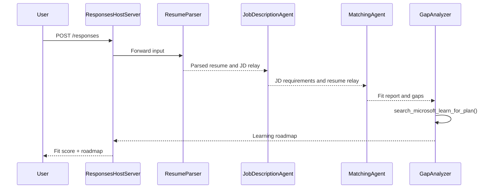

# Module 3 - Configure Instructions, Environment & Install Dependencies

⏱️ ~15 min

In this module, you transform the scaffolded stub into **your** multi-agent workflow - by setting environment variables, writing agent instructions, adding the MCP tool, wiring the workflow graph, and installing dependencies.

> **Reference:** The complete working code is in [`PersonalCareerCopilot/main.py`](../../../../../workshop/lab02-multi-agent/PersonalCareerCopilot/main.py). Use it as a reference while building your own workflow graph and prompt blocks.

---

## How the four agents fit together



---

## Step 1: Configure environment variables

1. Open the **`.env`** file in your project root (created by the scaffold wizard).
2. Replace the placeholders with your actual values from Lab 01.

<details open>
<summary><strong>🅰️ Path A - Foundry subscription</strong></summary>

```env
FOUNDRY_PROJECT_ENDPOINT=https://<your-account>.services.ai.azure.com/api/projects/<your-project>
AZURE_AI_MODEL_DEPLOYMENT_NAME=gpt-4.1-mini
```

> **Where to find values:** See [Lab 01, Module 1](../../lab01-single-agent/docs/01-setup.md#deploy-a-model--assign-rbac).

</details>

<details open>
<summary><strong>🅱️ Path B - Foundry Local</strong></summary>

```env
FOUNDRY_PROJECT_ENDPOINT=http://localhost:5273/v1
AZURE_AI_MODEL_DEPLOYMENT_NAME=phi-4-mini
```

> All inference runs on your machine - no data leaves your device. Run `foundry model list` to confirm the exact model alias. The only outbound request is the MCP tool call to `https://learn.microsoft.com/api/mcp`.

> **Where to find values:** See [Lab 01, Module 1 - local path](../../lab01-single-agent/docs/01-setup.md#step-2-set-up-based-on-your-access).

</details>

> **Security:** Never commit `.env` to version control. It should already be in `.gitignore`.

---

## Step 2: Write agent instructions

Instructions define each agent's role, output format, and rules. Open `main.py` and define (or replace) the four instruction constants - the complete strings are in [`PersonalCareerCopilot/main.py`](../../../../../workshop/lab02-multi-agent/PersonalCareerCopilot/main.py).

### 2.1 `RESUME_PARSER_INSTRUCTIONS`
Parses the resume into a structured candidate profile **and** copies the job description verbatim into `[JOB DESCRIPTION PASS-THROUGH]`. Both labeled sections must appear in the output.

> **Why the pass-through?** With `context_mode="last_agent"`, ResumeParser is the **only** agent that sees the original user message. If it doesn't copy the JD forward, the downstream agents never see it.

### 2.2 `JOB_DESCRIPTION_INSTRUCTIONS`
Reads `[PARSED RESUME]` and `[JOB DESCRIPTION PASS-THROUGH]` from ResumeParser output. Outputs `[JD REQUIREMENTS]` (structured requirements) and `[PARSED RESUME PASS-THROUGH]` (verbatim resume copy for MatchingAgent).

### 2.3 `MATCHING_AGENT_INSTRUCTIONS`
Reads `[JD REQUIREMENTS]` and `[PARSED RESUME PASS-THROUGH]`. Produces a scored fit report (0–100) with breakdown math, matched skills, missing skills, and experience alignment.

### 2.4 `GAP_ANALYZER_INSTRUCTIONS`
Reads the fit report. For **every** missing skill, calls `search_microsoft_learn_for_plan` to fetch Microsoft Learn resources. Produces one detailed gap card per skill plus a week-by-week learning roadmap.

---

## Step 3: Add the MCP tool

The GapAnalyzer calls the [Microsoft Learn MCP server](https://learn.microsoft.com/azure/foundry/agents/how-to/tools/model-context-protocol) to fetch real learning resources for each skill gap. The full `search_microsoft_learn_for_plan` function is in [`PersonalCareerCopilot/main.py`](../../../../../workshop/lab02-multi-agent/PersonalCareerCopilot/main.py).

Register the tool on the GapAnalyzer when creating the agent:

```python
gap_analyzer = Agent(
    client=client,
    instructions=GAP_ANALYZER_INSTRUCTIONS,
    name="GapAnalyzer",
    tools=[search_microsoft_learn_for_plan],
)
```

> See [`PersonalCareerCopilot/main.py`](../../../../../workshop/lab02-multi-agent/PersonalCareerCopilot/main.py) for the complete `WorkflowBuilder` graph with `FoundryChatClient`, `AgentExecutor`, and all `add_edge()` calls.

---

## Step 4: Create virtual environment & install dependencies

> ⚠️ **Do not skip this step.** Without dependencies installed, F5 debugging will fail.

### 4.1 Create the virtual environment

```powershell
python -m venv .venv
```

### 4.2 Activate it

| OS | Command |
|----|---------|
| **Windows (PowerShell)** | `.\.venv\Scripts\Activate.ps1` |
| **Windows (CMD)** | `.venv\Scripts\activate.bat` |
| **macOS / Linux** | `source .venv/bin/activate` |

You should see `(.venv)` in your terminal prompt.

### 4.3 Install dependencies

```powershell
pip install -r requirements.txt
```

### 4.4 Verify

```powershell
pip list | Select-String "agent-framework|mcp|debugpy"
```

Expected: `agent-framework-foundry`, `agent-framework-foundry-hosting`, `mcp`, and `debugpy` are listed.

---

## Step 5: Verify authentication

<details open>
<summary><strong>🅰️ Path A - Azure credential</strong></summary>

```powershell
az account show --query "{name:name, id:id}" --output table
```

If this fails, run [`az login`](https://learn.microsoft.com/cli/azure/authenticate-azure-cli-interactively).

All four agents share one `FoundryChatClient` and one `DefaultAzureCredential`. If authentication works for one, it works for all.

</details>

<details open>
<summary><strong>🅱️ Path B - Foundry Local</strong></summary>

No authentication required for local testing.

</details>

---

### ✅ Checkpoint

> Do **not** proceed to Module 04 until: **(1)** `(.venv)` is visible in your prompt AND **(2)** `pip install -r requirements.txt` completed successfully.

- [ ] `.env` has valid endpoint and model deployment name (not placeholders)
- [ ] All 4 agent instruction constants defined in `main.py` (ResumeParser, JD Agent, MatchingAgent, GapAnalyzer)
- [ ] `search_microsoft_learn_for_plan` MCP tool defined and registered on GapAnalyzer
- [ ] `FoundryChatClient` + 4 `Agent` + 4 `AgentExecutor` objects created in `main()`
- [ ] `WorkflowBuilder` builds the correct sequential graph with all 3 `add_edge()` calls
- [ ] Virtual environment created and activated (`(.venv)` visible in prompt)
- [ ] `pip install -r requirements.txt` completed without errors
- [ ] **Path A:** `az account show` succeeds OR VS Code Accounts icon shows signed-in account

---

**Previous:** [02 - Scaffold Multi-Agent Project](02-scaffold-multi-agent.md) · **Next:** [04 - Orchestration Patterns →](04-orchestration-patterns.md)

---

<!-- CO-OP TRANSLATOR DISCLAIMER START -->
**Disclaimer**:
This document has been translated using AI translation service [Co-op Translator](https://github.com/Azure/co-op-translator). While we strive for accuracy, please be aware that automated translations may contain errors or inaccuracies. The original document in its native language should be considered the authoritative source. For critical information, professional human translation is recommended. We are not liable for any misunderstandings or misinterpretations arising from the use of this translation.
<!-- CO-OP TRANSLATOR DISCLAIMER END -->