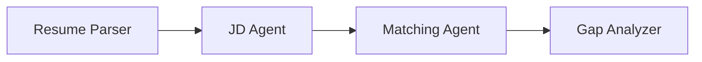
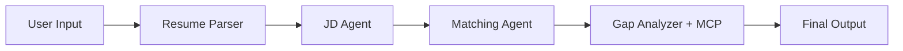

# Module 4 - Orchestration Patterns

⏱️ ~10 min

In this module, you explore the orchestration patterns used in the Resume Job Fit Evaluator and learn how to read, modify, and extend the workflow graph. Understanding these patterns is essential for debugging data flow issues and building your own [multi-agent workflows](https://learn.microsoft.com/agent-framework/workflows/).

---

## Pattern 1: Sequential chain

The fundamental pattern in the workflow is a **sequential chain** - each agent’s output feeds directly into the next.



In code, each `add_edge()` call creates one step in the chain:

```python
.add_edge(resume_executor, jd_executor)       # ResumeParser output → JD Agent
.add_edge(jd_executor, matching_executor)     # JD Agent output → MatchingAgent
.add_edge(matching_executor, gap_executor)    # MatchingAgent output → GapAnalyzer
```

> **Why sequential, not fan-out/fan-in?** `WorkflowBuilder` uses **OR-semantics** for incoming edges: a downstream executor fires as soon as **any** predecessor completes. If `matching_executor` had two incoming edges (from both `resume_executor` and `jd_executor`), it would trigger twice - once when ResumeParser finishes and again when JD Agent finishes - causing GapAnalyzer to also run twice and the output to appear twice. The sequential pipeline avoids this entirely.

## Pattern 2: Content Relay

Because `context_mode="last_agent"` means each executor sees only its **direct predecessor’s output**, agents in a sequential chain must explicitly pass forward any data that downstream agents need.

In this workflow:
- **ResumeParser** copies the JD verbatim into `[JOB DESCRIPTION PASS-THROUGH]` (so JD Agent can find it).
- **JD Agent** copies the `[PARSED RESUME]` verbatim into `[PARSED RESUME PASS-THROUGH]` (so MatchingAgent can compare both profiles).

```
ResumeParser output
└─ [PARSED RESUME]               ← extracted by JD Agent
└─ [JOB DESCRIPTION PASS-THROUGH] ← extracted by JD Agent

JD Agent output
└─ [JD REQUIREMENTS]             ← extracted by MatchingAgent
└─ [PARSED RESUME PASS-THROUGH]  ← extracted by MatchingAgent
```

Each relay section must be copied **verbatim** - summarizing or paraphrasing it breaks the downstream agent that depends on it.

---

## The complete graph

Combining the sequential chain and content relay patterns produces the full workflow:



The Agent Inspector shows this same graph structure when the agent is running locally. Refer to [Module 5 - Test Locally](05-test-locally.md) for screenshots.

---

## Reading the WorkflowBuilder code

The full `create_workflow()` function is in [`PersonalCareerCopilot/main.py`](../../../../../workshop/lab02-multi-agent/PersonalCareerCopilot/main.py). The three `add_edge()` calls build the sequential pipeline:

| # | Edge | Effect |
|---|------|--------|
| 1 | `resume_executor → jd_executor` | JD Agent receives `[PARSED RESUME]` + `[JOB DESCRIPTION PASS-THROUGH]` |
| 2 | `jd_executor → matching_executor` | MatchingAgent receives `[JD REQUIREMENTS]` + `[PARSED RESUME PASS-THROUGH]` |
| 3 | `matching_executor → gap_executor` | GapAnalyzer receives fit report + gap list |

---

## Modifying the graph

### Adding a new agent

To add a fifth agent (e.g., an **InterviewPrepAgent** after GapAnalyzer):

1. Define an `INTERVIEW_PREP_INSTRUCTIONS` constant.
2. Create `Agent` + `AgentExecutor` objects (same pattern as the existing four).
3. Add `.add_edge(gap_executor, interview_exec)` in `WorkflowBuilder`.
4. Update `output_executors=[interview_exec]`.

> **Important:** `start_executor` is the only agent that receives raw user input. All other agents receive output from their upstream edge.

---

## Common graph mistakes

| Mistake | Symptom | Fix |
|---------|---------|-----|
| Missing edge to `output_executors` | Agent runs but output is empty | Ensure there's a path from `start_executor` to every agent in `output_executors` |
| Circular dependency | Infinite loop or timeout | Check that no agent feeds back into an upstream agent |
| Agent in `output_executors` with no incoming edge | Empty output | Add at least one `add_edge(source, that_agent)` |
| Multiple `output_executors` without fan-in | Output contains only one agent's response | Use a single output agent that aggregates, or accept multiple outputs |
| Missing `start_executor` | `ValueError` at build time | Always specify `start_executor` in `WorkflowBuilder()` |

---

## Debugging the graph

### Using Agent Inspector

1. Start the agent locally with F5.
2. Open Agent Inspector (`Ctrl+Shift+P` → **Foundry Toolkit: Open Agent Inspector**).
3. Send a test message.
4. In the Inspector’s response panel, look for the **streaming output** - it shows each agent’s contribution in sequence.


### Using logging

Add logging to `main.py` to trace data flow:

```python
import logging
logger = logging.getLogger("resume-job-fit")

# In main(), after building the workflow:
logger.info("Workflow graph built with edges: RP→JD, JD→MA, MA→GA")
```

The server logs show agent execution order and MCP tool calls:

```
INFO:agent_framework:Executing agent: ResumeParser
INFO:agent_framework:Executing agent: JobDescriptionAgent
INFO:agent_framework:Executing agent: MatchingAgent
INFO:agent_framework:Executing agent: GapAnalyzer
INFO:agent_framework:Tool call: search_microsoft_learn_for_plan(skill="Kubernetes")
POST https://learn.microsoft.com/api/mcp → 200
INFO:agent_framework:Tool call: search_microsoft_learn_for_plan(skill="Terraform")
POST https://learn.microsoft.com/api/mcp → 200
```

---

### Checkpoint

- [ ] You can identify the two orchestration patterns in the workflow: sequential chain and content relay
- [ ] You understand why `context_mode="last_agent"` requires explicit data relay between agents
- [ ] You can read the `WorkflowBuilder` code and map each `add_edge()` call to the visual graph
- [ ] You know how to add a new agent to the end of the pipeline
- [ ] You can identify common graph mistakes and their symptoms

---

**Previous:** [03 - Configure Agents & Environment](03-configure-agents.md) · **Next:** [05 - Test Locally →](05-test-locally.md)

---

<!-- CO-OP TRANSLATOR DISCLAIMER START -->
**Disclaimer**:
This document has been translated using AI translation service [Co-op Translator](https://github.com/Azure/co-op-translator). While we strive for accuracy, please be aware that automated translations may contain errors or inaccuracies. The original document in its native language should be considered the authoritative source. For critical information, professional human translation is recommended. We are not liable for any misunderstandings or misinterpretations arising from the use of this translation.
<!-- CO-OP TRANSLATOR DISCLAIMER END -->