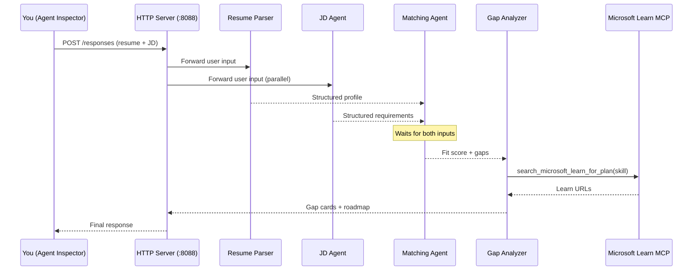
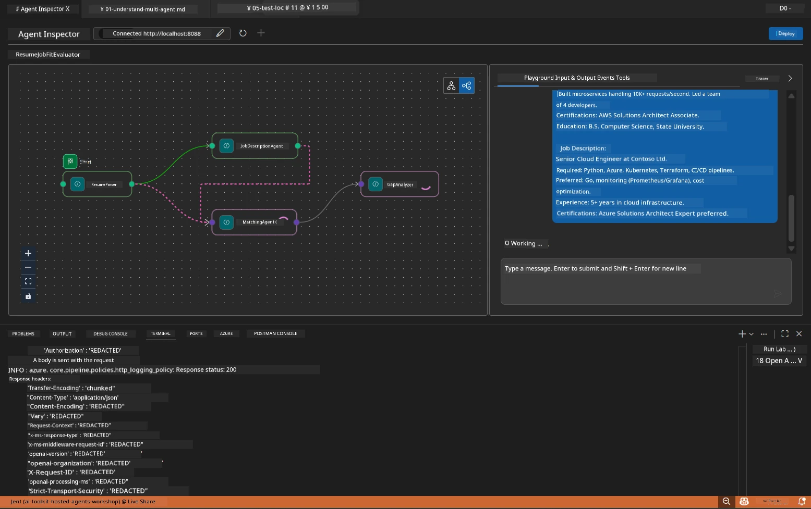

# Module 5 - Test Locally (Multi-Agent)

In this module, you run the multi-agent workflow locally, test it with Agent Inspector, and verify that all four agents and the MCP tool work correctly before deploying to Foundry.

### What happens during a local test run


---

## Step 1: Start the agent server

### Option A: Using the VS Code task (recommended)

1. Press `Ctrl+Shift+P` → type **Tasks: Run Task** → select **Run Lab02 HTTP Server**.
2. The task starts the server with debugpy attached on port `5679` and the agent on port `8088`.
3. Wait for the output to show:

```
INFO:resume-job-fit:Starting Resume -> Job Fit Evaluator HTTP server...
INFO:resume-job-fit:Server running on http://localhost:8088
```

### Option B: Using the terminal manually

```powershell
cd workshop\lab02-multi-agent\PersonalCareerCopilot
```

Activate the virtual environment:

**PowerShell (Windows):**
```powershell
.\.venv\Scripts\Activate.ps1
```

**macOS/Linux:**
```bash
source .venv/bin/activate
```

Start the server:

```powershell
python -m debugpy --listen 127.0.0.1:5679 -m agentdev run main.py --verbose --port 8088
```

### Option C: Using F5 (debug mode)

1. Press `F5` or go to **Run and Debug** (`Ctrl+Shift+D`).
2. Select the **Lab02 - Multi-Agent** launch configuration from the dropdown.
3. The server starts with full breakpoint support.

> **Tip:** Debug mode lets you set breakpoints inside `search_microsoft_learn_for_plan()` to inspect MCP responses, or inside agent instruction strings to see what each agent receives.

---

## Step 2: Open Agent Inspector

1. Press `Ctrl+Shift+P` → type **Foundry Toolkit: Open Agent Inspector**.
2. Agent Inspector opens in a browser tab at `http://localhost:5679`.
3. You should see the agent interface ready to accept messages.

> **If Agent Inspector doesn't open:** Ensure the server is fully started (you see the "Server running" log). If port 5679 is busy, see [Module 8 - Troubleshooting](08-troubleshooting.md).

---

## Step 3: Run smoke tests

Run these three tests in order. Each tests progressively more of the workflow.

### Test 1: Basic resume + job description

Paste the following into Agent Inspector:

```
Resume:
Jane Doe
Senior Software Engineer with 5 years of experience in Python, Django, and AWS.
Built microservices handling 10K+ requests/second. Led a team of 4 developers.
Certifications: AWS Solutions Architect Associate.
Education: B.S. Computer Science, State University.

Job Description:
Senior Cloud Engineer at Contoso Ltd.
Required: Python, Azure, Kubernetes, Terraform, CI/CD pipelines.
Preferred: Go, monitoring (Prometheus/Grafana), cost optimization.
Experience: 5+ years in cloud infrastructure.
Certifications: Azure Solutions Architect Expert preferred.
```

**Expected output structure:**

The response should contain output from all four agents in sequence:

1. **Resume Parser output** - Structured candidate profile with skills grouped by category
2. **JD Agent output** - Structured requirements with required vs. preferred skills separated
3. **Matching Agent output** - Fit score (0-100) with breakdown, matched skills, missing skills, gaps
4. **Gap Analyzer output** - Individual gap cards for each missing skill, each with Microsoft Learn URLs



### What to verify in Test 1

| Check | Expected | Pass? |
|-------|----------|-------|
| Response contains a fit score | Number between 0-100 with breakdown | |
| Matched skills are listed | Python, CI/CD (partial), etc. | |
| Missing skills are listed | Azure, Kubernetes, Terraform, etc. | |
| Gap cards exist for each missing skill | One card per skill | |
| Microsoft Learn URLs are present | Real `learn.microsoft.com` links | |
| No error messages in response | Clean structured output | |

### Test 2: Verify MCP tool execution

While Test 1 runs, check the **server terminal** for MCP log entries:

```
GET https://learn.microsoft.com/api/mcp → 405 (Method Not Allowed)
POST https://learn.microsoft.com/api/mcp → 200
DELETE https://learn.microsoft.com/api/mcp → 405 (Method Not Allowed)
```

| Log entry | Meaning | Expected? |
|-----------|---------|-----------|
| `GET ... → 405` | MCP client probes with GET during initialization | Yes - normal |
| `POST ... → 200` | Actual tool call to Microsoft Learn MCP server | Yes - this is the real call |
| `DELETE ... → 405` | MCP client probes with DELETE during cleanup | Yes - normal |
| `POST ... → 4xx/5xx` | Tool call failed | No - see [Troubleshooting](08-troubleshooting.md) |

> **Key point:** The `GET 405` and `DELETE 405` lines are **expected behavior**. Only worry if `POST` calls return non-200 status codes.

### Test 3: Edge case - high-fit candidate

Paste a resume that closely matches the JD to verify the GapAnalyzer handles high-fit scenarios:

```
Resume:
Alex Chen
Senior Cloud Engineer with 7 years of experience.
Skills: Python, Azure (AKS, Functions, DevOps), Kubernetes, Terraform, CI/CD (GitHub Actions, Azure Pipelines), Go, Prometheus, Grafana, cost optimization.
Certifications: Azure Solutions Architect Expert, Azure DevOps Engineer Expert.
Led infrastructure migration to Azure for 3 enterprise clients.
Education: M.S. Computer Science, Tech University.

Job Description:
Senior Cloud Engineer at Contoso Ltd.
Required: Python, Azure, Kubernetes, Terraform, CI/CD pipelines.
Preferred: Go, monitoring (Prometheus/Grafana), cost optimization.
Experience: 5+ years in cloud infrastructure.
Certifications: Azure Solutions Architect Expert preferred.
```

**Expected behavior:**
- Fit score should be **80+** (most skills match)
- Gap cards should focus on polish/interview readiness rather than foundational learning
- The GapAnalyzer instructions say: "If fit >= 80, focus on polish/interview readiness"

---

## Step 4: Verify output completeness

After running the tests, verify the output meets these criteria:

### Output structure checklist

| Section | Agent | Present? |
|---------|-------|----------|
| Candidate Profile | Resume Parser | |
| Technical Skills (grouped) | Resume Parser | |
| Role Overview | JD Agent | |
| Required vs. Preferred Skills | JD Agent | |
| Fit Score with breakdown | Matching Agent | |
| Matched / Missing / Partial skills | Matching Agent | |
| Gap card per missing skill | Gap Analyzer | |
| Microsoft Learn URLs in gap cards | Gap Analyzer (MCP) | |
| Learning order (numbered) | Gap Analyzer | |
| Timeline summary | Gap Analyzer | |

### Common issues at this stage

| Issue | Cause | Fix |
|-------|-------|-----|
| Only 1 gap card (rest truncated) | GapAnalyzer instructions missing CRITICAL block | Add the `CRITICAL:` paragraph to `GAP_ANALYZER_INSTRUCTIONS` - see [Module 3](03-configure-agents.md) |
| No Microsoft Learn URLs | MCP endpoint unreachable | Check internet connectivity. Verify `MICROSOFT_LEARN_MCP_ENDPOINT` in `.env` is `https://learn.microsoft.com/api/mcp` |
| Empty response | `PROJECT_ENDPOINT` or `MODEL_DEPLOYMENT_NAME` not set | Check `.env` file values. Run `echo $env:PROJECT_ENDPOINT` in terminal |
| Fit score is 0 or missing | MatchingAgent received no upstream data | Check that `add_edge(resume_parser, matching_agent)` and `add_edge(jd_agent, matching_agent)` exist in `create_workflow()` |
| Agent starts but immediately exits | Import error or missing dependency | Run `pip install -r requirements.txt` again. Check terminal for stack traces |
| `validate_configuration` error | Missing env vars | Create `.env` with `PROJECT_ENDPOINT=<your-endpoint>` and `MODEL_DEPLOYMENT_NAME=<your-model>` |

---

## Step 5: Test with your own data (optional)

Try pasting your own resume and a real job description. This helps verify:

- The agents handle different resume formats (chronological, functional, hybrid)
- The JD Agent handles different JD styles (bullet points, paragraphs, structured)
- The MCP tool returns relevant resources for real skills
- The gap cards are personalized to your specific background

> **Privacy note:** When testing locally, your data stays on your machine and is sent only to your Azure OpenAI deployment. It is not logged or stored by the workshop infrastructure. Use placeholder names if you prefer (e.g., "Jane Doe" instead of your real name).

---

### Checkpoint

- [ ] Server started successfully on port `8088` (log shows "Server running")
- [ ] Agent Inspector opened and connected to the agent
- [ ] Test 1: Complete response with fit score, matched/missing skills, gap cards, and Microsoft Learn URLs
- [ ] Test 2: MCP logs show `POST ... → 200` (tool calls succeeded)
- [ ] Test 3: High-fit candidate gets score 80+ with polish-focused recommendations
- [ ] All gap cards present (one per missing skill, no truncation)
- [ ] No errors or stack traces in the server terminal

---

**Previous:** [04 - Orchestration Patterns](04-orchestration-patterns.md) · **Next:** [06 - Deploy to Foundry →](06-deploy-to-foundry.md)

---

<!-- CO-OP TRANSLATOR DISCLAIMER START -->
**Disclaimer**:
This document has been translated using AI translation service [Co-op Translator](https://github.com/Azure/co-op-translator). While we strive for accuracy, please be aware that automated translations may contain errors or inaccuracies. The original document in its native language should be considered the authoritative source. For critical information, professional human translation is recommended. We are not liable for any misunderstandings or misinterpretations arising from the use of this translation.
<!-- CO-OP TRANSLATOR DISCLAIMER END -->