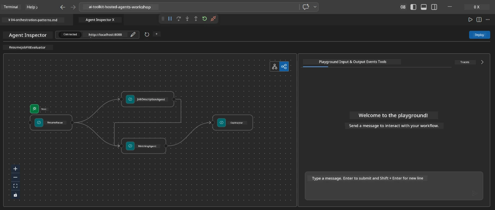
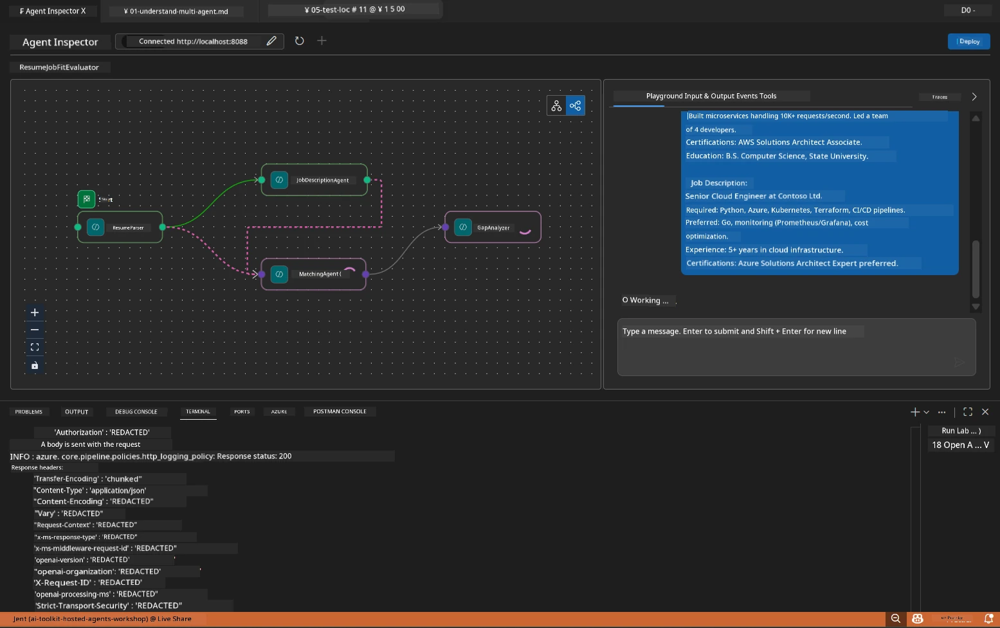
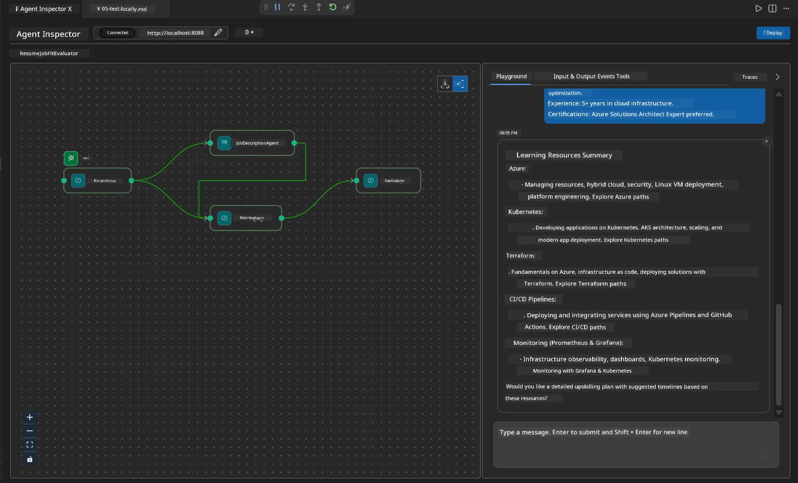

# Module 5 - Test Locally

⏱️ ~15 min

In this module, you run the multi-agent workflow locally, test it with Agent Inspector, and verify all four agents and the MCP tool work correctly before deploying.

---

## Step 1: Start the agent server

### Option A: Using the VS Code task (recommended)

1. Open `workshop/lab02-multi-agent/PersonalCareerCopilot/` as your VS Code folder.
2. Press `Ctrl+Shift+P` → type **Tasks: Run Task** → select **Run Agent HTTP Server**.
3. The task starts the server with debugpy attached on port `5679` and the agent on port `8088`.
4. Wait for the output to show:

```
INFO:resume-job-fit:Starting Resume -> Job Fit Evaluator HTTP server...
INFO:resume-job-fit:Server running on http://localhost:8088
```

### Option B: Using F5 (debug mode)

1. Press `F5` → select **Debug Local Agent HTTP Server**.
2. The server starts with full breakpoint support - useful for inspecting MCP responses or agent outputs.

---

## Step 2: Open Agent Inspector

1. Press `Ctrl+Shift+P` → type **Foundry Toolkit: Open Agent Inspector**.
2. Agent Inspector opens as a VS Code panel connected to `http://localhost:8088`.
3. You should see the agent interface ready to accept messages.



> **If Agent Inspector doesn't open:** Ensure the server is fully started (you see the "Server running" log). If port 5679 is busy, see [Module 8 - Troubleshooting](08-troubleshooting.md).

---

## Step 2b: (Optional) Open the Workflow Visualizer

The Foundry Toolkit includes a real-time **Workflow Visualizer** that shows how agents interact as the graph executes. This is especially useful for multi-agent debugging.

1. Press `Ctrl+Shift+P` → type **Foundry Toolkit: Open Visualizer for Hosted Agents**.
2. A new VS Code tab opens showing the live execution graph.
3. As you send messages in the Agent Inspector, the visualizer updates automatically - green nodes indicate completed agents, and animated edges show data flowing between them.

> **Port conflict:** If the visualizer port is already in use, change it in VS Code Settings → **Extensions** → **Microsoft Foundry Configuration** → **Hosted Agents: Visualizer Port**.

---

## Step 3: Run smoke tests

Run these three tests in order. Each tests progressively more of the workflow.

### Test 1: Basic resume + job description

Paste the following into Agent Inspector:

```
Resume:
Jane Doe
Senior Software Engineer with 5 years of experience in Python, Django, and AWS.
Built microservices handling 10K+ requests/second. Led a team of 4 developers.
Certifications: AWS Solutions Architect Associate.
Education: B.S. Computer Science, State University.

Job Description:
Senior Cloud Engineer at Contoso Ltd.
Required: Python, Azure, Kubernetes, Terraform, CI/CD pipelines.
Preferred: Go, monitoring (Prometheus/Grafana), cost optimization.
Experience: 5+ years in cloud infrastructure.
Certifications: Azure Solutions Architect Expert preferred.
```

**Expected output structure:**

The response should contain output from all four agents in sequence:

1. **Resume Parser output** - Two labeled sections: `[PARSED RESUME]` (candidate profile with grouped skills) and `[JOB DESCRIPTION PASS-THROUGH]` (verbatim JD text that feeds the JD Agent)
2. **JD Agent output** - Structured requirements with required vs. preferred skills separated
3. **Matching Agent output** - Fit score (0-100) with breakdown, matched skills, missing skills, gaps
4. **Gap Analyzer output** - Individual gap cards for each missing skill, each with Microsoft Learn URLs





### What to verify in Test 1

| Check | Expected | Pass? |
|-------|----------|-------|
| Response contains a fit score | Number between 0-100 with breakdown | |
| Matched skills are listed | Python, CI/CD (partial), etc. | |
| Missing skills are listed | Azure, Kubernetes, Terraform, etc. | |
| Gap cards exist for each missing skill | One card per skill | |
| Microsoft Learn URLs are present | Real `learn.microsoft.com` links | |
| No error messages in response | Clean structured output | |

### Test 2: Edge case - high-fit candidate

Paste a resume that closely matches the JD to verify the GapAnalyzer handles high-fit scenarios:

```
Resume:
Alex Chen
Senior Cloud Engineer with 7 years of experience.
Skills: Python, Azure (AKS, Functions, DevOps), Kubernetes, Terraform, CI/CD (GitHub Actions, Azure Pipelines), Go, Prometheus, Grafana, cost optimization.
Certifications: Azure Solutions Architect Expert, Azure DevOps Engineer Expert.
Led infrastructure migration to Azure for 3 enterprise clients.
Education: M.S. Computer Science, Tech University.

Job Description:
Senior Cloud Engineer at Contoso Ltd.
Required: Python, Azure, Kubernetes, Terraform, CI/CD pipelines.
Preferred: Go, monitoring (Prometheus/Grafana), cost optimization.
Experience: 5+ years in cloud infrastructure.
Certifications: Azure Solutions Architect Expert preferred.
```

**Expected behavior:**
- Fit score should be **80+** (most skills match)
- Gap cards should focus on polish/interview readiness rather than foundational learning
- The GapAnalyzer instructions say: "If fit >= 80, focus on polish/interview readiness"

---

## Step 4: Test with your own data (optional)

Try pasting your own resume and a real job description. This helps verify:

- The agents handle different resume formats (chronological, functional, hybrid)
- The JD Agent handles different JD styles (bullet points, paragraphs, structured)
- The MCP tool returns relevant resources for real skills
- The gap cards are personalized to your specific background

> **Privacy - Path A (Foundry cloud):** Resume and JD text is sent to your Azure OpenAI deployment for inference. It is not logged or stored by the workshop infrastructure. Use placeholder names (e.g., "Jane Doe") if you prefer.
>
> **Privacy - Path B (Foundry Local):** All four agent inferences run entirely on your device. Your resume and job description text **never leaves your machine**. The only outbound call is the MCP tool fetching resources from `https://learn.microsoft.com/api/mcp`; that query contains only the skill name, not your personal data.

---

### Checkpoint

- [ ] Server started successfully on port `8088` (log shows "Server running")
- [ ] Agent Inspector opened and connected to the agent
- [ ] Test 1: Complete response with fit score, matched/missing skills, gap cards, and Microsoft Learn URLs
- [ ] Test 2: High-fit candidate gets score 80+ with polish-focused recommendations
- [ ] All gap cards present (one per missing skill, no truncation)
- [ ] No errors or stack traces in the server terminal

---

**Previous:** [04 - Orchestration Patterns](04-orchestration-patterns.md) · **Next:** [06 - Deploy to Foundry →](06-deploy-to-foundry.md)

---

<!-- CO-OP TRANSLATOR DISCLAIMER START -->
**Disclaimer**:
This document has been translated using AI translation service [Co-op Translator](https://github.com/Azure/co-op-translator). While we strive for accuracy, please be aware that automated translations may contain errors or inaccuracies. The original document in its native language should be considered the authoritative source. For critical information, professional human translation is recommended. We are not liable for any misunderstandings or misinterpretations arising from the use of this translation.
<!-- CO-OP TRANSLATOR DISCLAIMER END -->