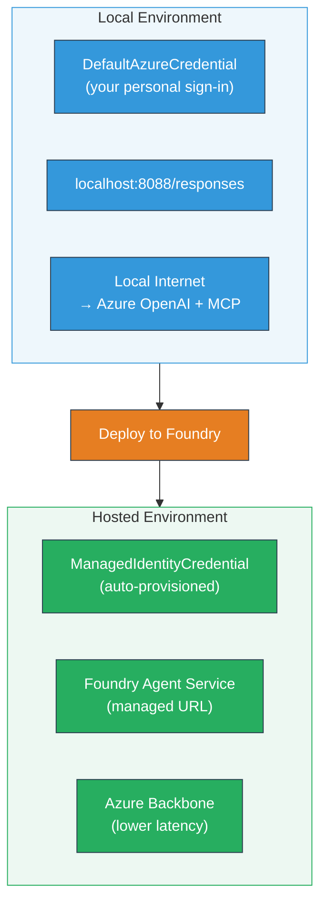

# Module 7 - Verify in Playground

In this module, you test your deployed multi-agent workflow in both **VS Code** and the **[Foundry Portal](https://ai.azure.com)**, confirming the agent behaves identically to local testing.

---

## Why verify after deployment?

Your multi-agent workflow ran perfectly locally, so why test again? The hosted environment differs in several ways:


| Difference | Local | Hosted |
|-----------|-------|--------|
| **Identity** | [`DefaultAzureCredential`](https://learn.microsoft.com/azure/developer/python/sdk/authentication/credential-chains#defaultazurecredential-overview) (your personal sign-in) | [`ManagedIdentityCredential`](https://learn.microsoft.com/python/api/overview/azure/identity-readme#managed-identity-support) (auto-provisioned) |
| **Endpoint** | `http://localhost:8088/responses` | [Foundry Agent Service](https://learn.microsoft.com/azure/foundry/agents/concepts/hosted-agents) endpoint (managed URL) |
| **Network** | Local machine → Azure OpenAI + MCP outbound | Azure backbone (lower latency between services) |
| **MCP connectivity** | Local internet → `learn.microsoft.com/api/mcp` | Container outbound → `learn.microsoft.com/api/mcp` |

If any environment variable is misconfigured, RBAC differs, or MCP outbound is blocked, you'll catch it here.

---

## Option A: Test in VS Code Playground (recommended first)

The [Foundry extension](https://marketplace.visualstudio.com/items?itemName=TeamsDevApp.vscode-ai-foundry) includes an integrated Playground that lets you chat with your deployed agent without leaving VS Code.

### Step 1: Navigate to your hosted agent

1. Click the **Microsoft Foundry** icon in the VS Code **Activity Bar** (left sidebar) to open the Foundry panel.
2. Expand your connected project (e.g., `workshop-agents`).
3. Expand **Hosted Agents (Preview)**.
4. You should see your agent name (e.g., `resume-job-fit-evaluator`).

### Step 2: Select a version

1. Click on the agent name to expand its versions.
2. Click on the version you deployed (e.g., `v1`).
3. A **detail panel** opens showing Container Details.
4. Verify the status is **Started** or **Running**.

### Step 3: Open the Playground

1. In the detail panel, click the **Playground** button (or right-click the version → **Open in Playground**).
2. A chat interface opens in a VS Code tab.

### Step 4: Run your smoke tests

Use the same 3 tests from [Module 5](05-test-locally.md). Type each message in the Playground input box and press **Send** (or **Enter**).

#### Test 1 - Full resume + JD (standard flow)

Paste the full resume + JD prompt from Module 5, Test 1 (Jane Doe + Senior Cloud Engineer at Contoso Ltd).

**Expected:**
- Fit score with breakdown math (100-point scale)
- Matched Skills section
- Missing Skills section
- **One gap card per missing skill** with Microsoft Learn URLs
- Learning roadmap with timeline

#### Test 2 - Quick short test (minimal input)

```
RESUME: 3 years Python developer, knows Django and PostgreSQL, no cloud experience.

JOB: Cloud DevOps Engineer requiring AWS, Kubernetes, Terraform, CI/CD. 5 years needed.
```

**Expected:**
- Lower fit score (< 40)
- Honest assessment with staged learning path
- Multiple gap cards (AWS, Kubernetes, Terraform, CI/CD, experience gap)

#### Test 3 - High-fit candidate

```
RESUME:
10 years Azure Cloud Architect. AZ-305 certified. Expert in AKS, Terraform, Azure DevOps, 
Azure Functions, Helm, Prometheus, Grafana, Python, Go. Led platform team of 8.

JOB:
Senior Cloud Engineer. Required: AKS, Terraform, Azure DevOps, Python. Preferred: Helm, Go.
5+ years experience. AZ-305 preferred.
```

**Expected:**
- High fit score (≥ 80)
- Focus on interview readiness and polishing
- Few or no gap cards
- Short timeline focused on preparation

### Step 5: Compare with local results

Open your notes or browser tab from Module 5 where you saved local responses. For each test:

- Does the response have the **same structure** (fit score, gap cards, roadmap)?
- Does it follow the **same scoring rubric** (100-point breakdown)?
- Are **Microsoft Learn URLs** still present in gap cards?
- Is there **one gap card per missing skill** (not truncated)?

> **Minor wording differences are normal** - the model is non-deterministic. Focus on structure, scoring consistency, and MCP tool usage.

---

## Option B: Test in the Foundry Portal

The [Foundry Portal](https://ai.azure.com) provides a web-based playground useful for sharing with teammates or stakeholders.

### Step 1: Open the Foundry Portal

1. Open your browser and navigate to [https://ai.azure.com](https://ai.azure.com).
2. Sign in with the same Azure account you've been using throughout the workshop.

### Step 2: Navigate to your project

1. On the home page, look for **Recent projects** on the left sidebar.
2. Click your project name (e.g., `workshop-agents`).
3. If you don't see it, click **All projects** and search for it.

### Step 3: Find your deployed agent

1. In the project left navigation, click **Build** → **Agents** (or look for the **Agents** section).
2. You should see a list of agents. Find your deployed agent (e.g., `resume-job-fit-evaluator`).
3. Click on the agent name to open its detail page.

### Step 4: Open the Playground

1. On the agent detail page, look at the top toolbar.
2. Click **Open in playground** (or **Try in playground**).
3. A chat interface opens.

### Step 5: Run the same smoke tests

Repeat all 3 tests from the VS Code Playground section above. Compare each response with both local results (Module 5) and VS Code Playground results (Option A above).

---

## Multi-agent specific verification

Beyond basic correctness, verify these multi-agent-specific behaviors:

### MCP tool execution

| Check | How to verify | Pass condition |
|-------|---------------|----------------|
| MCP calls succeed | Gap cards contain `learn.microsoft.com` URLs | Real URLs, not fallback messages |
| Multiple MCP calls | Each High/Medium priority gap has resources | Not just the first gap card |
| MCP fallback works | If URLs are missing, check for fallback text | Agent still produces gap cards (with or without URLs) |

### Agent coordination

| Check | How to verify | Pass condition |
|-------|---------------|----------------|
| All 4 agents ran | Output contains fit score AND gap cards | Score comes from MatchingAgent, cards from GapAnalyzer |
| Parallel fan-out | Response time is reasonable (< 2 min) | If > 3 min, parallel execution may not be working |
| Data flow integrity | Gap cards reference skills from the matching report | No hallucinated skills that aren't in the JD |

---

## Validation rubric

Use this rubric to evaluate your multi-agent workflow's hosted behavior:

| # | Criteria | Pass condition | Pass? |
|---|----------|---------------|-------|
| 1 | **Functional correctness** | Agent responds to resume + JD with fit score and gap analysis | |
| 2 | **Scoring consistency** | Fit score uses 100-point scale with breakdown math | |
| 3 | **Gap card completeness** | One card per missing skill (not truncated or combined) | |
| 4 | **MCP tool integration** | Gap cards include real Microsoft Learn URLs | |
| 5 | **Structural consistency** | Output structure matches between local and hosted runs | |
| 6 | **Response time** | Hosted agent responds within 2 minutes for full assessment | |
| 7 | **No errors** | No HTTP 500 errors, timeouts, or empty responses | |

> A "pass" means all 7 criteria are met for all 3 smoke tests in at least one playground (VS Code or Portal).

---

## Troubleshooting playground issues

| Symptom | Likely cause | Fix |
|---------|-------------|-----|
| Playground doesn't load | Container status not "Started" | Go back to [Module 6](06-deploy-to-foundry.md), verify deployment status. Wait if "Pending" |
| Agent returns empty response | Model deployment name mismatch | Check `agent.yaml` → `environment_variables` → `MODEL_DEPLOYMENT_NAME` matches your deployed model |
| Agent returns error message | [RBAC](https://learn.microsoft.com/azure/foundry/concepts/rbac-foundry) permission missing | Assign **[Azure AI User](https://aka.ms/foundry-ext-project-role)** at project scope |
| No Microsoft Learn URLs in gap cards | MCP outbound blocked or MCP server unavailable | Check if container can reach `learn.microsoft.com`. See [Module 8](08-troubleshooting.md) |
| Only 1 gap card (truncated) | GapAnalyzer instructions missing "CRITICAL" block | Review [Module 3, Step 2.4](03-configure-agents.md) |
| Fit score wildly different from local | Different model or instructions deployed | Compare `agent.yaml` env vars with local `.env`. Redeploy if needed |
| "Agent not found" in Portal | Deployment still propagating or failed | Wait 2 minutes, refresh. If still missing, re-deploy from [Module 6](06-deploy-to-foundry.md) |

---

### Checkpoint

- [ ] Tested agent in VS Code Playground - all 3 smoke tests passed
- [ ] Tested agent in [Foundry Portal](https://ai.azure.com) Playground - all 3 smoke tests passed
- [ ] Responses are structurally consistent with local testing (fit score, gap cards, roadmap)
- [ ] Microsoft Learn URLs are present in gap cards (MCP tool working in hosted environment)
- [ ] One gap card per missing skill (no truncation)
- [ ] No errors or timeouts during testing
- [ ] Completed validation rubric (all 7 criteria pass)

---

**Previous:** [06 - Deploy to Foundry](06-deploy-to-foundry.md) · **Next:** [08 - Troubleshooting →](08-troubleshooting.md)

---

<!-- CO-OP TRANSLATOR DISCLAIMER START -->
**Disclaimer**:
This document has been translated using AI translation service [Co-op Translator](https://github.com/Azure/co-op-translator). While we strive for accuracy, please be aware that automated translations may contain errors or inaccuracies. The original document in its native language should be considered the authoritative source. For critical information, professional human translation is recommended. We are not liable for any misunderstandings or misinterpretations arising from the use of this translation.
<!-- CO-OP TRANSLATOR DISCLAIMER END -->