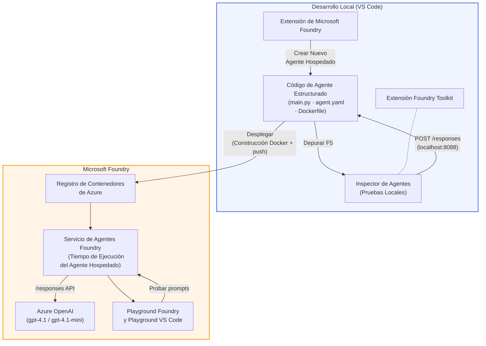

# Taller Foundry Toolkit + Foundry Hosted Agents

[](https://www.python.org/)
[](https://github.com/microsoft/agents)
[](https://learn.microsoft.com/azure/ai-foundry/agents/concepts/hosted-agents/)
[](https://ai.azure.com/)
[](https://learn.microsoft.com/azure/ai-services/openai/)
[](https://learn.microsoft.com/cli/azure/install-azure-cli)
[](https://learn.microsoft.com/azure/developer/azure-developer-cli/install-azd)
[](https://www.docker.com/)
[](https://marketplace.visualstudio.com/items?itemName=ms-windows-ai-studio.windows-ai-studio)
[](LICENSE)

Construye, prueba y despliega agentes de IA al **Microsoft Foundry Agent Service** como **Hosted Agents** - completamente desde VS Code usando la **extensión Microsoft Foundry** y **Foundry Toolkit**.

> **Hosted Agents están actualmente en vista previa.** Las regiones soportadas son limitadas - ver [disponibilidad por región](https://learn.microsoft.com/azure/foundry/agents/concepts/hosted-agents#region-availability).

> La carpeta `agent/` dentro de cada laboratorio es **creada automáticamente** por la extensión Foundry - luego personalizas el código, pruebas localmente y despliegas.

<!-- CO-OP TRANSLATOR LANGUAGES TABLE START -->
[Arabic](../ar/README.md) | [Bengali](../bn/README.md) | [Bulgarian](../bg/README.md) | [Burmese (Myanmar)](../my/README.md) | [Chinese (Simplified)](../zh-CN/README.md) | [Chinese (Traditional, Hong Kong)](../zh-HK/README.md) | [Chinese (Traditional, Macau)](../zh-MO/README.md) | [Chinese (Traditional, Taiwan)](../zh-TW/README.md) | [Croatian](../hr/README.md) | [Czech](../cs/README.md) | [Danish](../da/README.md) | [Dutch](../nl/README.md) | [Estonian](../et/README.md) | [Finnish](../fi/README.md) | [French](../fr/README.md) | [German](../de/README.md) | [Greek](../el/README.md) | [Hebrew](../he/README.md) | [Hindi](../hi/README.md) | [Hungarian](../hu/README.md) | [Indonesian](../id/README.md) | [Italian](../it/README.md) | [Japanese](../ja/README.md) | [Kannada](../kn/README.md) | [Khmer](../km/README.md) | [Korean](../ko/README.md) | [Lithuanian](../lt/README.md) | [Malay](../ms/README.md) | [Malayalam](../ml/README.md) | [Marathi](../mr/README.md) | [Nepali](../ne/README.md) | [Nigerian Pidgin](../pcm/README.md) | [Norwegian](../no/README.md) | [Persian (Farsi)](../fa/README.md) | [Polish](../pl/README.md) | [Portuguese (Brazil)](../pt-BR/README.md) | [Portuguese (Portugal)](../pt-PT/README.md) | [Punjabi (Gurmukhi)](../pa/README.md) | [Romanian](../ro/README.md) | [Russian](../ru/README.md) | [Serbian (Cyrillic)](../sr/README.md) | [Slovak](../sk/README.md) | [Slovenian](../sl/README.md) | [Spanish](./README.md) | [Swahili](../sw/README.md) | [Swedish](../sv/README.md) | [Tagalog (Filipino)](../tl/README.md) | [Tamil](../ta/README.md) | [Telugu](../te/README.md) | [Thai](../th/README.md) | [Turkish](../tr/README.md) | [Ukrainian](../uk/README.md) | [Urdu](../ur/README.md) | [Vietnamese](../vi/README.md)

> **¿Prefieres Clonar Localmente?**
>
> Este repositorio incluye más de 50 traducciones de idiomas, lo que aumenta significativamente el tamaño de la descarga. Para clonar sin traducciones, usa sparse checkout:
>
> **Bash / macOS / Linux:**
> ```bash
> git clone --filter=blob:none --sparse https://github.com/microsoft-foundry/Foundry_Toolkit_for_VSCode_Lab.git
> cd Foundry_Toolkit_for_VSCode_Lab
> git sparse-checkout set --no-cone '/*' '!translations' '!translated_images'
> ```
>
> **CMD (Windows):**
> ```cmd
> git clone --filter=blob:none --sparse https://github.com/microsoft-foundry/Foundry_Toolkit_for_VSCode_Lab.git
> cd Foundry_Toolkit_for_VSCode_Lab
> git sparse-checkout set --no-cone "/*" "!translations" "!translated_images"
> ```
>
> Esto te brinda todo lo necesario para completar el curso con una descarga mucho más rápida.
<!-- CO-OP TRANSLATOR LANGUAGES TABLE END -->

---

## Arquitectura


**Flujo:** La extensión Foundry crea la estructura del agente → personalizas el código y las instrucciones → pruebas localmente con Agent Inspector → despliegas a Foundry (imagen Docker enviada a ACR) → verificas en Playground.

---

## Qué vas a construir

| Laboratorio | Descripción | Estado |
|-------------|-------------|--------|
| **Lab 01 - Agente Único** | Construye el agente **"Explícame Como Si Fuera un Ejecutivo"**, pruébalo localmente y despliegalo a Foundry | ✅ Disponible |
| **Lab 02 - Flujo de Trabajo Multi-Agente** | Construye el **"Evaluador de Ajuste CV → Oferta de Trabajo"** - 4 agentes colaboran para puntuar el ajuste del CV y generar una hoja de ruta de aprendizaje | ✅ Disponible |

---

## Conoce al Agente Ejecutivo

En este taller construirás el agente **"Explícame Como Si Fuera un Ejecutivo"** - un agente de IA que toma lenguaje técnico complejo y lo traduce en resúmenes tranquilos, aptos para reuniones de junta directiva. Porque seamos sinceros, nadie en la alta dirección quiere escuchar sobre "agotamiento del pool de hilos causado por llamadas síncronas introducidas en la versión 3.2."

Creé este agente después de demasiados incidentes donde mi informe post-mortem perfectamente elaborado recibía la respuesta: *"Entonces... ¿el sitio web está caído o no?"*

### Cómo funciona

Le das una actualización técnica. Te devuelve un resumen ejecutivo - tres puntos clave, sin jerga, sin rastros de stack ni angustia existencial. Solo **qué pasó**, **impacto en el negocio** y **próximo paso**.

### Véalo en acción

**Tú dices:**
> "La latencia del API aumentó debido a agotamiento del pool de hilos causado por llamadas síncronas introducidas en la versión 3.2."

**El agente responde:**

> **Resumen Ejecutivo:**
> - **Qué pasó:** Después del último lanzamiento, el sistema se desaceleró.
> - **Impacto en el negocio:** Algunos usuarios experimentaron retrasos al usar el servicio.
> - **Próximo paso:** El cambio se revirtió y se está preparando una solución antes del redepliegue.

### ¿Por qué este agente?

Es un agente sencillo y con un solo propósito - perfecto para aprender el flujo de trabajo de agentes hospedados de principio a fin sin complicarse con cadenas de herramientas complejas. ¿Y honestamente? Todo equipo de ingeniería podría beneficiarse de uno así.

---

## Estructura del Taller

```
📂 Foundry_Toolkit_for_VSCode_Lab/
├── 📄 README.md                      ← You are here
├── 📂 ExecutiveAgent/                ← Standalone hosted agent project
│   ├── agent.yaml
│   ├── Dockerfile
│   ├── main.py
│   └── requirements.txt
└── 📂 workshop/
    ├── 📂 lab01-single-agent/        ← Full lab: docs + agent code
    │   ├── README.md                 ← Hands-on lab instructions
    │   ├── 📂 docs/                  ← Step-by-step tutorial modules
    │   │   ├── 00-prerequisites.md
    │   │   ├── 01-install-foundry-toolkit.md
    │   │   ├── 02-create-foundry-project.md
    │   │   ├── 03-create-hosted-agent.md
    │   │   ├── 04-configure-and-code.md
    │   │   ├── 05-test-locally.md
    │   │   ├── 06-deploy-to-foundry.md
    │   │   ├── 07-verify-in-playground.md
    │   │   └── 08-troubleshooting.md
    │   └── 📂 agent/                 ← Reference solution (auto-scaffolded by Foundry extension)
    │       ├── agent.yaml
    │       ├── Dockerfile
    │       ├── main.py
    │       └── requirements.txt
    └── 📂 lab02-multi-agent/         ← Resume → Job Fit Evaluator
        ├── README.md                 ← Hands-on lab instructions (end-to-end)
        ├── 📂 docs/                  ← Step-by-step tutorial modules
        │   ├── 00-prerequisites.md
        │   ├── 01-understand-multi-agent.md
        │   ├── 02-scaffold-multi-agent.md
        │   ├── 03-configure-agents.md
        │   ├── 04-orchestration-patterns.md
        │   ├── 05-test-locally.md
        │   ├── 06-deploy-to-foundry.md
        │   ├── 07-verify-in-playground.md
        │   └── 08-troubleshooting.md
        └── 📂 PersonalCareerCopilot/ ← Reference solution (multi-agent workflow)
            ├── agent.yaml
            ├── Dockerfile
            ├── main.py
            └── requirements.txt
```

> **Nota:** La carpeta `agent/` dentro de cada laboratorio es lo que la **extensión Microsoft Foundry** genera cuando ejecutas `Microsoft Foundry: Create a New Hosted Agent` desde la Paleta de Comandos. Los archivos luego se personalizan con las instrucciones, herramientas y configuración de tu agente. El Lab 01 te guía para recrear esto desde cero.

---

## Comenzando

### 1. Clona el repositorio

```bash
git clone https://github.com/microsoft-foundry/Foundry_Toolkit_for_VSCode_Lab.git
cd Foundry_Toolkit_for_VSCode_Lab
```

### 2. Configura un entorno virtual de Python

```bash
python -m venv venv
```

Actívalo:

- **Windows (PowerShell):**
  ```powershell
  .\venv\Scripts\Activate.ps1
  ```
- **macOS / Linux:**
  ```bash
  source venv/bin/activate
  ```

### 3. Instala las dependencias

```bash
pip install -r workshop/lab01-single-agent/agent/requirements.txt
```

### 4. Configura las variables de entorno

Copia el archivo de ejemplo `.env` dentro de la carpeta del agente y rellena tus valores:

```bash
cp workshop/lab01-single-agent/agent/.env.example workshop/lab01-single-agent/agent/.env
```

Edita `workshop/lab01-single-agent/agent/.env`:

```env
AZURE_AI_PROJECT_ENDPOINT=https://<your-account>.services.ai.azure.com/api/projects/<your-project>
MODEL_DEPLOYMENT_NAME=<your-model-deployment-name>
```

### 5. Sigue los laboratorios del taller

Cada laboratorio es autónomo con sus propios módulos. Comienza con **Lab 01** para aprender lo fundamental, luego continua con **Lab 02** para flujos de trabajo multi-agentes.

#### Lab 01 - Agente Único ([instrucciones completas](workshop/lab01-single-agent/README.md))

| # | Módulo | Enlace |
|---|--------|--------|
| 1 | Lee los prerrequisitos | [00-prerequisites.md](workshop/lab01-single-agent/docs/00-prerequisites.md) |
| 2 | Instala Foundry Toolkit y la extensión Foundry | [01-install-foundry-toolkit.md](workshop/lab01-single-agent/docs/01-install-foundry-toolkit.md) |
| 3 | Crea un proyecto Foundry | [02-create-foundry-project.md](workshop/lab01-single-agent/docs/02-create-foundry-project.md) |
| 4 | Crea un agente hospedado | [03-create-hosted-agent.md](workshop/lab01-single-agent/docs/03-create-hosted-agent.md) |
| 5 | Configura instrucciones y entorno | [04-configure-and-code.md](workshop/lab01-single-agent/docs/04-configure-and-code.md) |
| 6 | Prueba localmente | [05-test-locally.md](workshop/lab01-single-agent/docs/05-test-locally.md) |
| 7 | Despliega a Foundry | [06-deploy-to-foundry.md](workshop/lab01-single-agent/docs/06-deploy-to-foundry.md) |
| 8 | Verifica en playground | [07-verify-in-playground.md](workshop/lab01-single-agent/docs/07-verify-in-playground.md) |
| 9 | Resolución de problemas | [08-troubleshooting.md](workshop/lab01-single-agent/docs/08-troubleshooting.md) |

#### Lab 02 - Flujo de Trabajo Multi-Agente ([instrucciones completas](workshop/lab02-multi-agent/README.md))

| # | Módulo | Enlace |
|---|--------|--------|
| 1 | Prerrequisitos (Lab 02) | [00-prerequisites.md](workshop/lab02-multi-agent/docs/00-prerequisites.md) |
| 2 | Entiende la arquitectura multi-agente | [01-understand-multi-agent.md](workshop/lab02-multi-agent/docs/01-understand-multi-agent.md) |
| 3 | Genera la estructura del proyecto multi-agente | [02-scaffold-multi-agent.md](workshop/lab02-multi-agent/docs/02-scaffold-multi-agent.md) |
| 4 | Configura agentes y entorno | [03-configure-agents.md](workshop/lab02-multi-agent/docs/03-configure-agents.md) |
| 5 | Patrones de orquestación | [04-orchestration-patterns.md](workshop/lab02-multi-agent/docs/04-orchestration-patterns.md) |
| 6 | Prueba localmente (multi-agente) | [05-test-locally.md](workshop/lab02-multi-agent/docs/05-test-locally.md) |
| 7 | Desplegar en Foundry | [06-deploy-to-foundry.md](workshop/lab02-multi-agent/docs/06-deploy-to-foundry.md) |
| 8 | Verificar en playground | [07-verify-in-playground.md](workshop/lab02-multi-agent/docs/07-verify-in-playground.md) |
| 9 | Solución de problemas (multi-agent) | [08-troubleshooting.md](workshop/lab02-multi-agent/docs/08-troubleshooting.md) |

---

## Mantenedor

<table>
<tr>
    <td align="center"><a href="https://github.com/ShivamGoyal03">
        <br />
        <sub><b>Shivam Goyal</b></sub>
    </a><br />
    </td>
</tr>
</table>

---

## Permisos requeridos (referencia rápida)

| Escenario | Roles requeridos |
|----------|---------------|
| Crear nuevo proyecto Foundry | **Azure AI Owner** en recurso Foundry |
| Desplegar en proyecto existente (nuevos recursos) | **Azure AI Owner** + **Contributor** en suscripción |
| Desplegar en proyecto completamente configurado | **Reader** en cuenta + **Azure AI User** en proyecto |

> **Importante:** Los roles de Azure `Owner` y `Contributor` sólo incluyen permisos de *administración*, no permisos de *desarrollo* (acción de datos). Necesitas **Azure AI User** o **Azure AI Owner** para construir y desplegar agentes.

---

## Referencias

- [Inicio rápido: Despliega tu primer agente alojado (VS Code)](https://learn.microsoft.com/azure/foundry/agents/quickstarts/quickstart-hosted-agent)
- [¿Qué son los agentes alojados?](https://learn.microsoft.com/azure/foundry/agents/concepts/hosted-agents)
- [Crear flujos de trabajo de agentes alojados en VS Code](https://learn.microsoft.com/azure/foundry/agents/how-to/vs-code-agents-workflow-pro-code)
- [Desplegar un agente alojado](https://learn.microsoft.com/azure/foundry/agents/how-to/deploy-hosted-agent)
- [RBAC para Microsoft Foundry](https://learn.microsoft.com/azure/foundry/concepts/rbac-foundry)
- [Ejemplo de agente de revisión de arquitectura](https://github.com/Azure-Samples/agent-architecture-review-sample) - Agente alojado del mundo real con herramientas MCP, diagramas Excalidraw y despliegue dual

---


## Licencia

[MIT](../../LICENSE)

---

<!-- CO-OP TRANSLATOR DISCLAIMER START -->
**Descargo de responsabilidad**:  
Este documento ha sido traducido utilizando el servicio de traducción AI [Co-op Translator](https://github.com/Azure/co-op-translator). Aunque nos esforzamos por la precisión, tenga en cuenta que las traducciones automáticas pueden contener errores o inexactitudes. El documento original en su idioma nativo debe considerarse la fuente autorizada. Para información crítica, se recomienda la traducción profesional humana. No somos responsables de ningún malentendido o interpretación errónea derivada del uso de esta traducción.
<!-- CO-OP TRANSLATOR DISCLAIMER END -->