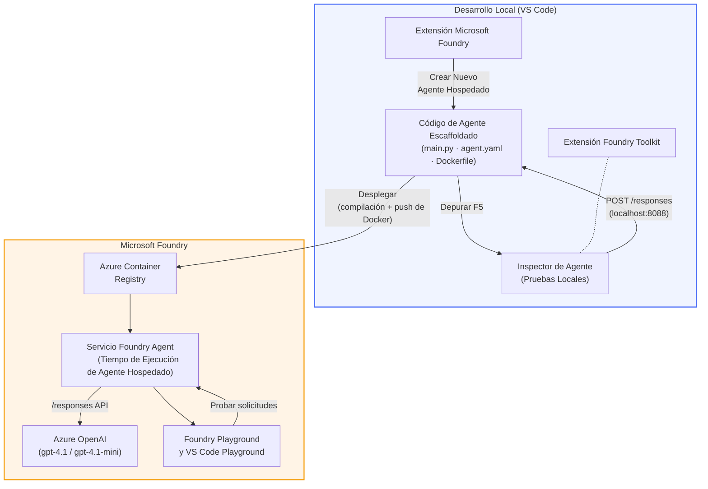

# Taller de Foundry Toolkit + Agentes Hospedados de Foundry

[](https://www.python.org/)
[](https://github.com/microsoft/agents)
[](https://learn.microsoft.com/azure/ai-foundry/agents/concepts/hosted-agents/)
[](https://ai.azure.com/)
[](https://learn.microsoft.com/azure/ai-services/openai/)
[](https://learn.microsoft.com/cli/azure/install-azure-cli)
[](https://learn.microsoft.com/azure/developer/azure-developer-cli/install-azd)
[](https://www.docker.com/)
[](https://marketplace.visualstudio.com/items?itemName=ms-windows-ai-studio.windows-ai-studio)
[](LICENSE)

Construye, prueba y despliega agentes de IA en el **Servicio de Agentes Microsoft Foundry** como **Agentes Hospedados** - todo desde VS Code utilizando la **extensión Microsoft Foundry** y el **Foundry Toolkit**.

> **Los Agentes Hospedados están actualmente en vista previa.** Las regiones soportadas son limitadas - consulta la [disponibilidad por región](https://learn.microsoft.com/azure/foundry/agents/concepts/hosted-agents#region-availability).

> La carpeta `agent/` dentro de cada laboratorio está **generada automáticamente** por la extensión Foundry - luego personalizas el código, pruebas localmente y despliegas.

### 🌐 Soporte Multilingüe

#### Soportado vía GitHub Action (Automatizado y Siempre Actualizado)

<!-- CO-OP TRANSLATOR LANGUAGES TABLE START -->
[Árabe](../ar/README.md) | [Bengalí](../bn/README.md) | [Búlgaro](../bg/README.md) | [Birmano (Myanmar)](../my/README.md) | [Chino (Simplificado)](../zh-CN/README.md) | [Chino (Tradicional, Hong Kong)](../zh-HK/README.md) | [Chino (Tradicional, Macao)](../zh-MO/README.md) | [Chino (Tradicional, Taiwán)](../zh-TW/README.md) | [Croata](../hr/README.md) | [Checo](../cs/README.md) | [Danés](../da/README.md) | [Holandés](../nl/README.md) | [Estonio](../et/README.md) | [Finlandés](../fi/README.md) | [Francés](../fr/README.md) | [Alemán](../de/README.md) | [Griego](../el/README.md) | [Hebreo](../he/README.md) | [Hindi](../hi/README.md) | [Húngaro](../hu/README.md) | [Indonesio](../id/README.md) | [Italiano](../it/README.md) | [Japonés](../ja/README.md) | [Kannada](../kn/README.md) | [Jemer](../km/README.md) | [Coreano](../ko/README.md) | [Lituano](../lt/README.md) | [Malayo](../ms/README.md) | [Malayalam](../ml/README.md) | [Maratí](../mr/README.md) | [Nepalí](../ne/README.md) | [Pidgin Nigeriano](../pcm/README.md) | [Noruego](../no/README.md) | [Persa (Farsi)](../fa/README.md) | [Polaco](../pl/README.md) | [Portugués (Brasil)](../pt-BR/README.md) | [Portugués (Portugal)](../pt-PT/README.md) | [Punjabi (Gurmukhi)](../pa/README.md) | [Rumano](../ro/README.md) | [Ruso](../ru/README.md) | [Serbio (Cirílico)](../sr/README.md) | [Eslovaco](../sk/README.md) | [Esloveno](../sl/README.md) | [Español](./README.md) | [Swahili](../sw/README.md) | [Sueco](../sv/README.md) | [Tagalo (Filipino)](../tl/README.md) | [Tamil](../ta/README.md) | [Telugu](../te/README.md) | [Tailandés](../th/README.md) | [Turco](../tr/README.md) | [Ucraniano](../uk/README.md) | [Urdu](../ur/README.md) | [Vietnamita](../vi/README.md)

> **¿Prefieres clonar localmente?**
>
> Este repositorio incluye más de 50 traducciones, lo que aumenta significativamente el tamaño de descarga. Para clonar sin traducciones, usa sparse checkout:
>
> **Bash / macOS / Linux:**
> ```bash
> git clone --filter=blob:none --sparse https://github.com/microsoft-foundry/Foundry_Toolkit_for_VSCode_Lab.git
> cd Foundry_Toolkit_for_VSCode_Lab
> git sparse-checkout set --no-cone '/*' '!translations' '!translated_images'
> ```
>
> **CMD (Windows):**
> ```cmd
> git clone --filter=blob:none --sparse https://github.com/microsoft-foundry/Foundry_Toolkit_for_VSCode_Lab.git
> cd Foundry_Toolkit_for_VSCode_Lab
> git sparse-checkout set --no-cone "/*" "!translations" "!translated_images"
> ```
>
> Esto te proporciona todo lo necesario para completar el curso con una descarga mucho más rápida.
<!-- CO-OP TRANSLATOR LANGUAGES TABLE END -->

---

## Arquitectura


**Flujo:** La extensión Foundry genera la estructura base del agente → personalizas el código e instrucciones → pruebas localmente con Agent Inspector → despliegas a Foundry (imagen Docker enviada a ACR) → verificas en Playground.

---

## Qué construirás

| Laboratorio | Descripción | Estado |
|-------------|-------------|--------|
| **Laboratorio 01 - Agente Único** | Construye el **agente "Explica Como Si Fuera un Ejecutivo"**, pruébalo localmente y despliega a Foundry | ✅ Disponible |
| **Laboratorio 02 - Flujo de Trabajo Multi-Agente** | Construye el **"Evaluador de Curriculum → Adecuación al Puesto"** - 4 agentes colaboran para calificar el ajuste del currículum y generar una hoja de ruta de aprendizaje | ✅ Disponible |

---

## Conoce al Agente Ejecutivo

En este taller construirás el **agente "Explica Como Si Fuera un Ejecutivo"** - un agente de IA que traduce la jerga técnica complicada en resúmenes tranquilos y aptos para la sala de juntas. Porque seamos honestos, nadie en la alta dirección quiere oír hablar sobre "agotamiento del pool de hilos causado por llamadas sincronizadas introducidas en la versión 3.2."

Construí este agente después de demasiados incidentes en los que mi post-mortem perfectamente elaborado recibía la respuesta: *"Entonces... ¿el sitio web está caído o no?"*

### Cómo funciona

Le das una actualización técnica. Él devuelve un resumen ejecutivo: tres puntos clave, sin jerga, sin rastros de pila, sin angustia existencial. Solo **qué pasó**, **impacto en el negocio** y **próximo paso**.

### Verlo en acción

**Tú dices:**
> "La latencia de la API aumentó debido al agotamiento del pool de hilos causado por llamadas sincronizadas introducidas en la versión 3.2."

**El agente responde:**

> **Resumen Ejecutivo:**  
> - **Qué pasó:** Después del último lanzamiento, el sistema se ralentizó.  
> - **Impacto en el negocio:** Algunos usuarios experimentaron retrasos al usar el servicio.  
> - **Próximo paso:** El cambio ha sido revertido y se está preparando una corrección antes del redepliegue.

### ¿Por qué este agente?

Es un agente de propósito único, sencillísimo, ideal para aprender el flujo de trabajo de agentes hospedados de principio a fin sin complicaciones con cadenas de herramientas complejas. ¿Y honestamente? Todo equipo de ingeniería podría beneficiarse de uno así.

---

## Estructura del taller

```
📂 Foundry_Toolkit_for_VSCode_Lab/
├── 📄 README.md                      ← You are here
├── 📂 ExecutiveAgent/                ← Standalone hosted agent project
│   ├── agent.yaml
│   ├── Dockerfile
│   ├── main.py
│   └── requirements.txt
└── 📂 workshop/
    ├── 📂 lab01-single-agent/        ← Full lab: docs + agent code
    │   ├── README.md                 ← Hands-on lab instructions
    │   ├── 📂 docs/                  ← Step-by-step tutorial modules
    │   │   ├── 00-prerequisites.md
    │   │   ├── 01-install-foundry-toolkit.md
    │   │   ├── 02-create-foundry-project.md
    │   │   ├── 03-create-hosted-agent.md
    │   │   ├── 04-configure-and-code.md
    │   │   ├── 05-test-locally.md
    │   │   ├── 06-deploy-to-foundry.md
    │   │   ├── 07-verify-in-playground.md
    │   │   └── 08-troubleshooting.md
    │   └── 📂 agent/                 ← Reference solution (auto-scaffolded by Foundry extension)
    │       ├── agent.yaml
    │       ├── Dockerfile
    │       ├── main.py
    │       └── requirements.txt
    └── 📂 lab02-multi-agent/         ← Resume → Job Fit Evaluator
        ├── README.md                 ← Hands-on lab instructions (end-to-end)
        ├── 📂 docs/                  ← Step-by-step tutorial modules
        │   ├── 00-prerequisites.md
        │   ├── 01-understand-multi-agent.md
        │   ├── 02-scaffold-multi-agent.md
        │   ├── 03-configure-agents.md
        │   ├── 04-orchestration-patterns.md
        │   ├── 05-test-locally.md
        │   ├── 06-deploy-to-foundry.md
        │   ├── 07-verify-in-playground.md
        │   └── 08-troubleshooting.md
        └── 📂 PersonalCareerCopilot/ ← Reference solution (multi-agent workflow)
            ├── agent.yaml
            ├── Dockerfile
            ├── main.py
            └── requirements.txt
```

> **Nota:** La carpeta `agent/` dentro de cada laboratorio es generada por la **extensión Microsoft Foundry** cuando ejecutas `Microsoft Foundry: Create a New Hosted Agent` desde la paleta de comandos. Luego se personalizan los archivos con las instrucciones, herramientas y configuración de tu agente. El Laboratorio 01 te guía para recrear esto desde cero.

---

## Comenzando

### 1. Clona el repositorio

```bash
git clone https://github.com/microsoft-foundry/Foundry_Toolkit_for_VSCode_Lab.git
cd Foundry_Toolkit_for_VSCode_Lab
```

### 2. Configura un entorno virtual de Python

```bash
python -m venv venv
```

Actívalo:

- **Windows (PowerShell):**
  ```powershell
  .\venv\Scripts\Activate.ps1
  ```
- **macOS / Linux:**
  ```bash
  source venv/bin/activate
  ```

### 3. Instala las dependencias

```bash
pip install -r workshop/lab01-single-agent/agent/requirements.txt
```

### 4. Configura variables de entorno

Copia el archivo `.env` de ejemplo dentro de la carpeta del agente y completa tus valores:

```bash
cp workshop/lab01-single-agent/agent/.env.example workshop/lab01-single-agent/agent/.env
```

Edita `workshop/lab01-single-agent/agent/.env`:

```env
AZURE_AI_PROJECT_ENDPOINT=https://<your-account>.services.ai.azure.com/api/projects/<your-project>
MODEL_DEPLOYMENT_NAME=<your-model-deployment-name>
```

### 5. Sigue los laboratorios del taller

Cada laboratorio es autónomo con sus propios módulos. Comienza con el **Laboratorio 01** para aprender los fundamentos, luego continúa con el **Laboratorio 02** para flujos de trabajo multi-agente.

#### Laboratorio 01 - Agente Único ([instrucciones completas](workshop/lab01-single-agent/README.md))

| # | Módulo | Enlace |
|---|--------|--------|
| 1 | Lee los prerrequisitos | [00-prerequisites.md](workshop/lab01-single-agent/docs/00-prerequisites.md) |
| 2 | Instala Foundry Toolkit y la extensión Foundry | [01-install-foundry-toolkit.md](workshop/lab01-single-agent/docs/01-install-foundry-toolkit.md) |
| 3 | Crea un proyecto Foundry | [02-create-foundry-project.md](workshop/lab01-single-agent/docs/02-create-foundry-project.md) |
| 4 | Crea un agente hospedado | [03-create-hosted-agent.md](workshop/lab01-single-agent/docs/03-create-hosted-agent.md) |
| 5 | Configura instrucciones y entorno | [04-configure-and-code.md](workshop/lab01-single-agent/docs/04-configure-and-code.md) |
| 6 | Prueba localmente | [05-test-locally.md](workshop/lab01-single-agent/docs/05-test-locally.md) |
| 7 | Despliega en Foundry | [06-deploy-to-foundry.md](workshop/lab01-single-agent/docs/06-deploy-to-foundry.md) |
| 8 | Verifica en playground | [07-verify-in-playground.md](workshop/lab01-single-agent/docs/07-verify-in-playground.md) |
| 9 | Solución de problemas | [08-troubleshooting.md](workshop/lab01-single-agent/docs/08-troubleshooting.md) |

#### Laboratorio 02 - Flujo de Trabajo Multi-Agente ([instrucciones completas](workshop/lab02-multi-agent/README.md))

| # | Módulo | Enlace |
|---|--------|--------|
| 1 | Prerrequisitos (Laboratorio 02) | [00-prerequisites.md](workshop/lab02-multi-agent/docs/00-prerequisites.md) |
| 2 | Comprender la arquitectura multi-agente | [01-understand-multi-agent.md](workshop/lab02-multi-agent/docs/01-understand-multi-agent.md) |
| 3 | Generar la estructura del proyecto multi-agente | [02-scaffold-multi-agent.md](workshop/lab02-multi-agent/docs/02-scaffold-multi-agent.md) |
| 4 | Configurar agentes y entorno | [03-configure-agents.md](workshop/lab02-multi-agent/docs/03-configure-agents.md) |
| 5 | Patrones de orquestación | [04-orchestration-patterns.md](workshop/lab02-multi-agent/docs/04-orchestration-patterns.md) |
| 6 | Prueba local (multi-agente) | [05-test-locally.md](workshop/lab02-multi-agent/docs/05-test-locally.md) |
| 7 | Desplegar en Foundry | [06-deploy-to-foundry.md](workshop/lab02-multi-agent/docs/06-deploy-to-foundry.md) |
| 8 | Verificar en el playground | [07-verify-in-playground.md](workshop/lab02-multi-agent/docs/07-verify-in-playground.md) |
| 9 | Solución de problemas (multi-agente) | [08-troubleshooting.md](workshop/lab02-multi-agent/docs/08-troubleshooting.md) |

---

## Mantenedor

<table>
<tr>
    <td align="center"><a href="https://github.com/ShivamGoyal03">
        <br />
        <sub><b>Shivam Goyal</b></sub>
    </a><br />
    </td>
</tr>
</table>

---

## Permisos requeridos (referencia rápida)

| Escenario | Roles requeridos |
|----------|---------------|
| Crear nuevo proyecto Foundry | **Azure AI Owner** en el recurso Foundry |
| Desplegar a proyecto existente (nuevos recursos) | **Azure AI Owner** + **Contributor** en la suscripción |
| Desplegar a proyecto completamente configurado | **Reader** en la cuenta + **Azure AI User** en el proyecto |

> **Importante:** Los roles de Azure `Owner` y `Contributor` solo incluyen permisos de *gestión*, no permisos de *desarrollo* (acción de datos). Necesitas **Azure AI User** o **Azure AI Owner** para crear y desplegar agentes.

---

## Referencias

- [Inicio rápido: Despliega tu primer agente hospedado (VS Code)](https://learn.microsoft.com/azure/foundry/agents/quickstarts/quickstart-hosted-agent)
- [¿Qué son los agentes hospedados?](https://learn.microsoft.com/azure/foundry/agents/concepts/hosted-agents)
- [Crear flujos de trabajo de agentes hospedados en VS Code](https://learn.microsoft.com/azure/foundry/agents/how-to/vs-code-agents-workflow-pro-code)
- [Desplegar un agente hospedado](https://learn.microsoft.com/azure/foundry/agents/how-to/deploy-hosted-agent)
- [RBAC para Microsoft Foundry](https://learn.microsoft.com/azure/foundry/concepts/rbac-foundry)
- [Ejemplo de agente de revisión de arquitectura](https://github.com/Azure-Samples/agent-architecture-review-sample) - Agente hospedado del mundo real con herramientas MCP, diagramas Excalidraw y despliegue dual

---

## Licencia

[MIT](../../LICENSE)

---

<!-- CO-OP TRANSLATOR DISCLAIMER START -->
**Descargo de responsabilidad**:  
Este documento ha sido traducido utilizando el servicio de traducción por IA [Co-op Translator](https://github.com/Azure/co-op-translator). Aunque nos esforzamos por la precisión, tenga en cuenta que las traducciones automáticas pueden contener errores o inexactitudes. El documento original en su idioma nativo debe considerarse la fuente autorizada. Para información crítica, se recomienda una traducción profesional realizada por humanos. No nos hacemos responsables de malentendidos o interpretaciones erróneas derivadas del uso de esta traducción.
<!-- CO-OP TRANSLATOR DISCLAIMER END -->