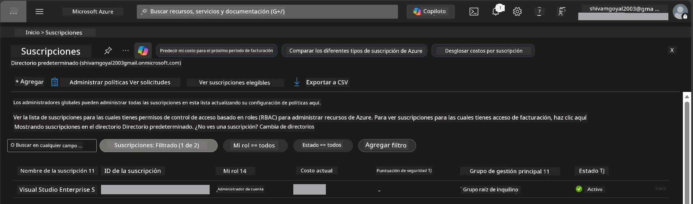

# Módulo 0 - Requisitos previos

Antes de comenzar el taller, confirme que tiene las siguientes herramientas, accesos y entorno listos. Siga cada paso a continuación, no omita ninguno.

---

## 1. Cuenta y suscripción de Azure

### 1.1 Crear o verificar su suscripción de Azure

1. Abra un navegador y navegue a [https://azure.microsoft.com/free/](https://azure.microsoft.com/free/).
2. Si no tiene una cuenta de Azure, haga clic en **Comenzar gratis** y siga el flujo de registro. Necesitará una cuenta de Microsoft (o crear una) y una tarjeta de crédito para la verificación de identidad.
3. Si ya tiene una cuenta, inicie sesión en [https://portal.azure.com](https://portal.azure.com).
4. En el Portal, haga clic en el panel **Suscripciones** en la navegación izquierda (o busque "Suscripciones" en la barra de búsqueda superior).
5. Verifique que vea al menos una suscripción **Activa**. Anote el **ID de suscripción**, lo necesitará más adelante.



### 1.2 Comprender los roles RBAC requeridos

La implementación de [Agentes alojados](https://learn.microsoft.com/azure/foundry/agents/concepts/hosted-agents) requiere permisos de **acción de datos** que los roles estándar de Azure `Owner` y `Contributor` **no** incluyen. Necesitará una de estas [combinaciones de roles](https://learn.microsoft.com/azure/foundry/concepts/rbac-foundry#built-in-roles):

| Escenario | Roles requeridos | Dónde asignarlos |
|----------|---------------|------------------|
| Crear nuevo proyecto Foundry | **Azure AI Owner** en el recurso Foundry | Recurso Foundry en el Portal de Azure |
| Implementar en proyecto existente (nuevos recursos) | **Azure AI Owner** + **Contributor** en la suscripción | Suscripción + recurso Foundry |
| Implementar en proyecto totalmente configurado | **Reader** en la cuenta + **Azure AI User** en el proyecto | Cuenta + Proyecto en el Portal de Azure |

> **Punto clave:** Los roles `Owner` y `Contributor` de Azure solo cubren permisos de *gestión* (operaciones ARM). Necesita [**Azure AI User**](https://learn.microsoft.com/azure/foundry/concepts/rbac-foundry#built-in-roles) (o superior) para *acciones de datos* como `agents/write`, que son necesarias para crear e implementar agentes. Asignará estos roles en el [Módulo 2](02-create-foundry-project.md).

---

## 2. Instalar herramientas locales

Instale cada herramienta a continuación. Después de la instalación, verifique que funcione ejecutando el comando de verificación.

### 2.1 Visual Studio Code

1. Vaya a [https://code.visualstudio.com/](https://code.visualstudio.com/).
2. Descargue el instalador para su SO (Windows/macOS/Linux).
3. Ejecute el instalador con la configuración predeterminada.
4. Abra VS Code para confirmar que se inicia.

### 2.2 Python 3.10+

1. Vaya a [https://www.python.org/downloads/](https://www.python.org/downloads/).
2. Descargue Python 3.10 o posterior (se recomienda 3.12+).
3. **Windows:** Durante la instalación, marque **"Add Python to PATH"** en la primera pantalla.
4. Abra una terminal y verifique:

   ```powershell
   python --version
   ```

   Salida esperada: `Python 3.10.x` o superior.

### 2.3 Azure CLI

1. Vaya a [https://learn.microsoft.com/cli/azure/install-azure-cli](https://learn.microsoft.com/cli/azure/install-azure-cli).
2. Siga las instrucciones de instalación para su SO.
3. Verifique:

   ```powershell
   az --version
   ```

   Esperado: `azure-cli 2.80.0` o superior.

4. Inicie sesión:

   ```powershell
   az login
   ```

### 2.4 Azure Developer CLI (azd)

1. Vaya a [https://learn.microsoft.com/azure/developer/azure-developer-cli/install-azd](https://learn.microsoft.com/azure/developer/azure-developer-cli/install-azd).
2. Siga las instrucciones de instalación para su SO. En Windows:

   ```powershell
   winget install microsoft.azd
   ```

3. Verifique:

   ```powershell
   azd version
   ```

   Esperado: `azd version 1.x.x` o superior.

4. Inicie sesión:

   ```powershell
   azd auth login
   ```

### 2.5 Docker Desktop (opcional)

Docker solo se necesita si desea construir y probar la imagen del contenedor localmente antes de la implementación. La extensión Foundry maneja las compilaciones del contenedor automáticamente durante la implementación.

1. Vaya a [https://docs.docker.com/get-docker/](https://docs.docker.com/get-docker/).
2. Descargue e instale Docker Desktop para su SO.
3. **Windows:** Asegúrese de que el backend WSL 2 esté seleccionado durante la instalación.
4. Inicie Docker Desktop y espere a que el ícono en la bandeja del sistema muestre **"Docker Desktop is running"**.
5. Abra una terminal y verifique:

   ```powershell
   docker info
   ```

   Esto debería imprimir la información del sistema Docker sin errores. Si ve `Cannot connect to the Docker daemon`, espere unos segundos más para que Docker se inicie por completo.

---

## 3. Instalar extensiones de VS Code

Necesita tres extensiones. Instálelas **antes** de que comience el taller.

### 3.1 Microsoft Foundry para VS Code

1. Abra VS Code.
2. Presione `Ctrl+Shift+X` para abrir el panel de Extensiones.
3. En el cuadro de búsqueda, escriba **"Microsoft Foundry"**.
4. Encuentre **Microsoft Foundry for Visual Studio Code** (editor: Microsoft, ID: `TeamsDevApp.vscode-ai-foundry`).
5. Haga clic en **Instalar**.
6. Después de la instalación, debería ver el ícono **Microsoft Foundry** aparecer en la Barra de Actividades (barra lateral izquierda).

### 3.2 Foundry Toolkit

1. En el panel de Extensiones (`Ctrl+Shift+X`), busque **"Foundry Toolkit"**.
2. Encuentre **Foundry Toolkit** (editor: Microsoft, ID: `ms-windows-ai-studio.windows-ai-studio`).
3. Haga clic en **Instalar**.
4. El ícono de **Foundry Toolkit** debería aparecer en la Barra de Actividades.

### 3.3 Python

1. En el panel de Extensiones, busque **"Python"**.
2. Encuentre **Python** (editor: Microsoft, ID: `ms-python.python`).
3. Haga clic en **Instalar**.

---

## 4. Iniciar sesión en Azure desde VS Code

El [Microsoft Agent Framework](https://learn.microsoft.com/agent-framework/overview/) usa [`DefaultAzureCredential`](https://learn.microsoft.com/azure/developer/python/sdk/authentication/credential-chains#defaultazurecredential-overview) para la autenticación. Necesita haber iniciado sesión en Azure en VS Code.

### 4.1 Iniciar sesión vía VS Code

1. Mire en la esquina inferior izquierda de VS Code y haga clic en el ícono **Cuentas** (silueta de persona).
2. Haga clic en **Iniciar sesión para usar Microsoft Foundry** (o **Iniciar sesión con Azure**).
3. Se abrirá una ventana del navegador: inicie sesión con la cuenta de Azure que tenga acceso a su suscripción.
4. Regrese a VS Code. Debería ver el nombre de su cuenta en la esquina inferior izquierda.

### 4.2 (Opcional) Iniciar sesión vía Azure CLI

Si instaló la Azure CLI y prefiere autenticarse por línea de comandos:

```powershell
az login
```

Esto abrirá un navegador para iniciar sesión. Después de iniciar sesión, configure la suscripción correcta:

```powershell
az account set --subscription "<your-subscription-id>"
```

Verifique:

```powershell
az account show --query "{name:name, id:id, state:state}" --output table
```

Debería ver el nombre de su suscripción, ID y estado = `Enabled`.

### 4.3 (Alternativa) Autenticación con principal de servicio

Para CI/CD o entornos compartidos, configure estas variables de entorno en su lugar:

```powershell
$env:AZURE_TENANT_ID = "<your-tenant-id>"
$env:AZURE_CLIENT_ID = "<your-client-id>"
$env:AZURE_CLIENT_SECRET = "<your-client-secret>"
```

---

## 5. Limitaciones de la vista previa

Antes de continuar, tenga en cuenta las limitaciones actuales:

- Los [**Agentes alojados**](https://learn.microsoft.com/azure/foundry/agents/concepts/hosted-agents) están actualmente en **vista previa pública** - no se recomienda para cargas de trabajo en producción.
- Las **regiones soportadas son limitadas** - consulte la [disponibilidad por región](https://learn.microsoft.com/azure/foundry/agents/concepts/hosted-agents#region-availability) antes de crear recursos. Si elige una región no soportada, la implementación fallará.
- El paquete `azure-ai-agentserver-agentframework` está en pre-lanzamiento (`1.0.0b16`) - las APIs pueden cambiar.
- Límites de escalado: los agentes alojados soportan de 0 a 5 réplicas (incluido el escalado a cero).

---

## 6. Lista de verificación previa

Revise cada ítem abajo. Si algún paso falla, regrese y arréglelo antes de continuar.

- [ ] VS Code se abre sin errores
- [ ] Python 3.10+ está en su PATH (`python --version` muestra `3.10.x` o superior)
- [ ] Azure CLI está instalado (`az --version` muestra `2.80.0` o superior)
- [ ] Azure Developer CLI está instalado (`azd version` muestra información de versión)
- [ ] La extensión Microsoft Foundry está instalada (ícono visible en la Barra de Actividades)
- [ ] La extensión Foundry Toolkit está instalada (ícono visible en la Barra de Actividades)
- [ ] La extensión Python está instalada
- [ ] Ha iniciado sesión en Azure en VS Code (verifique el ícono Cuentas, abajo a la izquierda)
- [ ] `az account show` devuelve su suscripción
- [ ] (Opcional) Docker Desktop está en ejecución (`docker info` muestra información del sistema sin errores)

### Punto de control

Abra la Barra de Actividades de VS Code y confirme que puede ver ambas vistas laterales **Foundry Toolkit** y **Microsoft Foundry**. Haga clic en cada una para verificar que se cargan sin errores.

---

**Siguiente:** [01 - Instalar Foundry Toolkit & Extensión Foundry →](01-install-foundry-toolkit.md)

---

<!-- CO-OP TRANSLATOR DISCLAIMER START -->
**Aviso Legal**:  
Este documento ha sido traducido utilizando el servicio de traducción automática [Co-op Translator](https://github.com/Azure/co-op-translator). Aunque nos esforzamos por la precisión, tenga en cuenta que las traducciones automáticas pueden contener errores o inexactitudes. El documento original en su idioma nativo debe considerarse la fuente autorizada. Para información crítica, se recomienda una traducción profesional realizada por humanos. No nos hacemos responsables de ningún malentendido o interpretación errónea derivada del uso de esta traducción.
<!-- CO-OP TRANSLATOR DISCLAIMER END -->