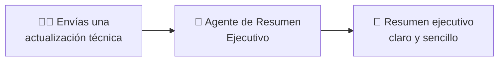

# Módulo 0 - Introducción

⏱️ ~10 min

> [!WARNING]
> **Vista previa y limitaciones:** Los [Agentes alojados](https://learn.microsoft.com/azure/foundry/agents/concepts/hosted-agents) están actualmente en **vista previa pública** - no se recomiendan para cargas de trabajo en producción. Tenga en cuenta lo siguiente:
> - **Las regiones compatibles son limitadas** - consulte la [disponibilidad por región](https://learn.microsoft.com/azure/foundry/agents/concepts/hosted-agents#region-availability) antes de crear recursos. Si selecciona una región no compatible, la implementación fallará.
> - El paquete `azure-ai-agentserver-agentframework` está en versión preliminar - las API pueden cambiar entre versiones.
> - Límites de escala: los agentes alojados admiten de 0 a 5 réplicas (incluyendo escalado a cero).
> - Algunas características mostradas en este taller pueden cambiar a medida que el servicio se acerca a GA.

## Lo que construirás

En este taller, construirás un agente de **"Explícalo como si fuera un ejecutivo"**: un agente de IA alojado que toma actualizaciones técnicas complejas y las reescribe como resúmenes ejecutivos en inglés sencillo.

```mermaid
flowchart LR
    A["🧑‍💻 Envías una\nactualización técnica"] --> B["🤖 Agente de Resumen\nEjecutivo"]
    B --> C["📝 Resumen ejecutivo\nclaro y sencillo"]
```

**El agente utiliza:**
- **Microsoft Agent Framework** - para la lógica y estructura del agente
- **Foundry Toolkit para VS Code** - para generar la estructura, probar localmente y desplegar
- **Un modelo de IA** (por ejemplo, `gpt-4.1-mini/gpt-5-mini`) - para generar los resúmenes

Al final de este laboratorio, tendrás un agente funcional que podrás probar localmente vía el Inspector de Agentes, y opcionalmente desplegar en la nube.

---

## ¿Qué son los agentes alojados?

Un **agente alojado** es un agente de IA que se ejecuta como un servicio administrado en Microsoft Foundry. En lugar de administrar tu propia infraestructura, empaquetas el código de tu agente en un contenedor y Foundry se encarga del escalado, alojamiento y la exposición a través de un endpoint HTTP estándar.

| Concepto | Qué significa |
|---------|--------------|
| **Agente** | Tu código Python que recibe un mensaje de usuario, llama a un modelo de IA y retorna una respuesta estructurada |
| **Alojado** | Foundry ejecuta tu contenedor por ti - sin máquinas virtuales, sin Kubernetes, sin infraestructura que gestionar |
| **Protocolo de respuestas** | Una API HTTP estándar (`POST /responses`) que cualquier cliente puede usar para interactuar con tu agente |
| **Inspector de Agentes** | Una UI de pruebas local (integrada en Foundry Toolkit) que te permite chatear con tu agente antes de desplegar |

En este taller, irás desde cero hasta un agente completamente alojado - o puedes detenerte en las pruebas locales si prefieres.

---

## Elige tu camino

> ⚠️ **Elige un camino antes de continuar.** Tu elección determina qué herramientas instalar y qué módulos aplicar. Puedes cambiar de Camino B → Camino A después si obtienes una suscripción.

<strong>🅰️ Camino A - Azure cloud (requiere suscripción Azure)</strong>

| | Detalles |
|---|---|
| **¿Para quién es?** | Tienes una suscripción activa de Azure y puedes crear recursos en Foundry |
| **Modelo** | Azure OpenAI vía Foundry (por ejemplo, `gpt-4.1-mini/gpt-5-mini`) |
| **Módulos cubiertos** | Todos los módulos (00–07) |
| **¿Desplegar en la nube?** | ✅ Sí - despliegue completo de extremo a extremo |

<strong>🅱️ Camino B - Local / nivel gratuito (no se necesita suscripción Azure)</strong>

| | Detalles |
|---|---|
| **¿Para quién es?** | MVPs, estudiantes o cualquiera sin acceso a Azure |
| **Modelo** | **Foundry Local** (gratis, se ejecuta en tu máquina) |
| **Módulos cubiertos** | Módulos 00–04 (omite despliegue y verificación en la nube) |
| **¿Desplegar en la nube?** | ❌ No - solo pruebas locales vía Inspector de Agentes |

---

## Todos los caminos: Herramientas requeridas

Instala cada herramienta abajo. Después de instalarlas, verifica que funcionan ejecutando el comando de comprobación.

| # | Herramienta | Versión | Instalación | Verificar (Salida esperada) |
|---|------------|---------|-------------|-----------------------------|
| 1 | **Visual Studio Code** | Última | [code.visualstudio.com](https://code.visualstudio.com/) | Se abre sin errores |
| 2 | **Python** | 3.12 o superior| [python.org/downloads](https://www.python.org/downloads/) | `python --version` $\rightarrow$ `Python 3.12.x` |
| 3 | **Foundry Toolkit para VS Code** | Última | ID extensión: `ms-windows-ai-studio.windows-ai-studio` | Ícono de Foundry en la barra de actividades |
| 4 | **Extensión Python para VS Code** | Última | ID extensión: `ms-python.python` | Instalada en el panel de Extensiones |

> [!TIP]
> **Consejos profesionales para la instalación:**
> - **Python PATH (Windows):** Marca siempre **"Agregar Python al PATH"** en la primera pantalla del instalador de Python. Sin esto, `python` no será reconocido en tu terminal.
> - **Múltiples versiones de Python:** Si tienes Python 3.10 y 3.12 instalados, usa `python3.12 -m venv .venv` para asegurar que la versión correcta se use en tu entorno virtual.
> - **Docker WSL 2 (Windows):** Durante la instalación de Docker Desktop, asegúrate de seleccionar el **backend WSL 2**. Docker con Hyper-V es más lento y puede causar problemas con las compilaciones de contenedores en Foundry.
> - **¿Docker no inicia?** Espera 30–60 segundos después de iniciar Docker Desktop. Ejecuta `docker info` - si ves "Cannot connect to the Docker daemon," Docker todavía se está inicializando.
> - **¿Extensiones de VS Code no cargan?** Después de instalar extensiones, recarga la ventana: `Ctrl+Shift+P` → `Developer: Reload Window`.

> **Usuarios de Windows:** Marquen **"Agregar Python al PATH"** durante la instalación de Python.

**Siguiente:** [01 - Configuración →](01-setup.md)

---

<!-- CO-OP TRANSLATOR DISCLAIMER START -->
**Descargo de responsabilidad**:
Este documento ha sido traducido utilizando el servicio de traducción automática [Co-op Translator](https://github.com/Azure/co-op-translator). Aunque nos esforzamos por la precisión, tenga en cuenta que las traducciones automatizadas pueden contener errores o inexactitudes. El documento original en su idioma nativo debe considerarse la fuente autorizada. Para información crítica, se recomienda una traducción profesional humana. No somos responsables de cualquier malentendido o interpretación errónea que surja del uso de esta traducción.
<!-- CO-OP TRANSLATOR DISCLAIMER END -->