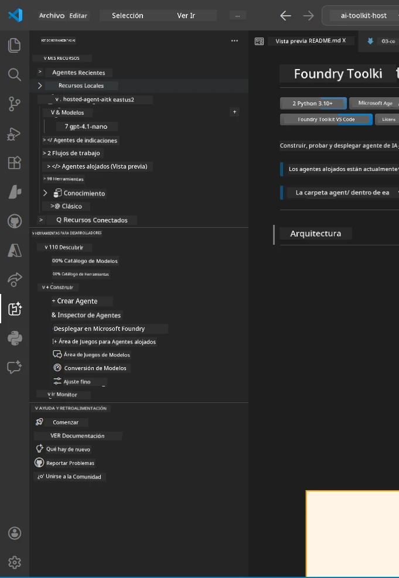
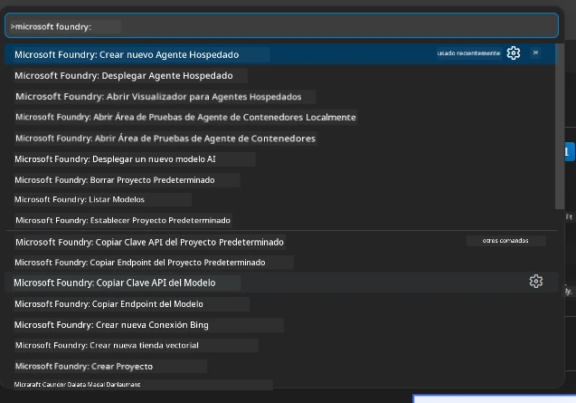

# Module 1 - Instalar Foundry Toolkit y Foundry Extension

Este módulo te guía para instalar y verificar las dos extensiones clave de VS Code para este taller. Si ya las instalaste durante el [Módulo 0](00-prerequisites.md), usa este módulo para verificar que estén funcionando correctamente.

---

## Paso 1: Instalar la extensión Microsoft Foundry

La extensión **Microsoft Foundry for VS Code** es tu herramienta principal para crear proyectos Foundry, desplegar modelos, generar agentes alojados y desplegar directamente desde VS Code.

1. Abre VS Code.
2. Presiona `Ctrl+Shift+X` para abrir el panel de **Extensiones**.
3. En el cuadro de búsqueda en la parte superior, escribe: **Microsoft Foundry**
4. Busca el resultado titulado **Microsoft Foundry for Visual Studio Code**.
   - Editor: **Microsoft**
   - ID de extensión: `TeamsDevApp.vscode-ai-foundry`
5. Haz clic en el botón **Instalar**.
6. Espera a que la instalación termine (verás un pequeño indicador de progreso).
7. Después de la instalación, mira la **Barra de Actividad** (la barra vertical de iconos en el lado izquierdo de VS Code). Deberías ver un nuevo icono llamado **Microsoft Foundry** (parece un diamante/icono de IA).
8. Haz clic en el icono de **Microsoft Foundry** para abrir su vista lateral. Deberías ver secciones para:
   - **Recursos** (o Proyectos)
   - **Agentes**
   - **Modelos**

> **Si el icono no aparece:** Intenta recargar VS Code (`Ctrl+Shift+P` → `Developer: Reload Window`).

---

## Paso 2: Instalar la extensión Foundry Toolkit

La extensión **Foundry Toolkit** proporciona el [**Inspector de Agentes**](https://learn.microsoft.com/azure/foundry/agents/how-to/vs-code-agents-workflow-pro-code) - una interfaz visual para probar y depurar agentes localmente - además de un playground, gestión de modelos y herramientas de evaluación.

1. En el panel de Extensiones (`Ctrl+Shift+X`), limpia el cuadro de búsqueda y escribe: **Foundry Toolkit**
2. Encuentra **Foundry Toolkit** en los resultados.
   - Editor: **Microsoft**
   - ID de extensión: `ms-windows-ai-studio.windows-ai-studio`
3. Haz clic en **Instalar**.
4. Después de la instalación, el icono de **Foundry Toolkit** aparece en la Barra de Actividad (parece un robot/icono de brillo).
5. Haz clic en el icono de **Foundry Toolkit** para abrir su vista lateral. Deberías ver la pantalla de bienvenida de Foundry Toolkit con opciones para:
   - **Modelos**
   - **Playground**
   - **Agentes**

---

## Paso 3: Verificar que ambas extensiones funcionan

### 3.1 Verificar la extensión Microsoft Foundry

1. Haz clic en el icono de **Microsoft Foundry** en la Barra de Actividad.
2. Si estás conectado a Azure (del Módulo 0), deberías ver tus proyectos listados bajo **Recursos**.
3. Si se te solicita iniciar sesión, haz clic en **Iniciar sesión** y sigue el flujo de autenticación.
4. Confirma que puedes ver la barra lateral sin errores.

### 3.2 Verificar la extensión Foundry Toolkit

1. Haz clic en el icono de **Foundry Toolkit** en la Barra de Actividad.
2. Confirma que la vista de bienvenida o el panel principal se cargan sin errores.
3. No necesitas configurar nada aún - usaremos el Inspector de Agentes en el [Módulo 5](05-test-locally.md).

### 3.3 Verificar vía la Paleta de Comandos

1. Presiona `Ctrl+Shift+P` para abrir la Paleta de Comandos.
2. Escribe **"Microsoft Foundry"** - deberías ver comandos como:
   - `Microsoft Foundry: Create a New Hosted Agent`
   - `Microsoft Foundry: Deploy Hosted Agent`
   - `Microsoft Foundry: Open Model Catalog`
3. Presiona `Escape` para cerrar la Paleta de Comandos.
4. Abre la Paleta de Comandos de nuevo y escribe **"Foundry Toolkit"** - deberías ver comandos como:
   - `Foundry Toolkit: Open Agent Inspector`

> Si no ves estos comandos, es posible que las extensiones no estén instaladas correctamente. Intenta desinstalarlas y volver a instalarlas.

---

## Qué hacen estas extensiones en este taller

| Extensión | Qué hace | Cuándo la usarás |
|-----------|----------|------------------|
| **Microsoft Foundry for VS Code** | Crear proyectos Foundry, desplegar modelos, **generar [agentes alojados](https://learn.microsoft.com/azure/foundry/agents/concepts/hosted-agents)** (auto-generación de `agent.yaml`, `main.py`, `Dockerfile`, `requirements.txt`), desplegar en el [Foundry Agent Service](https://learn.microsoft.com/azure/foundry/agents/overview) | Módulos 2, 3, 6, 7 |
| **Foundry Toolkit** | Inspector de Agentes para pruebas y depuración local, interfaz de playground, gestión de modelos | Módulos 5, 7 |

> **La extensión Foundry es la herramienta más crítica en este taller.** Maneja el ciclo de vida completo: generar → configurar → desplegar → verificar. Foundry Toolkit la complementa proporcionando el Inspector de Agentes visual para pruebas locales.

---

### Punto de control

- [ ] El icono de Microsoft Foundry es visible en la Barra de Actividad
- [ ] Al hacer clic abre la barra lateral sin errores
- [ ] El icono de Foundry Toolkit es visible en la Barra de Actividad
- [ ] Al hacer clic abre la barra lateral sin errores
- [ ] `Ctrl+Shift+P` → escribir "Microsoft Foundry" muestra los comandos disponibles
- [ ] `Ctrl+Shift+P` → escribir "Foundry Toolkit" muestra los comandos disponibles

---

**Anterior:** [00 - Prerrequisitos](00-prerequisites.md) · **Siguiente:** [02 - Crear Proyecto Foundry →](02-create-foundry-project.md)

---

<!-- CO-OP TRANSLATOR DISCLAIMER START -->
**Descargo de responsabilidad**:  
Este documento ha sido traducido utilizando el servicio de traducción automática [Co-op Translator](https://github.com/Azure/co-op-translator). Aunque nos esforzamos por la precisión, tenga en cuenta que las traducciones automáticas pueden contener errores o inexactitudes. El documento original en su idioma nativo debe considerarse la fuente autorizada. Para información crítica, se recomienda la traducción profesional humana. No nos responsabilizamos por malentendidos o interpretaciones erróneas derivados del uso de esta traducción.
<!-- CO-OP TRANSLATOR DISCLAIMER END -->