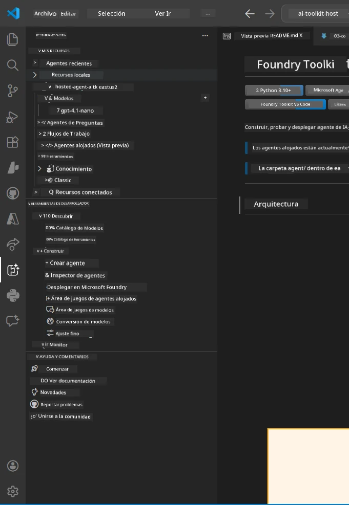
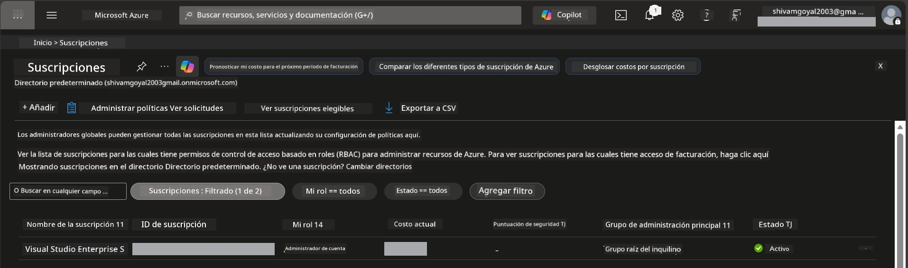
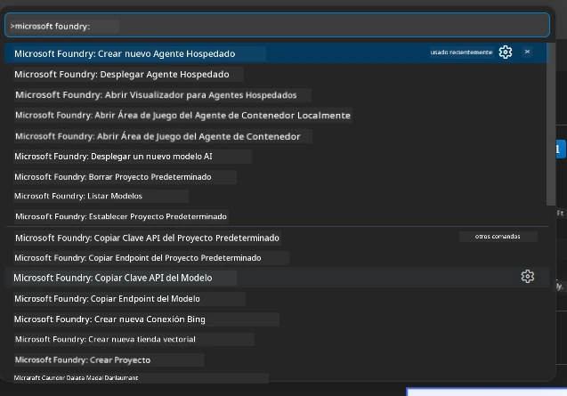
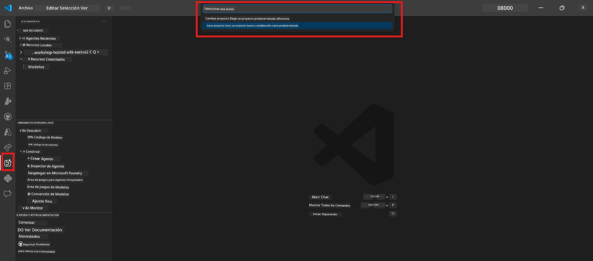
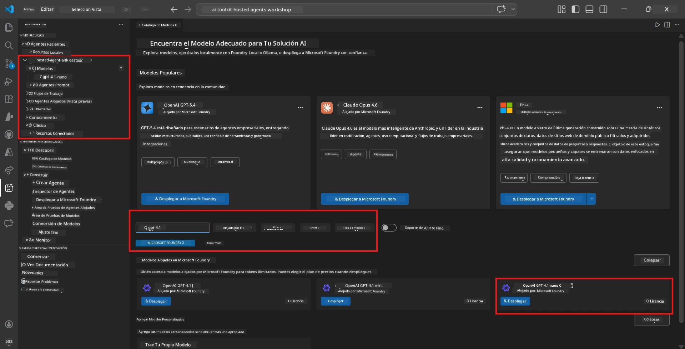
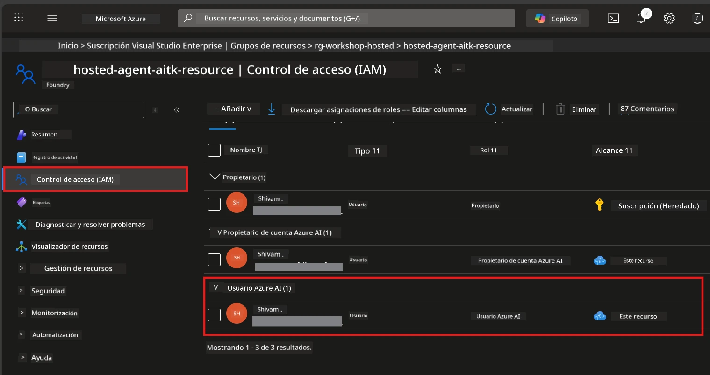

# Configuración: Extensión, Proyecto y Modelo

⏱️ ~15 min

En este módulo, instalarás y verificarás la extensión Foundry Toolkit, crearás (o conectarás) un proyecto Foundry y desplegarás un modelo que tu agente utilizará.

## Paso 1: Instalar Foundry Toolkit

**Foundry Toolkit para VS Code** es la extensión principal para este taller. Proporciona creación de proyectos, despliegue de modelos, esqueleto para agentes, pruebas locales (Inspector de Agentes) y despliegue en la nube, todo desde VS Code.

1. Abre VS Code y presiona `Ctrl+Shift+X` para abrir el panel de **Extensiones**.
2. Busca **Foundry Toolkit**.
3. Instala **Foundry Toolkit para VS Code** (Editor: Microsoft, ID: `ms-windows-ai-studio.windows-ai-studio`).
4. Tras la instalación, el ícono de **Foundry Toolkit** aparecerá en la Barra de Actividades (barra lateral izquierda).

> *Nota: La Barra de Actividades puede mostrar "AI TOOLKIT" en versiones antiguas de la extensión. La funcionalidad es idéntica.*



## Paso 2: Configuración según tu acceso

> **Elige tu ruta:** Expande la sección que coincide con tu configuración. Solo necesitas completar **una** ruta.

<details>
<summary><strong>🅰️ Ruta A - Nube Azure (requiere suscripción Azure)</strong></summary>

### Azure CLI

1. Instálalo desde [learn.microsoft.com/cli/azure/install-azure-cli](https://learn.microsoft.com/cli/azure/install-azure-cli).
2. Verifica: `az --version` (se espera versión 2.80.0 o superior).
3. Inicia sesión: `az login`

### Opciones de autenticación

El [Microsoft Agent Framework](https://learn.microsoft.com/agent-framework/overview/) usa [`DefaultAzureCredential`](https://learn.microsoft.com/azure/developer/python/sdk/authentication/credential-chains#defaultazurecredential-overview) que prueba múltiples métodos de autenticación en orden. Elige el que se adapte a tu entorno:

#### Opción 1: Cuentas de VS Code (recomendado para talleres)
1. Haz clic en el ícono de **Cuentas** (silueta de persona) en la esquina inferior izquierda de VS Code.
2. Selecciona **Iniciar sesión para usar Microsoft Foundry** (o **Iniciar sesión con Azure**).
3. Se abrirá un navegador: inicia sesión con la cuenta de Azure que tenga acceso a tu suscripción.
4. Vuelve a VS Code. Deberías ver el nombre de tu cuenta en la esquina inferior izquierda.

#### Opción 2: Azure CLI
```bash
az login
az account set --subscription "<your-subscription-id>"
```

#### Opción 3: Principal de servicio (Enterprise/CI)
Para entornos restringidos o pipelines CI/CD, configura estas variables de entorno en tu archivo `.env`:
```env
AZURE_TENANT_ID=<your-tenant-id>
AZURE_CLIENT_ID=<your-client-id>
AZURE_CLIENT_SECRET=<your-client-secret>
```

> **Cómo funciona `DefaultAzureCredential`:** Primero intenta variables de entorno, luego identidad administrada, luego inicio de sesión en VS Code, luego Azure CLI, y utiliza el primero que tenga éxito. Consulta la [documentación de la cadena de credenciales](https://learn.microsoft.com/azure/developer/python/sdk/authentication/credential-chains#defaultazurecredential-overview).

### Azure Developer CLI (azd)

1. Instala: `winget install microsoft.azd` (Windows) o consulta la [documentación de instalación](https://learn.microsoft.com/azure/developer/azure-developer-cli/install-azd).
2. Verifica: `azd version`
3. Inicia sesión: `azd auth login`

### Docker Desktop (opcional)

Docker solo es necesario si deseas construir contenedores localmente. La extensión Foundry gestiona las construcciones automáticamente durante el despliegue.

1. Instálalo desde [docs.docker.com/get-docker](https://docs.docker.com/get-docker/).
2. Verifica: `docker info`

### Suscripción Azure y RBAC

1. Inicia sesión en [portal.azure.com](https://portal.azure.com).
2. Navega a **Suscripciones** y confirma que al menos una esté **Activa**.
3. Anota tu **ID de Suscripción** - lo necesitarás en el Módulo 01.



#### Tabla de escenarios RBAC

El despliegue de [Agentes Hospedados](https://learn.microsoft.com/azure/foundry/agents/concepts/hosted-agents) requiere permisos de **acción de datos** que los roles estándar de Azure `Owner` y `Contributor` **no** incluyen. Usa la siguiente tabla para determinar qué roles necesitas:

| Escenario | Roles requeridos | Dónde asignarlos |
|----------|-----------------|------------------|
| Crear nuevo proyecto Foundry | **Azure AI Owner** en el recurso Foundry | Recurso Foundry en el Portal de Azure |
| Desplegar en proyecto existente (recursos nuevos) | **Azure AI Owner** + **Contributor** en la suscripción | Suscripción + Recurso Foundry |
| Desplegar en proyecto completamente configurado | **Reader** en cuenta + **Azure AI User** en proyecto | Cuenta + Proyecto en el Portal de Azure |
| Solo pruebas locales (sin despliegue) | **Azure AI User** en proyecto | Proyecto en el Portal de Azure |

> **Punto clave:** Los roles Azure `Owner` y `Contributor` solo cubren permisos de *gestión* (operaciones ARM). Necesitas [**Azure AI User**](https://learn.microsoft.com/azure/foundry/concepts/rbac-foundry#built-in-roles) (o superior) para *acciones de datos* como `agents/write` que es requerido para crear y desplegar agentes.

## Conectar o crear un proyecto Foundry



1. Presiona `Ctrl+Shift+P` → escribe **Foundry Toolkit: Create Project** → selecciónalo.
2. Selecciona tu **suscripción Azure** del desplegable.
3. Selecciona o crea un **grupo de recursos** (p. ej., `rg-hosted-agents-workshop`).
4. Selecciona una **región** que soporte agentes hospedados: `East US`, `West US 2` o `Sweden Central`. Consulta la [disponibilidad por región](https://learn.microsoft.com/azure/foundry/agents/concepts/hosted-agents#region-availability).
5. Ingresa un nombre para el proyecto (p. ej., `workshop-agents`).
6. Espera 2–5 minutos para la provisión. Aparece una notificación de progreso en VS Code.
7. Cuando finalice, tu proyecto aparecerá en la barra lateral de **Foundry Toolkit** bajo **MIS RECURSOS**.



## Desplegar un modelo y asignar RBAC

Tu agente hospedado necesita un modelo de IA para generar respuestas.

#### Matriz de selección de modelo
Según tus necesidades, puedes elegir entre diferentes niveles de modelo:

| Modelo | Mejor para | Costo | Notas |
|--------|-----------|-------|-------|
| `gpt-4.1` | Respuestas de alta calidad y matizadas | Más alto | Mejores resultados, recomendado para pruebas finales |
| `gpt-4.1-mini/gpt-5-mini` | Iteración rápida, costo menor | Más bajo | Bueno para desarrollo del taller y pruebas rápidas |
| `gpt-4.1-nano` | Tareas ligeras | Más bajo | Más económico, pero respuestas más simples |

1. Presiona `Ctrl+Shift+P` → **Foundry Toolkit: Open Model Catalog** (o haz clic en **Catálogo de Modelos** en la barra lateral en HERRAMIENTAS DE DESARROLLADOR → Descubrir).
2. Busca **gpt-4.1** en el catálogo.
3. Encuentra **OpenAI GPT-4.1-mini** (o `gpt-5-mini` para mejor calidad) y haz clic en **Desplegar**.



4. En la configuración de despliegue:
   - **Nombre del despliegue:** Deja el valor por defecto o ingresa un nombre personalizado. **Recuerda este nombre.**
   - **Destino:** Selecciona **Desplegar en Foundry Toolkit** → elige tu proyecto.
5. Haz clic en **Desplegar** y espera 1–3 minutos.

> **Recomendación:** Usa `gpt-4.1-mini/gpt-5-mini` para el taller: rápido, asequible y produce buenos resultados.

### Anota tus valores

Después del despliegue, anota estos dos valores (los necesitarás en el Módulo 03):

| Valor | Dónde encontrarlo |
|-------|-------------------|
| **Punto de conexión del proyecto** | Haz clic en tu proyecto en la barra lateral → la vista de detalles muestra la URL (p. ej., `https://<account>.services.ai.azure.com/api/projects/<project>`) |
| **Nombre del despliegue del modelo** | Expande el proyecto → **Modelos** → el nombre junto a tu modelo desplegado (p. ej., `gpt-4.1-mini/gpt-5-mini`) |

### Asignar rol RBAC

> ⚠️ **Este es el paso que más comúnmente se pasa por alto.** Sin el rol correcto, el despliegue en el Módulo 05 fallará.

#### ¿Qué rol necesito?
Según tu escenario, necesitas las siguientes combinaciones de roles:

| Escenario | Roles requeridos | Dónde asignarlos |
|----------|-----------------|------------------|
| Crear nuevo proyecto Foundry | **Azure AI Owner** en el recurso Foundry | Recurso Foundry en el Portal de Azure |
| Desplegar en proyecto existente (recursos nuevos) | **Azure AI Owner** + **Contributor** en la suscripción | Suscripción + Recurso Foundry |
| Desplegar en proyecto completamente configurado | **Reader** en cuenta + **Azure AI User** en proyecto | Cuenta + Proyecto en el Portal de Azure |

**Punto clave:** Los roles Azure `Owner` y `Contributor` solamente cubren permisos de *gestión*. Necesitas **Azure AI User** (o superior) para *acciones de datos* como `agents/write` que se requieren para crear y desplegar agentes.

1. Abre [portal.azure.com](https://portal.azure.com).
2. Busca el nombre de tu **proyecto Foundry** → haz clic en el resultado de tipo **"Proyecto Foundry Toolkit"** (NO en la cuenta principal).
3. Haz clic en **Control de acceso (IAM)** en la navegación izquierda.
4. Haz clic en **+ Agregar** → **Agregar asignación de rol**.
5. **Pestaña rol:** Busca **Azure AI User**, selecciónalo y haz clic en **Siguiente**.
6. **Pestaña miembros:** Selecciona **Usuario, grupo o principal de servicio** → haz clic en **+ Seleccionar miembros** → busca y selecciona tu usuario → haz clic en **Seleccionar**.
7. Haz clic en **Revisar + asignar** → de nuevo en **Revisar + asignar**.
8. **Espera 1–2 minutos** para la propagación.

> **¿Por qué este rol?** Los roles Azure `Owner`/`Contributor` solo otorgan permisos de gestión. El rol **Azure AI User** otorga la acción de datos `agents/write` requerida para crear y desplegar agentes. Consulta la [documentación RBAC de Foundry](https://learn.microsoft.com/azure/foundry/concepts/rbac-foundry#built-in-roles).



</details>

<details>
<summary><strong>🅱️ Ruta B - Local / nivel gratuito (no se necesita suscripción Azure)</strong></summary>

### Foundry Local

Foundry Local te permite ejecutar modelos de IA en tu propia máquina, sin necesidad de cuenta en la nube. Puedes acceder a los modelos de Foundry Local usando Foundry Toolkit a través del catálogo de modelos como sigue:

1. Ve a la extensión Foundry Toolkit.
2. En la navegación de Foundry Toolkit, ve a **Herramientas de Desarrollador** > y selecciona **Catálogo de Modelos**.
3. En la ventana nueva, selecciona **local** en la barra de navegación.
4. Desplázate hacia abajo hasta **Phi 4 Mini,** y haz clic en el **botón añadir**; aparecerá una ventana emergente indicando que el modelo se está descargando.
5. Una vez que el modelo esté descargado, puedes proceder al siguiente paso.

</details>

### ✅ Punto de control


- [ ] `Ctrl+Shift+P` → "Foundry Toolkit" muestra comandos disponibles
- [ ] Extensión Foundry Toolkit instalada y la barra lateral carga sin errores
- [ ] VS Code abre y funciona correctamente
- [ ] `python --version` muestra 3.10+
- [ ] Ícono de Foundry Toolkit visible en la Barra de Actividades de VS Code
- [ ] **Ruta A:** `az login` funciona, suscripción está Activa
- [ ] **Ruta B:** Foundry Local está en ejecución (`foundry local status`)
- [ ] **Ruta A:** Proyecto Foundry visible en la barra lateral, modelo desplegado, rol Azure AI User asignado
- [ ] **Ruta B:** Foundry Local ejecutándose con un modelo
- [ ] Has anotado tu **punto final** y **nombre del despliegue del modelo**


**Anterior:** [00 - Requisitos previos](00-prerequisites.md) · **Siguiente:** [02 - Crear Agente Hospedado →](02-create-hosted-agent.md)

---

<!-- CO-OP TRANSLATOR DISCLAIMER START -->
**Descargo de responsabilidad**:
Este documento ha sido traducido utilizando el servicio de traducción automática [Co-op Translator](https://github.com/Azure/co-op-translator). Aunque nos esforzamos por la precisión, tenga en cuenta que las traducciones automatizadas pueden contener errores o inexactitudes. El documento original en su idioma nativo debe considerarse la fuente autorizada. Para información crítica, se recomienda una traducción profesional humana. No somos responsables de cualquier malentendido o interpretación errónea que surja del uso de esta traducción.
<!-- CO-OP TRANSLATOR DISCLAIMER END -->