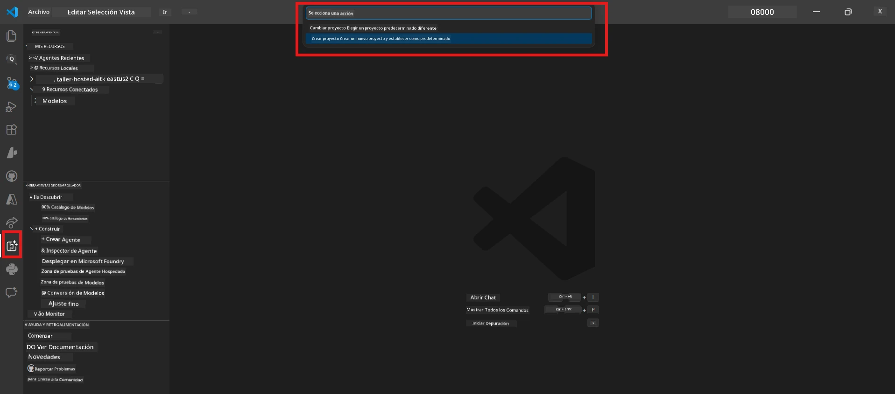
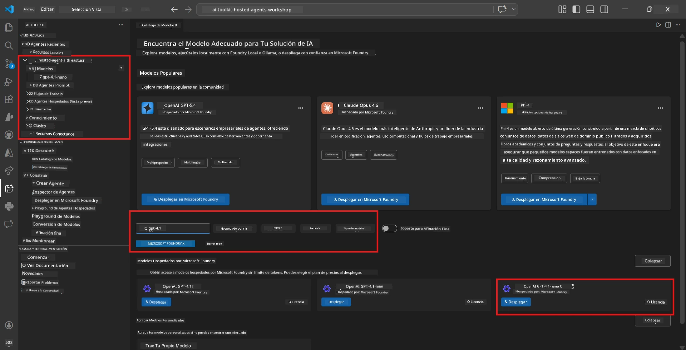
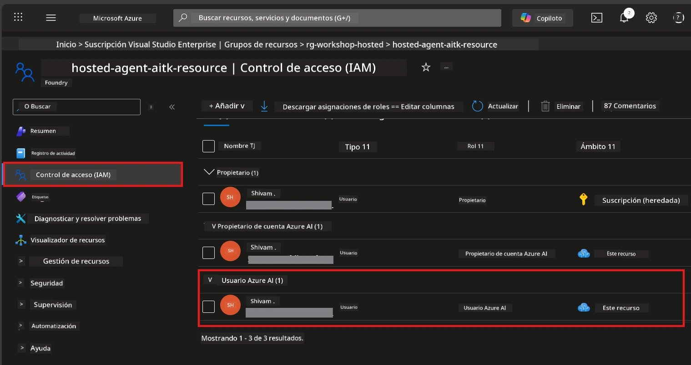

# Módulo 2 - Crear un proyecto Foundry y desplegar un modelo

En este módulo, crearás (o seleccionarás) un proyecto Microsoft Foundry y desplegarás un modelo que tu agente utilizará. Cada paso está escrito explícitamente, síguelos en orden.

> Si ya tienes un proyecto Foundry con un modelo desplegado, pasa a [Módulo 3](03-create-hosted-agent.md).

---

## Paso 1: Crear un proyecto Foundry desde VS Code

Usarás la extensión Microsoft Foundry para crear un proyecto sin salir de VS Code.

1. Presiona `Ctrl+Shift+P` para abrir la **Paleta de comandos**.
2. Escribe: **Microsoft Foundry: Create Project** y selecciónalo.
3. Aparecerá un menú desplegable: elige tu **suscripción de Azure** de la lista.
4. Se te pedirá seleccionar o crear un **grupo de recursos**:
   - Para crear uno nuevo: escribe un nombre (por ejemplo, `rg-hosted-agents-workshop`) y presiona Enter.
   - Para usar uno existente: selecciónalo del menú desplegable.
5. Selecciona una **región**. **Importante:** Elige una región que soporte agentes alojados. Consulta la [disponibilidad por región](https://learn.microsoft.com/azure/foundry/agents/concepts/hosted-agents#region-availability) - las opciones comunes son `East US`, `West US 2` o `Sweden Central`.
6. Ingresa un **nombre** para el proyecto Foundry (por ejemplo, `workshop-agents`).
7. Presiona Enter y espera a que termine la provisión.

> **La provisión tarda entre 2 y 5 minutos.** Verás una notificación de progreso en la esquina inferior derecha de VS Code. No cierres VS Code durante la provisión.

8. Cuando termine, la barra lateral de **Microsoft Foundry** mostrará tu nuevo proyecto bajo **Recursos**.
9. Haz clic en el nombre del proyecto para expandirlo y confirma que muestra secciones como **Models + endpoints** y **Agents**.



### Alternativa: Crear vía el portal Foundry

Si prefieres usar el navegador:

1. Abre [https://ai.azure.com](https://ai.azure.com) e inicia sesión.
2. Haz clic en **Create project** en la página principal.
3. Ingresa un nombre para el proyecto, selecciona tu suscripción, grupo de recursos y región.
4. Haz clic en **Create** y espera a que se provisione.
5. Una vez creado, regresa a VS Code; el proyecto debería aparecer en la barra lateral de Foundry tras un refresco (haz clic en el icono de actualizar).

---

## Paso 2: Desplegar un modelo

Tu [agente alojado](https://learn.microsoft.com/azure/foundry/agents/concepts/hosted-agents) necesita un modelo Azure OpenAI para generar respuestas. Vas a [desplegar uno ahora](https://learn.microsoft.com/azure/ai-foundry/openai/how-to/create-resource#deploy-a-model).

1. Presiona `Ctrl+Shift+P` para abrir la **Paleta de comandos**.
2. Escribe: **Microsoft Foundry: Open [Model Catalog](https://learn.microsoft.com/azure/ai-foundry/openai/concepts/models)** y selecciónalo.
3. Se abre la vista del Catálogo de Modelos en VS Code. Navega o usa la barra de búsqueda para encontrar **gpt-4.1**.
4. Haz clic en la tarjeta del modelo **gpt-4.1** (o `gpt-4.1-mini` si prefieres menor costo).
5. Haz clic en **Deploy**.


6. En la configuración del despliegue:
   - **Deployment name**: Deja el valor predeterminado (por ejemplo, `gpt-4.1`) o ingresa un nombre personalizado. **Recuerda este nombre** – lo necesitarás en el Módulo 4.
   - **Target**: Selecciona **Deploy to Microsoft Foundry** y elige el proyecto que creaste.
7. Haz clic en **Deploy** y espera a que el despliegue finalice (1-3 minutos).

### Elegir un modelo

| Modelo | Mejor para | Costo | Notas |
|-------|------------|-------|-------|
| `gpt-4.1` | Respuestas de alta calidad y matizadas | Mayor | Mejores resultados, recomendado para pruebas finales |
| `gpt-4.1-mini` | Iteración rápida, menor costo | Menor | Bueno para desarrollo en el taller y pruebas rápidas |
| `gpt-4.1-nano` | Tareas ligeras | El más bajo | Más económico, pero respuestas más simples |

> **Recomendación para este taller:** Usa `gpt-4.1-mini` para desarrollo y pruebas. Es rápido, económico y produce buenos resultados para los ejercicios.

### Verificar el despliegue del modelo

1. En la barra lateral de **Microsoft Foundry**, expande tu proyecto.
2. Busca bajo **Models + endpoints** (o una sección similar).
3. Debes ver tu modelo desplegado (por ejemplo, `gpt-4.1-mini`) con un estado de **Succeeded** o **Active**.
4. Haz clic en el despliegue del modelo para ver sus detalles.
5. **Anota** estos dos valores – los necesitarás en el Módulo 4:

   | Configuración | Dónde encontrarla | Valor de ejemplo |
   |---------------|-------------------|------------------|
   | **Project endpoint** | Haz clic en el nombre del proyecto en la barra lateral de Foundry. La URL del endpoint aparece en la vista de detalles. | `https://<account>.services.ai.azure.com/api/projects/<project>` |
   | **Model deployment name** | El nombre que se muestra junto al modelo desplegado. | `gpt-4.1-mini` |

---

## Paso 3: Asignar roles RBAC requeridos

Este es el **paso más comúnmente omitido**. Sin los roles correctos, el despliegue en el Módulo 6 fallará con un error de permisos.

### 3.1 Asignarte el rol Azure AI User

1. Abre un navegador y ve a [https://portal.azure.com](https://portal.azure.com).
2. En la barra de búsqueda superior, escribe el nombre de tu **proyecto Foundry** y haz clic en él en los resultados.
   - **Importante:** Navega al recurso del **proyecto** (tipo: "Microsoft Foundry project"), **no** al recurso padre de cuenta/hub.
3. En la navegación izquierda del proyecto, haz clic en **Control de acceso (IAM)**.
4. Haz clic en el botón **+ Agregar** en la parte superior → selecciona **Agregar asignación de rol**.
5. En la pestaña **Rol**, busca [**Azure AI User**](https://learn.microsoft.com/azure/foundry/concepts/rbac-foundry#built-in-roles) y selecciónalo. Haz clic en **Siguiente**.
6. En la pestaña **Miembros**:
   - Selecciona **Usuario, grupo o entidad de servicio**.
   - Haz clic en **+ Seleccionar miembros**.
   - Busca tu nombre o correo, selecciónate y haz clic en **Seleccionar**.
7. Haz clic en **Revisar + asignar** → luego nuevamente en **Revisar + asignar** para confirmar.



### 3.2 (Opcional) Asignar rol Azure AI Developer

Si necesitas crear recursos adicionales dentro del proyecto o administrar despliegues programáticamente:

1. Repite los pasos anteriores, pero en el paso 5 selecciona **Azure AI Developer** en su lugar.
2. Asigna este rol al nivel del **recurso Foundry (cuenta)**, no solo al nivel del proyecto.

### 3.3 Verificar tus asignaciones de rol

1. En la página **Control de acceso (IAM)** del proyecto, haz clic en la pestaña **Asignaciones de rol**.
2. Busca tu nombre.
3. Debes ver al menos el rol **Azure AI User** listado para el alcance del proyecto.

> **Por qué esto importa:** El rol [`Azure AI User`](https://learn.microsoft.com/azure/foundry/concepts/rbac-foundry#built-in-roles) concede la acción de datos `Microsoft.CognitiveServices/accounts/AIServices/agents/write`. Sin ella, verás este error durante el despliegue:
>
> ```
> Error: lacks the required data action 
> Microsoft.CognitiveServices/accounts/AIServices/agents/write 
> to perform POST /api/projects/{projectName}/assistants operation.
> ```
>
> Consulta [Módulo 8 - Resolución de problemas](08-troubleshooting.md) para más detalles.

---

### Punto de control

- [ ] El proyecto Foundry existe y es visible en la barra lateral de Microsoft Foundry en VS Code
- [ ] Al menos un modelo está desplegado (p. ej., `gpt-4.1-mini`) con estado **Succeeded**
- [ ] Has anotado la URL del **project endpoint** y el **model deployment name**
- [ ] Tienes asignado el rol **Azure AI User** a nivel de **proyecto** (verifica en Azure Portal → IAM → Asignaciones de rol)
- [ ] El proyecto está en una [región compatible](https://learn.microsoft.com/azure/foundry/agents/concepts/hosted-agents#region-availability) con agentes alojados

---

**Anterior:** [01 - Install Foundry Toolkit](01-install-foundry-toolkit.md) · **Siguiente:** [03 - Create a Hosted Agent →](03-create-hosted-agent.md)

---

<!-- CO-OP TRANSLATOR DISCLAIMER START -->
**Aviso legal**:  
Este documento ha sido traducido utilizando el servicio de traducción automática [Co-op Translator](https://github.com/Azure/co-op-translator). Aunque nos esforzamos por la precisión, tenga en cuenta que las traducciones automáticas pueden contener errores o imprecisiones. El documento original en su idioma nativo debe considerarse la fuente autorizada. Para información crítica, se recomienda una traducción profesional realizada por humanos. No nos hacemos responsables de ningún malentendido o interpretación errónea derivada del uso de esta traducción.
<!-- CO-OP TRANSLATOR DISCLAIMER END -->