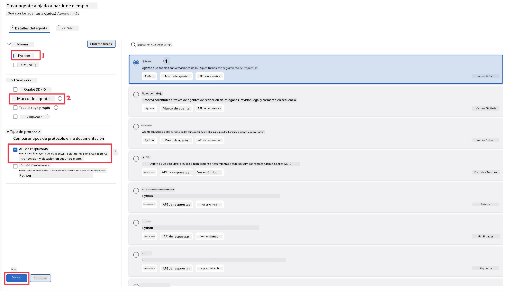
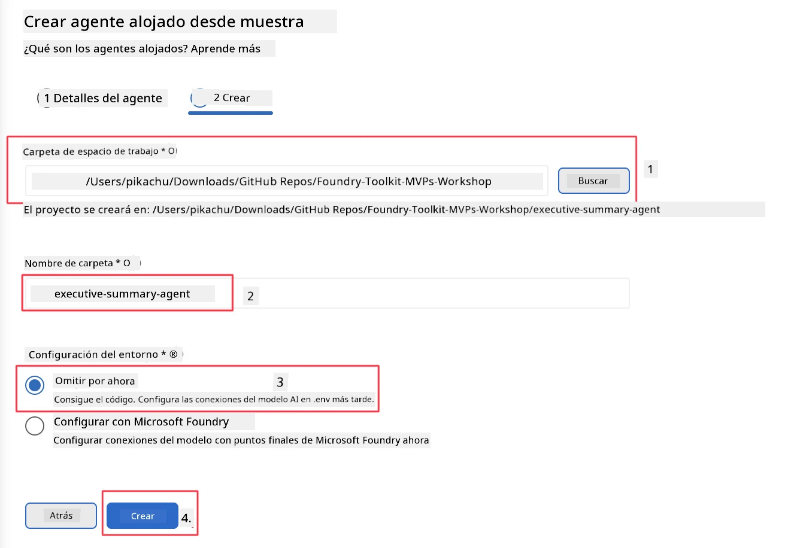

# Módulo 2 - Crear un nuevo agente alojado

⏱️ ~5 min

En este módulo, usarás Foundry Toolkit para **esbozar un proyecto de agente alojado**. El esqueleto genera toda la estructura del proyecto - `agent.yaml`, `main.py`, `Dockerfile`, `requirements.txt`, y la configuración de depuración de VS Code - para que puedas concentrarte en personalizar el comportamiento del agente.

> **Concepto clave:** La carpeta `agent/` en este laboratorio es un ejemplo de lo que genera Foundry Toolkit. No escribes estos archivos desde cero.

### Flujo del asistente de esqueleto

```mermaid
flowchart LR
    A["Command Palette:
    Create new Hosted Agent"] --> B["Language:
    Python"]
    B --> C["API type:
    Response API"]
    C --> D["Template:
    Basic - Agent Framework"]
    D --> E["Seleccionar modelo"]
    E --> F["Workspace folder
    & agent name"]
    F --> G["Proyecto generado"]

    style A fill:#4A90D9,color:#fff
    style B fill:#7B68EE,color:#fff
    style C fill:#7B68EE,color:#fff
    style D fill:#7B68EE,color:#fff
    style E fill:#7B68EE,color:#fff
    style F fill:#7B68EE,color:#fff
    style G fill:#27AE60,color:#fff
```



---

## Paso 1: Abrir el asistente Crear agente alojado

1. Presiona `Ctrl+Shift+P` para abrir la **Paleta de comandos**.
2. Escribe: **Foundry Toolkit: Create new Hosted Agent** y selecciónalo.

> **Alternativa: Crear vía Foundry Portal**
> Si prefieres usar el navegador, puedes crear tu proyecto en [https://ai.azure.com](https://ai.azure.com). Una vez que el proyecto esté aprovisionado, regresa a VS Code y usa la barra lateral de **Foundry Toolkit** para conectarte a él.

> **Alternativa:** Haz clic en el ícono **+** junto a **Hosted Agents (Preview)** en la barra lateral de Foundry Toolkit.

## Paso 2: Elegir configuraciones



1. En la sección de navegación/opciones a la izquierda selecciona lo siguiente:

| Menú | Selección | Notas |
|--------|-----------|-------|
| **Idioma** | Python | También soporta C# |
| **Framework** | Agent Framework | Punto de partida simple usando el SDK de Agent Framework |
| **Tipo de API** | Response API | `POST /responses` - conversacional, con historial gestionado por plataforma |
| **Plantilla** | Básica | Punto de partida simple usando el SDK de Agent Framework |

2. Una vez seleccionado, haz clic en **Siguiente**



3. En la siguiente ventana, selecciona lo siguiente:

| Menú | Selección | Notas |
|--------|-----------|-------|
| **Carpeta de trabajo** | Elige una carpeta destino | por ejemplo, `/workspace/Foundry_Toolkit_for_VSCode_Lab/` o una subcarpeta en este repositorio |
| **Nombre del agente** | Ingresa un nombre | por ejemplo, `executive-summary-agent` |
| **Configuración del entorno** | omite la configuración por ahora |  |

Haz clic en **crear** para crear nuestro agente. Se creará una nueva carpeta con el nombre del agente alojado.

## Paso 3: Inspeccionar el proyecto generado

Después de que finalice el esqueleto, verifica que veas estos archivos en el Explorador (`Ctrl+Shift+E`):

```
📂 my-agent/
├── .env                ← Environment variables (placeholders)
├── .vscode/
│   ├── launch.json     ← Debug config (F5 → run + Agent Inspector)
│   └── tasks.json      ← VS Code task definitions
├── agent.yaml          ← Agent definition (kind: hosted)
├── Dockerfile          ← Container config for deployment
├── main.py             ← Agent entry point (your main code)
└── requirements.txt    ← Python dependencies
```

### Archivos clave explicados

| Archivo | Propósito |
|------|---------|
| `agent.yaml` | Declara el agente como `kind: hosted`, asigna variables de entorno, define el protocolo `/responses` |
| `main.py` | Crea un `FoundryChatClient` → lo envuelve en un `Agent` con instrucciones → lo sirve mediante `ResponsesHostServer` en el puerto 8088 |
| `Dockerfile` | Usa `python:3.12-slim`, instala dependencias, expone puerto 8088, ejecuta `main.py` |
| `requirements.txt` | `agent-framework-foundry`, `agent-framework-foundry-hosting`, `mcp`, `debugpy` |

> **Importante:** Abre la carpeta del agente esbozado directamente en VS Code (la carpeta `agent/`) para que `.vscode/launch.json` y `tasks.json` funcionen correctamente para la depuración con F5.

---

### ✅ Punto de control

- [ ] Proyecto esbozado creado con todos los archivos esperados
- [ ] `agent.yaml` muestra `kind: hosted` y `protocol: responses`
- [ ] `main.py` importa `Agent`, `FoundryChatClient`, `ResponsesHostServer`
- [ ] La carpeta del agente está abierta en VS Code como raíz del espacio de trabajo

---

**Anterior:** [01 - Configuración](01-setup.md) · **Siguiente:** [03 - Configurar y codificar →](03-configure-and-code.md)

---

<!-- CO-OP TRANSLATOR DISCLAIMER START -->
**Descargo de responsabilidad**:
Este documento ha sido traducido utilizando el servicio de traducción automática [Co-op Translator](https://github.com/Azure/co-op-translator). Aunque nos esforzamos por la precisión, tenga en cuenta que las traducciones automatizadas pueden contener errores o inexactitudes. El documento original en su idioma nativo debe considerarse la fuente autorizada. Para información crítica, se recomienda una traducción profesional humana. No somos responsables de cualquier malentendido o interpretación errónea que surja del uso de esta traducción.
<!-- CO-OP TRANSLATOR DISCLAIMER END -->