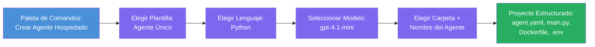

# Module 3 - Crear un Nuevo Agente Hospedado (Generado Automáticamente por la Extensión Foundry)

En este módulo, usas la extensión Microsoft Foundry para **generar un nuevo proyecto de [agente hospedado](https://learn.microsoft.com/azure/foundry/agents/concepts/hosted-agents)**. La extensión genera toda la estructura del proyecto por ti, incluyendo `agent.yaml`, `main.py`, `Dockerfile`, `requirements.txt`, un archivo `.env` y una configuración de depuración para VS Code. Después de generar la estructura, personalizas estos archivos con las instrucciones, herramientas y configuración de tu agente.

> **Concepto clave:** La carpeta `agent/` en este laboratorio es un ejemplo de lo que genera la extensión Foundry cuando ejecutas este comando para generar la estructura. No escribes estos archivos desde cero, la extensión los crea y luego tú los modificas.

### Flujo del asistente para generar la estructura


---

## Paso 1: Abrir el asistente Crear Agente Hospedado

1. Presiona `Ctrl+Shift+P` para abrir la **Paleta de Comandos**.
2. Escribe: **Microsoft Foundry: Create a New Hosted Agent** y selecciónalo.
3. Se abre el asistente para crear un agente hospedado.

> **Ruta alternativa:** También puedes acceder a este asistente desde la barra lateral de Microsoft Foundry → hacer clic en el icono **+** junto a **Agents** o hacer clic derecho y seleccionar **Create New Hosted Agent**.

---

## Paso 2: Elegir plantilla

El asistente te pide seleccionar una plantilla. Verás opciones como:

| Plantilla | Descripción | Cuándo usar |
|----------|-------------|-------------|
| **Single Agent** | Un agente con su propio modelo, instrucciones y herramientas opcionales | Este laboratorio (Lab 01) |
| **Multi-Agent Workflow** | Varios agentes que colaboran en secuencia | Lab 02 |

1. Selecciona **Single Agent**.
2. Haz clic en **Next** (o la selección avanza automáticamente).

---

## Paso 3: Elegir lenguaje de programación

1. Selecciona **Python** (recomendado para este taller).
2. Haz clic en **Next**.

> **También se soporta C#** si prefieres .NET. La estructura generada es similar (usa `Program.cs` en lugar de `main.py`).

---

## Paso 4: Seleccionar tu modelo

1. El asistente muestra los modelos desplegados en tu proyecto Foundry (del Módulo 2).
2. Selecciona el modelo que desplegaste – por ejemplo, **gpt-4.1-mini**.
3. Haz clic en **Next**.

> Si no ves ningún modelo, regresa a [Módulo 2](02-create-foundry-project.md) y despliega uno primero.

---

## Paso 5: Elegir ubicación de carpeta y nombre del agente

1. Se abre un cuadro de diálogo para archivos - elige una **carpeta destino** donde se creará el proyecto. Para este taller:
   - Si comienzas desde cero: elige cualquier carpeta (por ejemplo, `C:\Projects\my-agent`)
   - Si trabajas dentro del repositorio del taller: crea una subcarpeta nueva bajo `workshop/lab01-single-agent/agent/`
2. Ingresa un **nombre** para el agente hospedado (por ejemplo, `executive-summary-agent` o `my-first-agent`).
3. Haz clic en **Create** (o presiona Enter).

---

## Paso 6: Esperar a que termine la generación

1. VS Code abre una **nueva ventana** con el proyecto generado.
2. Espera unos segundos a que el proyecto cargue completamente.
3. Deberías ver los siguientes archivos en el panel Explorador (`Ctrl+Shift+E`):

```
📂 my-first-agent/
├── .env                ← Environment variables (auto-generated with placeholders)
├── .vscode/
│   └── launch.json     ← Debug configuration (F5 to run + Agent Inspector)
├── agent.yaml          ← Agent definition (kind: hosted)
├── Dockerfile          ← Container configuration for deployment
├── main.py             ← Agent entry point (your main code file)
└── requirements.txt    ← Python dependencies
```

> **Esta es la misma estructura que la carpeta `agent/`** en este laboratorio. La extensión Foundry genera estos archivos automáticamente – no necesitas crearlos manualmente.

> **Nota del taller:** En este repositorio del taller, la carpeta `.vscode/` está en la **raíz del espacio de trabajo** (no dentro de cada proyecto). Contiene un `launch.json` y `tasks.json` compartidos con dos configuraciones de depuración – **"Lab01 - Single Agent"** y **"Lab02 - Multi-Agent"** – cada uno apunta a la carpeta de trabajo (cwd) correcta del laboratorio. Cuando presionas F5, selecciona la configuración correspondiente al laboratorio en el que estás trabajando desde el desplegable.

---

## Paso 7: Entender cada archivo generado

Tómate un momento para revisar cada archivo que creó el asistente. Entenderlos es importante para el Módulo 4 (personalización).

### 7.1 `agent.yaml` - Definición del agente

Abre `agent.yaml`. Se ve así:

```yaml
# yaml-language-server: $schema=https://raw.githubusercontent.com/microsoft/AgentSchema/refs/heads/main/schemas/v1.0/ContainerAgent.yaml

kind: hosted
name: my-first-agent
description: >
  A hosted agent deployed to Microsoft Foundry Agent Service.
metadata:
  authors:
    - Microsoft
  tags:
    - Azure AI AgentServer
    - Microsoft Agent Framework
    - Hosted Agent
protocols:
  - protocol: responses
    version: v1
environment_variables:
  - name: AZURE_AI_PROJECT_ENDPOINT
    value: ${PROJECT_ENDPOINT}
  - name: AZURE_AI_MODEL_DEPLOYMENT_NAME
    value: ${MODEL_DEPLOYMENT_NAME}
dockerfile_path: Dockerfile
resources:
  cpu: '0.25'
  memory: 0.5Gi
```

**Campos clave:**

| Campo | Propósito |
|-------|-----------|
| `kind: hosted` | Declara que este es un agente hospedado (basado en contenedor, desplegado en el [Foundry Agent Service](https://learn.microsoft.com/azure/foundry/agents/overview)) |
| `protocols: responses v1` | El agente expone el endpoint HTTP `/responses` compatible con OpenAI |
| `environment_variables` | Mapea valores del `.env` a variables de entorno del contenedor en tiempo de despliegue |
| `dockerfile_path` | Apunta al Dockerfile usado para construir la imagen del contenedor |
| `resources` | Asignación de CPU y memoria para el contenedor (0.25 CPU, 0.5Gi memoria) |

### 7.2 `main.py` - Punto de entrada del agente

Abre `main.py`. Este es el archivo principal en Python donde vive la lógica de tu agente. La estructura generada incluye:

```python
from agent_framework.azure import AzureAIAgentClient
from azure.ai.agentserver.agentframework import from_agent_framework
from azure.identity.aio import DefaultAzureCredential
```

**Importaciones clave:**

| Importación | Propósito |
|-------------|-----------|
| `AzureAIAgentClient` | Se conecta a tu proyecto Foundry y crea agentes vía `.as_agent()` |
| [`DefaultAzureCredential`](https://learn.microsoft.com/azure/developer/python/sdk/authentication/credential-chains#defaultazurecredential-overview) | Maneja autenticación (Azure CLI, inicio de sesión en VS Code, identidad administrada, o principal de servicio) |
| `from_agent_framework` | Envuelve el agente como un servidor HTTP que expone el endpoint `/responses` |

El flujo principal es:
1. Crear una credencial → crear un cliente → llamar a `.as_agent()` para obtener un agente (gestor de contexto asíncrono) → envolverlo como servidor → ejecutar

### 7.3 `Dockerfile` - Imagen del contenedor

```dockerfile
FROM python:3.14-slim

WORKDIR /app

COPY ./ .

RUN pip install --upgrade pip && \
    if [ -f requirements.txt ]; then \
        pip install -r requirements.txt; \
    else \
        echo "No requirements.txt found" >&2; exit 1; \
    fi

EXPOSE 8088

CMD ["python", "main.py"]
```

**Detalles clave:**
- Usa `python:3.14-slim` como imagen base.
- Copia todos los archivos del proyecto en `/app`.
- Actualiza `pip`, instala dependencias desde `requirements.txt` y falla rápido si falta ese archivo.
- **Expone el puerto 8088** - este es el puerto requerido para agentes hospedados. No lo cambies.
- Inicia el agente con `python main.py`.

### 7.4 `requirements.txt` - Dependencias

```
agent-framework-azure-ai==1.0.0rc3
agent-framework-core==1.0.0rc3
azure-ai-agentserver-agentframework==1.0.0b16
azure-ai-agentserver-core==1.0.0b16
debugpy
agent-dev-cli
```

| Paquete | Propósito |
|---------|-----------|
| `agent-framework-azure-ai` | Integración Azure AI para Microsoft Agent Framework |
| `agent-framework-core` | Runtime central para construir agentes (incluye `python-dotenv`) |
| `azure-ai-agentserver-agentframework` | Runtime servidor para agentes hospedados en Foundry Agent Service |
| `azure-ai-agentserver-core` | Abstracciones centrales del servidor de agentes |
| `debugpy` | Soporte para depuración en Python (permite depurar con F5 en VS Code) |
| `agent-dev-cli` | CLI para desarrollo local y pruebas de agentes (usado por la configuración de depuración/ejecución) |

---

## Entendiendo el protocolo del agente

Los agentes hospedados se comunican vía el protocolo **OpenAI Responses API**. Cuando están en ejecución (local o nube), el agente expone un único endpoint HTTP:

```
POST http://localhost:8088/responses
Content-Type: application/json

{
  "input": "Your prompt here",
  "stream": false
}
```

El Foundry Agent Service llama a este endpoint para enviar indicaciones del usuario y recibir respuestas del agente. Este es el mismo protocolo usado por la API de OpenAI, por lo que tu agente es compatible con cualquier cliente que implemente el formato OpenAI Responses.

---

### Punto de control

- [ ] El asistente para generar la estructura terminó exitosamente y se abrió una **nueva ventana de VS Code**
- [ ] Puedes ver los 5 archivos: `agent.yaml`, `main.py`, `Dockerfile`, `requirements.txt`, `.env`
- [ ] Existe el archivo `.vscode/launch.json` (habilita depuración con F5 – en este taller está en la raíz del espacio de trabajo con configuraciones específicas para cada laboratorio)
- [ ] Has leído cada archivo y entiendes su propósito
- [ ] Comprendes que el puerto `8088` es requerido y que el endpoint `/responses` es el protocolo

---

**Anterior:** [02 - Create Foundry Project](02-create-foundry-project.md) · **Siguiente:** [04 - Configure & Code →](04-configure-and-code.md)

---

<!-- CO-OP TRANSLATOR DISCLAIMER START -->
**Descargo de responsabilidad**:  
Este documento ha sido traducido utilizando el servicio de traducción automática [Co-op Translator](https://github.com/Azure/co-op-translator). Aunque nos esforzamos por la precisión, tenga en cuenta que las traducciones automatizadas pueden contener errores o imprecisiones. El documento original en su idioma nativo debe considerarse la fuente autorizada. Para información crítica, se recomienda una traducción profesional realizada por humanos. No nos hacemos responsables de ningún malentendido o interpretación errónea derivada del uso de esta traducción.
<!-- CO-OP TRANSLATOR DISCLAIMER END -->