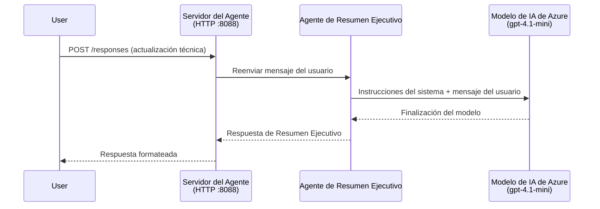
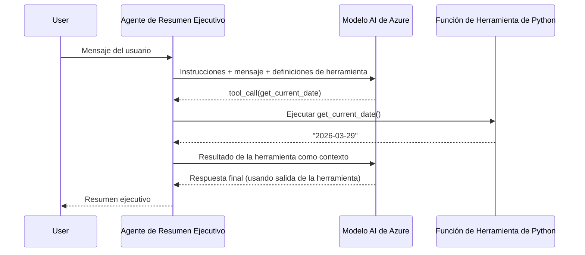

# Módulo 4 - Configurar instrucciones, entorno e instalar dependencias

En este módulo, personalizas los archivos del agente generados automáticamente del Módulo 3. Aquí es donde transformas el esqueleto genérico en **tu** agente: escribiendo instrucciones, configurando variables de entorno, opcionalmente agregando herramientas e instalando dependencias.

> **Recordatorio:** La extensión Foundry generó automáticamente los archivos de tu proyecto. Ahora los modificas. Consulta la carpeta [`agent/`](../../../../../workshop/lab01-single-agent/agent) para ver un ejemplo completo y funcional de un agente personalizado.

---

## Cómo encajan los componentes

### Ciclo de vida de la solicitud (agente único)


> **Con herramientas:** Si el agente tiene herramientas registradas, el modelo puede devolver una llamada a herramienta en lugar de una finalización directa. El marco ejecuta la herramienta localmente, alimenta el resultado al modelo, y el modelo genera entonces la respuesta final.


---

## Paso 1: Configurar variables de entorno

El esqueleto creó un archivo `.env` con valores de marcador de posición. Debes completar con los valores reales del Módulo 2.

1. En tu proyecto generado, abre el archivo **`.env`** (está en la raíz del proyecto).
2. Reemplaza los valores de marcador de posición con los detalles reales de tu proyecto Foundry:

   ```env
   PROJECT_ENDPOINT=https://<your-account>.services.ai.azure.com/api/projects/<your-project>
   MODEL_DEPLOYMENT_NAME=gpt-4.1-mini
   ```

3. Guarda el archivo.

### Dónde encontrar estos valores

| Valor | Cómo encontrarlo |
|-------|------------------|
| **Punto de conexión del proyecto** | Abre la barra lateral de **Microsoft Foundry** en VS Code → haz clic en tu proyecto → la URL del endpoint se muestra en la vista de detalles. Tiene esta forma: `https://<account-name>.services.ai.azure.com/api/projects/<project-name>` |
| **Nombre del despliegue de modelo** | En la barra lateral de Foundry, expande tu proyecto → busca bajo **Models + endpoints** → el nombre se muestra junto al modelo desplegado (por ejemplo, `gpt-4.1-mini`) |

> **Seguridad:** Nunca comites el archivo `.env` al control de versiones. Ya está incluido en `.gitignore` por defecto. Si no está, agrégalo:
> ```
> .env
> ```

### Cómo fluyen las variables de entorno

La cadena de mapeo es: `.env` → `main.py` (lee vía `os.getenv`) → `agent.yaml` (mapea a variables de entorno del contenedor en tiempo de despliegue).

En `main.py`, el esqueleto lee estos valores así:

```python
PROJECT_ENDPOINT = os.getenv("AZURE_AI_PROJECT_ENDPOINT") or os.getenv("PROJECT_ENDPOINT")
MODEL_DEPLOYMENT_NAME = os.getenv("AZURE_AI_MODEL_DEPLOYMENT_NAME", os.getenv("MODEL_DEPLOYMENT_NAME", "gpt-4.1-mini"))
```

Se aceptan `AZURE_AI_PROJECT_ENDPOINT` y `PROJECT_ENDPOINT` (el `agent.yaml` usa el prefijo `AZURE_AI_*`).

---

## Paso 2: Escribir instrucciones del agente

Este es el paso de personalización más importante. Las instrucciones definen la personalidad del agente, comportamiento, formato de salida y restricciones de seguridad.

1. Abre `main.py` en tu proyecto.
2. Busca la cadena de instrucciones (el esqueleto incluye una por defecto/genérica).
3. Reemplázala con instrucciones detalladas y estructuradas.

### Qué incluyen unas buenas instrucciones

| Componente | Propósito | Ejemplo |
|------------|-----------|---------|
| **Rol** | Qué es y hace el agente | "Eres un agente de resumen ejecutivo" |
| **Audiencia** | Para quién son las respuestas | "Líderes senior con conocimientos técnicos limitados" |
| **Definición de entrada** | Qué tipo de preguntas maneja | "Informes técnicos de incidentes, actualizaciones operativas" |
| **Formato de salida** | Estructura exacta de las respuestas | "Resumen Ejecutivo: - Qué pasó: ... - Impacto en el negocio: ... - Próximo paso: ..." |
| **Reglas** | Restricciones y condiciones de rechazo | "NO añadas información más allá de la proporcionada" |
| **Seguridad** | Evitar mal uso y alucinaciones | "Si la entrada no es clara, pide aclaración" |
| **Ejemplos** | Pares entrada/salida para guiar el comportamiento | Incluye 2-3 ejemplos con entradas variadas |

### Ejemplo: instrucciones para agente de resumen ejecutivo

Estas son las instrucciones usadas en el taller, en [`agent/main.py`](../../../../../workshop/lab01-single-agent/agent/main.py):

```python
AGENT_INSTRUCTIONS = """You are an "Explain Like I'm an Executive" agent.

Purpose:
Your job is to translate complex technical or operational information into
clear, concise, and outcome-focused summaries that can be easily understood
by non-technical executives.

Audience:
Senior leaders with limited technical background who care about impact,
risk, and what happens next.

What you must do:
- Rephrase the input so it is understandable to a non-technical audience
- Prioritize clarity, brevity, and outcomes over technical accuracy
- Remove technical jargon, logs, metrics, stack traces, and deep root-cause details
- Translate technical causes into simple cause-and-effect statements
- Explicitly call out business impact
- Always include a clear next step or action
- Maintain a neutral, factual, and calm executive tone
- Do NOT add new facts or speculate beyond the input

Standard Output Structure (always use this wording):

Executive Summary:
- What happened: <plain-language description>
- Business impact: <clear, non-technical impact>
- Next step: <clear action or mitigation>

Rules:
- Keep responses under 100 words
- Do NOT add facts beyond the input
- If input is unclear, ask for clarification
"""
```

4. Reemplaza la cadena de instrucciones existente en `main.py` con tus instrucciones personalizadas.
5. Guarda el archivo.

---

## Paso 3: (Opcional) Agregar herramientas personalizadas

Los agentes alojados pueden ejecutar **funciones Python locales** como [herramientas](https://learn.microsoft.com/azure/foundry/agents/concepts/tool-catalog). Esta es una ventaja clave de los agentes alojados basados en código frente a los agentes solo con prompt: tu agente puede ejecutar lógica arbitraria del lado servidor.

### 3.1 Definir una función de herramienta

Agrega una función herramienta a `main.py`:

```python
from agent_framework import tool

@tool
def get_current_date() -> str:
    """Returns the current date in YYYY-MM-DD format."""
    from datetime import date
    return str(date.today())
```

El decorador `@tool` convierte una función Python estándar en una herramienta del agente. La cadena de documentación se convierte en la descripción de la herramienta vista por el modelo.

### 3.2 Registrar la herramienta con el agente

Al crear el agente mediante el gestor de contexto `.as_agent()`, pasa la herramienta en el parámetro `tools`:

```python
async with AzureAIAgentClient(
    project_endpoint=PROJECT_ENDPOINT,
    model_deployment_name=MODEL_DEPLOYMENT_NAME,
    credential=credential,
).as_agent(
    name="my-agent",
    instructions=AGENT_INSTRUCTIONS,
    tools=[get_current_date],
) as agent:
    server = from_agent_framework(agent)
    await server.run_async()
```

### 3.3 Cómo funcionan las llamadas a herramientas

1. El usuario envía un prompt.
2. El modelo decide si necesita una herramienta (basándose en el prompt, las instrucciones y las descripciones de herramientas).
3. Si se necesita, el marco llama a tu función Python localmente (dentro del contenedor).
4. El valor devuelto por la herramienta se envía de vuelta al modelo como contexto.
5. El modelo genera la respuesta final.

> **Las herramientas se ejecutan del lado servidor** - corren dentro de tu contenedor, no en el navegador del usuario ni en el modelo. Esto significa que puedes acceder a bases de datos, APIs, sistemas de archivos o cualquier biblioteca Python.

---

## Paso 4: Crear y activar un entorno virtual

Antes de instalar dependencias, crea un entorno Python aislado.

### 4.1 Crear el entorno virtual

Abre una terminal en VS Code (`` Ctrl+` ``) y ejecuta:

```powershell
python -m venv .venv
```

Esto crea una carpeta `.venv` en tu directorio de proyecto.

### 4.2 Activar el entorno virtual

**PowerShell (Windows):**

```powershell
.\.venv\Scripts\Activate.ps1
```

**Command Prompt (Windows):**

```cmd
.venv\Scripts\activate.bat
```

**macOS/Linux (Bash):**

```bash
source .venv/bin/activate
```

Deberías ver `(.venv)` al inicio de tu prompt de terminal, indicando que el entorno virtual está activo.

### 4.3 Instalar dependencias

Con el entorno virtual activo, instala los paquetes necesarios:

```powershell
pip install -r requirements.txt
```

Esto instala:

| Paquete | Propósito |
|---------|-----------|
| `agent-framework-azure-ai==1.0.0rc3` | Integración Azure AI para el [Microsoft Agent Framework](https://learn.microsoft.com/agent-framework/overview/) |
| `agent-framework-core==1.0.0rc3` | Tiempo de ejecución core para crear agentes (incluye `python-dotenv`) |
| `azure-ai-agentserver-agentframework==1.0.0b16` | Tiempo de ejecución del servidor de agente alojado para [Foundry Agent Service](https://learn.microsoft.com/azure/foundry/agents/overview) |
| `azure-ai-agentserver-core==1.0.0b16` | Abstracciones core del servidor de agentes |
| `debugpy` | Depuración Python (habilita debugging con F5 en VS Code) |
| `agent-dev-cli` | CLI de desarrollo local para probar agentes |

### 4.4 Verificar instalación

```powershell
pip list | Select-String "agent-framework|agentserver"
```

Salida esperada:
```
agent-framework-azure-ai   1.0.0rc3
agent-framework-core       1.0.0rc3
azure-ai-agentserver-agentframework 1.0.0b16
azure-ai-agentserver-core  1.0.0b16
```

---

## Paso 5: Verificar autenticación

El agente usa [`DefaultAzureCredential`](https://learn.microsoft.com/azure/developer/python/sdk/authentication/credential-chains#defaultazurecredential-overview) que intenta múltiples métodos de autenticación en este orden:

1. **Variables de entorno** - `AZURE_CLIENT_ID`, `AZURE_TENANT_ID`, `AZURE_CLIENT_SECRET` (principal de servicio)
2. **Azure CLI** - usa la sesión de `az login`
3. **VS Code** - usa la cuenta con la que iniciaste sesión en VS Code
4. **Identidad administrada** - se usa al ejecutar en Azure (en tiempo de despliegue)

### 5.1 Verificar para desarrollo local

Al menos uno de estos debería funcionar:

**Opción A: Azure CLI (recomendado)**

```powershell
az account show --query "{name:name, id:id}" --output table
```

Esperado: Muestra el nombre y ID de tu suscripción.

**Opción B: Inicio de sesión en VS Code**

1. Mira en la esquina inferior izquierda de VS Code el ícono de **Cuentas**.
2. Si ves el nombre de tu cuenta, estás autenticado.
3. Si no, haz clic en el ícono → **Iniciar sesión para usar Microsoft Foundry**.

**Opción C: Principal de servicio (para CI/CD)**

```powershell
$env:AZURE_TENANT_ID = "<your-tenant-id>"
$env:AZURE_CLIENT_ID = "<your-client-id>"
$env:AZURE_CLIENT_SECRET = "<your-client-secret>"
```

### 5.2 Problema común de autenticación

Si has iniciado sesión en múltiples cuentas de Azure, asegúrate de que la suscripción correcta esté seleccionada:

```powershell
az account set --subscription "<your-subscription-id>"
```

---

### Punto de control

- [ ] El archivo `.env` tiene valores válidos para `PROJECT_ENDPOINT` y `MODEL_DEPLOYMENT_NAME` (no marcadores de posición)
- [ ] Las instrucciones del agente están personalizadas en `main.py` - definen rol, audiencia, formato de salida, reglas y restricciones de seguridad
- [ ] (Opcional) Se definieron y registraron herramientas personalizadas
- [ ] El entorno virtual está creado y activado (`(.venv)` visible en el prompt de terminal)
- [ ] `pip install -r requirements.txt` se completa sin errores
- [ ] `pip list | Select-String "azure-ai-agentserver"` muestra que el paquete está instalado
- [ ] La autenticación es válida - `az account show` devuelve tu suscripción O has iniciado sesión en VS Code

---

**Anterior:** [03 - Crear agente alojado](03-create-hosted-agent.md) · **Siguiente:** [05 - Probar localmente →](05-test-locally.md)

---

<!-- CO-OP TRANSLATOR DISCLAIMER START -->
**Descargo de responsabilidad**:  
Este documento ha sido traducido utilizando el servicio de traducción automática [Co-op Translator](https://github.com/Azure/co-op-translator). Aunque nos esforzamos por la precisión, tenga en cuenta que las traducciones automáticas pueden contener errores o inexactitudes. El documento original en su idioma nativo debe considerarse la fuente autorizada. Para información crítica, se recomienda una traducción profesional realizada por humanos. No nos hacemos responsables de ningún malentendido o interpretación incorrecta derivada del uso de esta traducción.
<!-- CO-OP TRANSLATOR DISCLAIMER END -->