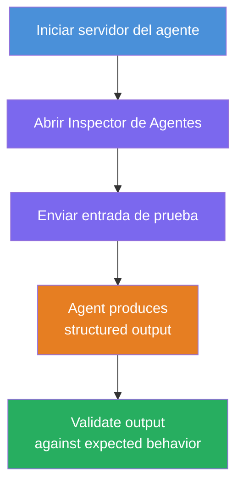
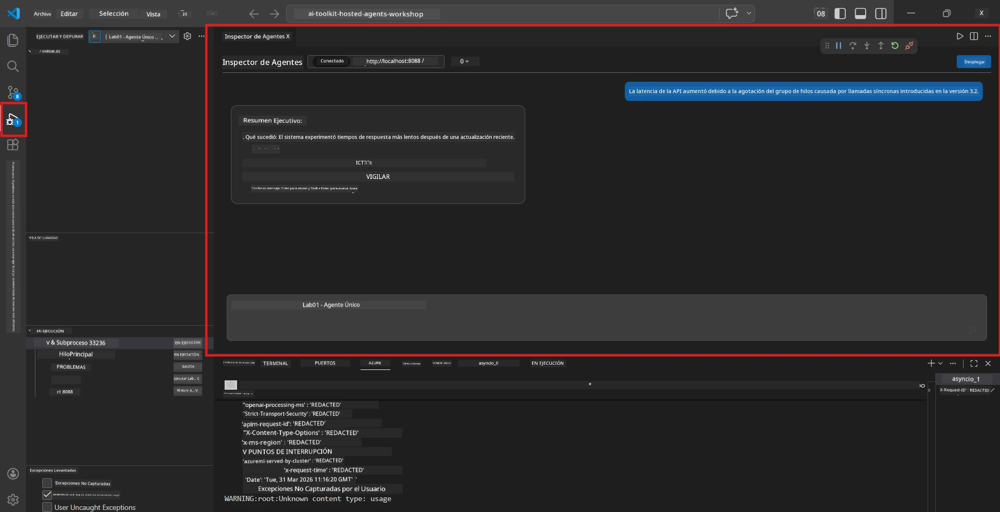
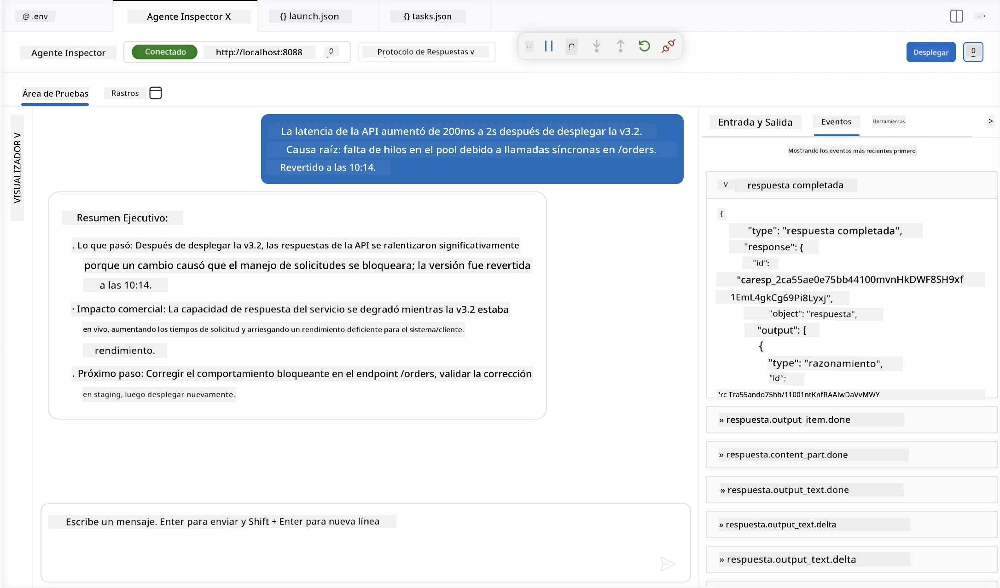

# Módulo 4 - Prueba Localmente

⏱️ ~10 min

En este módulo, ejecutarás tu agente localmente y validarás que funciona correctamente usando **pruebas funcionales de camino feliz**. Usarás el Inspector de Agentes (interfaz visual) o llamadas HTTP directas para confirmar que el agente produce respuestas estructuradas y precisas.

### Flujo de prueba local



---

## Opción 1: Presiona F5 - Depura con el Inspector de Agentes (recomendado)

### Inicia el depurador

1. Abre la carpeta **executive-summary-agent/** directamente en VS Code (`Archivo → Abrir carpeta`).
2. Abre el panel **Ejecutar y depurar** (`Ctrl+Shift+D`).
3. Selecciona **Debug Local Agent Server** en el menú desplegable.
4. Presiona **F5** (o haz clic en ▶ Iniciar depuración).

> ⚠️ **Crítico: Selecciona tu intérprete de Python**
> Si obtienes "ModuleNotFoundError" o el depurador no inicia, debes indicarle a VS Code que use tu entorno virtual:
  > 1. Presiona `Ctrl+Shift+P` $\rightarrow$ escribe **Python: Select Interpreter**.
  > 2. Selecciona el intérprete ubicado en la carpeta `.venv` de tu proyecto (por ejemplo, `.\.venv\Scripts\python.exe` en Windows).
  > 3. Reinicia la sesión de depuración.
> Si aún tienes errores, actualiza manualmente tu archivo `tasks.json` como sigue:
  > 1. Navega al archivo `.vscode/tasks.json`
  > 2. Ve al comando etiquetado: `Run Agent/Workflow HTTP Server`
  > 3. Actualiza el valor del comando así: `"value": "${workspaceFolder}/.venv/bin/python",`

### Qué sucede

1. El servidor HTTP inicia en `http://localhost:8088/responses`.
2. El panel **Inspector de Agentes** se abre automáticamente - una interfaz visual de chat para pruebas.
3. Los puntos de interrupción están activados en `main.py`.

Observa el Terminal para:
```
Starting executive summary hosted agent
Executive agent server running on http://localhost:8088
```

> **Si el Inspector de Agentes no se abre:** Presiona `Ctrl+Shift+P` → **Foundry Toolkit: Open Agent Inspector**.



> *La captura de pantalla puede mostrar una marca antigua 'AI TOOLKIT' de una versión anterior de la extensión.*

---

## Opción 2: Prueba mediante Terminal (alternativa)

Inicia el agente en un terminal, envía solicitudes desde otro:

```bash
# Terminal 1: Iniciar agente
cd executive-summary-agent/
source .venv/bin/activate
python main.py
```

```bash
# Terminal 2: Enviar prueba (curl)
curl -sS -X POST http://localhost:8088/responses \
  -H "Content-Type: application/json" \
  -d '{"input": "The API latency increased due to thread pool exhaustion caused by sync calls in v3.2.", "stream": false}'
```

---

## Pruebas de escenario: Validación funcional de camino feliz

Ejecuta **los tres** escenarios que se muestran abajo. Estos validan que tu agente produzca una salida correcta y estructurada para entradas realistas.



### Escenario 1: Incidente TI - pico de latencia API

**Entrada:**
```
The API latency increased from 200ms to 2s after deploying v3.2.
Root cause: thread pool starvation from synchronous calls in /orders.
Rolled back at 10:14.
```

**Comportamiento esperado:**
- ✅ Sigue la estructura de "Resumen Ejecutivo" (Qué pasó / Impacto comercial / Próximo paso)
- ✅ Sin jerga técnica (no "thread pool", no "/orders", no "v3.2")
- ✅ Explica claramente el impacto comercial (ej. usuarios experimentaron retrasos)
- ✅ Incluye un próximo paso (ej. corrección desplegada, monitoreo establecido)

---

### Escenario 2: Canal de datos - falla ETL

**Entrada:**
```
The nightly ETL job failed because the upstream schema changed. APAC dashboards show missing data.
```

**Comportamiento esperado:**
- ✅ Resume la falla en la actualización de datos en lenguaje sencillo
- ✅ Menciona el impacto en el tablero APAC
- ✅ Incluye un próximo paso de remediación
- ✅ NO menciona "ETL", "esquema", ni otros términos técnicos

---

### Escenario 3: Seguridad - credencial expuesta

**Entrada:**
```
Static analysis flagged a hardcoded secret in the repository.
The secret may have been exposed in commit history.
```

**Comportamiento esperado:**
- ✅ Describe un problema de credencial/seguridad en lenguaje apto para ejecutivos
- ✅ Destaca el riesgo potencial (acceso no autorizado)
- ✅ Indica acción de remediación (rotación de credencial, auditoría)
- ✅ NO incluye términos como "análisis estático", "historial de commits" ni "hardcoded"

---

## Criterios de validación

Para cada escenario, verifica:

| # | Criterios | Condición de aprobación |
|---|----------|-----------------------|
| 1 | **Estructura** | La respuesta usa el formato "Resumen Ejecutivo" con las tres viñetas |
| 2 | **Lenguaje sencillo** | Sin jerga técnica que un ejecutivo no entendería |
| 3 | **Precisión** | El resumen refleja la entrada - sin detalles inventados |
| 4 | **Brevedad** | La respuesta tiene menos de 100 palabras |
| 5 | **Próximo paso** | Se indica una acción o mitigación clara |

---

## Consejos para depuración

| Problema | Solución |
|---------|---------|
| El agente no inicia | Verifica valores en `.env`, confirma que el entorno virtual está activado, ejecuta `pip install -r requirements.txt` |
| Respuesta vacía o genérica | Revisa las instrucciones en `main.py` - asegúrate de que se especifique el formato de salida |
| Respuesta incluye jerga | Refuerza las reglas para "eliminar términos técnicos" en las instrucciones |
| Inspector de Agentes no se abre | `Ctrl+Shift+P` → **Foundry Toolkit: Open Agent Inspector** |
| Errores del modelo en Terminal | Verifica que `AZURE_AI_MODEL_DEPLOYMENT_NAME` coincida exactamente (sensible a mayúsculas) |

---

### ✅ Punto de control

- [ ] El agente inicia localmente sin errores
- [ ] El Inspector de Agentes se abre y muestra una interfaz de chat (si usas F5)
- [ ] **Escenario 1** (incidente TI) - Resumen Ejecutivo estructurado, sin jerga
- [ ] **Escenario 2** (canal de datos) - resumen relevante con impacto comercial
- [ ] **Escenario 3** (alerta de seguridad) - comunicación de riesgo adecuada
- [ ] Todas las respuestas siguen la estructura de salida definida

> **Guarda tus respuestas** (cópialas o haz capturas) - las compararás con los resultados en la nube en el Módulo 06.

---

**Anterior:** [03 - Configure & Code](03-configure-and-code.md) · **Siguiente:** [05 - Deploy to Foundry →](05-deploy-to-foundry.md)

---

<!-- CO-OP TRANSLATOR DISCLAIMER START -->
**Descargo de responsabilidad**:
Este documento ha sido traducido utilizando el servicio de traducción automática [Co-op Translator](https://github.com/Azure/co-op-translator). Aunque nos esforzamos por la precisión, tenga en cuenta que las traducciones automatizadas pueden contener errores o inexactitudes. El documento original en su idioma nativo debe considerarse la fuente autorizada. Para información crítica, se recomienda una traducción profesional humana. No somos responsables de cualquier malentendido o interpretación errónea que surja del uso de esta traducción.
<!-- CO-OP TRANSLATOR DISCLAIMER END -->