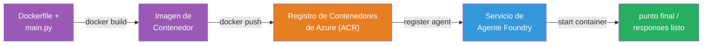
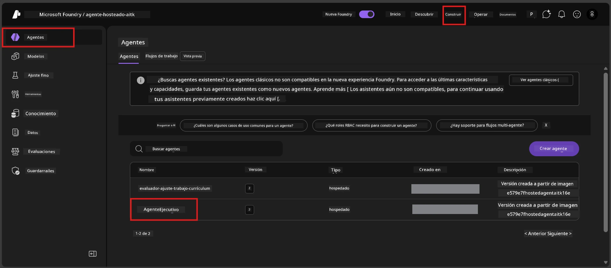

# Módulo 6 - Desplegar en Foundry Agent Service

En este módulo, despliegas tu agente probado localmente a Microsoft Foundry como un [**Agente Hospedado**](https://learn.microsoft.com/azure/foundry/agents/concepts/hosted-agents). El proceso de despliegue construye una imagen de contenedor Docker desde tu proyecto, la sube a [Azure Container Registry (ACR)](https://learn.microsoft.com/azure/container-registry/container-registry-intro), y crea una versión de agente hospedado en [Foundry Agent Service](https://learn.microsoft.com/azure/foundry/agents/overview).

### Pipeline de despliegue


---

## Revisión de prerrequisitos

Antes de desplegar, verifica cada elemento a continuación. Omitirlos es la causa más común de fallas en el despliegue.

1. **El agente pasa las pruebas locales básicas:**
   - Completaste las 4 pruebas en [Módulo 5](05-test-locally.md) y el agente respondió correctamente.

2. **Tienes el rol [Azure AI User](https://learn.microsoft.com/azure/foundry/concepts/rbac-foundry#built-in-roles):**
   - Este se asignó en [Módulo 2, Paso 3](02-create-foundry-project.md). Si no estás seguro, verifica ahora:
   - Portal de Azure → recurso **proyecto** Foundry → **Control de acceso (IAM)** → pestaña **Asignaciones de roles** → busca tu nombre → confirma que **Azure AI User** aparece listado.

3. **Estás conectado a Azure en VS Code:**
   - Revisa el ícono de Cuentas en la esquina inferior izquierda de VS Code. Deberías ver el nombre de tu cuenta.

4. **(Opcional) Docker Desktop está en ejecución:**
   - Docker solo es necesario si la extensión Foundry te solicita hacer una construcción local. En la mayoría de los casos, la extensión maneja la construcción del contenedor automáticamente durante el despliegue.
   - Si tienes Docker instalado, verifica que está ejecutándose: `docker info`

---

## Paso 1: Iniciar el despliegue

Tienes dos formas de desplegar, ambas conducen al mismo resultado.

### Opción A: Desplegar desde el Inspector del Agente (recomendado)

Si estás ejecutando el agente con el depurador (F5) y el Inspector del Agente está abierto:

1. Mira en la **esquina superior derecha** del panel del Inspector del Agente.
2. Haz clic en el botón **Deploy** (icono de nube con una flecha hacia arriba ↑).
3. Se abrirá el asistente de despliegue.

### Opción B: Desplegar desde la Paleta de Comandos

1. Presiona `Ctrl+Shift+P` para abrir la **Paleta de Comandos**.
2. Escribe: **Microsoft Foundry: Deploy Hosted Agent** y selecciónalo.
3. Se abrirá el asistente de despliegue.

---

## Paso 2: Configurar el despliegue

El asistente de despliegue te guiará a través de la configuración. Completa cada indicación:

### 2.1 Selecciona el proyecto destino

1. Un menú desplegable muestra tus proyectos Foundry.
2. Selecciona el proyecto que creaste en el Módulo 2 (por ejemplo, `workshop-agents`).

### 2.2 Selecciona el archivo agente del contenedor

1. Se te pedirá seleccionar el punto de entrada del agente.
2. Elige **`main.py`** (Python) – este es el archivo que el asistente usa para identificar tu proyecto de agente.

### 2.3 Configurar recursos

| Configuración | Valor recomendado | Notas |
|---------------|-------------------|-------|
| **CPU**       | `0.25`            | Por defecto, suficiente para el taller. Aumenta para cargas de trabajo en producción |
| **Memoria**   | `0.5Gi`           | Por defecto, suficiente para el taller |

Estos coinciden con los valores en `agent.yaml`. Puedes aceptar los valores predeterminados.

---

## Paso 3: Confirmar y desplegar

1. El asistente muestra un resumen del despliegue con:
   - Nombre del proyecto destino
   - Nombre del agente (desde `agent.yaml`)
   - Archivo del contenedor y recursos
2. Revisa el resumen y haz clic en **Confirm and Deploy** (o **Deploy**).
3. Observa el progreso en VS Code.

### Lo que ocurre durante el despliegue (paso a paso)

El despliegue es un proceso en varios pasos. Observa el panel **Output** de VS Code (selecciona "Microsoft Foundry" en el menú desplegable) para seguirlo:

1. **Construcción Docker** – VS Code construye una imagen de contenedor Docker desde tu `Dockerfile`. Verás mensajes de capas Docker:
   ```
   Step 1/6 : FROM python:<version>-slim
   Step 2/6 : WORKDIR /app
   ...
   Successfully built abc123def456
   ```

2. **Push Docker** – La imagen se sube al **Azure Container Registry (ACR)** asociado con tu proyecto Foundry. Esto puede tardar entre 1 y 3 minutos en el primer despliegue (la imagen base es >100MB).

3. **Registro del agente** – Foundry Agent Service crea un nuevo agente hospedado (o una versión nueva si el agente ya existe). Se usa la metadata del agente en `agent.yaml`.

4. **Inicio del contenedor** – El contenedor se inicia en la infraestructura gestionada de Foundry. La plataforma asigna una [identidad gestionada por sistema](https://learn.microsoft.com/azure/foundry/agents/concepts/agent-identity) y expone el endpoint `/responses`.

> **El primer despliegue es más lento** (Docker necesita subir todas las capas). Los despliegues siguientes son más rápidos porque Docker cachea las capas sin cambios.

---

## Paso 4: Verificar el estado del despliegue

Después de que el comando de despliegue finalice:

1. Abre la barra lateral **Microsoft Foundry** haciendo clic en el ícono Foundry en la Barra de Actividad.
2. Expande la sección **Hosted Agents (Preview)** debajo de tu proyecto.
3. Deberías ver el nombre de tu agente (por ejemplo, `ExecutiveAgent` o el nombre en `agent.yaml`).
4. **Haz clic en el nombre del agente** para expandirlo.
5. Verás una o más **versiones** (por ejemplo, `v1`).
6. Haz clic en la versión para ver los **Detalles del Contenedor**.
7. Revisa el campo **Estado**:

   | Estado      | Significado                                         |
   |-------------|----------------------------------------------------|
   | **Started** o **Running** | El contenedor está en ejecución y el agente listo |
   | **Pending** | El contenedor se está iniciando (espera 30-60 segundos) |
   | **Failed**  | El contenedor falló al iniciar (revisa los logs - ver solución de problemas abajo) |



> **Si ves "Pending" por más de 2 minutos:** Puede que el contenedor esté descargando la imagen base. Espera un poco más. Si continúa pendiente, revisa los logs del contenedor.

---

## Errores comunes en el despliegue y soluciones

### Error 1: Permiso denegado - `agents/write`

```
Error: lacks the required data action 
Microsoft.CognitiveServices/accounts/AIServices/agents/write 
to perform POST /api/projects/{projectName}/assistants operation.
```

**Causa raíz:** No tienes el rol `Azure AI User` a nivel de **proyecto**.

**Solución paso a paso:**

1. Abre [https://portal.azure.com](https://portal.azure.com).
2. En la barra de búsqueda, escribe el nombre de tu **proyecto** Foundry y haz clic en él.
   - **Crítico:** Asegúrate de navegar al recurso **proyecto** (tipo: "Microsoft Foundry project"), NO a la cuenta o hub padre.
3. En la navegación izquierda, haz clic en **Control de acceso (IAM)**.
4. Haz clic en **+ Agregar** → **Agregar asignación de rol**.
5. En la pestaña **Rol**, busca [**Azure AI User**](https://learn.microsoft.com/azure/foundry/concepts/rbac-foundry#built-in-roles) y selecciónalo. Haz clic en **Siguiente**.
6. En la pestaña **Miembros**, selecciona **Usuario, grupo o entidad de servicio**.
7. Haz clic en **+ Seleccionar miembros**, busca tu nombre/email, selecciónate, haz clic en **Seleccionar**.
8. Haz clic en **Revisar y asignar** → **Revisar y asignar** de nuevo.
9. Espera 1-2 minutos a que la asignación se propague.
10. **Reintenta el despliegue** desde el Paso 1.

> El rol debe estar con alcance en el **proyecto**, no solo en la cuenta. Esta es la causa #1 más común de fallas en despliegues.

### Error 2: Docker no está ejecutándose

```
Error: Docker build failed / Cannot connect to Docker daemon
```

**Solución:**
1. Inicia Docker Desktop (búscalo en el menú Inicio o bandeja del sistema).
2. Espera a que muestre "Docker Desktop is running" (30-60 segundos).
3. Verifica con: `docker info` en una terminal.
4. **Específico para Windows:** Asegúrate que el backend WSL 2 está habilitado en configuración de Docker Desktop → **General** → **Usar el motor basado en WSL 2**.
5. Reintenta el despliegue.

### Error 3: Autorización ACR - `AcrPullUnauthorized`

```
Error: AcrPullUnauthorized
```

**Causa raíz:** La identidad gestionada del proyecto Foundry no tiene permisos de pull al registro de contenedores.

**Solución:**
1. En el Portal de Azure, navega a tu **[Container Registry](https://learn.microsoft.com/azure/container-registry/container-registry-intro)** (está en el mismo grupo de recursos que tu proyecto Foundry).
2. Ve a **Control de acceso (IAM)** → **Agregar** → **Agregar asignación de rol**.
3. Selecciona el rol **[AcrPull](https://learn.microsoft.com/azure/container-registry/container-registry-roles)**.
4. En Miembros, selecciona **Identidad gestionada** → encuentra la identidad gestionada del proyecto Foundry.
5. **Revisar y asignar**.

> Esto usualmente lo configura automáticamente la extensión Foundry. Si ves este error, puede indicar que la configuración automática falló.

### Error 4: Incompatibilidad de plataforma del contenedor (Apple Silicon)

Si despliegas desde una Mac Apple Silicon (M1/M2/M3), el contenedor debe ser construido para `linux/amd64`:

```bash
docker build --platform linux/amd64 -t myagent:v1 .
```

> La extensión Foundry maneja esto automáticamente para la mayoría de los usuarios.

---

### Punto de control

- [ ] Comando de despliegue completado sin errores en VS Code
- [ ] El agente aparece bajo **Hosted Agents (Preview)** en la barra lateral de Foundry
- [ ] Hiciste clic en el agente → seleccionaste una versión → viste los **Detalles del contenedor**
- [ ] El estado del contenedor muestra **Started** o **Running**
- [ ] (Si hubo errores) Identificaste el error, aplicaste la solución y redeplegaste con éxito

---

**Anterior:** [05 - Testea Localmente](05-test-locally.md) · **Siguiente:** [07 - Verificar en Playground →](07-verify-in-playground.md)

---

<!-- CO-OP TRANSLATOR DISCLAIMER START -->
**Aviso legal**:  
Este documento ha sido traducido utilizando el servicio de traducción IA [Co-op Translator](https://github.com/Azure/co-op-translator). Si bien nos esforzamos por la precisión, tenga en cuenta que las traducciones automáticas pueden contener errores o inexactitudes. El documento original en su idioma nativo debe considerarse la fuente autorizada. Para información crítica, se recomienda traducción profesional humana. No nos hacemos responsables por malentendidos o interpretaciones erróneas derivadas del uso de esta traducción.
<!-- CO-OP TRANSLATOR DISCLAIMER END -->