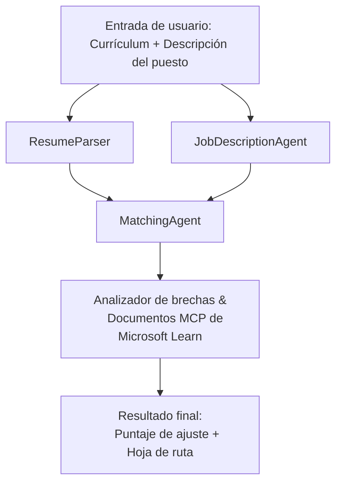

# PersonalCareerCopilot - Evaluador de Ajuste Curricular → Empleo

Un flujo de trabajo multiagente que evalúa qué tan bien un currículum coincide con una descripción de trabajo, y luego genera una hoja de ruta personalizada de aprendizaje para cerrar las brechas.

---

## Agentes

| Agente | Rol | Herramientas |
|--------|-----|--------------|
| **ResumeParser** | Extrae habilidades estructuradas, experiencia, certificaciones del texto del currículum | - |
| **JobDescriptionAgent** | Extrae habilidades requeridas/preferidas, experiencia, certificaciones de una descripción de trabajo | - |
| **MatchingAgent** | Compara perfil vs requisitos → puntuación de ajuste (0-100) + habilidades coincidentes/faltantes | - |
| **GapAnalyzer** | Construye una hoja de ruta personalizada de aprendizaje con recursos de Microsoft Learn | `search_microsoft_learn_for_plan` (MCP) |

## Flujo de trabajo


---

## Inicio rápido

### 1. Configurar entorno

```powershell
cd workshop\lab02-multi-agent\PersonalCareerCopilot
python -m venv .venv
.\.venv\Scripts\Activate.ps1          # Windows PowerShell
# source .venv/bin/activate            # macOS / Linux
pip install -r requirements.txt
```

### 2. Configurar credenciales

Copia el archivo env de ejemplo y completa los detalles de tu proyecto Foundry:

```powershell
cp .env.example .env
```

Edita `.env`:

```env
PROJECT_ENDPOINT=https://<your-account>.services.ai.azure.com/api/projects/<your-project>
MODEL_DEPLOYMENT_NAME=gpt-4.1-mini
```

| Valor | Dónde encontrarlo |
|-------|-------------------|
| `PROJECT_ENDPOINT` | Barra lateral de Microsoft Foundry en VS Code → clic derecho en tu proyecto → **Copiar punto de conexión del proyecto** |
| `MODEL_DEPLOYMENT_NAME` | Barra lateral de Foundry → expande proyecto → **Models + endpoints** → nombre de despliegue |

### 3. Ejecutar localmente

```powershell
python -m debugpy --listen 127.0.0.1:5679 -m agentdev run main.py --verbose --port 8088
```

O usa la tarea de VS Code: `Ctrl+Shift+P` → **Tasks: Run Task** → **Run Lab02 HTTP Server**.

### 4. Probar con Agent Inspector

Abre Agent Inspector: `Ctrl+Shift+P` → **Foundry Toolkit: Open Agent Inspector**.

Pega este prompt de prueba:

```
Resume:
Jane Doe
Senior Software Engineer with 5 years of experience in Python, Django, and AWS.
Built microservices handling 10K+ requests/second. Led a team of 4 developers.
Certifications: AWS Solutions Architect Associate.
Education: B.S. Computer Science, State University.

Job Description:
Senior Cloud Engineer at Contoso Ltd.
Required: Python, Azure, Kubernetes, Terraform, CI/CD pipelines.
Preferred: Go, monitoring (Prometheus/Grafana), cost optimization.
Experience: 5+ years in cloud infrastructure.
Certifications: Azure Solutions Architect Expert preferred.
```

**Se espera:** Una puntuación de ajuste (0-100), habilidades coincidentes/faltantes y una hoja de ruta personalizada con URLs de Microsoft Learn.

### 5. Desplegar en Foundry

`Ctrl+Shift+P` → **Microsoft Foundry: Deploy Hosted Agent** → selecciona tu proyecto → confirma.

---

## Estructura del proyecto

```
PersonalCareerCopilot/
├── .env.example        ← Template for environment variables
├── .env                ← Your credentials (git-ignored)
├── agent.yaml          ← Hosted agent definition (name, resources, env vars)
├── Dockerfile          ← Container image for Foundry deployment
├── main.py             ← 4-agent workflow (instructions, MCP tool, WorkflowBuilder)
└── requirements.txt    ← Python dependencies
```

## Archivos clave

### `agent.yaml`

Define el agente alojado para Foundry Agent Service:
- `kind: hosted` - se ejecuta como un contenedor gestionado
- `protocols: [responses v1]` - expone el endpoint HTTP `/responses`
- `environment_variables` - `PROJECT_ENDPOINT` y `MODEL_DEPLOYMENT_NAME` se inyectan al desplegar

### `main.py`

Contiene:
- **Instrucciones del agente** - cuatro constantes `*_INSTRUCTIONS`, una por agente
- **Herramienta MCP** - `search_microsoft_learn_for_plan()` llama a `https://learn.microsoft.com/api/mcp` vía HTTP Streamable
- **Creación de agentes** - gestor de contexto `create_agents()` usando `AzureAIAgentClient.as_agent()`
- **Grafo del flujo de trabajo** - `create_workflow()` usa `WorkflowBuilder` para conectar agentes con patrones fan-out/fan-in/secuenciales
- **Inicio del servidor** - `from_agent_framework(agent).run_async()` en puerto 8088

### `requirements.txt`

| Paquete | Versión | Propósito |
|---------|---------|-----------|
| `agent-framework-azure-ai` | `1.0.0rc3` | Integración Azure AI para Microsoft Agent Framework |
| `agent-framework-core` | `1.0.0rc3` | Runtime core (incluye WorkflowBuilder) |
| `azure-ai-agentserver-agentframework` | `1.0.0b16` | Runtime servidor agente alojado |
| `azure-ai-agentserver-core` | `1.0.0b16` | Abstracciones core servidor agente |
| `debugpy` | última | Depuración Python (F5 en VS Code) |
| `agent-dev-cli` | `--pre` | CLI local dev + backend de Agent Inspector |

---

## Solución de problemas

| Problema | Solución |
|----------|---------|
| `RuntimeError: Missing required environment variable(s)` | Crear `.env` con `PROJECT_ENDPOINT` y `MODEL_DEPLOYMENT_NAME` |
| `ModuleNotFoundError: No module named 'agent_framework'` | Activar venv y ejecutar `pip install -r requirements.txt` |
| No hay URLs de Microsoft Learn en la salida | Verificar conexión a internet con `https://learn.microsoft.com/api/mcp` |
| Sólo 1 tarjeta de brecha (truncada) | Verificar que `GAP_ANALYZER_INSTRUCTIONS` incluya el bloque `CRITICAL:` |
| Puerto 8088 en uso | Detener otros servidores: `netstat -ano \| findstr :8088` |

Para solución de problemas detallada, ver [Módulo 8 - Solución de problemas](../docs/08-troubleshooting.md).

---

**Recorrido completo:** [Documentación Lab 02](../docs/README.md) · **Volver a:** [Lab 02 README](../README.md) · [Inicio del Taller](../../../README.md)

---

<!-- CO-OP TRANSLATOR DISCLAIMER START -->
**Descargo de responsabilidad**:  
Este documento ha sido traducido utilizando el servicio de traducción automática [Co-op Translator](https://github.com/Azure/co-op-translator). Aunque nos esforzamos por la precisión, tenga en cuenta que las traducciones automáticas pueden contener errores o inexactitudes. El documento original en su idioma nativo debe considerarse la fuente autorizada. Para información crítica, se recomienda la traducción profesional realizada por humanos. No nos hacemos responsables por malentendidos o interpretaciones erróneas derivadas del uso de esta traducción.
<!-- CO-OP TRANSLATOR DISCLAIMER END -->