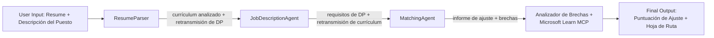

# PersonalCareerCopilot - Evaluador de Ajuste de Curriculum → Oferta de Trabajo

Una aplicación multiagente orientada al flujo de trabajo que evalúa qué tan bien un currículum coincide con una descripción de trabajo, y luego genera una hoja de ruta de aprendizaje personalizada para cerrar las brechas.

---

## Agentes

| Agente | Rol | Herramientas |
|-------|------|-------|
| **ResumeParser** | Extrae habilidades estructuradas, experiencia, certificaciones del texto del currículum | - |
| **JobDescriptionAgent** | Extrae habilidades requeridas/preferidas, experiencia, certificaciones de una JD | - |
| **MatchingAgent** | Compara perfil vs requisitos → puntaje de ajuste (0-100) + habilidades coincidentes/faltantes | - |
| **GapAnalyzer** | Construye una hoja de ruta de aprendizaje personalizada con recursos de Microsoft Learn | `search_microsoft_learn_for_plan` (MCP) |

## Flujo de trabajo


```mermaid
flowchart LR
    UserInput["User Input: Resume + Descripción del Puesto"] --> ResumeParser
    ResumeParser -- "currículum analizado + retransmisión de DP" --> JobDescriptionAgent
    JobDescriptionAgent -- "requisitos de DP + retransmisión de currículum" --> MatchingAgent
    MatchingAgent -- "informe de ajuste + brechas" --> GapAnalyzerMCP["Analizador de Brechas +\nMicrosoft Learn MCP"]
    GapAnalyzerMCP --> FinalOutput["Final Output:\nPuntuación de Ajuste + Hoja de Ruta"]
```

---

## Inicio rápido

### 1. Configurar el entorno

Esta carpeta es la implementación de referencia para el esqueleto del Lab 02 basado en flujo de trabajo. Su `main.py` usa los bloques de prompts existentes más `WorkflowBuilder` para conectar los cuatro agentes.

```powershell
cd workshop\lab02-multi-agent\PersonalCareerCopilot
python -m venv .venv
.\.venv\Scripts\Activate.ps1          # Windows PowerShell
# source .venv/bin/activate            # macOS / Linux
pip install -r requirements.txt
```

### 2. Configurar credenciales

Crea un archivo `.env` en esta carpeta:

```powershell
copy .env .env.bak 2>$null; echo $null > .env
```

Edita `.env`:

```env
FOUNDRY_PROJECT_ENDPOINT=https://<your-account>.services.ai.azure.com/api/projects/<your-project>
AZURE_AI_MODEL_DEPLOYMENT_NAME=gpt-4.1-mini
```

| Valor | Dónde encontrarlo |
|-------|------------------|
| `FOUNDRY_PROJECT_ENDPOINT` | Barra lateral Foundry Toolkit → clic derecho en tu proyecto → **Copiar Punto Final del Proyecto** |
| `AZURE_AI_MODEL_DEPLOYMENT_NAME` | Barra lateral de Foundry → expandir proyecto → **Modelos + puntos finales** → nombre del despliegue |

### 3. Ejecutar localmente

```powershell
python -m debugpy --listen 127.0.0.1:5679 main.py --port 8088
```

O usa la tarea de VS Code: `Ctrl+Shift+P` → **Tareas: Ejecutar tarea** → **Ejecutar servidor HTTP del agente**.

Para depurar con F5, usa **Depurar servidor HTTP local del agente**.

### 4. Probar con Agent Inspector

Abre Agent Inspector: `Ctrl+Shift+P` → **Foundry Toolkit: Abrir Agent Inspector**.

Pega este prompt de prueba:

```
Resume:
Jane Doe
Senior Software Engineer with 5 years of experience in Python, Django, and AWS.
Built microservices handling 10K+ requests/second. Led a team of 4 developers.
Certifications: AWS Solutions Architect Associate.
Education: B.S. Computer Science, State University.

Job Description:
Senior Cloud Engineer at Contoso Ltd.
Required: Python, Azure, Kubernetes, Terraform, CI/CD pipelines.
Preferred: Go, monitoring (Prometheus/Grafana), cost optimization.
Experience: 5+ years in cloud infrastructure.
Certifications: Azure Solutions Architect Expert preferred.
```

**Esperado:** Un puntaje de ajuste (0-100), habilidades coincidentes/faltantes, y una hoja de ruta de aprendizaje personalizada con URL de Microsoft Learn.

### 5. Desplegar en Foundry

`Ctrl+Shift+P` → **Foundry Toolkit: Desplegar agente alojado** → selecciona tu proyecto → confirma.

---

## Estructura del proyecto

```
PersonalCareerCopilot/
├── .env                ← Your credentials (git-ignored)
├── agent.yaml          ← Hosted agent definition (name, resources, env vars)
├── Dockerfile          ← Container image for Foundry deployment
├── main.py             ← 4-agent workflow (instructions, MCP tool, WorkflowBuilder)
└── requirements.txt    ← Python dependencies
```

## Archivos clave

### `agent.yaml`

Define el agente alojado para Foundry Agent Service:
- `kind: hosted` - se ejecuta como un contenedor gestionado
- `protocols` - protocolo `responses` con `version: 1.0.0`, exponiendo el endpoint HTTP `/responses`
- `environment_variables` - aquí se declara `AZURE_AI_MODEL_DEPLOYMENT_NAME`; `FOUNDRY_PROJECT_ENDPOINT` se inyecta automáticamente en tiempo de despliegue

### `main.py`

Contiene:
- **Instrucciones para agentes** - cuatro constantes `*_INSTRUCTIONS`, una por agente
- **Herramienta MCP** - `search_microsoft_learn_for_plan()` llama a `https://learn.microsoft.com/api/mcp` vía HTTP Streamable
- **Creación de agentes** - cuatro instancias `Agent()` + `AgentExecutor()` compartiendo un `FoundryChatClient`
- **Gráfico de flujo de trabajo** - `WorkflowBuilder` conecta agentes como línea secuencial: ResumeParser → Agente JD → MatchingAgent → GapAnalyzer
- **Inicio del servidor** - `ResponsesHostServer` corre en el puerto 8088

### `requirements.txt`

| Paquete | Propósito |
|---------|----------|
| `agent-framework-foundry` | Núcleo de ejecución: `Agent`, `AgentExecutor`, `WorkflowBuilder`, `@tool`, `FoundryChatClient` |
| `agent-framework-foundry-hosting` | `ResponsesHostServer` + integración de hosting en Foundry |
| `mcp<2,>=1.24.0` | Cliente MCP para GapAnalyzer (`streamable_http_client`) |
| `debugpy` | Depuración en Python (F5 en VS Code) |

---

## Solución de problemas

| Problema | Solución |
|-------|-----|
| `KeyError: 'FOUNDRY_PROJECT_ENDPOINT'` o `KeyError: 'AZURE_AI_MODEL_DEPLOYMENT_NAME'` | Crea `.env` con ambos valores `FOUNDRY_PROJECT_ENDPOINT` y `AZURE_AI_MODEL_DEPLOYMENT_NAME` configurados |
| `ModuleNotFoundError: No module named 'agent_framework'` | Activa el entorno virtual y ejecuta `pip install -r requirements.txt` |
| No hay URLs de Microsoft Learn en salida | Verifica la conectividad a internet con `https://learn.microsoft.com/api/mcp` |
| Solo una tarjeta de brecha (truncada) | Verifica que `GAP_ANALYZER_INSTRUCTIONS` incluya el bloque `CRITICAL:` |
| Puerto 8088 en uso | Detén otros servidores: `netstat -ano \| findstr :8088` |

Para solución de problemas detallada, consulta [Módulo 8 - Solución de problemas](../docs/08-troubleshooting.md).

---

**Recorrido completo:** [Documentación Lab 02](../docs/README.md) · **Volver a:** [README Lab 02](../README.md) · [Inicio del taller](../../../README.md)

---

<!-- CO-OP TRANSLATOR DISCLAIMER START -->
**Descargo de responsabilidad**:
Este documento ha sido traducido utilizando el servicio de traducción automática [Co-op Translator](https://github.com/Azure/co-op-translator). Aunque nos esforzamos por la precisión, tenga en cuenta que las traducciones automatizadas pueden contener errores o inexactitudes. El documento original en su idioma nativo debe considerarse la fuente autorizada. Para información crítica, se recomienda una traducción profesional humana. No somos responsables de cualquier malentendido o interpretación errónea que surja del uso de esta traducción.
<!-- CO-OP TRANSLATOR DISCLAIMER END -->