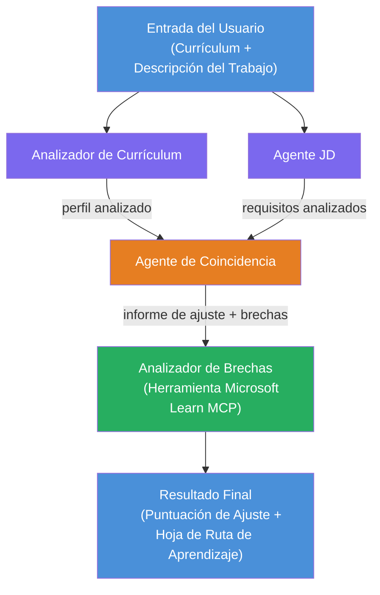

# Laboratorio 02 - Flujo de trabajo multiagente: Evaluador de ajuste CV → trabajo

---

## Lo que construirás

Un **Evaluador de ajuste CV → trabajo**: un flujo de trabajo multiagente donde cuatro agentes especializados colaboran para evaluar qué tan bien el currículum de un candidato coincide con una descripción de trabajo, y luego generan una hoja de ruta de aprendizaje personalizada para cerrar las brechas.

### Los agentes

| Agente | Rol |
|--------|-----|
| **Parseador de CV** | Extrae habilidades estructuradas, experiencia, certificaciones del texto del currículum |
| **Agente de descripción de trabajo** | Extrae habilidades requeridas/preferidas, experiencia, certificaciones de una JD |
| **Agente de coincidencia** | Compara perfil vs requisitos → puntuación de ajuste (0-100) + habilidades coincidentes/faltantes |
| **Analizador de brechas** | Construye una hoja de ruta de aprendizaje personalizada con recursos, cronogramas y proyectos de victorias rápidas |

### Flujo de demostración

Sube un **currículum + descripción del trabajo** → obtén una **puntuación de ajuste + habilidades faltantes** → recibe una **hoja de ruta de aprendizaje personalizada**.

### Arquitectura del flujo de trabajo

> Morado = agentes en paralelo | Naranja = punto de agregación | Verde = agente final con herramientas. Consulta [Módulo 1 - Entender la arquitectura](docs/01-understand-multi-agent.md) y [Módulo 4 - Patrones de orquestación](docs/04-orchestration-patterns.md) para diagramas detallados y flujo de datos.

### Temas cubiertos

- Crear un flujo de trabajo multiagente usando **WorkflowBuilder**
- Definir roles de agentes y flujo de orquestación (paralelo + secuencial)
- Patrones de comunicación entre agentes
- Pruebas locales con el Inspector de agentes
- Desplegar flujos de trabajo multiagentes en Foundry Agent Service

---

## Requisitos previos

Completa primero el Laboratorio 01:

- [Laboratorio 01 - Agente Único](../lab01-single-agent/README.md)

---

## Comenzar

Consulta las instrucciones completas de configuración, el recorrido del código y comandos de prueba en:

- [Documentación Laboratorio 2 - Requisitos previos](docs/00-prerequisites.md)
- [Documentación Laboratorio 2 - Ruta completa de aprendizaje](docs/README.md)
- [Guía de ejecución PersonalCareerCopilot](PersonalCareerCopilot/README.md)

## Patrones de orquestación (alternativas agénticas)

El Laboratorio 2 incluye el flujo por defecto **paralelo → agregador → planificador**, y la documentación
también describe patrones alternativos para demostrar un comportamiento agéntico más fuerte:

- **Expansión/contracción con consenso ponderado**
- **Revisión/crítica antes de la hoja de ruta final**
- **Enrutador condicional** (selección de ruta basada en la puntuación de ajuste y habilidades faltantes)

Consulta [docs/04-orchestration-patterns.md](docs/04-orchestration-patterns.md).

---

**Anterior:** [Laboratorio 01 - Agente Único](../lab01-single-agent/README.md) · **Volver a:** [Inicio del taller](../../README.md)

---

<!-- CO-OP TRANSLATOR DISCLAIMER START -->
**Aviso legal**:  
Este documento ha sido traducido utilizando el servicio de traducción automática [Co-op Translator](https://github.com/Azure/co-op-translator). Aunque nos esforzamos por la precisión, tenga en cuenta que las traducciones automáticas pueden contener errores o inexactitudes. El documento original en su idioma nativo debe considerarse la fuente autorizada. Para información crítica, se recomienda una traducción profesional realizada por humanos. No nos hacemos responsables de malentendidos o interpretaciones erróneas derivadas del uso de esta traducción.
<!-- CO-OP TRANSLATOR DISCLAIMER END -->