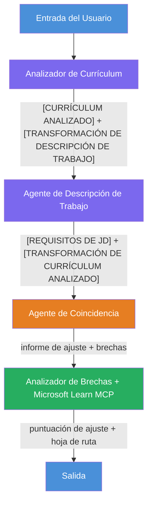

# Laboratorio 02 - Flujo de trabajo multiagente: Evaluador de ajuste de currículum a empleo

## Resumen

En este laboratorio práctico, construirás una **app multiagente con enfoque en flujo de trabajo** usando Foundry Toolkit en VS Code y la desplegarás en Microsoft Foundry Agent Service.

**Lo que construirás:** un Evaluador de ajuste de Currículum a Empleo que analiza un currículum y una descripción de trabajo, califica la coincidencia y produce una hoja de ruta de aprendizaje personalizada usando recursos de Microsoft Learn.

---

## Arquitectura

```mermaid
flowchart TD
    A["Entrada del Usuario"] --> B["Analizador de Currículum"]
    B -->|"[CURRÍCULUM ANALIZADO] + [TRANSFORMACIÓN DE DESCRIPCIÓN DE TRABAJO]"| C["Agente de Descripción de Trabajo"]
    C -->|"[REQUISITOS DE JD] + [TRANSFORMACIÓN DE CURRÍCULUM ANALIZADO]"| D["Agente de Coincidencia"]
    D -->|informe de ajuste + brechas| E["Analizador de Brechas + Microsoft Learn MCP"]
    E -->|puntuación de ajuste + hoja de ruta| F["Salida"]

    style A fill:#4A90D9,color:#fff
    style B fill:#7B68EE,color:#fff
    style C fill:#7B68EE,color:#fff
    style D fill:#E67E22,color:#fff
    style E fill:#27AE60,color:#fff
    style F fill:#4A90D9,color:#fff
```

**Cómo funciona:**
1. El usuario pega un currículum y una descripción de trabajo.
2. **ResumeParser** analiza el currículum y copia la descripción de trabajo textualmente en una sección `[JOB DESCRIPTION PASS-THROUGH]`.
3. **JD Agent** extrae requisitos estructurados del pass-through, luego transmite el `[PARSED RESUME]` hacia adelante como `[PARSED RESUME PASS-THROUGH]`.
4. **MatchingAgent** compara `[PARSED RESUME PASS-THROUGH]` vs `[JD REQUIREMENTS]` y produce una puntuación de ajuste.
5. **GapAnalyzer** convierte las brechas en una hoja de ruta práctica y obtiene enlaces reales de Microsoft Learn mediante MCP.

---

## Prerrequisitos

Completa primero el Laboratorio 01:

- [Laboratorio 01 - Agente único](../lab01-single-agent/README.md)

---

## Parte 1: Leer los módulos en orden

Consulta la ruta de aprendizaje completa en:

- [Documentación Lab 2 - Prerrequisitos](docs/00-prerequisites.md)
- [Documentación Lab 2 - Ruta de aprendizaje completa](docs/README.md)
- [Guía de ejecución PersonalCareerCopilot](PersonalCareerCopilot/README.md)

---

## Parte 2: Construir y probar el flujo de trabajo

1. Usa el asistente Foundry Toolkit para crear la estructura del proyecto basado en flujo de trabajo.
2. Copia los bloques de prompt y el gráfico de flujo de trabajo de `PersonalCareerCopilot/main.py` a tu espacio de trabajo.
3. Ejecuta localmente con el Inspector de Agentes y verifica los cuatro agentes más la herramienta MCP.
4. Despliega el agente alojado en Foundry cuando las pruebas locales sean exitosas.

---

## Patrones de orquestación

El Laboratorio 02 incluye el flujo por defecto **fan-out → fan-in → secuencial**, y la documentación también describe patrones alternativos de orquestación para experimentar.

- **Fan-out/Fan-in con consenso ponderado**
- **Revisión/crítica antes de la hoja de ruta final**
- **Enrutador condicional** basado en la puntuación de ajuste y habilidades faltantes

Consulta [docs/04-orchestration-patterns.md](docs/04-orchestration-patterns.md).

---

**Anterior:** [Laboratorio 01 - Agente único](../lab01-single-agent/README.md) · **Volver a:** [Inicio del taller](../../README.md)

---

<!-- CO-OP TRANSLATOR DISCLAIMER START -->
**Descargo de responsabilidad**:
Este documento ha sido traducido utilizando el servicio de traducción automática [Co-op Translator](https://github.com/Azure/co-op-translator). Aunque nos esforzamos por la precisión, tenga en cuenta que las traducciones automatizadas pueden contener errores o inexactitudes. El documento original en su idioma nativo debe considerarse la fuente autorizada. Para información crítica, se recomienda una traducción profesional humana. No somos responsables de cualquier malentendido o interpretación errónea que surja del uso de esta traducción.
<!-- CO-OP TRANSLATOR DISCLAIMER END -->