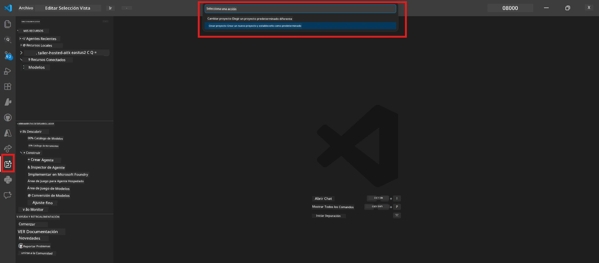

# Module 0 - Prerrequisitos

Antes de comenzar el Laboratorio 02, confirme que tiene lo siguiente completado. Este laboratorio se basa directamente en el Laboratorio 01: no lo omita.

---

## 1. Complete el Laboratorio 01

El Laboratorio 02 asume que ya ha:

- [x] Completado los 8 módulos de [Laboratorio 01 - Agente Único](../../lab01-single-agent/README.md)
- [x] Desplegado con éxito un agente único en Foundry Agent Service
- [x] Verificado que el agente funciona tanto en Agent Inspector local como en Foundry Playground

Si no ha completado el Laboratorio 01, regrese y termínelo ahora: [Documentos del Laboratorio 01](../../lab01-single-agent/docs/00-prerequisites.md)

---

## 2. Verifique la configuración existente

Todas las herramientas del Laboratorio 01 deberían seguir instaladas y funcionando. Ejecute estas verificaciones rápidas:

### 2.1 Azure CLI

```powershell
az account show --query "{name:name, id:id}" --output table
```

Esperado: Muestra el nombre y ID de su suscripción. Si falla, ejecute [`az login`](https://learn.microsoft.com/cli/azure/authenticate-azure-cli-interactively).

### 2.2 Extensiones de VS Code

1. Presione `Ctrl+Shift+P` → escriba **"Microsoft Foundry"** → confirme que ve comandos (por ejemplo, `Microsoft Foundry: Create a New Hosted Agent`).
2. Presione `Ctrl+Shift+P` → escriba **"Foundry Toolkit"** → confirme que ve comandos (por ejemplo, `Foundry Toolkit: Open Agent Inspector`).

### 2.3 Proyecto y modelo Foundry

1. Haga clic en el ícono **Microsoft Foundry** en la Barra de Actividades de VS Code.
2. Confirme que su proyecto está listado (por ejemplo, `workshop-agents`).
3. Expanda el proyecto → verifique que exista un modelo desplegado (por ejemplo, `gpt-4.1-mini`) con estado **Succeeded**.

> **Si el despliegue de su modelo expiró:** Algunos despliegues en la capa gratuita expiran automáticamente. Vuelva a desplegar desde el [Catálogo de Modelos](https://learn.microsoft.com/azure/foundry/foundry-models/concepts/models-sold-directly-by-azure) (`Ctrl+Shift+P` → **Microsoft Foundry: Open Model Catalog**).



### 2.4 Roles RBAC

Verifique que tenga el rol **Azure AI User** en su proyecto Foundry:

1. [Azure Portal](https://portal.azure.com) → recurso **proyecto** de Foundry → **Control de acceso (IAM)** → pestaña **[Asignaciones de roles](https://learn.microsoft.com/azure/foundry/concepts/rbac-foundry)**.
2. Busque su nombre → confirme que **[Azure AI User](https://aka.ms/foundry-ext-project-role)** está listado.

---

## 3. Entienda los conceptos multi-agente (nuevo para el Laboratorio 02)

El Laboratorio 02 introduce conceptos que no se cubrieron en el Laboratorio 01. Léalos antes de continuar:

### 3.1 ¿Qué es un flujo de trabajo multi-agente?

En lugar de que un solo agente maneje todo, un **flujo de trabajo multi-agente** divide el trabajo entre varios agentes especializados. Cada agente tiene:

- Sus propias **instrucciones** (prompt del sistema)
- Su propio **rol** (por lo que es responsable)
- Herramientas **opcionales** (funciones que puede llamar)

Los agentes se comunican mediante un **grafo de orquestación** que define cómo fluye la información entre ellos.

### 3.2 WorkflowBuilder

La clase [`WorkflowBuilder`](https://learn.microsoft.com/agent-framework/workflows/agents-in-workflows) del SDK `agent_framework` es el componente que conecta los agentes entre sí:

```python
from agent_framework import WorkflowBuilder

workflow = (
    WorkflowBuilder(
        name="MyWorkflow",
        start_executor=agent_a,
        output_executors=[agent_d],
    )
    .add_edge(agent_a, agent_b)
    .add_edge(agent_a, agent_c)
    .add_edge(agent_b, agent_d)
    .add_edge(agent_c, agent_d)
    .build()
)
```

- **`start_executor`** - El primer agente que recibe la entrada del usuario
- **`output_executors`** - El agente(s) cuya salida se convierte en la respuesta final
- **`add_edge(source, target)`** - Define que `target` recibe la salida de `source`

### 3.3 Herramientas MCP (Model Context Protocol)

El Laboratorio 02 utiliza una **herramienta MCP** que llama a la API Microsoft Learn para obtener recursos de aprendizaje. [MCP (Model Context Protocol)](https://modelcontextprotocol.io/introduction) es un protocolo estandarizado para conectar modelos de IA con fuentes de datos y herramientas externas.

| Término | Definición |
|------|-----------|
| **Servidor MCP** | Un servicio que expone herramientas/recursos vía el [protocolo MCP](https://learn.microsoft.com/azure/foundry/agents/how-to/tools/model-context-protocol) |
| **Cliente MCP** | Su código de agente que se conecta a un servidor MCP y llama a sus herramientas |
| **[Streamable HTTP](https://learn.microsoft.com/agent-framework/agents/tools/hosted-mcp-tools)** | El método de transporte usado para comunicarse con el servidor MCP |

### 3.4 Cómo el Laboratorio 02 difiere del Laboratorio 01

| Aspecto | Laboratorio 01 (Agente Único) | Laboratorio 02 (Multi-Agente) |
|--------|----------------------|---------------------|
| Agentes | 1 | 4 (roles especializados) |
| Orquestación | Ninguna | WorkflowBuilder (paralelo + secuencial) |
| Herramientas | Función opcional `@tool` | Herramienta MCP (llamada API externa) |
| Complejidad | Prompt simple → respuesta | CV + JD → puntaje de ajuste → hoja de ruta |
| Flujo de contexto | Directo | Entrega agente a agente |

---

## 4. Estructura del repositorio del taller para el Laboratorio 02

Asegúrese de saber dónde están los archivos del Laboratorio 02:

```
workshop/
└── lab02-multi-agent/
    ├── README.md                       ← Lab overview
    ├── docs/                           ← You are here
    │   ├── README.md                   ← Learning path index
    │   ├── 00-prerequisites.md         ← This file
    │   ├── 01-understand-multi-agent.md
    │   ├── ...
    │   └── 08-troubleshooting.md
    └── PersonalCareerCopilot/          ← The agent project
        ├── agent.yaml                  ← Agent definition
        ├── main.py                     ← 4-agent workflow code
        ├── Dockerfile                  ← Container configuration
        └── requirements.txt            ← Python dependencies
```

---

### Punto de control

- [ ] Laboratorio 01 completamente finalizado (todos los 8 módulos, agente desplegado y verificado)
- [ ] `az account show` devuelve su suscripción
- [ ] Extensiones Microsoft Foundry y Foundry Toolkit instaladas y respondiendo
- [ ] Proyecto Foundry con modelo desplegado (por ejemplo, `gpt-4.1-mini`)
- [ ] Tiene el rol **Azure AI User** en el proyecto
- [ ] Ha leído la sección de conceptos multi-agente arriba y entiende WorkflowBuilder, MCP y la orquestación de agentes

---

**Siguiente:** [01 - Comprender la Arquitectura Multi-Agente →](01-understand-multi-agent.md)

---

<!-- CO-OP TRANSLATOR DISCLAIMER START -->
**Descargo de responsabilidad**:  
Este documento ha sido traducido utilizando el servicio de traducción automática [Co-op Translator](https://github.com/Azure/co-op-translator). Aunque nos esforzamos por la precisión, tenga en cuenta que las traducciones automatizadas pueden contener errores o inexactitudes. El documento original en su idioma nativo debe considerarse la fuente autorizada. Para información crítica, se recomienda una traducción profesional realizada por humanos. No nos responsabilizamos por malentendidos o interpretaciones erróneas derivadas del uso de esta traducción.
<!-- CO-OP TRANSLATOR DISCLAIMER END -->