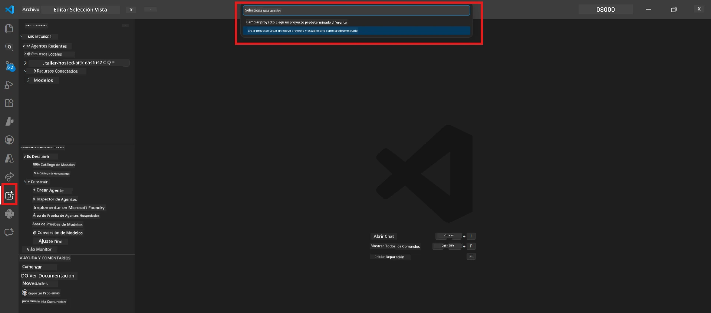

# Módulo 0 - Introducción

⏱️ ~10 min

> [!WARNING]
> **Vista previa y Limitaciones:** [Agentes alojados](https://learn.microsoft.com/azure/foundry/agents/concepts/hosted-agents) están actualmente en **vista previa pública** - no se recomienda para cargas de trabajo en producción. Algunas características mostradas en este taller pueden cambiar a medida que el servicio avanza hacia GA.

## Lo que construirás

En este laboratorio, extiendes las habilidades de un solo agente del Laboratorio 01 para construir un **flujo de trabajo multi-agente** - el Evaluador de Ajuste de Currículum → Trabajo.

Pegas un **currículum** y una **descripción del trabajo**. Cuatro agentes especializados procesan la entrada de forma secuencial y luego devuelven:
- Una puntuación de ajuste (0–100 con un desglose de puntuación)
- Una lista de brechas de habilidades y certificaciones
- Una hoja de ruta personalizada de aprendizaje con enlaces reales de Microsoft Learn para cada brecha

**El flujo de trabajo usa:**
- **Microsoft Agent Framework** - `WorkflowBuilder` para la orquestación secuencial del pipeline
- **Foundry Toolkit para VS Code** - para generar la estructura, probar localmente, desplegar
- **Un modelo de IA** (por ejemplo, `gpt-4.1-mini`) - usado por los cuatro agentes
- **Servidor MCP de Microsoft Learn** - provee enlaces de recursos de aprendizaje reales para cada brecha de habilidad

---

## Elige tu camino

> ⚠️ **Continúa con el mismo camino que usaste en el Laboratorio 01.**

<details open>
<summary><strong>🅰️ Camino A - Nube Azure (requiere suscripción a Azure)</strong></summary>

| | Detalles |
|---|---|
| **¿Para quién es esto?** | Completaste el Laboratorio 01 usando una suscripción a Azure |
| **Modelo** | Azure OpenAI vía Foundry (por ejemplo, `gpt-4.1-mini`) |
| **Módulos cubiertos** | Todos los módulos (00–09) |
| **¿Desplegar en la nube?** | ✅ Sí - despliegue completo de extremo a extremo |

</details>

<details open>
<summary><strong>🅱️ Camino B - Foundry Local (no se necesita suscripción a Azure)</strong></summary>

| | Detalles |
|---|---|
| **¿Para quién es esto?** | Completaste el Laboratorio 01 usando Foundry Local |
| **Modelo** | Foundry Local (gratis, se ejecuta en tu máquina) |
| **Módulos cubiertos** | Módulos 00–05 (omite 06–07 - despliegue y verificación en la nube) |
| **¿Desplegar en la nube?** | ❌ No - solo pruebas locales vía Agent Inspector |

</details>

---

## Revisión del Laboratorio 01

El Laboratorio 02 se basa directamente en el Laboratorio 01. Completa primero el Laboratorio 01 antes de comenzar aquí.

¿No has hecho aún el Laboratorio 01? Empieza aquí: [Laboratorio 01 - Introducción](../../lab01-single-agent/docs/00-prerequisites.md)

<details open>
<summary><strong>🅰️ Camino A - Nube Azure</strong></summary>

```powershell
az account show --query "{name:name, id:id}" --output table
```

Si esto falla, ejecuta `az login`. Luego verifica en VS Code:

1. `Ctrl+Shift+P` → escribe **Foundry Toolkit** → confirma que aparecen los comandos.
2. Haz clic en el ícono de **Foundry Toolkit** → tu proyecto y modelo desplegado muestran **Succeeded**.



> **RBAC:** Asignaste **Foundry User** en el Laboratorio 01. Si necesitas reasignarlo, consulta [Laboratorio 01, Módulo 1](../../lab01-single-agent/docs/01-setup.md#deploy-a-model--assign-rbac). El rol se llamaba previamente **Azure AI User** - mismos permisos.

</details>

<details open>
<summary><strong>🅱️ Camino B - Foundry Local</strong></summary>

```powershell
Invoke-WebRequest -Uri "http://localhost:5273/v1/health" -UseBasicParsing | Select-Object StatusCode
```

Esperado: `StatusCode: 200`. Si no, reinicia Foundry Local desde la barra lateral de Foundry Toolkit.

> Todas las inferencias se ejecutan en tu máquina. La única llamada saliente es la herramienta MCP a `https://learn.microsoft.com/api/mcp`.

</details>

---

## Novedades en el Laboratorio 02

| | Laboratorio 01 | Laboratorio 02 |
|--|-------------|-------------|
| Agentes | 1 | 4 (encadenados con WorkflowBuilder) |
| Plantilla scaffold | Básica - Agent Framework | Flujos de trabajo - Agent Framework |
| Nuevo paquete | - | `mcp` |
| Orquestación | Agente conversacional único | Pipeline secuencial (WorkflowBuilder) |
| Nueva herramienta | - | `search_microsoft_learn_for_plan` (MCP) |

---

**Siguiente:** [01 - Comprender la Arquitectura →](01-understand-multi-agent.md)

---

<!-- CO-OP TRANSLATOR DISCLAIMER START -->
**Descargo de responsabilidad**:
Este documento ha sido traducido utilizando el servicio de traducción automática [Co-op Translator](https://github.com/Azure/co-op-translator). Aunque nos esforzamos por la precisión, tenga en cuenta que las traducciones automatizadas pueden contener errores o inexactitudes. El documento original en su idioma nativo debe considerarse la fuente autorizada. Para información crítica, se recomienda una traducción profesional humana. No somos responsables de cualquier malentendido o interpretación errónea que surja del uso de esta traducción.
<!-- CO-OP TRANSLATOR DISCLAIMER END -->