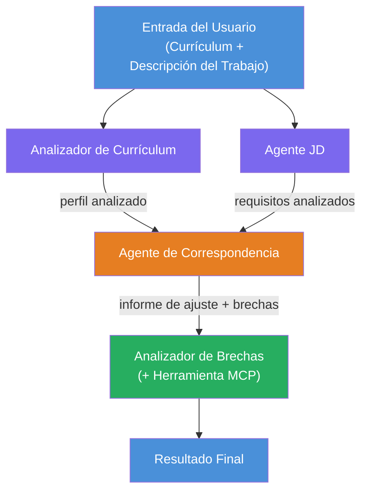
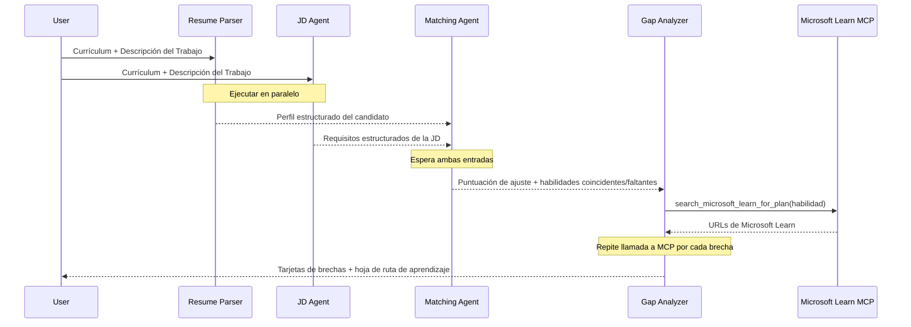
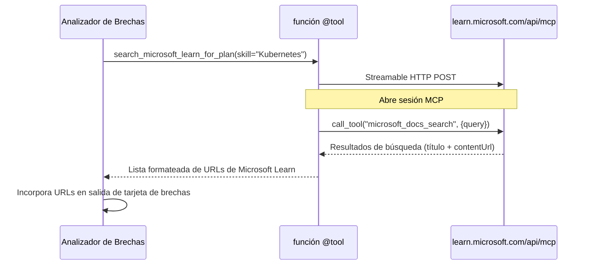

# Módulo 1 - Entender la Arquitectura Multi-Agente

En este módulo, aprenderás la arquitectura del Evaluador de Ajuste Currículum → Trabajo antes de escribir cualquier código. Entender el gráfico de orquestación, los roles de los agentes y el flujo de datos es crítico para depurar y extender [flujos de trabajo multi-agente](https://learn.microsoft.com/azure/architecture/ai-ml/idea/multiple-agent-workflow-automation).

---

## El problema que esto resuelve

Emparejar un currículum con una descripción de trabajo implica múltiples habilidades distintas:

1. **Análisis** - Extraer datos estructurados del texto no estructurado (currículum)
2. **Análisis** - Extraer requisitos de una descripción de trabajo
3. **Comparación** - Calificar la alineación entre ambos
4. **Planificación** - Construir una hoja de ruta de aprendizaje para cerrar brechas

Un solo agente que realice las cuatro tareas en un solo prompt a menudo produce:
- Extracción incompleta (se apresura en el análisis para llegar a la puntuación)
- Calificación superficial (sin desglose basado en evidencia)
- Hojas de ruta genéricas (no ajustadas a las brechas específicas)

Dividir en **cuatro agentes especializados**, cada uno enfocado en su tarea con instrucciones dedicadas, produce resultados de mayor calidad en cada etapa.

---

## Los cuatro agentes

Cada agente es un agente completo de [Microsoft Foundry](https://learn.microsoft.com/azure/foundry/agents/concepts/hosted-agents) creado mediante `AzureAIAgentClient.as_agent()`. Comparten el mismo despliegue de modelo pero tienen diferentes instrucciones y (opcionalmente) diferentes herramientas.

| # | Nombre del Agente | Rol | Entrada | Salida |
|---|-----------|------|-------|--------|
| 1 | **ResumeParser** | Extrae un perfil estructurado del texto del currículum | Texto crudo del currículum (del usuario) | Perfil del Candidato, Habilidades Técnicas, Habilidades Blandas, Certificaciones, Experiencia en el Dominio, Logros |
| 2 | **JobDescriptionAgent** | Extrae requisitos estructurados de una JD | Texto crudo de JD (del usuario, reenviado por ResumeParser) | Visión General del Rol, Habilidades Requeridas, Habilidades Preferidas, Experiencia, Certificaciones, Educación, Responsabilidades |
| 3 | **MatchingAgent** | Calcula una puntuación de ajuste basada en evidencia | Salidas de ResumeParser + JobDescriptionAgent | Puntuación de Ajuste (0-100 con desglose), Habilidades Coincidentes, Habilidades Faltantes, Brechas |
| 4 | **GapAnalyzer** | Construye una hoja de ruta de aprendizaje personalizada | Salida de MatchingAgent | Tarjetas de brechas (por habilidad), Orden de Aprendizaje, Cronograma, Recursos de Microsoft Learn |

---

## El gráfico de orquestación

El flujo de trabajo utiliza **despliegue paralelo** seguido de **agregación secuencial**:


> **Leyenda:** Morado = agentes paralelos, Naranja = punto de agregación, Verde = agente final con herramientas

### Cómo fluye el dato


1. **El usuario envía** un mensaje que contiene un currículum y una descripción de trabajo.
2. **ResumeParser** recibe toda la entrada del usuario y extrae un perfil estructurado del candidato.
3. **JobDescriptionAgent** recibe la entrada del usuario en paralelo y extrae requisitos estructurados.
4. **MatchingAgent** recibe las salidas de **ambos** ResumeParser y JobDescriptionAgent (el marco espera a que ambos terminen antes de ejecutar MatchingAgent).
5. **GapAnalyzer** recibe la salida de MatchingAgent y llama a la **herramienta MCP de Microsoft Learn** para obtener recursos reales de aprendizaje para cada brecha.
6. La **salida final** es la respuesta de GapAnalyzer, que incluye la puntuación de ajuste, tarjetas de brechas y una hoja de ruta de aprendizaje completa.

### Por qué importa el despliegue paralelo

ResumeParser y JobDescriptionAgent corren **en paralelo** porque ninguno depende del otro. Esto:
- Reduce la latencia total (ambos corren simultáneamente en lugar de secuencialmente)
- Es una división natural (analizar currículum vs. analizar JD son tareas independientes)
- Demuestra un patrón común multi-agente: **despliegue → agregación → acción**

---

## WorkflowBuilder en código

Aquí se muestra cómo el gráfico anterior se mapea a llamadas de la API [`WorkflowBuilder`](https://learn.microsoft.com/agent-framework/workflows/agents-in-workflows) en `main.py`:

```python
from agent_framework import WorkflowBuilder

workflow = (
    WorkflowBuilder(
        name="ResumeJobFitEvaluator",
        start_executor=resume_parser,       # Primer agente en recibir entrada del usuario
        output_executors=[gap_analyzer],     # Agente final cuyo resultado es devuelto
    )
    .add_edge(resume_parser, jd_agent)      # ResumeParser → JobDescriptionAgent
    .add_edge(resume_parser, matching_agent) # ResumeParser → MatchingAgent
    .add_edge(jd_agent, matching_agent)      # JobDescriptionAgent → MatchingAgent
    .add_edge(matching_agent, gap_analyzer)  # MatchingAgent → GapAnalyzer
    .build()
)
```

**Entendiendo las aristas:**

| Arista | Lo que significa |
|------|--------------|
| `resume_parser → jd_agent` | El Agente JD recibe la salida de ResumeParser |
| `resume_parser → matching_agent` | MatchingAgent recibe la salida de ResumeParser |
| `jd_agent → matching_agent` | MatchingAgent también recibe la salida del Agente JD (espera por ambos) |
| `matching_agent → gap_analyzer` | GapAnalyzer recibe la salida de MatchingAgent |

Porque `matching_agent` tiene **dos aristas entrantes** (`resume_parser` y `jd_agent`), el marco automáticamente espera que ambos terminen antes de ejecutar MatchingAgent.

---

## La herramienta MCP

El agente GapAnalyzer tiene una herramienta: `search_microsoft_learn_for_plan`. Esta es una **[herramienta MCP](https://learn.microsoft.com/agent-framework/agents/tools/hosted-mcp-tools)** que llama a la API de Microsoft Learn para obtener recursos de aprendizaje curados.

### Cómo funciona

```python
@tool
async def search_microsoft_learn_for_plan(
    skill: str, role: str = "", max_results: int = 5
) -> str:
    """Search Microsoft Learn MCP and return curated official links."""
    # Se conecta a https://learn.microsoft.com/api/mcp a través de HTTP transmitible
    # Llama a la herramienta 'microsoft_docs_search' en el servidor MCP
    # Devuelve una lista formateada de URLs de Microsoft Learn
```

### Flujo de llamada MCP


1. GapAnalyzer decide que necesita recursos de aprendizaje para una habilidad (por ejemplo, "Kubernetes")
2. El marco llama a `search_microsoft_learn_for_plan(skill="Kubernetes")`
3. La función abre una conexión [HTTP Streamable](https://learn.microsoft.com/agent-framework/agents/tools/hosted-mcp-tools) a `https://learn.microsoft.com/api/mcp`
4. Llama a la herramienta `microsoft_docs_search` en el [servidor MCP](https://learn.microsoft.com/azure/foundry/agents/how-to/tools/model-context-protocol)
5. El servidor MCP devuelve resultados de búsqueda (título + URL)
6. La función formatea los resultados y los devuelve como cadena
7. GapAnalyzer usa las URLs devueltas en la salida de sus tarjetas de brechas

### Registros esperados de MCP

Cuando la herramienta se ejecuta, verás entradas de registro como:

```
GET https://learn.microsoft.com/api/mcp → 405 (Method Not Allowed)
POST https://learn.microsoft.com/api/mcp → 200
DELETE https://learn.microsoft.com/api/mcp → 405 (Method Not Allowed)
```

**Esto es normal.** El cliente MCP hace sondas con GET y DELETE durante la inicialización - que devuelvan 405 es un comportamiento esperado. La llamada real de la herramienta usa POST y devuelve 200. Solo preocúpate si las llamadas POST fallan.

---

## Patrón de creación del agente

Cada agente se crea usando el **contexto asíncrono [`AzureAIAgentClient.as_agent()`](https://learn.microsoft.com/python/api/overview/azure/ai-agents-readme)**. Este es el patrón del SDK Foundry para crear agentes que se limpian automáticamente:

```python
async with (
    get_credential() as credential,
    AzureAIAgentClient(
        project_endpoint=PROJECT_ENDPOINT,
        model_deployment_name=MODEL_DEPLOYMENT_NAME,
        credential=credential,
    ).as_agent(
        name="ResumeParser",
        instructions=RESUME_PARSER_INSTRUCTIONS,
    ) as resume_parser,
    # ... repetir para cada agente ...
):
    # Aquí existen los 4 agentes
    workflow = create_workflow(resume_parser, jd_agent, matching_agent, gap_analyzer)
```

**Puntos clave:**
- Cada agente obtiene su propia instancia de `AzureAIAgentClient` (el SDK requiere que el nombre del agente esté ligado al cliente)
- Todos los agentes comparten el mismo `credential`, `PROJECT_ENDPOINT` y `MODEL_DEPLOYMENT_NAME`
- El bloque `async with` asegura que todos los agentes se limpien cuando el servidor se apague
- El GapAnalyzer recibe adicionalmente `tools=[search_microsoft_learn_for_plan]`

---

## Inicio del servidor

Después de crear los agentes y construir el flujo de trabajo, el servidor inicia:

```python
from azure.ai.agentserver.agentframework import from_agent_framework

agent = create_workflow(resume_parser, jd_agent, matching_agent, gap_analyzer)
await from_agent_framework(agent).run_async()
```

`from_agent_framework()` envuelve el flujo de trabajo como un servidor HTTP que expone el endpoint `/responses` en el puerto 8088. Este es el mismo patrón que el Laboratorio 01, pero el "agente" ahora es todo el [gráfico de flujo de trabajo](https://learn.microsoft.com/agent-framework/workflows/as-agents).

---

### Punto de control

- [ ] Entiendes la arquitectura de 4 agentes y el rol de cada uno
- [ ] Puedes rastrear el flujo de datos: Usuario → ResumeParser → (paralelo) Agente JD + MatchingAgent → GapAnalyzer → Salida
- [ ] Entiendes por qué MatchingAgent espera por ResumeParser y Agente JD (dos aristas entrantes)
- [ ] Entiendes la herramienta MCP: qué hace, cómo se llama y que los registros GET 405 son normales
- [ ] Entiendes el patrón `AzureAIAgentClient.as_agent()` y por qué cada agente tiene su propia instancia de cliente
- [ ] Puedes leer el código de `WorkflowBuilder` y mapearlo al gráfico visual

---

**Anterior:** [00 - Prerrequisitos](00-prerequisites.md) · **Siguiente:** [02 - Estructurar el proyecto Multi-Agente →](02-scaffold-multi-agent.md)

---

<!-- CO-OP TRANSLATOR DISCLAIMER START -->
**Aviso legal**:  
Este documento ha sido traducido utilizando el servicio de traducción AI [Co-op Translator](https://github.com/Azure/co-op-translator). Aunque nos esforzamos por la precisión, tenga en cuenta que las traducciones automáticas pueden contener errores o inexactitudes. El documento original en su idioma nativo debe considerarse la fuente autorizada. Para información crítica, se recomienda una traducción profesional realizada por humanos. No nos responsabilizamos por cualquier malentendido o interpretación errónea que surja del uso de esta traducción.
<!-- CO-OP TRANSLATOR DISCLAIMER END -->