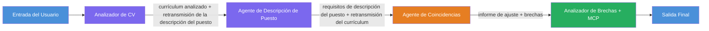

# Módulo 1 - Entender la Arquitectura

⏱️ ~5 min

Antes de escribir cualquier código, aquí hay una visión rápida de lo que estás construyendo y cómo funciona.

---

## Lo que estás construyendo

Pegas un **currículum** y una **descripción del puesto**. El flujo de trabajo devuelve:

- Una puntuación de ajuste (0–100 con un desglose)
- Una lista de brechas de habilidades y certificaciones
- Una hoja de ruta de aprendizaje personalizada con enlaces de Microsoft Learn para cada brecha

---

## Los cuatro agentes

Un solo agente tratando de analizar, puntuar y planear todo a la vez tiende a apresurarse y producir resultados superficiales. Dividir el trabajo en cuatro agentes especializados da mejores resultados:

| Agente | Qué hace |
|-------|-------------|
| **ResumeParser** | Analiza el currículum; copia la descripción del puesto literalmente en `[JOB DESCRIPTION PASS-THROUGH]` para los agentes posteriores |
| **JobDescriptionAgent** | Extrae los requisitos de la descripción del puesto del paso intermedio; retransmite `[PARSED RESUME]` hacia adelante como `[PARSED RESUME PASS-THROUGH]` |
| **MatchingAgent** | Compara ambas secciones etiquetadas; produce una puntuación de ajuste de 0 a 100 y una lista de brechas |
| **GapAnalyzer** | Construye una hoja de ruta de aprendizaje; busca en Microsoft Learn para cada brecha |

---

## El gráfico de orquestación

El flujo de trabajo es una **cadena secuencial**: cada agente pasa su salida al siguiente:


```mermaid
flowchart LR
    A["Entrada del Usuario"] --> B["Analizador de CV"]
    B -- "currículum analizado + retransmisión de la descripción del puesto" --> C["Agente de Descripción de Puesto"]
    C -- "requisitos de descripción del puesto + retransmisión del currículum" --> D["Agente de Coincidencias"]
    D -- "informe de ajuste + brechas" --> E["Analizador de Brechas + MCP"]
    E --> F["Salida Final"]

    style A fill:#4A90D9,color:#fff
    style B fill:#7B68EE,color:#fff
    style C fill:#7B68EE,color:#fff
    style D fill:#E67E22,color:#fff
    style E fill:#27AE60,color:#fff
    style F fill:#4A90D9,color:#fff
```

1. **ResumeParser** recibe la entrada del usuario, analiza el currículum y copia la descripción del puesto en `[JOB DESCRIPTION PASS-THROUGH]`.
2. **JD Agent** extrae los requisitos estructurados y retransmite `[PARSED RESUME PASS-THROUGH]` hacia adelante.
3. **MatchingAgent** compara ambas secciones y produce una puntuación de ajuste y una lista de brechas.
4. **GapAnalyzer** construye la hoja de ruta y llama a la herramienta Microsoft Learn MCP para cada brecha.

---

## Cómo se traduce esto en código

En `main.py`, describes este gráfico con `WorkflowBuilder`:

```python
workflow_agent = (
    WorkflowBuilder(
        start_executor=resume_executor,       # primer agente en recibir la entrada del usuario
        output_executors=[gap_executor],      # último agente - su salida es la respuesta
    )
    .add_edge(resume_executor, jd_executor)       # ResumeParser → Agente JD
    .add_edge(jd_executor, matching_executor)     # Agente JD → MatchingAgent
    .add_edge(matching_executor, gap_executor)    # MatchingAgent → GapAnalyzer
    .build()
    .as_agent()
)
```

Cada `Agent` está envuelto en un `AgentExecutor`. Las llamadas `add_edge()` definen una cadena estrictamente secuencial; cada agente recibe solo la salida directa de su predecesor.

> `context_mode="last_agent"` significa que cada ejecutor ve solo la salida de su predecesor directo. ResumeParser y JD Agent retransmiten datos hacia adelante en secciones etiquetadas para que cada agente posterior tenga exactamente lo que necesita.

---

## La herramienta MCP

GapAnalyzer tiene una herramienta: `search_microsoft_learn_for_plan`. Se conecta a `https://learn.microsoft.com/api/mcp` y devuelve enlaces reales de Microsoft Learn para cada brecha de habilidad.

Cuando la herramienta se ejecuta, verás estos registros, todos esperados:

```
GET  https://learn.microsoft.com/api/mcp → 405   ← connection probe, normal
POST https://learn.microsoft.com/api/mcp → 200   ← actual tool call
DELETE https://learn.microsoft.com/api/mcp → 405 ← cleanup probe, normal
```

Solo preocúpate si el `POST` devuelve un error.

---

**Anterior:** [00 - Prerrequisitos](00-prerequisites.md) · **Siguiente:** [02 - Construir el andamiaje del proyecto →](02-scaffold-multi-agent.md)

---

<!-- CO-OP TRANSLATOR DISCLAIMER START -->
**Descargo de responsabilidad**:
Este documento ha sido traducido utilizando el servicio de traducción automática [Co-op Translator](https://github.com/Azure/co-op-translator). Aunque nos esforzamos por la precisión, tenga en cuenta que las traducciones automatizadas pueden contener errores o inexactitudes. El documento original en su idioma nativo debe considerarse la fuente autorizada. Para información crítica, se recomienda una traducción profesional humana. No somos responsables de cualquier malentendido o interpretación errónea que surja del uso de esta traducción.
<!-- CO-OP TRANSLATOR DISCLAIMER END -->